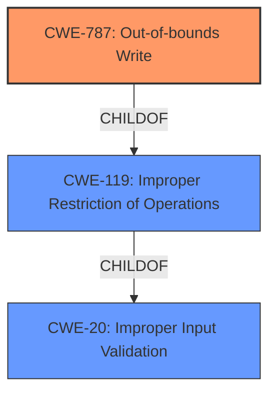

# Analysis for CVE-2021-1510

# Summary
| CWE ID    | CWE Name                                                                | Confidence | CWE Abstraction Level | CWE Vulnerability Mapping Label | CWE-Vulnerability Mapping Notes |
| --------- | ----------------------------------------------------------------------- | ---------- | --------------------- | ------------------------------- | ----------------------------- |
| CWE-787   | Out-of-bounds Write                                                     | 0.85       | Base                  | Allowed                         |                               |
| CWE-119   | Improper Restriction of Operations within the Bounds of a Memory Buffer | 0.65       | Class                 | Discouraged                     | Secondary Candidate             |
| CWE-20    | Improper Input Validation                                               | 0.50       | Class                 | Discouraged                     | Secondary Candidate             |

## Evidence and Confidence

*   **Confidence Score:** 0.75
*   **Evidence Strength:** MEDIUM

## Relationship Analysis
The primary CWE is CWE-787 (**Out-of-bounds Write**), a base-level CWE. CWE-787 is a child of CWE-119 (**Improper Restriction of Operations within the Bounds of a Memory Buffer**), which is a class-level CWE. CWE-119, in turn, is a child of CWE-20 (**Improper Input Validation**), also a class-level CWE. This hierarchical relationship indicates that the root cause could be an out-of-bounds write due to improper input validation. The description specifies a buffer overflow due to **insufficient bounds checking**, pointing towards CWE-787 as the most specific and appropriate classification.

## Vulnerability Chain
The vulnerability chain starts with **insufficient bounds checking** during packet mirroring, leading to a **buffer overflow** and ultimately a denial-of-service (DoS) condition.
  - **Root Cause**: Insufficient bounds checking (implicit in CWE-787).
  - **Weakness**: Buffer overflow (CWE-787).
  - **Impact**: Denial of Service (DoS).

## Summary of Analysis
The analysis is based on the provided vulnerability description and CVE reference. The **root cause** is **insufficient bounds checking** leading to a **buffer overflow**, which results in a denial-of-service (DoS) condition. The CVE reference states: "Insufficient bounds checking when an affected device processes traffic related to the packet mirroring feature" and "Buffer overflow due to insufficient bounds checking".

CWE-787 (**Out-of-bounds Write**) is the primary CWE because it directly addresses the **buffer overflow** resulting from the **insufficient bounds checking**. CWE-119 (**Improper Restriction of Operations within the Bounds of a Memory Buffer**) is considered as a secondary candidate because it is a broader category that encompasses out-of-bounds read/write issues, but CWE-787 is more specific. CWE-20 (**Improper Input Validation**) is another secondary candidate, as the **insufficient bounds checking** can be considered a form of improper input validation, but it's less direct than CWE-787.

CWE-787 is at the optimal level of specificity (Base) because it clearly describes the **buffer overflow** due to the **insufficient bounds checking**. The mapping guidance for CWE-119 suggests considering its children, such as CWE-787, for more specific mappings.

Relevant CWE Information:

# Enhanced Context (25 CWEs)

## CWE-476: NULL Pointer Dereference
**Abstraction Level**: Base
**Similarity Score**: 0.78
**Source**: dense
**Reason Not Used**: While possible, the description does not mention anything about null pointers.

## CWE-170: Improper Null Termination
**Abstraction Level**: Base
**Similarity Score**: 0.76
**Source**: dense
**Reason Not Used**: The vulnerability description doesn't provide any information about string termination issues.

## CWE-822: Untrusted Pointer Dereference
**Abstraction Level**: Base
**Similarity Score**: 0.75
**Source**: dense
**Reason Not Used**: There is no mention of untrusted pointers being dereferenced.

## CWE-404: Improper Resource Shutdown or Release
**Abstraction Level**: Class
**Similarity Score**: 0.75
**Source**: dense
**Reason Not Used**: The description focuses on memory corruption due to out-of-bounds writes, not resource management.

## CWE-667: Improper Locking
**Abstraction Level**: Class
**Similarity Score**: 0.75
**Source**: dense
**Reason Not Used**: The vulnerability does not involve any locking mechanisms.

## CWE-226: Sensitive Information in Resource Not Removed Before Reuse
**Abstraction Level**: Base
**Similarity Score**: 0.75
**Source**: dense
**Reason Not Used**: The description doesn't mention sensitive information being leaked due to resource reuse.

## CWE-824: Access of Uninitialized Pointer
**Abstraction Level**: Base
**Similarity Score**: 0.75
**Source**: dense
**Reason Not Used**: The description doesn't provide any information about uninitialized pointers.

## CWE-41: Improper Resolution of Path Equivalence
**Abstraction Level**: Base
**Similarity Score**: 0.75
**Source**: dense
**Reason Not Used**: The vulnerability isn't related to path equivalence issues.

## CWE-665: Improper Initialization
**Abstraction Level**: Class
**Similarity Score**: 0.74
**Source**: dense
**Reason Not Used**: The description does not indicate any initialization issues.

## CWE-703: Improper Check or Handling of Exceptional Conditions
**Abstraction Level**: Pillar
**Similarity Score**: 0.74
**Source**: dense
**Reason Not Used**: Too generic; the vulnerability is related to a specific **buffer overflow**, not general exception handling.

## CWE-1284: Improper Validation of Specified Quantity in Input
**Abstraction Level**: Base
**Similarity Score**: 7286.07
**Source**: sparse
**Reason Not Used**: While **insufficient bounds checking** is a form of input validation, CWE-787 better describes the specific weakness.

## CWE-119: Improper Restriction of Operations within the Bounds of a Memory Buffer
**Abstraction Level**: Class
**Similarity Score**: 7270.63
**Source**: sparse
**Reason Not Used**: CWE-787 is a more specific child of CWE-119, making it a better fit.

## CWE-190: Integer Overflow or Wraparound
**Abstraction Level**: Base
**Similarity Score**: 7237.61
**Source**: sparse
**Reason Not Used**: The description mentions a **buffer overflow**, not an integer overflow.

## CWE-22: Improper Limitation of a Pathname to a Restricted Directory ('Path Traversal')
**Abstraction Level**: Base
**Similarity Score**: 7201.04
**Source**: sparse
**Reason Not Used**: The vulnerability is not related to path traversal.

## CWE-125: Out-of-bounds Read
**Abstraction Level**: Base
**Similarity Score**: 7196.18
**Source**: sparse
**Reason Not Used**: The CVE description focuses on a **buffer overflow** which suggests a write, not a read.

## CWE-78: Improper Neutralization of Special Elements used in an OS Command ('OS Command Injection')
**Abstraction Level**: base
**Similarity Score**: 4.47
**Source**: graph
**Reason Not Used**: The vulnerability is not related to OS command injection.

## CWE-22: Improper Limitation of a Pathname to a Restricted Directory ('Path Traversal')
**Abstraction Level**: base
**Similarity Score**: 4.33
**Source**: graph
**Reason Not Used**: The vulnerability is not related to path traversal.

## CWE-770: Allocation of Resources Without Limits or Throttling
**Abstraction Level**: base
**Similarity Score**: 4.33
**Source**: graph
**Reason Not Used**: The vulnerability is not related to resource allocation without limits.

## CWE-73: External Control of File Name or Path
**Abstraction Level**: base
**Similarity Score**: 4.33
**Source**: graph
**Reason Not Used**: The vulnerability is not related to external control of file names or paths.

## CWE-190: Integer Overflow or Wraparound
**Abstraction Level**: base
**Similarity Score**: 4.33
**Source**: graph
**Reason Not Used**: The description mentions a **buffer overflow**, not an integer overflow.

## CWE-1284: Improper Validation of Specified Quantity in Input
**Abstraction