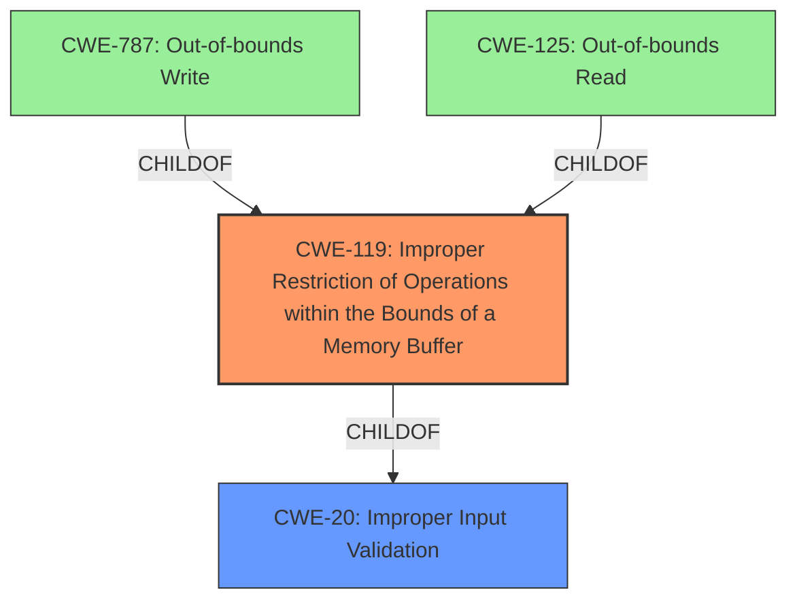

# Analysis for CVE-2021-1511

# Summary
| CWE ID | CWE Name | Confidence | CWE Abstraction Level | CWE Vulnerability Mapping Label | CWE-Vulnerability Mapping Notes |
|---|---|---|---|---|---|
| CWE-119 | Improper Restriction of Operations within the Bounds of a Memory Buffer | 0.7 | Class | Allowed | Primary CWE |
| CWE-20 | Improper Input Validation | 0.5 | Class | Discouraged | Secondary Candidate |

## Evidence and Confidence

*   **Confidence Score:** 0.6
*   **Evidence Strength:** MEDIUM

## Relationship Analysis
The primary CWE is CWE-119, which is a Class-level CWE. CWE-119's children, such as CWE-787 (Out-of-bounds Write) and CWE-125 (Out-of-bounds Read), were considered but the provided information does not provide enough detail to determine which of these is most accurate. Therefore, the Class-level CWE-119 is used. CWE-20 is a Class level CWE that is a peer of CWE-119.

## Vulnerability Chain
The vulnerability chain starts with **insufficient bounds checking when processing traffic**, leading to a **buffer overflow due to insufficient input validation**, and finally resulting in a denial of service or device reload.

## Summary of Analysis
The analysis is based on the provided evidence, particularly the CVE Reference Links Content Summary. The description of CVE-2021-1511 states that the root cause is "**insufficient bounds checking when processing traffic**," which leads to "**buffer overflow due to insufficient input validation**". Given this information, CWE-119 (Improper Restriction of Operations within the Bounds of a Memory Buffer) is the most appropriate primary CWE because it directly relates to buffer overflows caused by improper bounds checking. The relationship graph shows that CWE-119 is a parent of CWE-787 (Out-of-bounds Write) and CWE-125 (Out-of-bounds Read), which are more specific types of buffer overflows. However, the provided information doesn't specify whether the overflow is a read or a write, so the more general CWE-119 is selected.

CWE-20 (Improper Input Validation) is considered as a secondary CWE because the buffer overflow is a consequence of insufficient input validation. However, CWE-20 is discouraged because it is commonly misused and is a level-1 Class. Given that the primary cause is a buffer overflow, CWE-119 is more specific and thus more appropriate.

Relevant CWE Information:
*   **CWE-119: Improper Restriction of Operations within the Bounds of a Memory Buffer**
    *   The vulnerability description states "**buffer overflow due to insufficient input validation**" which aligns with CWE-119's description.
    *   The security implication is a denial of service (DoS) or device reload.
    *   CWE-119 is a Class-level CWE, and its children (e.g., CWE-787, CWE-125) are more specific types of buffer overflows.
    *   The MITRE mapping guidance discourages the use of CWE-119 when more specific CWEs are available. However, the provided information does not allow for a more specific classification.
*   **CWE-20: Improper Input Validation**
    *   The vulnerability is due to "**insufficient bounds checking when processing traffic**", which implies improper input validation, but this is an indirect cause.
    *   CWE-20 is a Class-level CWE and is discouraged by MITRE.