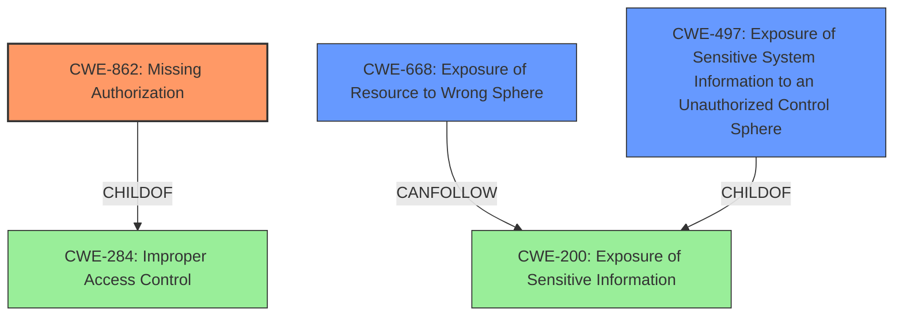

# Analysis for CVE-2021-1515

# Summary
| CWE ID  | CWE Name                        | Confidence | CWE Abstraction Level | CWE Vulnerability Mapping Label | CWE-Vulnerability Mapping Notes |
| :-------- | :------------------------------ | :--------- | :---------------------- | :------------------------------ | :------------------------------ |
| CWE-862   | Missing Authorization           | 0.9        | Base                    | Allowed                       | Primary CWE                     |
| CWE-668   | Exposure of Resource to Wrong Sphere | 0.6        | Class                    | Discouraged                       | Secondary Candidate                     |
| CWE-497   | Exposure of Sensitive System Information to an Unauthorized Control Sphere | 0.5        | Base                    | Allowed                       | Secondary Candidate                     |

## Evidence and Confidence

*   **Confidence Score:** 0.8
*   **Evidence Strength:** HIGH

## Relationship Analysis
The primary relationship influencing the selection was the parent-child relationship, where CWE-862 is a more specific child of the high-level Class CWE-284. The choice was made to select the most specific **root cause**. Additionally, the "CanFollow" relationships guided the analysis to consider potential follow-on impacts, such as information exposure. The abstraction levels were considered to ensure the chosen CWEs were at the base level, providing appropriate detail.

## Vulnerability Chain
The vulnerability chain starts with the **missing authorization** (**CWE-862**) on API endpoints. This **root cause** leads to the **exposure of sensitive information** (**CWE-668** and **CWE-497**), including potentially hashed credentials. The attacker exploits this by sending a request to an affected API endpoint within the multi-tenant environment.

## Summary of Analysis
The initial analysis focused on the **improper access controls** as the **root cause** of the vulnerability. The provided evidence from the "Vulnerability Description Key Phrases" and "CVE Reference Links Content Summary" strongly supports this. Specifically, the description states "**improper access controls** on API endpoints when Cisco SD-WAN vManage Software is running in multi-tenant mode". The graph relationships highlighted the importance of selecting a specific child CWE of the high-level "Improper Access Control" (CWE-284). After reviewing the retriever results and complete CWE specifications, CWE-862 (Missing Authorization) was selected as the primary CWE because it accurately represents the **root cause** of the vulnerability, i.e., the absence of proper authorization checks on the API endpoints.

CWE-668 (Exposure of Resource to Wrong Sphere) and CWE-497 (Exposure of Sensitive System Information to an Unauthorized Control Sphere) were considered as secondary CWEs to represent the impact of the missing authorization, but were not chosen as the primary because they are more focused on the impact rather than the **root cause**.

The selected CWEs are at the optimal level of specificity because CWE-862 directly addresses the lack of authorization checks, while CWE-668 and CWE-497 highlight the resulting information exposure.

Relevant CWE Information:

# Enhanced Context (25 CWEs)
The following CWEs were identified as potentially relevant to this vulnerability:

## CWE-41: Improper Resolution of Path Equivalence
**Abstraction Level**: Base
**Similarity Score**: 0.77
**Source**: dense

**Description**:
The product is vulnerable to file system contents disclosure through path equivalence. Path equivalence involves the use of special characters in file and directory names. The associated manipulations are intended to generate multiple names for the same object.

**Mapping Guidance**:
- Usage: Allowed
- Rationale: This CWE entry is at the Base level of abstraction, which is a preferred level of abstraction for mapping to the root causes of vulnerabilities.

## CWE-23: Relative Path Traversal
**Abstraction Level**: Base
**Similarity Score**: 0.76
**Source**: dense

**Description**:
The product uses external input to construct a pathname that should be within a restricted directory, but it does not properly neutralize sequences such as ".." that can resolve to a location that is outside of that directory.

**Mapping Guidance**:
- Usage: Allowed
- Rationale: This CWE entry is at the Base level of abstraction, which is a preferred level of abstraction for mapping to the root causes of vulnerabilities.

## CWE-73: External Control of File Name or Path
**Abstraction Level**: Base
**Similarity Score**: 0.76
**Source**: dense

**Description**:
The product allows user input to control or influence paths or file names that are used in filesystem operations.

**Mapping Guidance**:
- Usage: Allowed
- Rationale: This CWE entry is at the Base level of abstraction, which is a preferred level of abstraction for mapping to the root causes of vulnerabilities.

## CWE-668: Exposure of Resource to Wrong Sphere
**Abstraction Level**: Class
**Similarity Score**: 0.75
**Source**: dense

**Description**:
The product exposes a resource to the wrong control sphere, providing unintended actors with inappropriate access to the resource.

**Mapping Guidance**:
- Usage: Discouraged
- Rationale: CWE-668 is high-level and is often misused as a catch-all when lower-level CWE IDs might be applicable. It is sometimes used for low-information vulnerability reports [REF-1287]. It is a level-1 Class (i.e., a child of a Pillar). It is not useful for trend analysis.

## CWE-24: Path Traversal: '../filedir'
**Abstraction Level**: Variant
**Similarity Score**: 0.75
**Source**: dense

**Description**:
The product uses external input to construct a pathname that should be within a restricted directory, but it does not properly neutralize "../" sequences that can resolve to a location that is outside of that directory.

**Mapping Guidance**:
- Usage: Allowed
- Rationale: This CWE entry is at the Variant level of abstraction, which is a preferred level of abstraction for mapping to the root causes of vulnerabilities.

## CWE-59: Improper Link Resolution Before File Access ('Link Following')
**Abstraction Level**: Base
**Similarity Score**: 0.74
**Source**: dense

**Description**:
The product attempts to access a file based on the filename, but it does not properly prevent that filename from identifying a link or shortcut that resolves to an unintended resource.

**Mapping Guidance**:
- Usage: Allowed
- Rationale: This CWE entry is at the Base level of abstraction, which is a preferred level of abstraction for mapping to the root causes of vulnerabilities.

## CWE-1289: Improper Validation of Unsafe Equivalence in Input
**Abstraction Level**: Base
**Similarity Score**: 0.74
**Source**: dense

**Description**:
The product receives an input value that is used as a resource identifier or other type of reference, but it does not validate or incorrectly validates that the input is equivalent to a potentially-unsafe value.

**Mapping Guidance**:
- Usage: Allowed
- Rationale: This CWE entry is at the Base level of abstraction, which is a preferred level of abstraction for mapping to the root causes of vulnerabilities.

## CWE-807: Reliance on Untrusted Inputs in a Security Decision
**Abstraction Level**: Base
**Similarity Score**: 0.74
**Source**: dense

**Description**:
The product uses a protection mechanism that relies on the existence or values of an input, but the input can be modified by an untrusted actor in a way that bypasses the protection mechanism.

**Mapping Guidance**:
- Usage: Allowed
- Rationale: This CWE entry is at the Base level of abstraction, which is a preferred level of abstraction for mapping to the root causes of vulnerabilities.

## CWE-36: Absolute Path Traversal
**Abstraction Level**: Base
**Similarity Score**: 0.74
**Source**: dense

**Description**:
The product uses external input to construct a pathname that should be within a restricted directory, but it does not properly neutralize absolute path sequences such as "/abs/path" that can resolve to a location that is outside of that directory.

**Mapping Guidance**:
- Usage: Allowed
- Rationale: This CWE entry is at the Base level of abstraction, which is a preferred level of abstraction for mapping to the root causes of vulnerabilities.

## CWE-552: Files