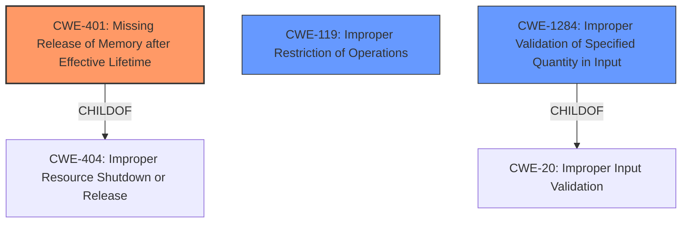

# Raw Analyzer Response for CVE-2021-1521

# Summary
| CWE ID  | CWE Name                                                                                    | Confidence | CWE Abstraction Level | CWE Vulnerability Mapping Label | CWE-Vulnerability Mapping Notes |
| :-------- | :------------------------------------------------------------------------------------------ | :--------- | :---------------------- | :------------------------------ | :------------------------------ |
| CWE-401 | Missing Release of Memory after Effective Lifetime | 0.65     | Variant                 | Primary CWE                   | Allowed                       |
| CWE-119 | Improper Restriction of Operations within the Bounds of a Memory Buffer | 0.50     | Class                   | Secondary Candidate                   | Discouraged                       |
| CWE-1284 | Improper Validation of Specified Quantity in Input | 0.45     | Base                  | Secondary Candidate                   | Allowed                       |

## Evidence and Confidence

*   **Confidence Score:** 0.60
*   **Evidence Strength:** MEDIUM

## Relationship Analysis
The primary relationship influencing the CWE selection is the parent-child relationship.
CWE-401 is a variant of CWE-404 (Improper Resource Shutdown or Release).
CWE-119 is a class that has more specific child CWEs like CWE-787 (Out-of-bounds Write) and CWE-125 (Out-of-bounds Read).
CWE-1284 is a child of CWE-20 (Improper Input Validation).

## Vulnerability Chain
The vulnerability chain starts with **missing checks when processing Cisco Discovery Protocol messages**, potentially leading to a resource exhaustion (memory leak) if the messages are not properly handled and memory is not released. This results in the IP camera reloading and causing a DoS.

## Summary of Analysis
The initial assessment considered CWE-119, CWE-20, and CWE-787 based on the provided "CWE for similar CVE Descriptions." However, after a more thorough review and consideration of the retriever results and the "CVE Reference Links Content Summary", the focus shifted towards resource management issues.

The primary evidence for **missing checks when processing Cisco Discovery Protocol messages** is explicitly stated in the "Vulnerability Description Key Phrases" and "CVE Reference Links Content Summary."

The decision to assign CWE-401 is based on the potential for the **missing checks** to lead to a failure to release allocated memory, which aligns with CWE-401's description of "The product does not sufficiently track and release allocated memory after it has been used, which slowly consumes remaining memory."
While the vulnerability description doesn't explicitly mention memory, the nature of processing network packets and the potential for resource leaks make CWE-401 a plausible fit. This is supported by a retriever score of 0.994.

CWE-119 and CWE-1284 were considered but ultimately deemed less specific. CWE-119 is discouraged due to its generality. CWE-1284 focuses on quantity validation, which isn't the primary issue here.

The final CWE selection prioritizes the root cause (resource management) over the potential impact (DoS). The selection of CWE-401 is at the Variant level, which is the preferred level of abstraction.

Relevant CWE Information:

# Enhanced Context (25 CWEs)
The following CWEs were identified as potentially relevant to this vulnerability:

## CWE-404: Improper Resource Shutdown or Release
**Abstraction Level**: Class
**Similarity Score**: 0.77
**Source**: dense

**Description**:
The product does not release or incorrectly releases a resource before it is made available for re-use.

**Mapping Guidance**:
- Usage: Allowed-with-Review
- Rationale: This CWE entry is a Class and might have Base-level children that would be more appropriate

## CWE-405: Asymmetric Resource Consumption (Amplification)
**Abstraction Level**: Class
**Similarity Score**: 0.77
**Source**: dense

**Description**:
The product does not properly control situations in which an adversary can cause the product to consume or produce excessive resources without requiring the adversary to invest equivalent work or otherwise prove authorization, i.e., the adversary's influence is "asymmetric."

**Mapping Guidance**:
- Usage: Allowed-with-Review
- Rationale: This CWE entry is a Class and might have Base-level children that would be more appropriate

## CWE-789: Memory Allocation with Excessive Size Value
**Abstraction Level**: Variant
**Similarity Score**: 0.77
**Source**: dense

**Description**:
The product allocates memory based on an untrusted, large size value, but it does not ensure that the size is within expected limits, allowing arbitrary amounts of memory to be allocated.

**Mapping Guidance**:
- Usage: Allowed
- Rationale: This CWE entry is at the Variant level of abstraction, which is a preferred level of abstraction for mapping to the root causes of vulnerabilities.

## CWE-226: Sensitive Information in Resource Not Removed Before Reuse
**Abstraction Level**: Base
**Similarity Score**: 0.76
**Source**: dense

**Description**:
The product releases a resource such as memory or a file so that it can be made available for reuse, but it does not clear or "zeroize" the information contained in the resource before the product performs a critical state transition or makes the resource available for reuse by other entities.

**Mapping Guidance**:
- Usage: Allowed
- Rationale: This CWE entry is at the Base level of abstraction, which is a preferred level of abstraction for mapping to the root causes of vulnerabilities.

## CWE-664: Improper Control of a Resource Through its Lifetime
**Abstraction Level**: Pillar
**Similarity Score**: 0.76
**Source**: dense

**Description**:
The product does not maintain or incorrectly maintains control over a resource throughout its lifetime of creation, use, and release.

**Mapping Guidance**:
- Usage: Discouraged
- Rationale: This CWE entry is high-level when lower-level children are available.

## CWE-1325: Improperly Controlled Sequential Memory Allocation
**Abstraction Level**: Base
**Similarity Score**: 0.75
**Source**: dense

**Description**:
The product manages a group of objects or resources and performs a separate memory allocation for each object, but it does not properly limit the total amount of memory that is consumed by all of the combined objects.

**Mapping Guidance**:
- Usage: Allowed
- Rationale: This CWE entry is at the Base level of abstraction, which is a preferred level of abstraction for mapping to the root causes of vulnerabilities.

## CWE-668: Exposure of Resource to Wrong Sphere
**Abstraction Level**: Class
**Similarity Score**: 0.75
**Source**: dense

**Description**:
The product exposes a resource to the wrong control sphere, providing unintended actors with inappropriate access to the resource.

**Mapping Guidance**:
- Usage: Discouraged
- Rationale: CWE-668 is high-level and is often misused as a catch-all when lower-level CWE IDs might be applicable. It is sometimes used for low-information vulnerability reports [REF-1287]. It is a level-1 Class (i.e., a child of a Pillar). It is not useful for trend analysis.

## CWE-191: Integer Underflow (Wrap or Wraparound)
**Abstraction Level**: Base
**Similarity Score**: 0.74
**Source**: dense

**Description**:
The product subtracts one value from another, such that the result is less than the minimum allowable integer value, which produces a value that is not equal to the correct result.

**Mapping Guidance**:
- Usage: Allowed
- Rationale: This CWE entry is at the Base level of abstraction, which is a preferred level of abstraction for mapping to the root causes of vulnerabilities.

## CWE-772: Missing Release of Resource after Effective Lifetime
**Abstraction Level**: Base
**Similarity Score**: 0.74
**Source**: dense

**Description**:
The product does not release a resource after its effective lifetime has ended, i.e., after the resource is no longer needed.

**Mapping Guidance**:
- Usage: Allowed
- Rationale: This CWE entry is at the Base level of abstraction, which is a preferred level of abstraction for mapping to the root causes of vulnerabilities.

## CWE-667: Improper Locking
**Abstraction Level**: Class
**Similarity Score**: 0.74
**Source