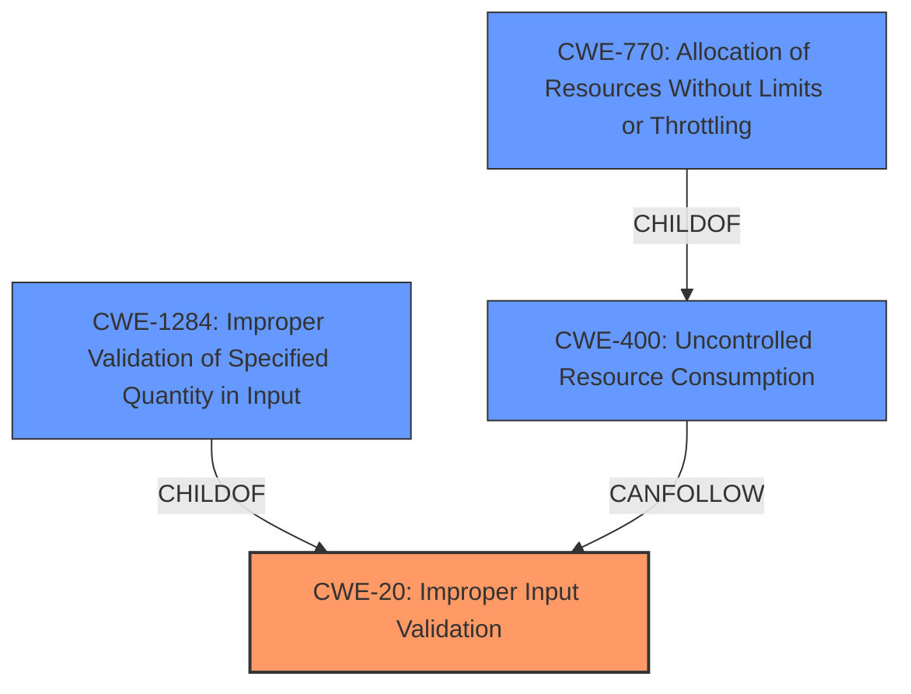

# Analysis Report for CVE-2021-1524

# Vulnerability Analysis Report: CVE-2021-1524

## Description


## Analysis (with Relationship Data)

# Summary
| CWE ID | CWE Name | Confidence | CWE Abstraction Level | CWE Vulnerability Mapping Label | CWE-Vulnerability Mapping Notes |
|---|---|---|---|---|---|
| **CWE-20** | Improper Input Validation | 0.9 | Class | Primary | Discouraged |
| CWE-400 | Uncontrolled Resource Consumption | 0.7 | Class | Secondary | Discouraged |
| CWE-770 | Allocation of Resources Without Limits or Throttling | 0.6 | Base | Secondary | Allowed |
| CWE-1284 | Improper Validation of Specified Quantity in Input | 0.6 | Base | Secondary | Allowed |

## Evidence and Confidence

*   **Confidence Score:** 0.9
*   **Evidence Strength:** HIGH

## Relationship Analysis
The primary CWE selected is CWE-20 [Improper Input Validation], which is a class-level CWE. While it's generally discouraged, the provided vulnerability description and CVE summary strongly indicate that the root cause is a failure to properly validate requests sent to the API. CWE-20 has child CWEs that specify the type of improper validation, such as CWE-1284 [Improper Validation of Specified Quantity in Input]. CWE-400 [Uncontrolled Resource Consumption] is also considered because the improper validation could lead to resource exhaustion. The relationship between these CWEs is that improper input validation can precede uncontrolled resource consumption.



## Vulnerability Chain
The vulnerability chain begins with the **improper input validation** (CWE-20), which allows an attacker to send a malicious request. This leads to the disconnection of all participants, resulting in a denial of service (DoS). The DoS can be a consequence of **uncontrolled resource consumption** (CWE-400) if the malicious requests consume excessive resources.

## Summary of Analysis
The initial analysis identified CWE-20 [Improper Input Validation] as the primary weakness, supported by the description: "requests that are sent to the API are **not properly validated**." This directly aligns with CWE-20's definition. The CVE Reference Links Content Summary reinforces this by stating: "The vulnerability exists because the API of Cisco Meeting Server does not properly validate requests sent to it." While CWE-20 is a class-level CWE and generally discouraged, the specific details provided don't allow for a more precise base or variant CWE.

CWE-400 [Uncontrolled Resource Consumption] is a secondary consideration because the **improper input validation** could enable an attacker to consume excessive resources, leading to a denial-of-service condition. The connection between CWE-20 and CWE-400 is that the former can lead to the latter.

CWE-770 [Allocation of Resources Without Limits or Throttling] is a more specific child of CWE-400 that could be relevant if the API allocates resources without proper limits based on the unvalidated requests.

CWE-1284 [Improper Validation of Specified Quantity in Input] could apply if the requests contained a quantity that was not properly validated, leading to the DoS.

The selected CWEs are at the optimal level of specificity given the provided evidence. While more specific CWEs exist, the available information does not provide sufficient detail to justify their use. The decision is primarily based on the vulnerability description and CVE summary, which both highlight **improper input validation** as the root cause.

Relevant CWE Information:

# Enhanced Context (25 CWEs)
## CWE-664: Improper Control of a Resource Through its Lifetime
**Abstraction Level**: Pillar
**Similarity Score**: 0.75
**Source**: dense

**Description**:
The product does not maintain or incorrectly maintains control over a resource throughout its lifetime of creation, use, and release.

**Mapping Guidance**:
- Usage: Discouraged
- Rationale: This CWE entry is high-level when lower-level children are available.

## CWE-1289: Improper Validation of Unsafe Equivalence in Input
**Abstraction Level**: Base
**Similarity Score**: 0.74
**Source**: dense

**Description**:
The product receives an input value that is used as a resource identifier or other type of reference, but it does not validate or incorrectly validates that the input is equivalent to a potentially-unsafe value.

**Mapping Guidance**:
- Usage: Allowed
- Rationale: This CWE entry is at the Base level of abstraction, which is a preferred level of abstraction for mapping to the root causes of vulnerabilities.

## CWE-404: Improper Resource Shutdown or Release
**Abstraction Level**: Class
**Similarity Score**: 0.74
**Source**: dense

**Description**:
The product does not release or incorrectly releases a resource before it is made available for re-use.

**Mapping Guidance**:
- Usage: Allowed-with-Review
- Rationale: This CWE entry is a Class and might have Base-level children that would be more appropriate

## CWE-703: Improper Check or Handling of Exceptional Conditions
**Abstraction Level**: Pillar
**Similarity Score**: 0.74
**Source**: dense

**Description**:
The product does not properly anticipate or handle exceptional conditions that rarely occur during normal operation of the product.

**Mapping Guidance**:
- Usage: Discouraged
- Rationale: This CWE entry is extremely high-level, a Pillar.

## CWE-274: Improper Handling of Insufficient Privileges
**Abstraction Level**: Base
**Similarity Score**: 0.74
**Source**: dense

**Description**:
The product does not handle or incorrectly handles when it has insufficient privileges to perform an operation, leading to resultant weaknesses.

**Mapping Guidance**:
- Usage: Discouraged
- Rationale: This CWE entry could be deprecated in a future version of CWE.

## CWE-653: Improper Isolation or Compartmentalization
**Abstraction Level**: Class
**Similarity Score**: 0.74
**Source**: dense

**Description**:
The product does not properly compartmentalize or isolate functionality, processes, or resources that require different privilege levels, rights, or permissions.

**Mapping Guidance**:
- Usage: Allowed
- Rationale: This CWE entry is at the Base level of abstraction, which is a preferred level of abstraction for mapping to the root causes of vulnerabilities.

## CWE-691: Insufficient Control Flow Management
**Abstraction Level**: Pillar
**Similarity Score**: 0.74
**Source**: dense

**Description**:
The code does not sufficiently manage its control flow during execution, creating conditions in which the control flow can be modified in unexpected ways.

**Mapping Guidance**:
- Usage: Discouraged
- Rationale: This CWE entry is extremely high-level, a Pillar. However, classification research is limited for weaknesses of this type, so there can be gaps or organizational difficulties within CWE that force use of this weakness, even at such a high level of abstraction.

## CWE-799: Improper Control of Interaction Frequency
**Abstraction Level**: Class
**Similarity Score**: 0.74
**Source**: dense

**Description**:
The product does not properly limit the number or frequency of interactions that it has with an actor, such as the number of incoming requests.

**Mapping Guidance**:
- Usage: Allowed-with-Review
- Rationale: This CWE entry is a Class and might have Base-level children that would be more appropriate

## CWE-754: Improper Check for Unusual or Exceptional Conditions
**Abstraction Level**: Class
**Similarity Score**: 0.73
**Source**: dense

**Description**:
The product does not check or incorrectly checks for unusual or exceptional conditions that are not expected to occur frequently during day to day operation of the product.

**Mapping Guidance**:
- Usage: Allowed-with-Review
- Rationale: This CWE entry is a Class and might have Base-level children that would be more appropriate

## CWE-405: Asymmetric Resource Consumption (Amplification)
**Abstraction Level**: Class
**Similarity Score**: 0.73
**Source**: dense

**Description**:
The product does not properly control situations in which an adversary can cause the product to consume or produce excessive resources without requiring the adversary to invest equivalent work or otherwise prove authorization, i.e., the adversary's influence is "asymmetric."

**Mapping Guidance**:
- Usage: Allowed-with-Review
- Rationale: This CWE entry is a Class and might have Base-level children


## CWE Relationship Analysis

Current CWEs represent these abstraction levels: .


### Vulnerability Chain Analysis

**Chain starting from CWE-691:**
- 691 (Insufficient Control Flow Management) - ROOT


**Chain starting from CWE-754:**
- 754 (Improper Check for Unusual or Exceptional Conditions) - ROOT


### CWE Relationship Diagram

```mermaid
graph TD
    classDef primary fill:#f96,stroke:#333,stroke-width:2px
    classDef secondary fill:#69f,stroke:#333
    classDef tertiary fill:#9e9,stroke:#333
```


*Report generated on 2025-04-02 08:34:32*
