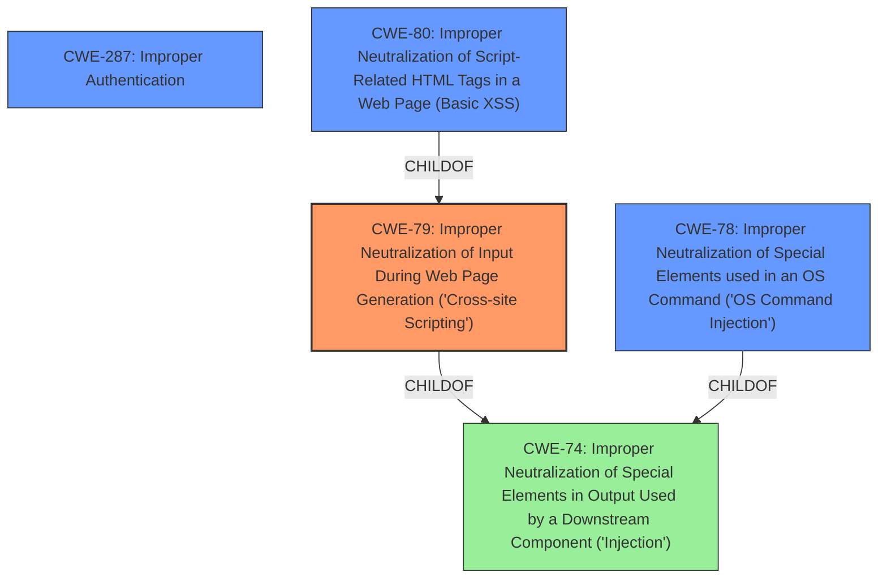

# Analysis for CVE-2021-1541

# Summary
| CWE ID  | CWE Name  | Confidence | CWE Abstraction Level | CWE Vulnerability Mapping Label | CWE-Vulnerability Mapping Notes |
|---|---|---|---|---|---|
| CWE-79 | Improper Neutralization of Input During Web Page Generation ('Cross-site Scripting') | 0.9 | Base | Allowed | Primary CWE |
| CWE-78 | Improper Neutralization of Special Elements used in an OS Command ('OS Command Injection') | 0.8 | Base | Allowed | Secondary CWE |
| CWE-287 | Improper Authentication | 0.7 | Base | Allowed | Secondary CWE |
| CWE-80 | Improper Neutralization of Script-Related HTML Tags in a Web Page (Basic XSS) | 0.6 | Variant | Allowed | Secondary CWE |

## Evidence and Confidence

*   **Confidence Score:** 0.8
*   **Evidence Strength:** MEDIUM

## Relationship Analysis
The primary weakness is **cross-site scripting (XSS)**, which involves **improper neutralization of input** during web page generation. This maps directly to CWE-79. The ability to execute arbitrary commands as root suggests **OS Command Injection** (CWE-78) due to **improper neutralization of special elements** in OS commands. The **session hijacking** is likely due to **improper authentication** (CWE-287). **HTML injection** is similar to XSS and can be represented by CWE-80 which involves **improper neutralization of script-related HTML tags**.

## Vulnerability Chain
The vulnerability chain starts with **improper input validation** or **neutralization**, leading to:
1.  **Cross-site scripting (CWE-79)**
2.  **OS Command Injection (CWE-78)**
3.  **Session Hijacking (CWE-287)**
4.  **HTML Injection (CWE-80)**

The root cause is the **lack of proper input handling**, which allows attackers to inject malicious code or commands.

## Summary of Analysis
The initial analysis identified several potential CWEs based on the vulnerability description's key phrases. After considering the relationships between these CWEs and the specific attack vectors described (XSS, command injection, session hijacking, and HTML injection), the final classification focuses on the root causes and attack mechanisms.

The primary CWE is CWE-79, as it directly addresses the **cross-site scripting vulnerability** described. The other CWEs (CWE-78, CWE-287, and CWE-80) represent related weaknesses that contribute to the overall vulnerability profile of the Cisco Small Business 220 Series Smart Switches.

The selected CWEs are at the optimal level of specificity because they accurately represent the specific weaknesses identified in the vulnerability description. More generic CWEs like CWE-20 (**Improper Input Validation**) were considered but deemed too broad, as they do not capture the specific nature of the vulnerabilities.

The analysis is based on the provided evidence, specifically the vulnerability description and keyphrase analysis. The vulnerability description explicitly mentions "cross-site scripting," "command injection," "session hijack," and "HTML injection," which directly correspond to the selected CWEs.

Relevant CWE Information:

# Enhanced Context (25 CWEs)
The following CWEs were identified as potentially relevant to this vulnerability:

## CWE-80: Improper Neutralization of Script-Related HTML Tags in a Web Page (Basic XSS)
**Abstraction Level**: Variant
**Similarity Score**: 0.76
**Source**: dense

**Description**:
The product receives input from an upstream component, but it does not neutralize or incorrectly neutralizes special characters such as "<", ">", and "&" that could be interpreted as web-scripting elements when they are sent to a downstream component that processes web pages.

**Mapping Guidance**:
- Usage: Allowed
- Rationale: This CWE entry is at the Variant level of abstraction, which is a preferred level of abstraction for mapping to the root causes of vulnerabilities.

## CWE-807: Reliance on Untrusted Inputs in a Security Decision
**Abstraction Level**: Base
**Similarity Score**: 0.76
**Source**: dense

**Description**:
The product uses a protection mechanism that relies on the existence or values of an input, but the input can be modified by an untrusted actor in a way that bypasses the protection mechanism.

**Mapping Guidance**:
- Usage: Allowed
- Rationale: This CWE entry is at the Base level of abstraction, which is a preferred level of abstraction for mapping to the root causes of vulnerabilities.

## CWE-74: Improper Neutralization of Special Elements in Output Used by a Downstream Component ('Injection')
**Abstraction Level**: Class
**Similarity Score**: 0.75
**Source**: dense

**Description**:
The product constructs all or part of a command, data structure, or record using externally-influenced input from an upstream component, but it does not neutralize or incorrectly neutralizes special elements that could modify how it is parsed or interpreted when it is sent to a downstream component.

**Mapping Guidance**:
- Usage: Discouraged
- Rationale: CWE-74 is high-level and often misused when lower-level weaknesses are more appropriate.

## CWE-1391: Use of Weak Credentials
**Abstraction Level**: Class
**Similarity Score**: 0.75
**Source**: dense

**Description**:
The product uses weak credentials (such as a default key or hard-coded password) that can be calculated, derived, reused, or guessed by an attacker.

**Mapping Guidance**:
- Usage: Allowed-with-Review
- Rationale: This CWE entry is a Class and might have Base-level children that would be more appropriate

## CWE-497: Exposure of Sensitive System Information to an Unauthorized Control Sphere
**Abstraction Level**: Base
**Similarity Score**: 0.74
**Source**: dense

**Description**:
The product does not properly prevent sensitive system-level information from being accessed by unauthorized actors who do not have the same level of access to the underlying system as the product does.

**Mapping Guidance**:
- Usage: Allowed
- Rationale: This CWE entry is at the Base level of abstraction, which is a preferred level of abstraction for mapping to the root causes of vulnerabilities.

## CWE-138: Improper Neutralization of Special Elements
**Abstraction Level**: Class
**Similarity Score**: 0.74
**Source**: dense

**Description**:
The product receives input from an upstream component, but it does not neutralize or incorrectly neutralizes special elements that could be interpreted as control elements or syntactic markers when they are sent to a downstream component.

**Mapping Guidance**:
- Usage: Discouraged
- Rationale: This CWE entry is a level-1 Class (i.e., a child of a Pillar). It might have lower-level children that would be more appropriate

## CWE-41: Improper Resolution of Path Equivalence
**Abstraction Level**: Base
**Similarity Score**: 0.74
**Source**: dense

**Description**:
The product is vulnerable to file system contents disclosure through path equivalence. Path equivalence involves the use of special characters in file and directory names. The associated manipulations are intended to generate multiple names for the same object.

**Mapping Guidance**:
- Usage: Allowed
- Rationale: This CWE entry is at the Base level of abstraction, which is a preferred level of abstraction for mapping to the root causes of vulnerabilities.

## CWE-425: Direct Request ('Forced Browsing')
**Abstraction Level**: Base
**Similarity Score**: 0.73
**Source**: dense

**Description**:
The web application does not adequately enforce appropriate authorization on all restricted URLs, scripts, or files.

**Mapping Guidance**:
- Usage: Allowed
- Rationale: This CWE entry is at the Base level of abstraction, which is a preferred level of abstraction for mapping to the root causes of vulnerabilities.

## CWE-799: Improper Control of Interaction Frequency
**Abstraction Level**: Class
**Similarity Score**: 0.73
**Source**: dense

**Description**:
The product does not properly limit the number or frequency of interactions that it has with an actor,

# Enhanced Query for CVE-2021-1541

# Vulnerability Description

    Multiple vulnerabilities in the web-based management interface of Cisco Small Business 220 Series Smart Switches could allow an attacker to do the following Hijack a user session Execute arbitrary commands as a root user on the underlying operating system Conduct a **cross-site scripting** (XSS) attack Conduct an **HTML injection** attack For more information about these vulnerabilities, see the Details section of this advisory.

    # Keyphrase-Specific CWE Analysis
    This vulnerability contains multiple keyphrases that may map to different CWEs. 
    Please analyze each keyphrase separately and determine the most appropriate CWE(s) for each.

    ## WEAKNESS: 'cross-site scripting'

Relevant CWEs for this WEAKNESS:

### 1. CWE-352: Cross-Site Request Forgery (CSRF) (Score: 393.31)

The web application does not, or can not, sufficiently verify whether a well-formed, valid, consistent request was intentionally provided by the user who submitted the request....

### 2. CWE-20: Improper Input Validation (Score: 390.04)

The product receives input or data, but it does
        not validate or incorrectly validates that the input has the
        properties that are required to process the data safely and
        correctly....

### 3. CWE-79: Improper Neutralization of Input During Web Page Generation ('Cross-site Scripting') (Score: 383.32)

The product does not neutralize or incorrectly neutralizes user-controllable input before it is placed in output that is used as a web page that is served to other users....

### 4. CWE-942: Permissive Cross-domain Policy with Untrusted Domains (Score: 382.38)

The product uses a cross-domain policy file that includes domains that should not be trusted....

### 5. CWE-80: Improper Neutralization of Script-Related HTML Tags in a Web Page (Basic XSS) (Score: 368.89)

The product receives input from an upstream component, but it does not neutralize or incorrectly neutralizes special characters such as "<", ">", and "&" that could be interpreted as web-scripting elements when they are sent to a downstream component that processes web pages....

## WEAKNESS: 'session hijack'

Relevant CWEs for this WEAKNESS:

### 1. CWE-20: Improper Input Validation (Score: 390.04)

The product receives input or data, but it does
        not validate or incorrectly validates that the input has the
        properties that are required to process the data safely and
        correctly....

### 2. CWE-79: Improper Neutralization of Input During Web Page Generation ('Cross-site Scripting') (Score: 383.32)

The product does not neutralize or incorrectly neutralizes user-controllable input before it is placed in output that is used as a web page that is served to other users....

### 3. CWE-80: Improper Neutralization of Script-Related HTML Tags in a Web Page (Basic XSS) (Score: 368.89)

The product receives input from an upstream component, but it does not neutralize or incorrectly neutralizes special characters such as "<", ">", and "&" that could be interpreted as web-scripting elements when they are sent to a downstream component that processes web pages....

### 4. CWE-23: Relative Path Traversal (Score: 357.50)

The product uses external input to construct a pathname that should be within a restricted directory, but it does not properly neutralize sequences such as ".." that can resolve to a location that is outside of that directory....

### 5. CWE-287: Improper Authentication (Score: 355.01)

When an actor claims to have a given identity, the product does not prove or insufficiently proves that the claim is correct....

## WEAKNESS: 'command injection'

Relevant CWEs for this WEAKNESS:

### 1. CWE-20: Improper Input Validation (Score: 390.04)

The product receives input or data, but it does
        not validate or incorrectly validates that the input has the
        properties that are required to process the data safely and
        correctly....

### 2. CWE-79: Improper Neutralization of Input During Web Page Generation ('Cross-site Scripting') (Score: 383.32)

The product does not neutralize or incorrectly neutralizes user-controllable input before it is placed in output that is used as a web page that is served to other users....

### 3. CWE-78: Improper Neutralization of Special Elements used in an OS Command ('OS Command Injection') (Score: 376.80)

The product constructs all or part of an OS command using externally-influenced input from an upstream component, but it does not neutralize or incorrectly neutralizes special elements that could modify the intended OS command when it is sent to a downstream component....

### 4. CWE-22: Improper Limitation of a Pathname to a Restricted Directory ('Path Traversal') (Score: 372.88)

The product uses external input to construct a pathname that is intended to identify a file or directory that is located underneath a restricted parent directory, but the product does not properly neutralize special elements within the pathname that can cause the pathname to resolve to a location th...

### 5. CWE-80: Improper Neutralization of Script-Related HTML Tags in a Web Page (Basic XSS) (Score: 368.89)

The product receives input from an upstream component, but it does not neutralize or incorrectly neutralizes special characters such as "<", ">", and "&" that could be interpreted as web-scripting elements when they are sent to a downstream component that processes web pages....

## WEAKNESS: 'HTML injection'

Relevant CWEs for this WEAKNESS:

### 1. CWE-20: Improper Input Validation (Score: 390.04)

The product receives input or data, but it does
        not validate or incorrectly validates that the input has the
        properties that are required to process the data safely and
        correctly....

### 2. CWE-79: Improper Neutralization of Input During Web Page Generation ('Cross-site Scripting') (Score: 383.32)

The product does not neutralize or incorrectly neutralizes user-controllable input before it is placed in output that is used as a web page that is served to other users....

### 3. CWE-22: Improper Limitation of a Pathname to a Restricted Directory ('Path Traversal') (Score: 372.88)

The product uses external input to construct a pathname that is intended to identify a file or directory that is located underneath a restricted parent directory, but the product does not properly neutralize special elements within the pathname that can cause the pathname to resolve to a location th...

### 4. CWE-80: Improper Neutralization of Script-Related HTML Tags in a Web Page (Basic XSS) (Score: 368.89)

The product receives input from an upstream component, but it does not neutralize or incorrectly neutralizes special characters such as "<", ">", and "&" that could be interpreted as web-scripting elements when they are sent to a downstream component that processes web pages....

### 5. CWE-23: Relative Path Traversal (Score: 357.50)

The product uses external input to construct a pathname that should be within a restricted directory, but it does not properly neutralize sequences such as ".." that can resolve to a location that is outside of that directory....

## ATTACKER: 'attacker'

Relevant CWEs for this ATTACKER:

### 1. CWE-20: Improper Input Validation (Score: 390.04)

The product receives input or data, but it does
        not validate or incorrectly validates that the input has the
        properties that are required to process the data safely and
        correctly....

### 2. CWE-79: Improper Neutralization of Input During Web Page Generation ('Cross-site Scripting') (Score: 383.32)

The product does not neutralize or incorrectly neutralizes user-controllable input before it is placed in output that is used as a web page that is served to other users....

### 3. CWE-22: Improper Limitation of a Pathname to a Restricted Directory ('Path Traversal') (Score: 372.88)

The product uses external input to construct a pathname that is intended to identify a file or directory that is located underneath a restricted parent directory, but the product does not properly neutralize special elements within the pathname that can cause the pathname to resolve to a location th...

### 4. CWE-80: Improper Neutralization of Script-Related HTML Tags in a Web Page (Basic XSS) (Score: 368.89)

The product receives input from an upstream component, but it does not neutralize or incorrectly neutralizes special characters such as "<", ">", and "&" that could be interpreted as web-scripting elements when they are sent to a downstream component that processes web pages....

### 5. CWE-23: Relative Path Traversal (Score: 357.50)

The product uses external input to construct a pathname that should be within a restricted directory, but it does not properly neutralize sequences such as ".." that can resolve to a location that is outside of that directory....

## PRODUCT: 'Cisco Small Business 220 Series Smart Switches'

Relevant CWEs for this PRODUCT:

### 1. CWE-20: Improper Input Validation (Score: 390.04)

The product receives input or data, but it does
        not validate or incorrectly validates that the input has the
        properties that are required to process the data safely and
        correctly....

### 2. CWE-79: Improper Neutralization of Input During Web Page Generation ('Cross-site Scripting') (Score: 383.32)

The product does not neutralize or incorrectly neutralizes user-controllable input before it is placed in output that is used as a web page that is served to other users....

### 3. CWE-23: Relative Path Traversal (Score: 357.50)

The product uses external input to construct a pathname that should be within a restricted directory, but it does not properly neutralize sequences such as ".." that can resolve to a location that is outside of that directory....

### 4. CWE-287: Improper Authentication (Score: 355.01)

When an actor claims to have a given identity, the product does not prove or insufficiently proves that the claim is correct....

### 5. CWE-799: Improper Control of Interaction Frequency (Score: 135.11)

The product does not properly limit the number or frequency of interactions that it has with an actor, such as the number of incoming requests....

## COMPONENT: 'web-based management interface'

Relevant CWEs for this COMPONENT:

### 1. CWE-20: Improper Input Validation (Score: 390.04)

The product receives input or data, but it does
        not validate or incorrectly validates that the input has the
        properties that are required to process the data safely and
        correctly....

### 2. CWE-79: Improper Neutralization of Input During Web Page Generation ('Cross-site Scripting') (Score: 383.32)

The product does not neutralize or incorrectly neutralizes user-controllable input before it is placed in output that is used as a web page that is served to other users....

### 3. CWE-22: Improper Limitation of a Pathname to a Restricted Directory ('Path Traversal') (Score: 372.88)

The product uses external input to construct a pathname that is intended to identify a file or directory that is located underneath a restricted parent directory, but the product does not properly neutralize special elements within the pathname that can cause the pathname to resolve to a location th...

### 4. CWE-80: Improper Neutralization of Script-Related HTML Tags in a Web Page (Basic XSS) (Score: 368.89)

The product receives input from an upstream component, but it does not neutralize or incorrectly neutralizes special characters such as "<", ">", and "&" that could be interpreted as web-scripting elements when they are sent to a downstream component that processes web pages....

### 5. CWE-23: Relative Path Traversal (Score: 357.50)

The product uses external input to construct a pathname that should be within a restricted directory, but it does not properly neutralize sequences such as ".." that can resolve to a location that is outside of that directory....

    # Analysis Instructions
    1. For each keyphrase, identify the most appropriate CWE(s) that represent the weakness.
    2. Consider how the different keyphrases might relate to each other in the vulnerability chain.
    3. Provide a final determination of primary CWE(s) and any secondary CWEs.
    4. Format your response using the standard analysis template.

    Please analyze how these different weaknesses interact and provide a comprehensive CWE classification.
    