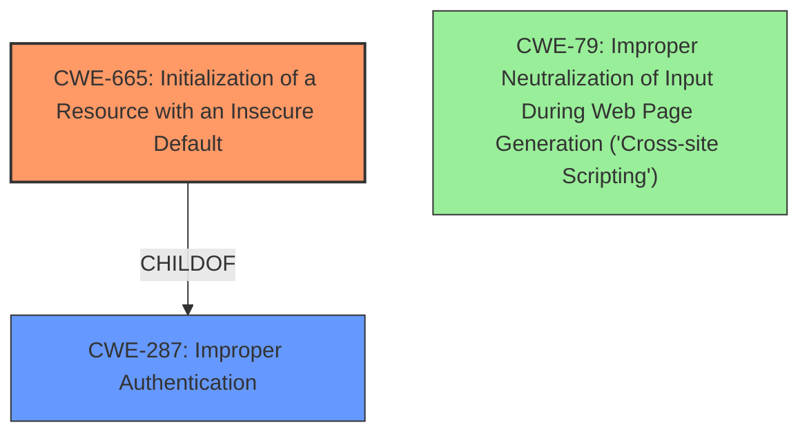

# Enhanced Analysis for CVE-2021-1542

# Summary
| CWE ID | CWE Name | Confidence | CWE Abstraction Level | CWE Vulnerability Mapping Label | CWE-Vulnerability Mapping Notes |
|---|---|---|---|---|---|
| CWE-665 | Initialization of a Resource with an Insecure Default | 0.8 | Base | Primary | Allowed |
| CWE-287 | Improper Authentication | 0.6 | Class | Secondary | Discouraged |
| CWE-79 | Improper Neutralization of Input During Web Page Generation ('Cross-site Scripting') | 0.5 | Base | Secondary | Allowed |

## Evidence and Confidence

*   **Confidence Score:** 0.7
*   **Evidence Strength:** MEDIUM

## Relationship Analysis
The primary CWE is CWE-665 as the switches had an insecure default configuration that could be exploited. CWE-287 is a parent Class of CWE-665, and could apply if the root cause was a failure to authenticate. CWE-79 is related to the XSS and HTML injection attacks, but those are impacts rather than root causes of the weak session management described in the CVE details.



## Vulnerability Chain
The chain of root cause and weaknesses for the Vulnerability Description is:
1.  **CWE-665** A root cause where the web-based management interface of Cisco Small Business 220 Series Smart Switches had an insecure default configuration.
2.  An attacker exploits **Weak Session Management** due to the **insecure default**.
3.  **Unauthorized Access:** An unauthenticated, remote attacker bypasses authentication and gains access to the web-based management interface.
4.  **Privilege Escalation:** The attacker gains the privileges associated with the hijacked user session.
5.  **Control of Device:** The attacker takes actions within the management interface, with the potential to configure or manipulate the device.
6.  **CWE-79**: Exploitation of XSS and HTML injection vulnerabilities.

## Summary of Analysis
The initial assessment leaned towards CWE-79 due to the mention of XSS and HTML injection, however, upon closer examination of the vulnerability description, the root cause lies in the **weak session management** resulting from **insecure default** settings. The CVE reference summary states that the vulnerability stems from weak session management practices within the web-based management interface of Cisco Small Business 220 Series Smart Switches. Specifically, the session identifier values are not sufficiently robust. This allows an attacker to bypass authentication and gain unauthorized access.

The selection of CWE-665 as the primary CWE is based on the fact that the **insecure default** configuration is the underlying cause that enables the weak session management, which in turn leads to unauthorized access and privilege escalation.

CWE-287, Improper Authentication, is considered a secondary candidate because the **weak session management** effectively bypasses authentication. However, it's a more general class, and CWE-665 more precisely captures the root cause.

CWE-79, Improper Neutralization of Input During Web Page Generation ('Cross-site Scripting'), is also considered as a secondary candidate because the vulnerability description mentions XSS and HTML injection attacks. However, these are more related to the impact of the vulnerability rather than the root cause.

The final selection prioritizes the root cause (CWE-665) over the resulting impacts (CWE-79) and the general class of Improper Authentication (CWE-287).


## CWE Relationship Analysis

Current CWEs represent these abstraction levels: .


### Vulnerability Chain Analysis

**Chain starting from CWE-287:**
- 287 (Improper Authentication) - ROOT


**Chain starting from CWE-79:**
- 79 (Improper Neutralization of Input During Web Page Generation ('Cross-site Scripting')) - ROOT


### CWE Relationship Diagram

```mermaid
graph TD
    classDef primary fill:#f96,stroke:#333,stroke-width:2px
    classDef secondary fill:#69f,stroke:#333
    classDef tertiary fill:#9e9,stroke:#333
```