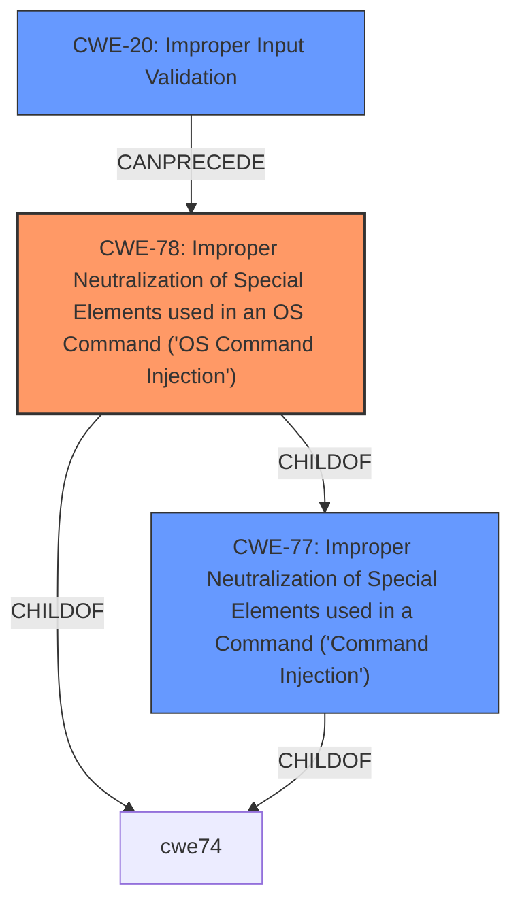

# Raw Analyzer Response for CVE-2021-1547

# Summary
| CWE ID | CWE Name | Confidence | CWE Abstraction Level | CWE Vulnerability Mapping Label | CWE-Vulnerability Mapping Notes |
|---|---|---|---|---|---|
| CWE-78 | Improper Neutralization of Special Elements used in an OS Command ('OS Command Injection') | 1.0 | Base | Allowed | Primary CWE |
| CWE-20 | Improper Input Validation | 0.7 | Class | Discouraged | Secondary Candidate |

## Evidence and Confidence

*   **Confidence Score:** 0.9
*   **Evidence Strength:** HIGH

## Relationship Analysis
The primary relationship impacting the decision is the parent-child relationship between CWE-77 (Improper Neutralization of Special Elements used in a Command) and CWE-78 (Improper Neutralization of Special Elements used in an OS Command). Because the vulnerability specifically involves OS commands, CWE-78 is more appropriate. CWE-20 (Improper Input Validation) is a class-level weakness that can often precede command injection vulnerabilities.

## Vulnerability Chain
The vulnerability chain starts with **improper input validation (CWE-20)**, which allows an attacker to inject special elements into an OS command, leading to **OS Command Injection (CWE-78)**. The successful exploitation results in the ability to execute arbitrary commands with root privileges.

## Summary of Analysis
The initial assessment considered CWE-77 and CWE-78, given the description involves command injection. The description states: "These vulnerabilities are due to **improper validation of user-supplied input**. An attacker could exploit these vulnerabilities by sending crafted HTTP requests to the web-based management interface of an affected system. A successful exploit could allow the attacker to execute arbitrary commands with root privileges on the device." This clearly points to a **command injection** vulnerability.

The **Retriever Results** also highlight CWE-77 (Improper Neutralization of Special Elements used in a Command) and CWE-78 (Improper Neutralization of Special Elements used in an OS Command) as top candidates. Given that the vulnerability allows execution of *OS* commands, CWE-78 is a more specific and accurate classification than its parent, CWE-77.

CWE-20 (Improper Input Validation) is also considered because the root cause is **improper input validation**. However, it's a class-level CWE, and the more specific consequence is command injection; therefore, it is a secondary consideration.

The final selection is CWE-78 because it accurately reflects the vulnerability and is at the optimal level of specificity (Base). The evidence for this is in the Vulnerability Description Key Phrases and the CVE Reference Links Content Summary, which both highlight **improper input validation** leading to **command injection**, allowing execution of arbitrary commands with root privileges.

Relevant CWE Information:

# Enhanced Context (25 CWEs)

## CWE-78: Improper Neutralization of Special Elements used in an OS Command ('OS Command Injection')
**Abstraction:** Base
**Status:** Stable

### Description
The product constructs all or part of an OS command using externally-influenced input from an upstream component, but it does not neutralize or incorrectly neutralizes special elements that could modify the intended OS command when it is sent to a downstream component.

### Extended Description
This weakness can lead to a vulnerability in environments in which the attacker does not have direct access to the operating system, such as in web applications. Alternately, if the weakness occurs in a privileged program, it could allow the attacker to specify commands that normally would not be accessible, or to call alternate commands with privileges that the attacker does not have. The problem is exacerbated if the compromised process does not follow the principle of least privilege, because the attacker-controlled commands may run with special system privileges that increases the amount of damage.

## Technical Justification for CWE-78 Selection

The vulnerability perfectly matches the description of CWE-78. The product (Cisco Small Business Wireless Access Points) constructs an OS command using external input (crafted HTTP requests). Due to **improper input validation**, special elements are not neutralized, allowing an attacker to modify the intended OS command. This leads to arbitrary command execution with root privileges. The security implication is complete compromise of the device.

This is a primary weakness because it directly represents the exploitable flaw in the system.

## CWE-20: Improper Input Validation
**Abstraction:** Class
**Status:** Stable

### Description
The product receives input or data, but it does
        not validate or incorrectly validates that the input has the
        properties that are required to process the data safely and
        correctly.

## Technical Justification for CWE-20 Selection
The vulnerability description clearly states that the root cause is **improper input validation** of user-supplied input. While CWE-20 represents this root cause, it is a broad, class-level CWE. The more specific consequence of this **improper input validation** is command injection (CWE-78). Therefore, CWE-20 is considered as a contributing factor but not the primary weakness.

## CWEs Considered but Not Used:

*   **CWE-77 (Improper Neutralization of Special Elements used in a Command):** While relevant, it is less specific than CWE-78 because the vulnerability involves OS commands.
*   **CWE-119 (Improper Restriction of Operations within the Bounds of a Memory Buffer):** This CWE was in the Top CWEs list, but the vulnerability is not related to memory buffer operations, so it is not applicable.
*   **CWE-190 (Integer Overflow or Wraparound):** This CWE was in the Retriever Results, but the vulnerability is not related to integer overflow, so it is not applicable.
*   **CWE-807 (Reliance on Untrusted Inputs in a Security Decision):** While the device relies on user-supplied input, the core issue is the lack of proper validation, making CWE-20 and ultimately CWE-78 more relevant.
*   **CWE-287 (Improper Authentication):** This CWE was not used as the vulnerability is not due to bypassing or missing authentication; it explicitly requires administrative credentials, focusing the weakness on command injection post-authentication.
*   **CWE-306 (Missing Authentication for Critical Function):** Not applicable because authentication is required.
*   **CWE-285 (Improper Authorization):** Not applicable because the attacker has administrative privileges, meaning the issue is not related to insufficient authorization.
*   **CWE-138 (Improper Neutralization of Special Elements):** This is too generic and is better represented by command injection specific CWEs.