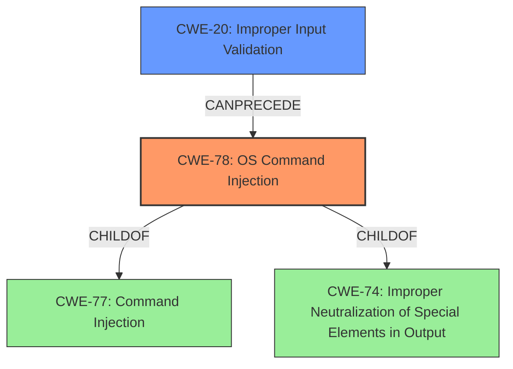

# Analysis for CVE-2021-1549

# Summary
| CWE ID | CWE Name | Confidence | CWE Abstraction Level | CWE Vulnerability Mapping Label | CWE-Vulnerability Mapping Notes |
|---|---|---|---|---|---|
| CWE-78 | Improper Neutralization of Special Elements used in an OS Command ('OS Command Injection') | 1.0 | Base | Allowed | Primary CWE |
| CWE-20 | Improper Input Validation | 0.7 | Class | Discouraged | Secondary CWE |

## Evidence and Confidence

*   **Confidence Score:** 0.9
*   **Evidence Strength:** HIGH

## Relationship Analysis
The primary relationship is that **CWE-78** [Improper Neutralization of Special Elements used in an OS Command ('OS Command Injection')] is a child of **CWE-77** [Improper Neutralization of Special Elements used in a Command ('Command Injection')], indicating that OS command injection is a specific type of command injection. **CWE-78** is also a child of **CWE-74** [Improper Neutralization of Special Elements in Output], which highlights that command injection is related to the broader issue of neutralizing special elements. **CWE-20** [Improper Input Validation] can precede **CWE-78**, indicating that a lack of input validation can lead to command injection vulnerabilities. These relationships support the selection of **CWE-78** as the primary CWE due to its specificity and the evidence of **improper input validation** as a contributing factor.

## Vulnerability Chain
The vulnerability chain starts with **improper input validation** (**CWE-20**), which leads to **command injection** (**CWE-78**). The final impact is arbitrary command execution with root privileges.

## Summary of Analysis
The initial assessment identified **CWE-78** [Improper Neutralization of Special Elements used in an OS Command ('OS Command Injection')] as the primary CWE due to the vulnerability description explicitly stating that the vulnerabilities are due to **improper validation of user-supplied input** and can lead to **command injection** attacks. The CVE Reference Links Content Summary confirms this, stating "Improper validation of user-supplied input in the web-based management interface" as the root cause and "Command Injection (CWE-77)" as the vulnerability. However, given the context of OS commands being executed, **CWE-78** is more appropriate than **CWE-77**.

**CWE-20** [Improper Input Validation] was considered because the **root cause** is **improper input validation**. The retriever results also listed it. However, **CWE-20** is a Class-level CWE and is discouraged when more specific CWEs are available. Since the **improper input validation** leads directly to **command injection**, **CWE-78** is a more precise and appropriate choice.

The final decision is based on the evidence from the vulnerability description and the CVE Reference Links Content Summary, which both point to **command injection** as the weakness resulting from **improper input validation**. The relationship analysis further supports this by showing that **CWE-78** is a specific type of command injection, and **CWE-20** can precede it. The selected CWEs are at the optimal level of specificity, with **CWE-78** being a Base-level CWE and **CWE-20** being a Class-level CWE that describes the **root cause**.