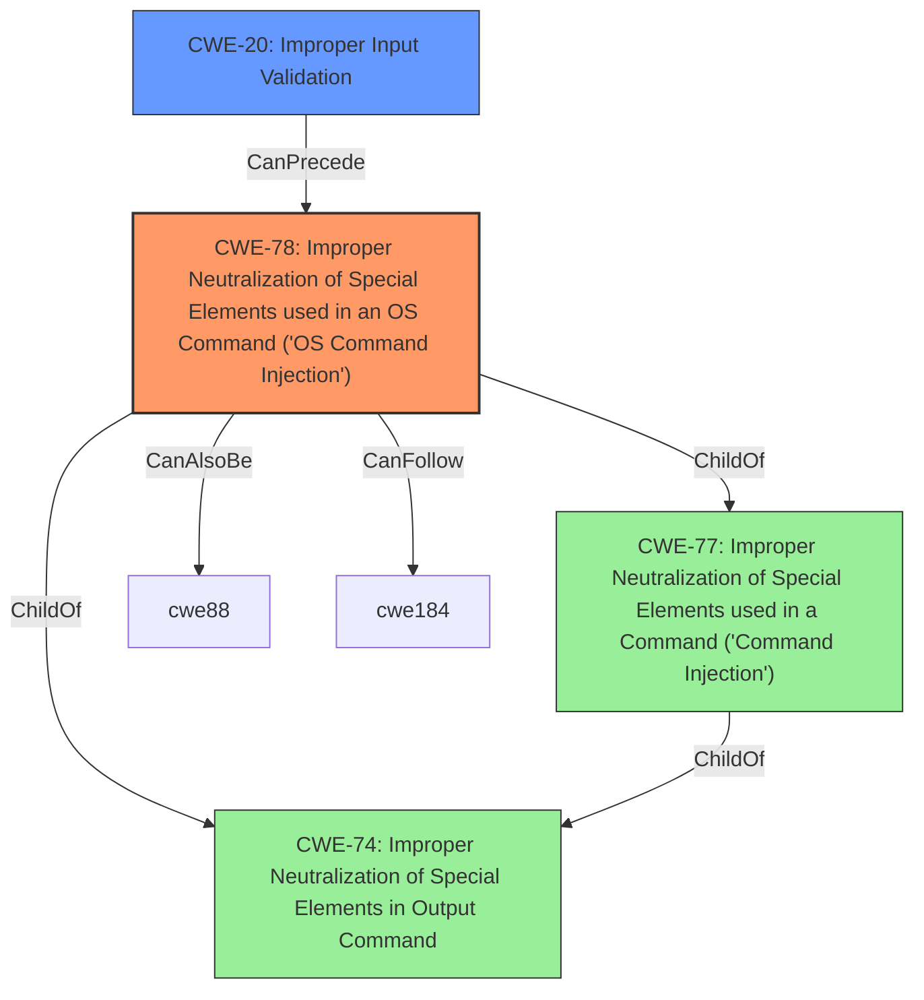

# Raw Analyzer Response for CVE-2021-1550

# Summary
| CWE ID | CWE Name | Confidence | CWE Abstraction Level | CWE Vulnerability Mapping Label | CWE-Vulnerability Mapping Notes |
|---|---|---|---|---|---|
| CWE-78 | Improper Neutralization of Special Elements used in an OS Command ('OS Command Injection') | 1.0 | Base | Allowed | Primary CWE |
| CWE-20 | Improper Input Validation | 0.7 | Class | Discouraged | Secondary Candidate |

## Evidence and Confidence

*   **Confidence Score:** 0.9
*   **Evidence Strength:** HIGH

## Relationship Analysis
The primary CWE selected is CWE-78, which is a Base level CWE, providing a specific description of the vulnerability. It is a child of CWE-77 and CWE-74. CWE-20 is considered as a secondary factor, as **improper input validation** is the root cause of the command injection. However, CWE-20 is a Class level CWE and is discouraged to use when a more specific CWE is available.



## Vulnerability Chain
The vulnerability chain starts with **improper input validation** (CWE-20), which leads to the **command injection** (CWE-78) vulnerability, eventually allowing the attacker to execute arbitrary commands with root privileges on the device.

## Summary of Analysis
The analysis identified CWE-78 as the primary weakness and CWE-20 as a contributing factor.

*   The vulnerability description clearly states that the vulnerability is due to **improper validation of user-supplied input** and that it allows an authenticated, remote attacker to perform **command injection** attacks.
*   The CVE Reference Links Content Summary confirms this, stating:

```json
{
    "details": {
      "root_cause": "The vulnerabilities are due to improper validation of user-supplied input within the web-based management interface.",
      "weaknesses": [
        "Command Injection (CWE-77)",
        "Improper input validation"
      ],
      "impact": "Successful exploitation could allow a remote attacker to execute arbitrary commands with root privileges on the affected device.",
      "attack_vector": "A remote attacker can exploit this by sending crafted HTTP requests to the web-based management interface.",
      "attacker_capabilities": "The attacker must have valid administrative credentials for the device."
    }
  }
```

*   CWE-78 is a Base level CWE and is an acceptable mapping. CWE-77 is a Class level CWE and is too generic.
*   CWE-20 is a Class level CWE and is discouraged when a more specific CWE is available.
*   The retriever results show that CWE-78 is a good match for the vulnerability description and the root cause.

Relevant CWE Information:

# Enhanced Context (25 CWEs)
The following CWEs were identified as potentially relevant to this vulnerability:

## CWE-807: Reliance on Untrusted Inputs in a Security Decision
**Abstraction Level**: Base
**Similarity Score**: 0.77
**Source**: dense

**Description**:
The product uses a protection mechanism that relies on the existence or values of an input, but the input can be modified by an untrusted actor in a way that bypasses the protection mechanism.

**Mapping Guidance**:
- Usage: Allowed
- Rationale: This CWE entry is at the Base level of abstraction, which is a preferred level of abstraction for mapping to the root causes of vulnerabilities.

(Considered, but not applicable, as the vulnerability is not about relying on untrusted inputs for security decisions, but about failing to neutralize special elements in commands.)

## CWE-1289: Improper Validation of Unsafe Equivalence in Input
**Abstraction Level**: Base
**Similarity Score**: 0.76
**Source**: dense

**Description**:
The product receives an input value that is used as a resource identifier or other type of reference, but it does not validate or incorrectly validates that the input is equivalent to a potentially-unsafe value.

**Mapping Guidance**:
- Usage: Allowed
- Rationale: This CWE entry is at the Base level of abstraction, which is a preferred level of abstraction for mapping to the root causes of vulnerabilities.

(Considered, but not applicable, as the vulnerability isn't specifically about unsafe equivalence.)

## CWE-274: Improper Handling of Insufficient Privileges
**Abstraction Level**: Base
**Similarity Score**: 0.75
**Source**: dense

**Description**:
The product does not handle or incorrectly handles when it has insufficient privileges to perform an operation, leading to resultant weaknesses.

**Mapping Guidance**:
- Usage: Discouraged
- Rationale: This CWE entry could be deprecated in a future version of CWE.

(Considered, but not applicable, as it's not related to privilege handling.)

## CWE-280: Improper Handling of Insufficient Permissions or Privileges
**Abstraction Level**: Base
**Similarity Score**: 0.75
**Source**: dense

**Description**:
The product does not handle or incorrectly handles when it has insufficient privileges to access resources or functionality as specified by their permissions. This may cause it to follow unexpected code paths that may leave the product in an invalid state.

**Mapping Guidance**:
- Usage: Allowed
- Rationale: This CWE entry is at the Base level of abstraction, which is a preferred level of abstraction for mapping to the root causes of vulnerabilities.

(Considered, but not applicable, as it's not related to permission handling.)

## CWE-653: Improper Isolation or Compartmentalization
**Abstraction Level**: Class
**Similarity Score**: 0.75
**Source**: dense

**Description**:
The product does not properly compartmentalize or isolate functionality, processes, or resources that require different privilege levels, rights, or permissions.

**Mapping Guidance**:
- Usage: Allowed
- Rationale: This CWE entry is at the Base level of abstraction, which is a preferred level of abstraction for mapping to the root causes of vulnerabilities.

(Considered, but not applicable, as it's not about improper isolation.)

## CWE-303: Incorrect Implementation of Authentication Algorithm
**Abstraction Level**: Base
**Similarity Score**: 0.74
**Source**: dense

**Description**:
The requirements for the product dictate the use of an established authentication algorithm, but the implementation of the algorithm is incorrect.

**Mapping Guidance**:
- Usage: Allowed
- Rationale: This CWE entry is at the Base level of abstraction, which is a preferred level of abstraction for mapping to the root causes of vulnerabilities.

(Considered, but not applicable, as it's not related to authentication algorithm implementation.)

## CWE-1220: Insufficient Granularity of Access Control
**Abstraction Level**: Base
**Similarity Score**: 0.74
**Source**: dense

**Description**:
The product implements access controls via a policy or other feature with the intention to disable or restrict accesses (reads and/or writes) to assets in a system from untrusted agents. However, implemented access controls lack required granularity, which renders the control policy too broad because it allows accesses from unauthorized agents to the security-sensitive assets.

**Mapping Guidance**:
- Usage: Allowed
- Rationale: This CWE entry is at the Base level of abstraction, which is a preferred level of abstraction for mapping to the root causes of vulnerabilities.

(Considered, but not applicable, as it's not about access control granularity.)

## CWE-183: Permissive List of Allowed Inputs
**Abstraction Level**: Base
**Similarity Score**: 0.74
**Source**: dense

**Description**:
The product implements a protection mechanism that relies on a list of inputs (or properties of inputs) that are explicitly allowed by policy because the inputs are assumed to be safe, but the list is too permissive - that is, it allows an input that is unsafe, leading to resultant weaknesses.

**Mapping Guidance**:
- Usage: Allowed
- Rationale: This CWE entry is at the Base level of abstraction, which is a preferred level of abstraction for mapping to the root causes of vulnerabilities.

(Considered, but not applicable, as it's not related to a permissive list of allowed inputs.)

## CWE-