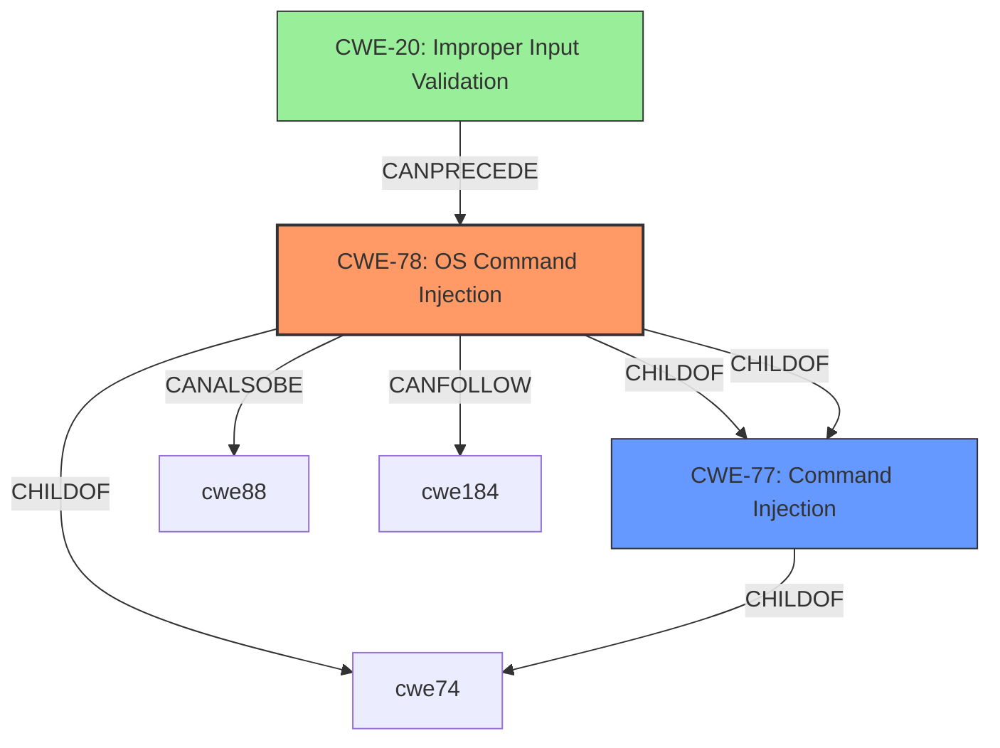

# Analysis for CVE-2021-1552

# Summary
| CWE ID  | CWE Name                                                                                                                                                                     | Confidence | CWE Abstraction Level | CWE Vulnerability Mapping Label | CWE-Vulnerability Mapping Notes |
| :-------- | :--------------------------------------------------------------------------------------------------------------------------------------------------------------------------- | :--------- | :---------------------- | :-------------------------------- | :-------------------------------- |
| CWE-78  | Improper Neutralization of Special Elements used in an OS Command ('OS Command Injection')                                                                                 | 1.0        | Base                    | Allowed                           | Primary CWE                       |
| CWE-20  | Improper Input Validation                                                                                                                                                      | 0.75       | Class                   | Discouraged                       | Secondary Candidate               |

## Evidence and Confidence

*   **Confidence Score:** 0.9
*   **Evidence Strength:** HIGH

## Relationship Analysis
The primary relationship that impacted the decision was the parent-child relationship between CWE-77 (Command Injection) and CWE-78 (OS Command Injection). Because the vulnerability specifically involves OS commands, the more specific CWE-78 was chosen over the more general CWE-77. CWE-20 (Improper Input Validation) is a class-level CWE and a parent of several more specific CWEs. It was considered because the vulnerability description explicitly mentions **improper input validation** as the root cause.

## Vulnerability Chain
The vulnerability chain starts with **improper input validation** (CWE-20), which leads to **OS command injection** (CWE-78), ultimately allowing an attacker to execute arbitrary commands with root privileges.

## Summary of Analysis
The initial analysis focused on identifying the root cause and the specific type of weakness. The vulnerability description clearly states that the issue is due to **improper input validation** leading to **command injection**. The CVE reference link content summary confirms this, stating: "The vulnerability is due to **improper validation of user-supplied input** in the web-based management interface" and "Command Injection Vulnerability".

Based on the evidence, CWE-78 (Improper Neutralization of Special Elements used in an OS Command ('OS Command Injection')) is the most appropriate primary CWE. This is because the vulnerability involves injecting OS commands through user-supplied input, allowing the execution of arbitrary commands. The description of CWE-78 perfectly matches this scenario: "The product constructs all or part of an OS command using externally-influenced input from an upstream component, but it does not neutralize or incorrectly neutralizes special elements that could modify the intended OS command when it is sent to a downstream component."

CWE-20 (Improper Input Validation) was considered as a secondary CWE because the description mentions **improper input validation** as the root cause. However, CWE-20 is a high-level class, and the more specific CWE-78 better captures the nature of the vulnerability. The retriever results also support this decision.

The selection of CWE-78 is at the optimal level of specificity because it directly addresses the type of command injection that occurs in the vulnerability.
Relevant CWE Information:

# Enhanced Context (25 CWEs)

## CWE-807: Reliance on Untrusted Inputs in a Security Decision
**Abstraction Level**: Base
**Similarity Score**: 0.77
**Source**: dense

**Description**:
The product uses a protection mechanism that relies on the existence or values of an input, but the input can be modified by an untrusted actor in a way that bypasses the protection mechanism.

**Mapping Guidance**:
- Usage: Allowed
- Rationale: This CWE entry is at the Base level of abstraction, which is a preferred level of abstraction for mapping to the root causes of vulnerabilities.
**Why Not Used:** Although related, this CWE is more about bypassing a protection mechanism. The primary issue is the lack of proper neutralization of special elements in OS commands, not specifically bypassing a security decision.

## CWE-1289: Improper Validation of Unsafe Equivalence in Input
**Abstraction Level**: Base
**Similarity Score**: 0.76
**Source**: dense

**Description**:
The product receives an input value that is used as a resource identifier or other type of reference, but it does not validate or incorrectly validates that the input is equivalent to a potentially-unsafe value.

**Mapping Guidance**:
- Usage: Allowed
- Rationale: This CWE entry is at the Base level of abstraction, which is a preferred level of abstraction for mapping to the root causes of vulnerabilities.
**Why Not Used:** Not applicable, this is not about validating equivalence.

## CWE-274: Improper Handling of Insufficient Privileges
**Abstraction Level**: Base
**Similarity Score**: 0.75
**Source**: dense

**Description**:
The product does not handle or incorrectly handles when it has insufficient privileges to perform an operation, leading to resultant weaknesses.

**Mapping Guidance**:
- Usage: Discouraged
- Rationale: This CWE entry could be deprecated in a future version of CWE.
**Why Not Used:** The vulnerability is not related to privilege handling.

## CWE-280: Improper Handling of Insufficient Permissions or Privileges
**Abstraction Level**: Base
**Similarity Score**: 0.75
**Source**: dense

**Description**:
The product does not handle or incorrectly handles when it has insufficient privileges to access resources or functionality as specified by their permissions. This may cause it to follow unexpected code paths that may leave the product in an invalid state.

**Mapping Guidance**:
- Usage: Allowed
- Rationale: This CWE entry is at the Base level of abstraction, which is a preferred level of abstraction for mapping to the root causes of vulnerabilities.
**Why Not Used:** The vulnerability is not related to permission handling.

## CWE-653: Improper Isolation or Compartmentalization
**Abstraction Level**: Class
**Similarity Score**: 0.75
**Source**: dense

**Description**:
The product does not properly compartmentalize or isolate functionality, processes, or resources that require different privilege levels, rights, or permissions.

**Mapping Guidance**:
- Usage: Allowed
- Rationale: This CWE entry is at the Base level of abstraction, which is a preferred level of abstraction for mapping to the root causes of vulnerabilities.
**Why Not Used:** The vulnerability is not related to isolation or compartmentalization.

## CWE-303: Incorrect Implementation of Authentication Algorithm
**Abstraction Level**: Base
**Similarity Score**: 0.75
**Source**: dense

**Description**:
The requirements for the product dictate the use of an established authentication algorithm, but the implementation of the algorithm is incorrect.

**Mapping Guidance**:
- Usage: Allowed
- Rationale: This CWE entry is at the Base level of abstraction, which is a preferred level of abstraction for mapping to the root causes of vulnerabilities.
**Why Not Used:** The vulnerability is not related to authentication algorithm implementation.

## CWE-1220: Insufficient Granularity of Access Control
**Abstraction Level**: Base
**Similarity Score**: 0.74
**Source**: dense

**Description**:
The product implements access controls via a policy or other feature with the intention to disable or restrict accesses (reads and/or writes) to assets in a system from untrusted agents. However, implemented access controls lack required granularity, which renders the control policy too broad because it allows accesses from unauthorized agents to the security-sensitive assets.

**Mapping Guidance**:
- Usage: Allowed
- Rationale: This CWE entry is at the Base level of abstraction, which is a preferred level of abstraction for mapping to the root causes of vulnerabilities.
**Why Not Used:** The vulnerability is not related to the granularity of access control.

## CWE-183: Permissive List of Allowed Inputs
**Abstraction Level**: Base
**Similarity Score**: 0.74
**Source**: dense

**Description**:
The product implements a protection mechanism that relies on a list of inputs (or properties of inputs) that are explicitly allowed by policy because the inputs are assumed to be safe, but the list is too permissive - that is, it allows an input that is unsafe, leading to resultant weaknesses.

**Mapping Guidance**:
- Usage: Allowed
- Rationale: This CWE entry is at the Base level of abstraction, which is a preferred level of abstraction for mapping to the root causes of vulnerabilities.
**Why Not Used:** The vulnerability is not due to a permissive list of allowed inputs.

## CWE-639: Authorization Bypass Through User-