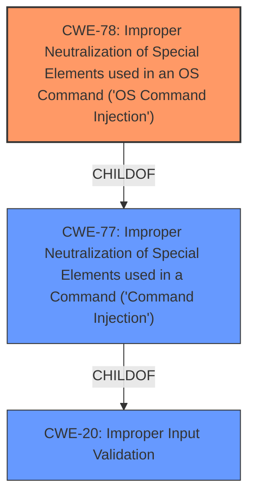

# Analysis for CVE-2021-1554

# Summary
| CWE ID  | CWE Name                                                                                | Confidence | CWE Abstraction Level | CWE Vulnerability Mapping Label | CWE-Vulnerability Mapping Notes |
| ------- | --------------------------------------------------------------------------------------- | ---------- | ----------------------- | ------------------------------- | --------------------------------- |
| CWE-78  | Improper Neutralization of Special Elements used in an OS Command ('OS Command Injection') | 1.0        | Base                    | Primary                         | Allowed                           |
| CWE-20  | Improper Input Validation                                                               | 0.7        | Class                   | Secondary                       | Discouraged                       |

## Evidence and Confidence

*   **Confidence Score:** 0.9
*   **Evidence Strength:** HIGH

## Relationship Analysis
The primary CWE is CWE-78, which is a Base level CWE and a child of CWE-77. The vulnerability is due to **improper validation of user-supplied input**, which leads to **command injection**. CWE-20 is a Class level CWE that describes **improper input validation**, but it is too general. CWE-78 is a more specific type of **improper input validation** that leads to **OS command injection**.

## Vulnerability Chain
The vulnerability chain starts with the **improper validation of user-supplied input** (CWE-20), which leads to **OS command injection** (CWE-78). The final impact is the execution of arbitrary commands with root privileges.

## Summary of Analysis
The vulnerability is due to **improper validation of user-supplied input**, which leads to **command injection**. The attacker can send crafted HTTP requests to the web-based management interface of an affected system. A successful exploit could allow the attacker to execute arbitrary commands with root privileges on the device.

The **Vulnerability Description Key Phrases** includes:
- **rootcause:** **improper validation of user-supplied input**
- **weakness:** **command injection**

The **CVE Reference Links Content Summary** includes:
    "root_cause": "The vulnerabilities are due to **improper validation of user-supplied input** in the web-based management interface.",
    "weaknesses": [
      "Command Injection (CWE-77)"
    ],

The primary CWE is CWE-78, which is a Base level CWE and a child of CWE-77. The vulnerability is due to **improper validation of user-supplied input**, which leads to **command injection**. CWE-20 is a Class level CWE that describes **improper input validation**, but it is too general. CWE-78 is a more specific type of **improper input validation** that leads to **OS command injection**.

The retriever results listed CWE-77 as the top combined result.
CWE-77: Improper Neutralization of Special Elements used in a Command ('Command Injection') is a Class level CWE.
The description reads: The product constructs all or part of a command using externally-influenced input from an upstream component, but it does not neutralize or incorrectly neutralizes special elements that could modify the intended command when it is sent to a downstream component.
The mapping guidance says: CWE-77 is often misused when OS command injection (CWE-78) was intended instead [REF-1287].

CWE-78: Improper Neutralization of Special Elements used in an OS Command ('OS Command Injection') is a Base level CWE.
The description reads: The product constructs all or part of an OS command using externally-influenced input from an upstream component, but it does not neutralize or incorrectly neutralizes special elements that could modify the intended OS command when it is sent to a downstream component.
The mapping guidance says: This CWE entry is at the Base level of abstraction, which is a preferred level of abstraction for mapping to the root causes of vulnerabilities.

Based on the key phrases, the retriever results, and the CWE descriptions, CWE-78 is the best match for this vulnerability.

CWE-20: Improper Input Validation
The description reads: The product receives input or data, but it does not validate or incorrectly validates that the input has the properties that are required to process the data safely and correctly.
The mapping guidance says: CWE-20 is commonly misused in low-information vulnerability reports when lower-level CWEs could be used instead, or when more details about the vulnerability are available [REF-1287].
CWE-20 is too general for this vulnerability.

CWE-770: Allocation of Resources Without Limits or Throttling
The description reads: CWE-770: Allocation of Resources Without Limits or Throttling
This CWE is not related to the vulnerability.

CWE-1284: Improper Validation of Specified Quantity in Input
The description reads: The product receives input that is expected to specify a quantity (such as size or length), but it does not validate or incorrectly validates that the quantity has the required properties.
This CWE is not related to the vulnerability.

Relevant CWE Information: