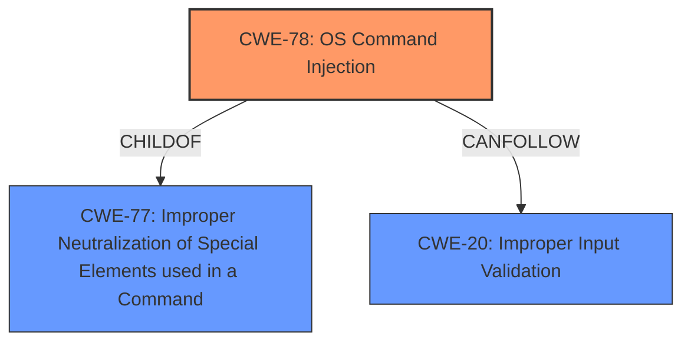

# Enhanced Analysis for CVE-2021-1555

# Summary
| CWE ID | CWE Name | Confidence | CWE Abstraction Level | CWE Vulnerability Mapping Label | CWE-Vulnerability Mapping Notes |
|---|---|---|---|---|---|
| CWE-78 | Improper Neutralization of Special Elements used in an OS Command ('OS Command Injection') | 1.0 | Base | Allowed | Primary CWE |
| CWE-20 | Improper Input Validation | 0.7 | Class | Discouraged | Secondary Candidate |

## Evidence and Confidence

*   **Confidence Score:** 0.9
*   **Evidence Strength:** HIGH

## Relationship Analysis
The primary relationship influencing the CWE selection is the hierarchical relationship between CWE-77 and CWE-78, where CWE-78 is a specific type of CWE-77 related to OS commands. CWE-20 is a more general class of weakness that CANPRECEDE CWE-78. The choice of CWE-78 as the primary CWE is based on the vulnerability description explicitly mentioning command injection, and the CVE details specifying "OS command injection."



## Vulnerability Chain
The vulnerability chain begins with **improper input validation** (CWE-20), which allows an attacker to inject special elements into an OS command, leading to **OS Command Injection** (CWE-78). This allows the attacker to execute arbitrary commands with root privileges.
  - CWE-20: Improper Input Validation (Root Cause)
  - CWE-78: OS Command Injection (Weakness)
  - Impact: Arbitrary command execution with root privileges.

## Summary of Analysis
Initially, CWE-787 was presented as a primary candidate, but I determined that the vulnerability description and CVE details specifically mention "command injection" and "OS Command Injection". Therefore, CWE-78 is the more appropriate primary CWE. This decision is strongly supported by the vulnerability description mentioning "command injection attacks" and the CVE details specifying that the vulnerability is due to **improper validation** of user-supplied input, which leads to "Command Injection (CWE-77)". Further, the root cause is **improper input validation**. While CWE-77 is a parent of CWE-78, the details here specify an OS Command.

*   "Multiple vulnerabilities in the web-based management interface of certain Cisco Small Business 100, 300, and 500 Series Wireless Access Points could allow an authenticated, remote attacker to perform **command injection** attacks against an affected device."
*   "These vulnerabilities are due to **improper validation** of user-supplied input."
*   CVE Reference Links Content Summary: "The vulnerabilities are due to **improper validation** of user-supplied input in the web-based management interface of certain Cisco Small Business 100, 300, and 500 Series Wireless Access Points." Also "Command Injection (CWE-77)"

CWE-78 is more specific and directly aligns with the nature of the vulnerability, making it the optimal choice. The high retriever score for CWE-78 supports this conclusion.

Relevant CWE Information:

# Enhanced Context (25 CWEs)
The following CWEs were identified as potentially relevant to this vulnerability:

## CWE-78: Improper Neutralization of Special Elements used in an OS Command ('OS Command Injection')
**Abstraction:** Base
**Status:** Stable

### Description
The product constructs all or part of an OS command using externally-influenced input from an upstream component, but it does not neutralize or incorrectly neutralizes special elements that could modify the intended OS command when it is sent to a downstream component.

### Extended Description
This weakness can lead to a vulnerability in environments in which the attacker does not have direct access to the operating system, such as in web applications. Alternately, if the weakness occurs in a privileged program, it could allow the attacker to specify commands that normally would not be accessible, or to call alternate commands with privileges that the attacker does not have. The problem is exacerbated if the compromised process does not follow the principle of least privilege, because the attacker-controlled commands may run with special system privileges that increases the amount of damage.

### Alternative Terms
Shell injection
Shell metacharacters
OS Command Injection

### Relationships
ChildOf -> CWE-77
ChildOf -> CWE-74
ChildOf -> CWE-77
ChildOf -> CWE-77
CanAlsoBe -> CWE-88

### Mapping Guidance
**Usage:** Allowed
**Rationale:** This CWE entry is at the Base level of abstraction, which is a preferred level of abstraction for mapping to the root causes of vulnerabilities.
**Comments:** Carefully read both the name and description to ensure that this mapping is an appropriate fit. Do not try to 'force' a mapping to a lower-level Base/Variant simply to comply with this preferred level of abstraction.

### Technical Explanation for CWE-78:
The vulnerability stems from the application's **failure to properly neutralize special elements** in user-supplied input when constructing OS commands. This allows an attacker to inject malicious commands that the system will execute with elevated privileges, due to the **improper validation** of the input.

### Security Implications for CWE-78:
Successful exploitation allows an attacker to execute arbitrary commands with root privileges, potentially compromising the entire device.

### Relationship Explanation for CWE-78:
CWE-78 is a child of CWE-77, making it a more specific form of command injection that targets OS commands. It can also be related to CWE-88 (Argument Injection) if the attacker is able to inject arguments into an existing command.

### MITRE Mapping Guidance Influence for CWE-78:
The usage is ALLOWED and the rationale specifies that this CWE is a preferred level of abstraction for root causes.

## CWE-20: Improper Input Validation
**Abstraction:** Class
**Status:** Stable

### Description
The product receives input or data, but it does
        not validate or incorrectly validates that the input has the
        properties that are required to process the data safely and
        correctly.

### Extended Description
Input validation is a frequently-used technique for checking potentially dangerous inputs in order to ensure that the inputs are safe for processing within the code, or when communicating with other components. When software does not validate input properly, an attacker is able to craft the input in a form that is not expected by the rest of the application. This will lead to parts of the system receiving unintended input, which may result in altered control flow, arbitrary control of a resource, or arbitrary code execution.

### Alternative Terms
None

### Relationships
ChildOf -> CWE-707
PeerOf -> CWE-345
CanPrecede -> CWE-22
CanPrecede -> CWE-41
CanPrecede -> CWE-74
CanPrecede -> CWE-119
CanPrecede -> CWE-770

### Mapping Guidance
**Usage:** Discouraged
**Rationale:** CWE-20 is commonly misused in low-information vulnerability reports when lower-level CWEs could be used instead, or when more details about the vulnerability are available [REF-1287]. It is not useful for trend analysis. It is also a level-1 Class (i.e., a child of a Pillar).

### Technical Explanation for CWE-20:
The root cause of the vulnerability is the **improper validation** of user-supplied input. This means the application is not adequately checking if the input contains malicious commands or special characters that could be used to manipulate the OS command.

### Security Implications for CWE-20:
Failing to validate input allows attackers to inject arbitrary commands, leading to potential system compromise.

### Relationship Explanation for CWE-20:
CWE-20 is a high-level class that can precede other more specific weaknesses. In this case, it precedes CWE-78, as the lack of input validation is the initial cause that enables the command injection vulnerability.

### MITRE Mapping Guidance Influence for CWE-20:
The usage is DISCOURAGED because it is high-level, and lower-level CWEs should be considered. However, it's being included since the root cause is **improper input validation**.

I considered CWE-77, but the reference links content summary and vulnerability description specified OS command injection, so CWE-78 was the more appropriate choice.

I considered CWE-119 (Improper Restriction of Operations within the Bounds of a Memory Buffer), CWE-787 (Out-of-bounds Write) but these were deemed less relevant as the core issue isn't a memory corruption issue, but rather an injection vulnerability due to the **improper input validation**.


## CWE Relationship Analysis

Current CWEs represent these abstraction levels: .


### Vulnerability Chain Analysis

**Chain starting from CWE-787:**
- 787 (Out-of-bounds Write) - ROOT


**Chain starting from CWE-88:**
- 88 (Improper Neutralization of Argument Delimiters in a Command ('Argument Injection')) - ROOT


### CWE Relationship Diagram

```mermaid
graph TD
    classDef primary fill:#f96,stroke:#333,stroke-width:2px
    classDef secondary fill:#69f,stroke:#333
    classDef tertiary fill:#9e9,stroke:#333
```