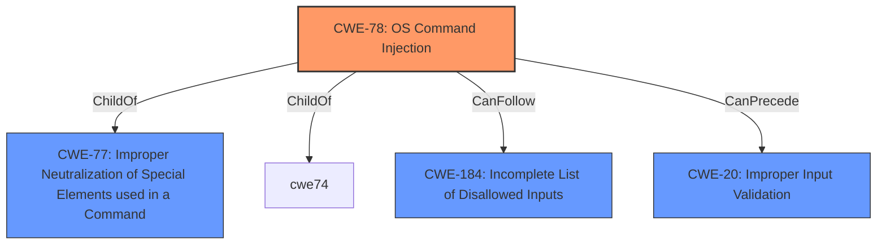

# Raw Analyzer Response for CVE-2021-1560

# Summary
| CWE ID | CWE Name | Confidence | CWE Abstraction Level | CWE Vulnerability Mapping Label | CWE-Vulnerability Mapping Notes |
|---|---|---|---|---|---|
| CWE-78 | Improper Neutralization of Special Elements used in an OS Command ('OS Command Injection') | 1.0 | Base | Allowed | Primary CWE |
| CWE-20 | Improper Input Validation | 0.7 | Class | Discouraged | Secondary Candidate |

## Evidence and Confidence

*   **Confidence Score:** 0.9
*   **Evidence Strength:** HIGH

## Relationship Analysis
The primary relationship influencing the decision is the ChildOf relationship, where CWE-78 (OS Command Injection) is a child of CWE-77 (Improper Neutralization of Special Elements used in a Command). This indicates that OS command injection is a specific type of command injection. Additionally, CWE-78 can be preceded by CWE-184 (Incomplete List of Disallowed Inputs). CWE-20 (Improper Input Validation) is a high-level class, making CWE-78 a more specific and appropriate choice.

## Vulnerability Chain
The vulnerability chain starts with **insufficient input sanitization**, leading to **command injection**, and ultimately resulting in the ability to execute arbitrary commands as root.

## Summary of Analysis
The initial analysis indicated a **command injection** vulnerability due to **insufficient input sanitization**. The CVE Reference Links Content Summary confirms this, stating that "Multiple command injection vulnerabilities exist in Cisco DNA Spaces Connector due to **insufficient input sanitization**." The primary CWE match suggested was CWE-269 (Improper Privilege Management), but this is incorrect. The retriever results and the description of the vulnerability clearly point to CWE-78 (Improper Neutralization of Special Elements used in an OS Command ('OS Command Injection')) as the most appropriate CWE. The vulnerability involves injecting crafted input during command execution, allowing an attacker to execute arbitrary commands as root. CWE-78 directly addresses this scenario. CWE-20 (Improper Input Validation) is a more general class and less specific than CWE-78. I am overriding the primary CWE suggestion based on the evidence provided in the vulnerability description and the retriever results.

Relevant CWE Information:

# Enhanced Context (25 CWEs)

## CWE-653: Improper Isolation or Compartmentalization
**Abstraction Level**: Class
**Similarity Score**: 0.75
**Source**: dense

**Description**:
The product does not properly compartmentalize or isolate functionality, processes, or resources that require different privilege levels, rights, or permissions.
**Not considered**: This is related to privilege separation, but the root cause is command injection due to **insufficient input sanitization**, making it a less direct match.

## CWE-73: External Control of File Name or Path
**Abstraction Level**: Base
**Similarity Score**: 0.75
**Source**: dense

**Description**:
The product allows user input to control or influence paths or file names that are used in filesystem operations.
**Not considered**: This is related to file path manipulation, but the vulnerability is about command injection.

## CWE-280: Improper Handling of Insufficient Permissions or Privileges 
**Abstraction Level**: Base
**Similarity Score**: 0.74
**Source**: dense

**Description**:
The product does not handle or incorrectly handles when it has insufficient privileges to access resources or functionality as specified by their permissions. This may cause it to follow unexpected code paths that may leave the product in an invalid state.
**Not considered**: The root cause is command injection, not privilege handling.

## CWE-274: Improper Handling of Insufficient Privileges
**Abstraction Level**: Base
**Similarity Score**: 0.74
**Source**: dense

**Description**:
The product does not handle or incorrectly handles when it has insufficient privileges to perform an operation, leading to resultant weaknesses.
**Not considered**: Same reason as CWE-280

## CWE-807: Reliance on Untrusted Inputs in a Security Decision
**Abstraction Level**: Base
**Similarity Score**: 0.74
**Source**: dense

**Description**:
The product uses a protection mechanism that relies on the existence or values of an input, but the input can be modified by an untrusted actor in a way that bypasses the protection mechanism.
**Not considered**: While related to untrusted inputs, the core issue is the command injection itself.

## CWE-427: Uncontrolled Search Path Element
**Abstraction Level**: Base
**Similarity Score**: 0.74
**Source**: dense

**Description**:
The product uses a fixed or controlled search path to find resources, but one or more locations in that path can be under the control of unintended actors.
**Not considered**: Not related to the vulnerability description.

## CWE-250: Execution with Unnecessary Privileges
**Abstraction Level**: Base
**Similarity Score**: 0.73
**Source**: dense

**Description**:
The product performs an operation at a privilege level that is higher than the minimum level required, which creates new weaknesses or amplifies the consequences of other weaknesses.
**Not considered**: While the attacker executes commands as root, the root cause is still command injection.

## CWE-267: Privilege Defined With Unsafe Actions
**Abstraction Level**: Base
**Similarity Score**: 0.73
**Source**: dense

**Description**:
A particular privilege, role, capability, or right can be used to perform unsafe actions that were not intended, even when it is assigned to the correct entity.
**Not considered**: The vulnerability is not about defining unsafe actions with privileges.

## CWE-1220: Insufficient Granularity of Access Control
**Abstraction Level**: Base
**Similarity Score**: 0.73
**Source**: dense

**Description**:
The product implements access controls via a policy or other feature with the intention to disable or restrict accesses (reads and/or writes) to assets in a system from untrusted agents. However, implemented access controls lack required granularity, which renders the control policy too broad because it allows accesses from unauthorized agents to the security-sensitive assets.
**Not considered**: The issue is not related to access control granularity.

## CWE-59: Improper Link Resolution Before File Access ('Link Following')
**Abstraction Level**: Base
**Similarity Score**: 0.73
**Source**: dense

**Description**:
The product attempts to access a file based on the filename, but it does not properly prevent that filename from identifying a link or shortcut that resolves to an unintended resource.
**Not considered**: The vulnerability is not about improper link resolution.

## CWE-22: Improper Limitation of a Pathname to a Restricted Directory ('Path Traversal')
**Abstraction Level**: Base
**Similarity Score**: 10066.92
**Source**: sparse

**Description**:
The product uses external input to construct a pathname that is intended to identify a file or directory that is located underneath a restricted parent directory, but the product does not properly neutralize special elements within the pathname that can cause the pathname to resolve to a location that is outside of the restricted directory.
**Not considered**: The issue is command injection, not path traversal.

## CWE-88: Improper Neutralization of Argument Delimiters in a Command ('Argument Injection')
**Abstraction Level**: Base
**Similarity Score**: 9558.53
**Source**: sparse

**Description**:
The product constructs a string for a command to be executed by a separate component
in another control sphere, but it does not properly delimit the
intended arguments, options, or switches within that command string.
**Not considered**: While argument injection can lead to command execution, the provided information points to general OS command injection rather than argument injection.

## CWE-138: Improper Neutralization of Special Elements
**Abstraction Level**: Class
**Similarity Score**: 9530.74
**Source**: sparse

**Description**:
The product receives input from an upstream component, but it does not neutralize or incorrectly neutralizes special elements that could be interpreted as control elements or syntactic markers when they are sent to a downstream component.
**Not considered**: Too general compared to CWE-78

## CWE-184: Incomplete List of Disallowed Inputs
**Abstraction Level**: Base
**Similarity Score**: 9448.98
**Source**: sparse

**Description**:
The product implements a protection mechanism that relies on a list