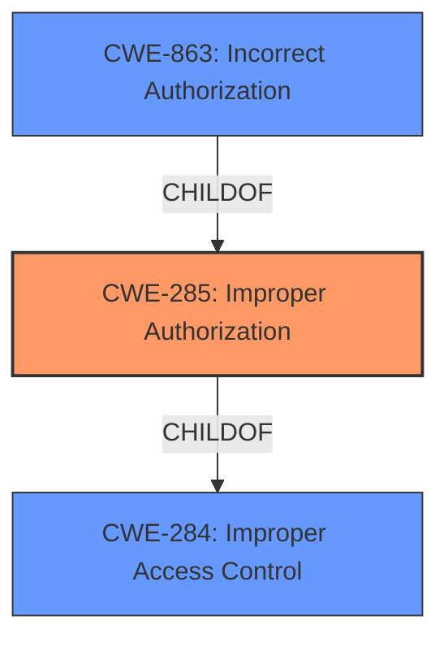

# Analysis for CVE-2021-1561

# Summary
| CWE ID | CWE Name | Confidence | CWE Abstraction Level | CWE Vulnerability Mapping Label | CWE-Vulnerability Mapping Notes |
|---|---|---|---|---|---|
| CWE-285 | Improper Authorization | 0.9 | Class | Primary | Allowed-with-Review |
| CWE-863 | Incorrect Authorization | 0.7 | Class | Secondary | Allowed-with-Review |

## Evidence and Confidence

*   **Confidence Score:** 0.8
*   **Evidence Strength:** HIGH

## Relationship Analysis
The primary relationship influencing the decision is the hierarchical relationship between CWE-284 (Improper Access Control), CWE-285 (Improper Authorization), and CWE-863 (Incorrect Authorization). CWE-285 and CWE-863 are children of CWE-284. Since the vulnerability involves an authorization **check that is not correctly performed**, CWE-863 is a more specific classification than CWE-285. The description mentions that **access to the spam quarantine feature is not properly restricted**, pointing towards an authorization issue. CWE-284 is too high-level (Pillar) and therefore not specific enough. Both CWE-285 and CWE-863 are Class level, and the decision between these two hinges on whether the authorization check is missing entirely (CWE-285) or performed incorrectly (CWE-863). The vulnerability description implies that some form of access control exists, but it's **not properly restricted**, which suggests an **incorrect** authorization check rather than a complete absence.

## Vulnerability Chain
The chain of events is as follows:

1.  **Root Cause:** **Access to the spam quarantine feature is not properly restricted** (Implies **incorrect** authorization).
2.  **Weakness:** The system **fails to properly restrict access** to the spam quarantine feature.
3.  **Impact:** An attacker can modify another user's spam quarantine settings, potentially disabling security controls or viewing email messages stored in quarantine.

The root cause is the **incorrect** implementation of access control, which leads to the ability to modify settings.

## Summary of Analysis
The initial assessment focused on identifying the root cause of the vulnerability. The key phrase **access to the spam quarantine feature is not properly restricted** strongly suggests an authorization problem. This eliminated CWEs related to file system access or link following (e.g., CWE-59, CWE-73). The choice between CWE-285 and CWE-863 was made based on the nuance that the vulnerability involves some form of authorization that is **incorrectly** implemented rather than completely missing.

The retriever results list CWE-285 (Improper Authorization) and CWE-863 (Incorrect Authorization) as potential candidates. The evidence from the vulnerability description and CVE summary supports the classification. The vulnerability description states, **access to the spam quarantine feature is not properly restricted**, which aligns with the description of CWE-285: **The product does not perform or incorrectly performs an authorization check when an actor attempts to access a resource or perform an action.** However, since the description specifies that access control is present but **not properly restricted**, CWE-863 (Incorrect Authorization) becomes more appropriate: **The product performs an authorization check when an actor attempts to access a resource or perform an action, but it does not correctly perform the check.**

The MITRE mapping guidance discourages the use of CWE-285, suggesting more specific CWEs. CWE-863 fits this criterion. Therefore, CWE-285 is the primary candidate, with CWE-863 as a secondary, more specific candidate.

Relevant CWE Information:

# Enhanced Context (25 CWEs)
The following CWEs were identified as potentially relevant to this vulnerability:

## CWE-59: Improper Link Resolution Before File Access ('Link Following')
**Abstraction Level**: Base
**Similarity Score**: 0.81
**Source**: dense

**Description**:
The product attempts to access a file based on the filename, but it does not properly prevent that filename from identifying a link or shortcut that resolves to an unintended resource.

**Mapping Guidance**:
- Usage: Allowed
- Rationale: This CWE entry is at the Base level of abstraction, which is a preferred level of abstraction for mapping to the root causes of vulnerabilities.

## CWE-1386: Insecure Operation on Windows Junction / Mount Point
**Abstraction Level**: Base
**Similarity Score**: 0.78
**Source**: dense

**Description**:
The product opens a file or directory, but it does not properly prevent the name from being associated with a junction or mount point to a destination that is outside of the intended control sphere.

**Mapping Guidance**:
- Usage: Allowed
- Rationale: This CWE entry is at the Base level of abstraction, which is a preferred level of abstraction for mapping to the root causes of vulnerabilities.

## CWE-41: Improper Resolution of Path Equivalence
**Abstraction Level**: Base
**Similarity Score**: 0.78
**Source**: dense

**Description**:
The product is vulnerable to file system contents disclosure through path equivalence. Path equivalence involves the use of special characters in file and directory names. The associated manipulations are intended to generate multiple names for the same object.

**Mapping Guidance**:
- Usage: Allowed
- Rationale: This CWE entry is at the Base level of abstraction, which is a preferred level of abstraction for mapping to the root causes of vulnerabilities.

## CWE-73: External Control of File Name or Path
**Abstraction Level**: Base
**Similarity Score**: 0.78
**Source**: dense

**Description**:
The product allows user input to control or influence paths or file names that are used in filesystem operations.

**Mapping Guidance**:
- Usage: Allowed
- Rationale: This CWE entry is at the Base level of abstraction, which is a preferred level of abstraction for mapping to the root causes of vulnerabilities.

## CWE-23: Relative Path Traversal
**Abstraction Level**: Base
**Similarity Score**: 0.77
**Source**: dense

**Description**:
The product uses external input to construct a pathname that should be within a restricted directory, but it does not properly neutralize sequences such as ".." that can resolve to a location that is outside of that directory.

**Mapping Guidance**:
- Usage: Allowed
- Rationale: This CWE entry is at the Base level of abstraction, which is a preferred level of abstraction for mapping to the root causes of vulnerabilities.

## CWE-274: Improper Handling of Insufficient Privileges
**Abstraction Level**: Base
**Similarity Score**: 0.77
**Source**: dense

**Description**:
The product does not handle or incorrectly handles when it has insufficient privileges to perform an operation, leading to resultant weaknesses.

**Mapping Guidance**:
- Usage: Discouraged
- Rationale: This CWE entry could be deprecated in a future version of CWE.

## CWE-552: Files or Directories Accessible to External Parties
**Abstraction Level**: Base
**Similarity Score**: 0.77
**Source**: dense

**Description**:
The product makes files or directories accessible to unauthorized actors, even though they should not be.

**Mapping Guidance**:
- Usage: Allowed
- Rationale: This CWE entry is at the Base level of abstraction, which is a preferred level of abstraction for mapping to the root causes of vulnerabilities.

## CWE-668: Exposure of Resource to Wrong Sphere
**Abstraction Level**: Class
**Similarity Score**: 0.76
**Source**: dense

**Description**:
The product exposes a resource to the wrong control sphere, providing unintended actors with inappropriate access to the resource.

**Mapping Guidance**:
- Usage: Discouraged
- Rationale: CWE-668 is high-level and is often misused as a catch-all when lower-level CWE IDs might be applicable. It is sometimes used for low-information vulnerability reports [REF-1287]. It is a level-1 Class (i.e., a child of a Pillar). It is not useful for trend analysis.

## CWE-427: Uncontrolled Search Path Element
**Abstraction Level**: Base
**Similarity Score**: 0.76
**Source**: dense

**Description**:
The product uses a fixed or controlled search path to find resources, but one or more locations in that path can be under the control of unintended actors.

**Mapping Guidance**:
- Usage: Allowed
- Rationale: This CWE entry is at the Base level of abstraction, which is a preferred level of abstraction for mapping to the root causes of vulnerabilities.

## CWE-61: UNIX Symbolic Link (Symlink) Following
**Abstraction Level**: Compound
**Similarity Score**: 0.76
**Source**: