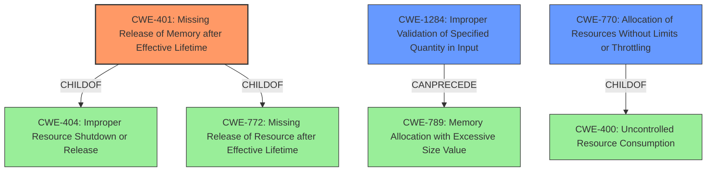

# Analysis for CVE-2021-1564

# Summary
| CWE ID | CWE Name | Confidence | CWE Abstraction Level | CWE Vulnerability Mapping Label | CWE-Vulnerability Mapping Notes |
|---|---|---|---|---|---|
| CWE-401 | Missing Release of Memory after Effective Lifetime | 1.0 | Variant | Allowed | Primary CWE |
| CWE-1284 | Improper Validation of Specified Quantity in Input | 0.7 | Base | Allowed | Secondary Candidate |
| CWE-770 | Allocation of Resources Without Limits or Throttling | 0.6 | Base | Allowed | Secondary Candidate |

## Evidence and Confidence

*   **Confidence Score:** 0.9
*   **Evidence Strength:** HIGH

## Relationship Analysis
The primary CWE, CWE-401 [CWE-401: Missing Release of Memory after Effective Lifetime], is a variant of CWE-404 [CWE-404: Improper Resource Shutdown or Release], indicating a more specific type of resource management issue. CWE-401 is also a child of CWE-772, suggesting a relationship where resources are not released after their intended use. CWE-1284 [CWE-1284: Improper Validation of Specified Quantity in Input] can precede CWE-789 [CWE-789: Memory Allocation with Excessive Size Value], forming a chain where improper input validation leads to excessive memory allocation. CWE-770 [CWE-770: Allocation of Resources Without Limits or Throttling] is a child of CWE-400 [CWE-400: Uncontrolled Resource Consumption], indicating a specific type of uncontrolled resource consumption due to lack of limits or throttling.

## Vulnerability Chain
The vulnerability chain starts with **incorrect processing** of packets, leading to a **memory leak**, and finally resulting in a denial of service (DoS). Specifically, crafted packets cause continuous memory consumption, which leads to device crash and reload.

## Summary of Analysis
The initial assessment aligns with the provided "CWE for similar CVE Descriptions," which identifies CWE-401 [CWE-401: Missing Release of Memory after Effective Lifetime] as the primary match. The vulnerability description highlights the **memory leak** caused by **incorrect processing** of Cisco Discovery Protocol and LLDP packets. This aligns directly with CWE-401, which describes a failure to release allocated memory after its effective lifetime. The "CVE Reference Links Content Summary" reinforces this by stating, "The vulnerabilities are due to incorrect processing of certain Cisco Discovery Protocol and LLDP packets at ingress time" and listing "Memory leak" as a weakness.

The retriever results also support CWE-401 as the top candidate, with a score of 1.000. Given the strong evidence and direct alignment with the CWE description, CWE-401 is the most appropriate primary mapping.

CWE-1284 [CWE-1284: Improper Validation of Specified Quantity in Input] and CWE-770 [CWE-770: Allocation of Resources Without Limits or Throttling] were considered as secondary candidates. CWE-1284 is relevant because the size or quantity specified in the crafted packets might not be properly validated, leading to excessive memory allocation. CWE-770 is also relevant because the system might allocate resources without limits or throttling when processing the crafted packets. However, the primary issue is the failure to release the allocated memory, making CWE-401 the most direct and specific match.

The decision to use CWE-401 as the primary CWE is based on the direct evidence of a **memory leak** resulting from **incorrect processing**, which aligns precisely with the CWE's description of missing release of memory after its effective lifetime. This selection is at the optimal level of specificity (Variant) and is supported by both the vulnerability description and the retriever results.