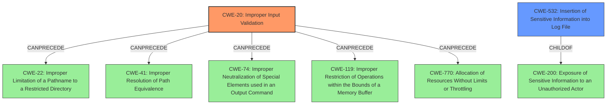

# Analysis Report for CVE-2021-1569

# Vulnerability Analysis Report: CVE-2021-1569

## Description


## Analysis (with Relationship Data)

# Summary
| CWE ID | CWE Name | Confidence | CWE Abstraction Level | CWE Vulnerability Mapping Label | CWE-Vulnerability Mapping Notes |
|---|---|---|---|---|---|
| CWE-20 | Improper Input Validation | 0.8 | Class | Primary | Discouraged |
| CWE-532 | Insertion of Sensitive Information into Log File | 0.6 | Base | Secondary | Allowed |

## Evidence and Confidence

*   **Confidence Score:** 0.7
*   **Evidence Strength:** MEDIUM

## Relationship Analysis
The primary CWE selected is CWE-20, which is a Class-level CWE. While the guidance discourages its use, the evidence primarily points to an input validation issue within the crafted XMPP messages. The secondary CWE, CWE-532, is considered because the "sensitive authentication information" could potentially be logged due to the **improper validation**. CWE-20 can precede several other CWEs in a chain, but without more information, it's difficult to pinpoint the precise flow.



## Vulnerability Chain
The vulnerability chain starts with the **improper validation** of XMPP message content (CWE-20), leading to potential information disclosure. If sensitive information is logged, then CWE-532 is applicable.
  - Crafted XMPP Message --> CWE-20 --> Information Disclosure / Sensitive Information logged --> CWE-532

## Summary of Analysis
The initial assessment and the retriever results pointed to CWE-20 as a strong candidate. The vulnerability description key phrases and CVE Reference Links Content Summary support this assessment, indicating that the root cause is an **improper validation** of the message content.

The graph relationships highlight that CWE-20 can lead to various other vulnerabilities, but the specific type of vulnerability resulting from the **improper validation** in this case is information disclosure.

While CWE-20 is a class-level CWE and is generally discouraged, the available information does not provide sufficient details to map to a more specific base or variant level CWE. The evidence from the CVE Reference Links Content Summary explicitly states "**Improper validation** of message content within Cisco Jabber for Windows" supports the selection of CWE-20.

The selection of CWE-532 is based on the potential for "sensitive authentication information" to be logged, which aligns with the description of CWE-532. This is a secondary consideration.

Relevant CWE Information:

# Enhanced Context (25 CWEs)
The following CWEs were identified as potentially relevant to this vulnerability:

## CWE-59: Improper Link Resolution Before File Access ('Link Following')
**Abstraction Level**: Base
**Similarity Score**: 0.80

## CWE-41: Improper Resolution of Path Equivalence
**Abstraction Level**: Base
**Similarity Score**: 0.79

## CWE-23: Relative Path Traversal
**Abstraction Level**: Base
**Similarity Score**: 0.79

## CWE-1289: Improper Validation of Unsafe Equivalence in Input
**Abstraction Level**: Base
**Similarity Score**: 0.78

## CWE-73: External Control of File Name or Path
**Abstraction Level**: Base
**Similarity Score**: 0.78

## CWE-668: Exposure of Resource to Wrong Sphere
**Abstraction Level**: Class
**Similarity Score**: 0.77

## CWE-61: UNIX Symbolic Link (Symlink) Following
**Abstraction Level**: Compound
**Similarity Score**: 0.77

## CWE-703: Improper Check or Handling of Exceptional Conditions
**Abstraction Level**: Pillar
**Similarity Score**: 0.77

## CWE-184: Incomplete List of Disallowed Inputs
**Abstraction Level**: Base
**Similarity Score**: 0.77

## CWE-754: Improper Check for Unusual or Exceptional Conditions
**Abstraction Level**: Class
**Similarity Score**: 0.77

## CWE-1284: Improper Validation of Specified Quantity in Input
**Abstraction Level**: Base
**Similarity Score**: 6476.12

## CWE-22: Improper Limitation of a Pathname to a Restricted Directory ('Path Traversal')
**Abstraction Level**: Base
**Similarity Score**: 6433.05

## CWE-59: Improper Link Resolution Before File Access ('Link Following')
**Abstraction Level**: Base
**Similarity Score**: 6342.60

## CWE-119: Improper Restriction of Operations within the Bounds of a Memory Buffer
**Abstraction Level**: Class
**Similarity Score**: 6340.07

## CWE-125: Out-of-bounds Read
**Abstraction Level**: Base
**Similarity Score**: 6331.51

## CWE-22: Improper Limitation of a Pathname to a Restricted Directory ('Path Traversal')
**Abstraction Level**: base
**Similarity Score**: 4.33

## CWE-770: Allocation of Resources Without Limits or Throttling
**Abstraction Level**: base
**Similarity Score**: 4.33

## CWE-190: Integer Overflow or Wraparound
**Abstraction Level**: base
**Similarity Score**: 4.33

## CWE-1284: Improper Validation of Specified Quantity in Input
**Abstraction Level**: base
**Similarity Score**: 4.33

## CWE-1257: Improper Access Control Applied to Mirrored or Aliased Memory Regions
**Abstraction Level**: base
**Similarity Score**: 4.33

## CWE-386: Symbolic Name not Mapping to Correct Object
**Abstraction Level**: base
**Similarity Score**: 4.21

## CWE-789: Memory Allocation with Excessive Size Value
**Abstraction Level**: variant
**Similarity Score**: 3.88

## CWE-41: Improper Resolution of Path Equivalence
**Abstraction Level**: Base
**Similarity Score**: 3.34

## CWE-787: Out-of-bounds Write
**Abstraction Level**: base
**Similarity Score**: 3.30

## CWE-20: Improper Input Validation
**Abstraction Level**: class
**Similarity Score**: 2.98

### Considered but not used:

*   **CWE-119:** While this was a top result in the Retriever, there is no evidence of memory buffer issues, making it unsuitable.
*   **CWE-799:** There's no evidence suggesting the interaction frequency is the issue.
*   **CWE-1284:** No specific quantity validation issue is described.
*   **CWE-401:** There is no evidence of a memory leak, so not applicable.
*   **CWE-23, CWE-41, CWE-59, CWE-73:** These path-related CWEs aren't supported by the vulnerability description which mentions XMPP messages rather than file paths.
*   **CWE-532:** Considered as a secondary weakness if sensitive info is logged.


## CWE Relationship Analysis

Current CWEs represent these abstraction levels: .


### Vulnerability Chain Analysis

**Chain starting from CWE-754:**
- 754 (Improper Check for Unusual or Exceptional Conditions) - ROOT


**Chain starting from CWE-787:**
- 787 (Out-of-bounds Write) - ROOT


### CWE Relationship Diagram

```mermaid
graph TD
    classDef primary fill:#f96,stroke:#333,stroke-width:2px
    classDef secondary fill:#69f,stroke:#333
    classDef tertiary fill:#9e9,stroke:#333
```


*Report generated on 2025-04-02 02:36:32*
