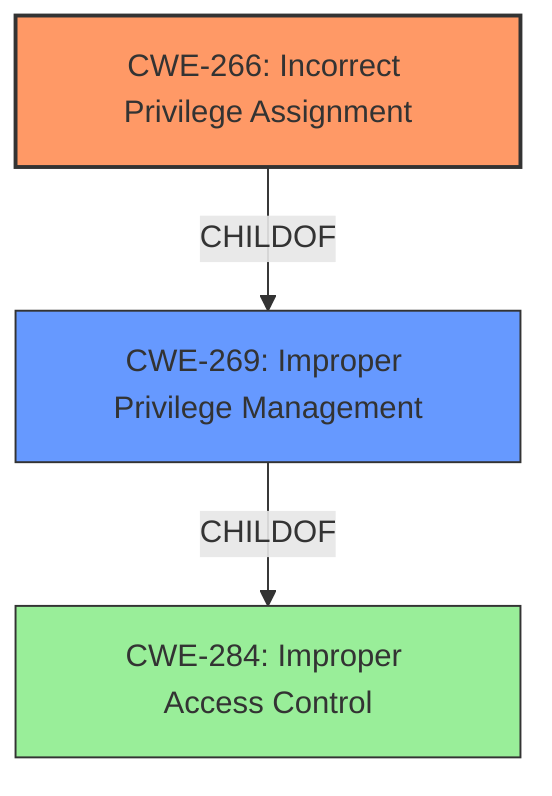

# Analysis for CVE-2021-1572

# Summary
| CWE ID | CWE Name | Confidence | CWE Abstraction Level | CWE Vulnerability Mapping Label | CWE-Vulnerability Mapping Notes |
|---|---|---|---|---|---|
| CWE-266 | Incorrect Privilege Assignment | 1.0 | Base | Allowed | Primary CWE |

## Evidence and Confidence

*   **Confidence Score:** 1.0
*   **Evidence Strength:** HIGH

## Relationship Analysis
The primary relationship that impacted my decision was the ChildOf relationship where CWE-266 is a child of CWE-269 (Improper Privilege Management). This helped narrow down the selection to a more specific Base level CWE.

## Vulnerability Chain
The vulnerability chain starts with the **incorrect privilege level for SFTP user service**, which leads to the ability of an authenticated local attacker to execute arbitrary commands.
  - **Root Cause:** Incorrect Privilege Assignment (CWE-266)
  - **Impact:** Execute arbitrary commands

## Summary of Analysis
The vulnerability description clearly states that the **rootcause** is an **incorrect privilege level for SFTP user service**. The "CVE Reference Links Content Summary" section explicitly mentions "**Incorrect Privilege Assignment**" as a weakness. The vulnerability occurs because the affected software **incorrectly** runs the SFTP user service at the privilege level of the account.

I selected CWE-266 as the primary CWE because it directly addresses the **rootcause** of the vulnerability, which is the **incorrect** assignment of privileges to the SFTP user service. This aligns with the CWE's description: "A product **incorrectly assigns a privilege** to a particular actor, creating an unintended sphere of control for that actor."

The other CWEs considered were not as directly related to the **rootcause**. While some CWEs like CWE-250 (Execution with Unnecessary Privileges) and CWE-269 (Improper Privilege Management) touch on privilege-related issues, they are either too general or do not precisely capture the nature of the vulnerability. For example, CWE-269 is a Class-level CWE and the mapping guidance discourages using it when more specific CWEs are available. CWE-250 describes a scenario where a process runs with higher than necessary privileges, but the described vulnerability is specifically about an incorrect assignment of privilege level.

The selection of CWE-266 is at the optimal level of specificity because it is a Base-level CWE that accurately represents the weakness described in the vulnerability. The evidence provided supports this classification, and the relationship analysis with its parent CWE further reinforces the decision.