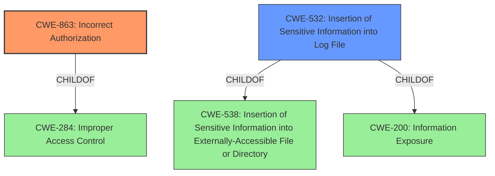

# Raw Analyzer Response for CVE-2021-1574

# Summary
| CWE ID    | CWE Name                         | Confidence | CWE Abstraction Level | CWE Vulnerability Mapping Label | CWE-Vulnerability Mapping Notes |
| :---------- | :------------------------------- | :--------- | :---------------------- | :------------------------------ | :------------------------------ |
| CWE-863 | Incorrect Authorization | 0.9 | Class | Allowed-with-Review | Primary CWE |
| CWE-532 | Insertion of Sensitive Information into Log File | 0.6 | Base | Allowed | Secondary CWE |

## Evidence and Confidence

*   **Confidence Score:** 0.8
*   **Evidence Strength:** HIGH

## Relationship Analysis
The primary CWE is CWE-863, which is a Class-level CWE. Its parent is CWE-284 (Improper Access Control). CWE-863 is chosen because the vulnerability description explicitly states "**improper authorization enforcement**". CWE-532 (Insertion of Sensitive Information into Log File) is a Base-level CWE and is included as a secondary CWE. It's parent is CWE-538 (Insertion of Sensitive Information into Externally-Accessible File or Directory) and CWE-200 (Information Exposure).

## Vulnerability Chain
The vulnerability chain starts with **improper authorization enforcement** (CWE-863), which leads to privilege escalation, allowing attackers to perform unauthorized actions. It also involves the exposure of sensitive information in log files (CWE-532), which could be used to impersonate legitimate users.

## Summary of Analysis
The initial assessment points towards CWE-863 (Incorrect Authorization) as the primary CWE due to the explicit mention of "**improper authorization enforcement**" in the vulnerability description. Additionally, the ability to retrieve sensitive data from log files suggests CWE-532 (Insertion of Sensitive Information into Log File) as a secondary CWE.

The graph relationships confirm that CWE-863 is a child of CWE-284 (Improper Access Control), indicating that the **improper authorization** is a specific type of access control issue. CWE-532 is a child of CWE-538 (Insertion of Sensitive Information into Externally-Accessible File or Directory) and CWE-200 (Information Exposure), highlighting the data exposure aspect of the vulnerability.

The selected CWEs are at the optimal level of specificity because CWE-863 directly addresses the **improper authorization** issue, and CWE-532 captures the sensitive information exposure aspect. While CWE-284 is a parent of CWE-863, it is too general and doesn't provide enough detail about the specific weakness.

Relevant CWE Information:
- Vulnerability Description Key Phrases:
  - **rootcause:** **improper authorization enforcement**
- CVE Reference Links Content Summary:
  - **Improper Authorization:** The system fails to properly restrict access to certain commands, allowing authenticated users to execute unauthorized actions.
  - The vulnerability is due to **improper authorization enforcement** for specific features within the web-based management interface of Cisco Business Process Automation (BPA).

CWEs Considered but Not Used:
- CWE-284: Improper Access Control - While related, it's too broad compared to CWE-863.
- CWE-285: Improper Authorization - Similar to CWE-863, but CWE-863 specifies that the authorization check exists but is performed incorrectly, which aligns better with the description.
- CWE-798: Use of Hard-coded Credentials - Not applicable as the vulnerability is about **improper authorization enforcement**, not the use of hard-coded credentials.
- CWE-22: Improper Limitation of a Pathname to a Restricted Directory ('Path Traversal') - Not applicable, as there is no path traversal mentioned in the description.
- CWE-20: Improper Input Validation - Although crafted HTTP messages are used, the root cause is **improper authorization enforcement**, not input validation.
- CWE-73: External Control of File Name or Path - Not applicable, as the vulnerability is not related to external control of file names or paths.
- CWE-250: Execution with Unnecessary Privileges - While privilege escalation occurs, the root cause is not execution with unnecessary privileges, but rather **improper authorization enforcement**.
- CWE-287: Improper Authentication - Not applicable, as the vulnerability is not related to authentication.
- CWE-538: Insertion of Sensitive Information into Externally-Accessible File or Directory - While related to CWE-532, it is a higher-level abstraction.