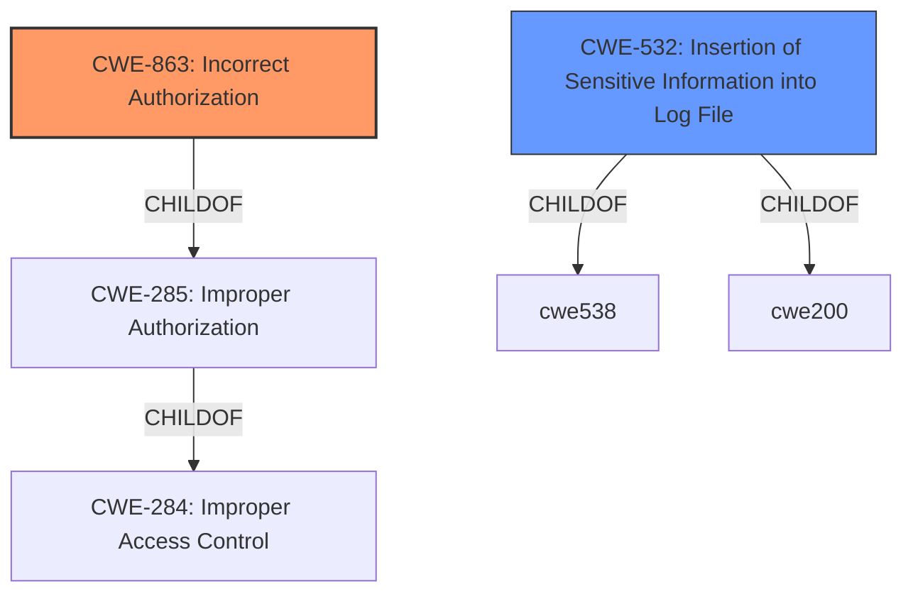

# Enhanced Analysis for CVE-2021-1576

# Summary
| CWE ID | CWE Name | Confidence | CWE Abstraction Level | CWE Vulnerability Mapping Label | CWE-Vulnerability Mapping Notes |
|---|---|---|---|---|---|
| CWE-863 | Incorrect Authorization | 0.9 | Class | Primary | Allowed-with-Review |
| CWE-532 | Insertion of Sensitive Information into Log File | 0.7 | Base | Secondary | Allowed |

## Evidence and Confidence

*   **Confidence Score:** 0.8
*   **Evidence Strength:** HIGH

## Relationship Analysis
The primary CWE is CWE-863, "Incorrect Authorization," which is a Class-level CWE. It is a child of CWE-285, "Improper Authorization," and CWE-284, "Improper Access Control." The secondary CWE is CWE-532 "Insertion of Sensitive Information into Log File" which is at the Base level of abstraction. The relationships between these CWEs help to show the potential for a complex vulnerability where **improper authorization** leads to sensitive information being logged and potentially exposed.



## Vulnerability Chain
The vulnerability chain starts with the **improper authorization enforcement** (CWE-863), which allows an attacker to perform unauthorized actions. Additionally, sensitive information is logged (CWE-532) due to the **improper authorization**. This information could be used to further compromise the system, potentially leading to privilege escalation.

## Summary of Analysis
The initial analysis identified CWE-863, "Incorrect Authorization," as the primary CWE due to the vulnerability description highlighting **improper authorization enforcement**. This aligns with the root cause of the vulnerability, where the system fails to properly check whether the attacker is authorized to perform specific actions or access certain log files.

The CVE Reference Links Content Summary provides supporting evidence:
"root_cause": "Improper authorization enforcement for access to log files containing confidential information."

Additionally, it was identified that sensitive data from log files could be retrieved. This aspect of the vulnerability aligns with CWE-532, "Insertion of Sensitive Information into Log File," because the system is writing sensitive data to logs, which an attacker can then access due to the **improper authorization**.

The selected CWEs are at the optimal level of specificity. CWE-863 is a Class, but it accurately captures the **incorrect authorization** aspect of the vulnerability. CWE-532 is a Base level, and it accurately captures the detail that sensitive data is being logged.

# Relevant CWE Information:

# Enhanced Context (25 CWEs)

## CWE-807: Reliance on Untrusted Inputs in a Security Decision
**Abstraction Level**: Base
**Similarity Score**: 0.75
**Source**: dense
**NOT USED:** This CWE does not fit the vulnerability description. The issue is not about relying on untrusted inputs in a security decision, but rather about **improper authorization** and exposure of sensitive information.

## CWE-538: Insertion of Sensitive Information into Externally-Accessible File or Directory
**Abstraction Level**: Base
**Similarity Score**: 0.75
**Source**: dense
**NOT USED:** While related to CWE-532, this CWE is broader. The vulnerability specifically mentions log files, making CWE-532 a more precise fit.

## CWE-73: External Control of File Name or Path
**Abstraction Level**: Base
**Similarity Score**: 0.74
**Source**: dense
**NOT USED:** This CWE is not relevant because the vulnerability is not related to external control of file names or paths.

## CWE-668: Exposure of Resource to Wrong Sphere
**Abstraction Level**: Class
**Similarity Score**: 0.74
**Source**: dense
**NOT USED:** This CWE is too high-level. While it's true that resources are exposed, the specific issue is **improper authorization**, which is better captured by CWE-863 and the logging of the data is better captured by CWE-532.

## CWE-552: Files or Directories Accessible to External Parties
**Abstraction Level**: Base
**Similarity Score**: 0.73
**Source**: dense
**NOT USED:** This CWE is similar to CWE-532 but not as precise. The vulnerability specifically deals with log files, making CWE-532 more appropriate.

## CWE-274: Improper Handling of Insufficient Privileges
**Abstraction Level**: Base
**Similarity Score**: 0.73
**Source**: dense
**NOT USED:** The vulnerability is about **improper authorization**, not about handling insufficient privileges.

## CWE-41: Improper Resolution of Path Equivalence
**Abstraction Level**: Base
**Similarity Score**: 0.73
**Source**: dense
**NOT USED:** This CWE is not relevant to the vulnerability description.

## CWE-280: Improper Handling of Insufficient Permissions or Privileges
**Abstraction Level**: Base
**Similarity Score**: 0.73
**Source**: dense
**NOT USED:** Similar to CWE-274, the vulnerability is about **improper authorization**, not about handling insufficient privileges.

## CWE-212: Improper Removal of Sensitive Information Before Storage or Transfer
**Abstraction Level**: Base
**Similarity Score**: 0.73
**Source**: dense
**NOT USED:** This CWE doesn't fit because the issue isn't about removing sensitive information before storage or transfer, but about logging it in the first place and failing to protect access to those logs.

## CWE-23: Relative Path Traversal
**Abstraction Level**: Base
**Similarity Score**: 0.73
**Source**: dense
**NOT USED:** This CWE is not relevant to the vulnerability description.

## CWE-863: Incorrect Authorization
**Abstraction Level**: Class
**Similarity Score**: 7616.51
**Source**: sparse
**USED:** This CWE directly addresses the root cause described in the vulnerability description and the "CVE Reference Links Content Summary": **improper authorization enforcement**. It is a Class-level CWE, which might have more specific Base-level children, but it accurately reflects the weakness.
**Mapping Guidance**:
- Usage: Allowed-with-Review
- Rationale: This CWE entry is a Class and might have Base-level children that would be more appropriate

## CWE-285: Improper Authorization
**Abstraction Level**: Class
**Similarity Score**: 7521.83
**Source**: sparse
**NOT USED:** While related to CWE-863, CWE-863 is more specific because it addresses the *incorrect* authorization check, rather than simply the lack of one.

## CWE-639: Authorization Bypass Through User-Controlled Key
**Abstraction Level**: Base
**Similarity Score**: 7472.68
**Source**: sparse
**NOT USED:** This CWE is too specific. The vulnerability is not about authorization bypass through a user-controlled key.

## CWE-22: Improper Limitation of a Pathname to a Restricted Directory ('Path Traversal')
**Abstraction Level**: Base
**Similarity Score**: 7357.11
**Source**: sparse
**NOT USED:** This CWE is not relevant because the vulnerability is not about path traversal.

## CWE-287: Improper Authentication
**Abstraction Level**: Class
**Similarity Score**: 7353.77
**Source**: sparse
**NOT USED:** This CWE is not relevant. The vulnerability is related to **improper authorization**, not authentication.

## CWE-22: Improper Limitation of a Pathname to a Restricted Directory ('Path Traversal')
**Abstraction Level**: base
**Similarity Score**: 4.33
**Source**: graph
**NOT USED:** This CWE is not relevant because the vulnerability is not about path traversal.

## CWE-190: Integer Overflow or Wraparound
**Abstraction Level**: base
**Similarity Score**: 4.33
**Source**: graph
**NOT USED:** This CWE is not relevant to the vulnerability description.

## CWE-434: Unrestricted Upload of File with Dangerous Type
**Abstraction Level**: base
**Similarity Score**: 4.33
**Source**: graph
**NOT USED:** This CWE is not relevant to the vulnerability description.

## CWE-770: Allocation of Resources Without Limits or Throttling
**Abstraction Level**: base
**Similarity Score**: 4.33
**Source**: graph
**NOT USED


## CWE Relationship Analysis

Current CWEs represent these abstraction levels: .


### Vulnerability Chain Analysis

**Chain starting from CWE-434:**
- 434 (Unrestricted Upload of File with Dangerous Type) - ROOT


**Chain starting from CWE-639:**
- 639 (Authorization Bypass Through User-Controlled Key) - ROOT


### CWE Relationship Diagram

```mermaid
graph TD
    classDef primary fill:#f96,stroke:#333,stroke-width:2px
    classDef secondary fill:#69f,stroke:#333
    classDef tertiary fill:#9e9,stroke:#333
```