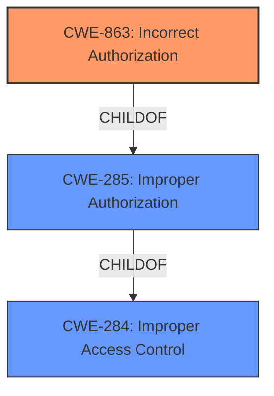

# Analysis for CVE-2021-1579

# Summary
| CWE ID | CWE Name | Confidence | CWE Abstraction Level | CWE Vulnerability Mapping Label | CWE-Vulnerability Mapping Notes |
|---|---|---|---|---|---|
| CWE-863 | Incorrect Authorization | 0.9 | Class | Allowed-with-Review | Primary CWE |
| CWE-285 | Improper Authorization | 0.7 | Class | Discouraged | Secondary Candidate |
| CWE-284 | Improper Access Control | 0.6 | Pillar | Discouraged | Secondary Candidate |

## Evidence and Confidence

*   **Confidence Score:** 0.9
*   **Evidence Strength:** HIGH

## Relationship Analysis
The primary CWE selected is CWE-863 (**Incorrect Authorization**). This is a child of CWE-285 (**Improper Authorization**), which in turn is a child of CWE-284 (**Improper Access Control**). While CWE-284 is too general, CWE-285 and CWE-863 are more specific. The vulnerability involves an authorization check that is performed incorrectly, making CWE-863 the more precise classification.

## Vulnerability Chain
The chain of root cause and weakness that followed is:
1.  **Root Cause:** **Insufficient role-based access control (RBAC)**
2.  Weakness: An attacker with Administrator read-only credentials could send a specific API request using an app with admin write credentials
3.  Impact: Privilege escalation to Administrator with write privileges.

## Summary of Analysis
The initial assessment, based on the **rootcause** and **Vulnerability Description Key Phrases**, points towards an authorization issue related to **insufficient role-based access control (RBAC)**. The CVE description further confirms this by stating, "This vulnerability is due to an insufficient role-based access control (RBAC)." The attacker exploits this by sending a specific API request to elevate privileges.

The retriever results suggest CWE-250 (**Execution with Unnecessary Privileges**), CWE-284 (**Improper Access Control**), CWE-269 (**Improper Privilege Management**), CWE-522 (**Insufficiently Protected Credentials**), CWE-285 (**Improper Authorization**), and CWE-863 (**Incorrect Authorization**).

However, CWE-284 is too high-level (Pillar), and CWE-269 is too broad (Class). CWE-522 is not applicable as the vulnerability does not involve exposure of credentials. CWE-250 is not a fit because the vulnerability is not about executing with unnecessary privileges but about the authorization check itself being flawed.

CWE-285 (**Improper Authorization**) and CWE-863 (**Incorrect Authorization**) are more relevant. CWE-285 is a Class, while CWE-863 is also a Class but more specific, stating that the authorization check is performed but "does not correctly perform the check." Given the vulnerability description, which indicates that the authorization check exists but is insufficient, CWE-863 is the most appropriate choice.

Therefore, the primary CWE is CWE-863 (**Incorrect Authorization**), as it accurately reflects the **insufficient role-based access control (RBAC)** that leads to privilege escalation. CWE-285 (**Improper Authorization**) and CWE-284 (**Improper Access Control**) were considered but deemed less specific.

Relevant CWE Information:

# Enhanced Context (25 CWEs)

## CWE-807: Reliance on Untrusted Inputs in a Security Decision
**Abstraction Level**: Base
**Similarity Score**: 0.74
**Source**: dense

**Description**:
The product uses a protection mechanism that relies on the existence or values of an input, but the input can be modified by an untrusted actor in a way that bypasses the protection mechanism.
*Not Selected*: The vulnerability is not about relying on untrusted input, but about an authorization check that is performed incorrectly.

## CWE-274: Improper Handling of Insufficient Privileges
**Abstraction Level**: Base
**Similarity Score**: 0.74
**Source**: dense

**Description**:
The product does not handle or incorrectly handles when it has insufficient privileges to perform an operation, leading to resultant weaknesses.
*Not Selected*: The vulnerability isn't about the handling of insufficient privileges in general, but more specifically about an **incorrect authorization** check.

## CWE-538: Insertion of Sensitive Information into Externally-Accessible File or Directory
**Abstraction Level**: Base
**Similarity Score**: 0.74
**Source**: dense

**Description**:
The product places sensitive information into files or directories that are accessible to actors who are allowed to have access to the files, but not to the sensitive information.
*Not Selected*: This CWE is not relevant as it deals with sensitive information being exposed in files or directories.

## CWE-280: Improper Handling of Insufficient Permissions or Privileges
**Abstraction Level**: Base
**Similarity Score**: 0.73
**Source**: dense

**Description**:
The product does not handle or incorrectly handles when it has insufficient privileges to access resources or functionality as specified by their permissions. This may cause it to follow unexpected code paths that may leave the product in an invalid state.
*Not Selected*: This CWE is not the most appropriate as it focuses on handling insufficient privileges generally, whereas the reported vulnerability is specifically about an authorization mechanism that isn't functioning correctly, allowing privilege escalation.

## CWE-668: Exposure of Resource to Wrong Sphere
**Abstraction Level**: Class
**Similarity Score**: 0.73
**Source**: dense

**Description**:
The product exposes a resource to the wrong control sphere, providing unintended actors with inappropriate access to the resource.
*Not Selected*: While this could be related, it is a high-level classification and the problem is more precisely that an authorization check exists but is flawed.

## CWE-1220: Insufficient Granularity of Access Control
**Abstraction Level**: Base
**Similarity Score**: 0.73
**Source**: dense

**Description**:
The product implements access controls via a policy or other feature with the intention to disable or restrict accesses (reads and/or writes) to assets in a system from untrusted agents. However, implemented access controls lack required granularity, which renders the control policy too broad because it allows accesses from unauthorized agents to the security-sensitive assets.
*Not Selected*: The problem isn't necessarily about the granularity of access controls, but the correctness of the authorization check.

## CWE-653: Improper Isolation or Compartmentalization
**Abstraction Level**: Class
**Similarity Score**: 0.73
**Source**: dense

**Description**:
The product does not properly compartmentalize or isolate functionality, processes, or resources that require different privilege levels, rights, or permissions.
*Not Selected*: This CWE is not relevant as it deals with compartmentalization, not an authorization bypass.

## CWE-552: Files or Directories Accessible to External Parties
**Abstraction Level**: Base
**Similarity Score**: 0.73
**Source**: dense

**Description**:
The product makes files or directories accessible to unauthorized actors, even though they should not be.
*Not Selected*: This CWE is not relevant as it deals with file access, not privilege escalation through incorrect authorization.

## CWE-41: Improper Resolution of Path Equivalence
**Abstraction Level**: Base
**Similarity Score**: 0.73
**Source**: dense

**Description**:
The product is vulnerable to file system contents disclosure through path equivalence. Path equivalence involves the use of special characters in file and directory names. The associated manipulations are intended to generate multiple names for the same object.
*Not Selected*: This CWE is not relevant as it deals with file path equivalence issues.

## CWE-212: Improper Removal of Sensitive Information Before Storage or Transfer
**Abstraction Level**: Base
**Similarity Score**: 0.72
**Source**: dense

**Description**:
The product stores, transfers, or shares a resource that contains sensitive information, but it does not properly remove that information before the product makes the resource available to unauthorized actors.
*Not Selected*: This CWE is not relevant as it deals with sensitive information handling.

## CWE-863: Incorrect Authorization
**Abstraction Level**: Class
**Similarity Score**: 7079.91
**Source**: sparse

**Description**:
The product performs an authorization check when an actor attempts to access a resource or perform an action, but it does not correctly perform the check.
*Selected*: This is the primary CWE because it directly addresses the core issue: an authorization check is performed, but it's done incorrectly, leading to privilege escalation.

## CWE-285: Improper