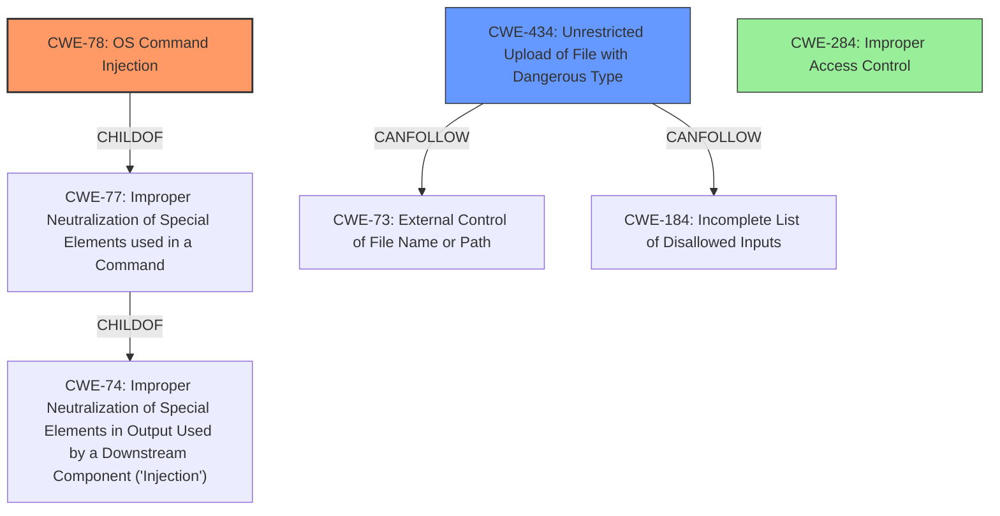

# Analysis for CVE-2021-1580

# Summary
| CWE ID | CWE Name | Confidence | CWE Abstraction Level | CWE Vulnerability Mapping Label | CWE-Vulnerability Mapping Notes |
|---|---|---|---|---|---|
| CWE-78 | Improper Neutralization of Special Elements used in an OS Command ('OS Command Injection') | 1.0 | Base | Allowed | Primary CWE |
| CWE-434 | Unrestricted Upload of File with Dangerous Type | 0.8 | Base | Allowed | Secondary Candidate |
| CWE-284 | Improper Access Control | 0.6 | Pillar | Discouraged | Secondary Candidate |

## Evidence and Confidence

*   **Confidence Score:** 0.9
*   **Evidence Strength:** HIGH

## Relationship Analysis
The primary weakness is CWE-78, which is a base-level CWE. The secondary weakness related to file upload could be connected to CWE-434 or CWE-284. CWE-78 is `ChildOf` CWE-77 (Improper Neutralization of Special Elements used in a Command), which is `ChildOf` CWE-74 (Improper Neutralization of Special Elements in Output Used by a Downstream Component ('Injection')). CWE-434 can `CanFollow` CWE-73 (External Control of File Name or Path) and CWE-184 (Incomplete List of Disallowed Inputs). CWE-284 is a high-level `Pillar` and doesn't have direct relationships that strongly influence this case, so it's considered less specific.

## Vulnerability Chain
The vulnerability chain for **command injection** is:
1.  **Root Cause:** **Improper input validation** in the web UI and API endpoint (from CVE-2021-1580 description).
2.  **Weakness:** **Improper Neutralization of Special Elements used in an OS Command ('OS Command Injection')** (CWE-78).
3.  **Impact:** Execution of arbitrary commands with root-level privileges on an affected device.

The vulnerability chain for **file upload attack** is:
1.  **Root Cause:** **Improper access control** (from CVE-2021-1581 description).
2.  **Weakness:** Unrestricted Upload of File with Dangerous Type (CWE-434).
3.  **Impact:** Filling the upload partition of the affected device.

## Summary of Analysis
The initial analysis identified that the vulnerability involves command injection and file upload attacks on Cisco APIC or Cloud APIC. The primary **weakness** for command injection is **Improper Neutralization of Special Elements used in an OS Command ('OS Command Injection')** (CWE-78) because it directly addresses the **improper neutralization** of input leading to command execution.

The analysis also indicates a file upload vulnerability due to **improper access control**. This suggests a potential secondary weakness related to file handling. CWE-434 (Unrestricted Upload of File with Dangerous Type) is a strong candidate because it specifically addresses the unrestricted upload of files with dangerous types, aligning with the vulnerability description.

The "CVE Reference Links Content Summary" provides strong evidence:
*   CVE-2021-1580: Root cause is **Improper input validation** which results in CWE-78.
*   CVE-2021-1581: Root cause is **Improper access control**, but it's not very specific on the nature of the weakness, so it will have a lower confidence.

The relationship graph shows how CWE-78 is related to other injection-related CWEs, while CWE-434 is related to file handling weaknesses. This supports the selection of CWE-78 as the primary and CWE-434 as a secondary, file-related weakness.

The selection of CWE-78 is at the optimal level of specificity because it directly describes the command injection vulnerability. CWE-434 is a suitable secondary weakness to address the file upload aspect.

CWE-20 (Improper Input Validation) was considered but deemed too generic. While **improper input validation** is mentioned as a root cause in the CVE description, CWE-78 provides a more specific classification. Similarly, CWE-284 (Improper Access Control) is too high-level and less descriptive than CWE-434 for the file upload vulnerability.

Relevant CWE Information:

# Enhanced Context (25 CWEs)

## CWE-78: Improper Neutralization of Special Elements used in an OS Command ('OS Command Injection')
**Technical Explanation:** The vulnerability in Cisco APIC/Cloud APIC's web UI or API endpoints allows a remote attacker to inject OS commands due to **improper neutralization** of special elements in the input. This means that when the application constructs an OS command using external input, it fails to properly sanitize or escape characters that have special meanings in the OS command interpreter (e.g., shell). As a result, an attacker can inject arbitrary commands that will be executed by the system.
**Security Implications:** This can lead to complete system compromise, as the attacker can execute commands with the privileges of the affected process. In the context of Cisco APIC, this could mean root-level access, allowing the attacker to modify system configurations, install malware, or steal sensitive information.
**Relationship:** CWE-78 is a base-level CWE that is a child of CWE-77 (Improper Neutralization of Special Elements used in a Command) and CWE-74 (Improper Neutralization of Special Elements in Output Used by a Downstream Component ('Injection')). It can also be related to CWE-88 (Improper Neutralization of Argument Delimiters in a Command ('Argument Injection')).
**Mapping Guidance Influence:** The MITRE mapping guidance recommends using base-level CWEs when available, which supports the selection of CWE-78.

## CWE-434: Unrestricted Upload of File with Dangerous Type
**Technical Explanation:** The vulnerability allows an unauthenticated, remote attacker to upload files on an affected device due to **improper access control**. This means that the system does not properly restrict the type of files that can be uploaded, allowing an attacker to upload executable files or other dangerous file types that can be used to compromise the system.
**Security Implications:** A successful exploit could allow the attacker to fill the upload partition of the affected device, causing a denial of service. Additionally, if the uploaded file is an executable or script, it could be used to execute arbitrary code on the server.
**Relationship:** CWE-434 is a base-level CWE that can follow CWE-73 (External Control of File Name or Path) and CWE-184 (Incomplete List of Disallowed Inputs).
**Mapping Guidance Influence:** The MITRE mapping guidance recommends using base-level CWEs when available, which supports the selection of CWE-434.

## CWE-284: Improper Access Control
**Technical Explanation:** The vulnerability in the API endpoint allows an unauthenticated, remote attacker to upload files on an affected device because the system does not properly restrict access to the file upload functionality. As a result, an attacker can bypass authentication checks and upload files to the server.
**Security Implications:** This can lead to unauthorized access to sensitive data, modification of system configurations, or denial of service.
**Relationship:** CWE-284 is a pillar-level CWE that is a parent of many more specific access control weaknesses.
**Mapping Guidance Influence:** The MITRE mapping guidance discourages the use of high-level CWEs like CWE-284, recommending more specific CWEs instead. However, in this case, the lack of specific details about the **improper access control** makes it difficult to choose a more specific CWE.

Other CWEs considered but not used:
*   CWE-20 (Improper Input Validation): Considered but deemed too generic. While improper input validation is a contributing factor, CWE-78 provides a more specific classification for the command injection vulnerability.
*   CWE-22 (Improper Limitation of a Pathname to a Restricted Directory ('Path Traversal')): Not directly applicable, as the vulnerability primarily involves command injection