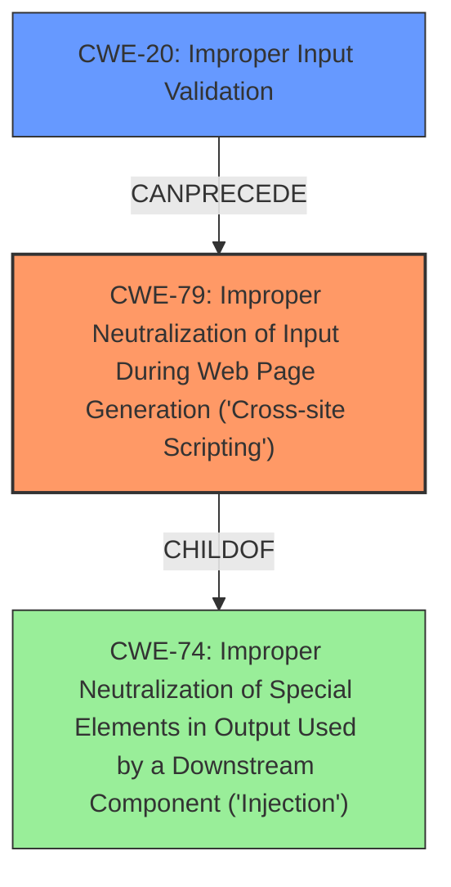

# Raw Analyzer Response for CVE-2021-1582

# Summary
| CWE ID | CWE Name | Confidence | CWE Abstraction Level | CWE Vulnerability Mapping Label | CWE-Vulnerability Mapping Notes |
|---|---|---|---|---|---|
| CWE-79 | Improper Neutralization of Input During Web Page Generation ('Cross-site Scripting') | 1.0 | Base | Allowed | Primary CWE: The vulnerability is a stored cross-site scripting (XSS) due to **improper input validation** in the web UI, allowing an attacker to execute arbitrary script code or access sensitive information.|
| CWE-20 | Improper Input Validation | 0.7 | Class | Discouraged | Secondary CWE: The root cause is **improper input validation** in the web UI, which is a prerequisite for the XSS vulnerability. However, CWE-20 is a high-level class, and CWE-79 more directly addresses the XSS vulnerability.|

## Evidence and Confidence

*   **Confidence Score:** 0.9
*   **Evidence Strength:** HIGH

## Relationship Analysis
The primary CWE is CWE-79, which directly addresses the stored cross-site scripting vulnerability. CWE-20 is considered as a secondary CWE since the vulnerability stems from **improper input validation**, which is a prerequisite for the XSS. However, CWE-20 is a high-level class, and CWE-79 more specifically captures the weakness.

## Vulnerability Chain
The vulnerability chain starts with **improper input validation** (CWE-20), which allows for the injection of malicious script code. This leads to a stored cross-site scripting (XSS) vulnerability (CWE-79), enabling the attacker to execute arbitrary script code or access sensitive information.

## Summary of Analysis
The vulnerability is classified as CWE-79, which directly addresses the stored cross-site scripting vulnerability. The root cause is **improper input validation**, but CWE-20 is a high-level class, and CWE-79 more specifically captures the weakness.
The evidence supporting this classification is the description of the vulnerability as a stored cross-site scripting attack due to **improper input validation** in the web UI. The vulnerability allows an authenticated attacker to send malicious input to the web UI, resulting in the execution of arbitrary script code or access to sensitive information.
The relationship analysis shows that CWE-20 can precede CWE-79, indicating that **improper input validation** is a prerequisite for the XSS vulnerability. However, CWE-79 is a more specific classification for the weakness.
The mapping guidance recommends using a Base level of abstraction when possible, and CWE-79 is a Base level CWE that directly addresses the XSS vulnerability.

Relevant CWE Information:

# Enhanced Context (25 CWEs)
The following CWEs were identified as potentially relevant to this vulnerability:

## CWE-838: Inappropriate Encoding for Output Context
**Abstraction Level**: Base
**Similarity Score**: 0.74
**Source**: dense

**Description**:
The product uses or specifies an encoding when generating output to a downstream component, but the specified encoding is not the same as the encoding that is expected by the downstream component.

**Mapping Guidance**:
- Usage: Allowed
- Rationale: This CWE entry is at the Base level of abstraction, which is a preferred level of abstraction for mapping to the root causes of vulnerabilities.

*This CWE is not suitable because the vulnerability is not related to encoding issues.*

## CWE-1289: Improper Validation of Unsafe Equivalence in Input
**Abstraction Level**: Base
**Similarity Score**: 0.74
**Source**: dense

**Description**:
The product receives an input value that is used as a resource identifier or other type of reference, but it does not validate or incorrectly validates that the input is equivalent to a potentially-unsafe value.

**Mapping Guidance**:
- Usage: Allowed
- Rationale: This CWE entry is at the Base level of abstraction, which is a preferred level of abstraction for mapping to the root causes of vulnerabilities.

*This CWE is not suitable because the vulnerability is not related to unsafe equivalence.*

## CWE-807: Reliance on Untrusted Inputs in a Security Decision
**Abstraction Level**: Base
**Similarity Score**: 0.72
**Source**: dense

**Description**:
The product uses a protection mechanism that relies on the existence or values of an input, but the input can be modified by an untrusted actor in a way that bypasses the protection mechanism.

**Mapping Guidance**:
- Usage: Allowed
- Rationale: This CWE entry is at the Base level of abstraction, which is a preferred level of abstraction for mapping to the root causes of vulnerabilities.

*This CWE is not suitable because the vulnerability is not directly related to reliance on untrusted inputs in a security decision.*

## CWE-184: Incomplete List of Disallowed Inputs
**Abstraction Level**: Base
**Similarity Score**: 0.72
**Source**: dense

**Description**:
The product implements a protection mechanism that relies on a list of inputs (or properties of inputs) that are not allowed by policy or otherwise require other action to neutralize before additional processing takes place, but the list is incomplete.

**Mapping Guidance**:
- Usage: Allowed
- Rationale: This CWE entry is at the Base level of abstraction, which is a preferred level of abstraction for mapping to the root causes of vulnerabilities.

*This CWE is not suitable because the vulnerability is not directly related to an incomplete list of disallowed inputs.*

## CWE-74: Improper Neutralization of Special Elements in Output Used by a Downstream Component ('Injection')
**Abstraction Level**: Class
**Similarity Score**: 0.72
**Source**: dense

**Description**:
The product constructs all or part of a command, data structure, or record using externally-influenced input from an upstream component, but it does not neutralize or incorrectly neutralizes special elements that could modify how it is parsed or interpreted when it is sent to a downstream component.

**Mapping Guidance**:
- Usage: Discouraged
- Rationale: CWE-74 is high-level and often misused when lower-level weaknesses are more appropriate.

*This CWE is a parent of CWE-79, but CWE-79 is a better fit because it is more specific to cross-site scripting.*

## CWE-653: Improper Isolation or Compartmentalization
**Abstraction Level**: Class
**Similarity Score**: 0.71
**Source**: dense

**Description**:
The product does not properly compartmentalize or isolate functionality, processes, or resources that require different privilege levels, rights, or permissions.

**Mapping Guidance**:
- Usage: Allowed
- Rationale: This CWE entry is at the Base level of abstraction, which is a preferred level of abstraction for mapping to the root causes of vulnerabilities.

*This CWE is not suitable because the vulnerability is not related to improper isolation or compartmentalization.*

## CWE-80: Improper Neutralization of Script-Related HTML Tags in a Web Page (Basic XSS)
**Abstraction Level**: Variant
**Similarity Score**: 0.71
**Source**: dense

**Description**:
The product receives input from an upstream component, but it does not neutralize or incorrectly neutralizes special characters such as "<", ">", and "&" that could be interpreted as web-scripting elements when they are sent to a downstream component that processes web pages.

**Mapping Guidance**:
- Usage: Allowed
- Rationale: This CWE entry is at the Variant level of abstraction, which is a preferred level of abstraction for mapping to the root causes of vulnerabilities.

*CWE-80 is a more specific variant of CWE-79, but the description does not explicitly state that only script-related HTML tags are involved. Therefore, CWE-79 is a better fit.*

## CWE-138: Improper Neutralization of Special Elements
**Abstraction Level**: Class
**Similarity Score**: 0.71
**Source**: dense

**Description**:
The product receives input from an upstream component, but it does not neutralize or incorrectly neutralizes special elements that could be interpreted as control elements or syntactic markers when they are sent to a downstream component.

**Mapping Guidance**:
- Usage: Discouraged
- Rationale: This CWE entry is a level-1 Class (i.e., a child of a Pillar). It might have lower-level children that would be more appropriate

*This CWE is too general and not specific to XSS.*

## CWE-173: Improper Handling of Alternate Encoding
**Abstraction Level**: Variant
**Similarity Score**: 0.71
**Source**: dense

**Description**:
The product does not properly handle when an input