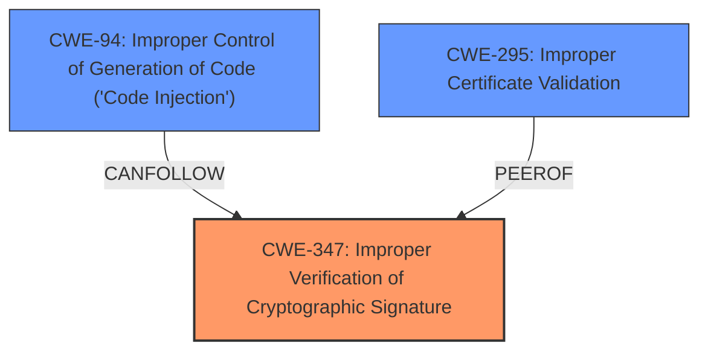

# Analysis for CVE-2021-1585

# Summary
| CWE ID | CWE Name | Confidence | CWE Abstraction Level | CWE Vulnerability Mapping Label | CWE-Vulnerability Mapping Notes |
|---|---|---|---|---|---|
| CWE-347 | Improper Verification of Cryptographic Signature | 1.0 | Base | Allowed | Primary CWE |
| CWE-295 | Improper Certificate Validation | 0.9 | Base | Allowed | Secondary Candidate |
| CWE-94 | Improper Control of Generation of Code ('Code Injection') | 0.7 | Base | Allowed-with-Review | Secondary Candidate |

## Evidence and Confidence

*   **Confidence Score:** 0.9
*   **Evidence Strength:** HIGH

## Relationship Analysis
The primary weakness is the **lack of proper signature verification** (CWE-347). This can lead to the injection of arbitrary code (CWE-94) because the system trusts unsigned or improperly signed code. The **lack of SSL certificate validation** (CWE-295) exacerbates the issue by allowing man-in-the-middle attacks, which can facilitate code injection.

## Vulnerability Chain
The vulnerability chain starts with the **lack of signature verification** (CWE-347) and **lack of SSL certificate validation** (CWE-295). This allows an attacker to perform a man-in-the-middle attack, inject arbitrary code (CWE-94), and ultimately execute arbitrary code on the user's system.

## Summary of Analysis
The primary weakness is the **lack of proper signature verification** (CWE-347), which allows an attacker to inject arbitrary code. The **lack of SSL certificate validation** (CWE-295) makes the MITM attack easier, and the code injection (CWE-94) leads to arbitrary code execution.

The selection is based on the evidence:
- Vulnerability Description Key Phrases: "**lack of proper signature verification**"
- CVE Reference Links Content Summary: "The primary cause is a **lack of proper signature verification** for code exchanged between the Cisco Adaptive Security Device Manager (ASDM) and its Launcher application. This allows an attacker to inject arbitrary code during the communication process."
- CVE Reference Links Content Summary: "Additionally, the ASDM client does not validate the server's SSL certificate, enabling man-in-the-middle (MITM) attacks."
- CVE Reference Links Content Summary: "The vulnerability is also due to the fact that the ASDM launcher trusts the content it receives from the ASA, without performing any code signing checks"

CWE-347 is the most specific and appropriate for the **lack of signature verification**.
CWE-295 is related because the **lack of SSL certificate validation** makes the MITM attack easier.
CWE-94 is a consequence of the **lack of signature verification**, as it allows for the injection of arbitrary code.

Other CWEs Considered but Not Used:

*   **CWE-22 Improper Limitation of a Pathname to a Restricted Directory ('Path Traversal')**: While "drive-by download" is mentioned, path traversal isn't the primary mechanism. The vulnerability relies more on the **lack of verification** than path manipulation.
*   **CWE-119 Improper Restriction of Operations within the Bounds of a Memory Buffer**: This is too generic. The specific issue isn't a buffer overflow but a **lack of signature validation**, which allows for the injection of malicious code.
*   **CWE-20 Improper Input Validation**: This is also too generic. The core issue isn't a failure to validate input in general, but the **lack of cryptographic signature verification**.
*   **CWE-321 Use of Hard-coded Cryptographic Key**: There is no mention of hardcoded cryptographic keys.
*   **CWE-250 Execution with Unnecessary Privileges**: There is no mention of privileges.