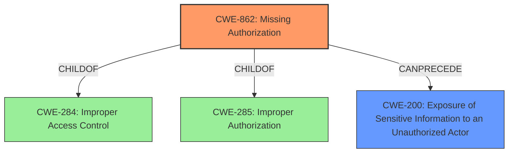

# Analysis for CVE-2021-1589

# Summary
| CWE ID | CWE Name | Confidence | CWE Abstraction Level | CWE Vulnerability Mapping Label | CWE-Vulnerability Mapping Notes |
|---|---|---|---|---|---|
| CWE-862 | Missing Authorization | 1.0 | Base | Primary | Allowed |
| CWE-200 | Exposure of Sensitive Information to an Unauthorized Actor | 0.7 | Class | Secondary | Discouraged |

## Evidence and Confidence

*   **Confidence Score:** 0.9
*   **Evidence Strength:** HIGH

## Relationship Analysis
The primary CWE is CWE-862, which is a base-level weakness indicating a failure to perform authorization checks. It's a child of CWE-284 (Improper Access Control) and CWE-285 (Improper Authorization), but is more specific. CWE-200 is related as a potential consequence of missing authorization.

## Vulnerability Chain
The vulnerability chain starts with **missing authorization** on API endpoints (CWE-862), leading to **unauthorized access to user credentials**, which is a form of **exposure of sensitive information** (CWE-200).

## Summary of Analysis
The primary weakness is the **lack of proper restriction** on API endpoints, which directly leads to the possibility of an attacker gaining unauthorized access. This is best captured by CWE-862 (Missing Authorization). While CWE-200 (Exposure of Sensitive Information to an Unauthorized Actor) is a potential consequence, it is not the root cause. The evidence clearly points to a **missing authorization check** as the primary issue.

The vulnerability description states: "This vulnerability exists because **access to API endpoints is not properly restricted**." This statement provides direct evidence for selecting a CWE related to access control or authorization.
The CVE Reference Links Content Summary states: "The vulnerability exists due to improper restriction of access to API endpoints within the disaster recovery feature of Cisco SD-WAN vManage Software."

CWE-862 is the most specific and appropriate choice because it directly addresses the **missing authorization** aspect.
CWE-284 and CWE-285 are more general and less descriptive of the actual vulnerability. While technically applicable, they are less precise.
CWE-200 is a consequence of the **missing authorization**, but not the root cause itself.

Relevant CWE Information:

## CWE-807: Reliance on Untrusted Inputs in a Security Decision
**Abstraction Level**: Base
**Similarity Score**: 0.75
**Source**: dense

**Description**:
The product uses a protection mechanism that relies on the existence or values of an input, but the input can be modified by an untrusted actor in a way that bypasses the protection mechanism.

**Mapping Guidance**:
- Usage: Allowed
- Rationale: This CWE entry is at the Base level of abstraction, which is a preferred level of abstraction for mapping to the root causes of vulnerabilities.

This CWE is not the best match, as the vulnerability stems from **missing authorization**, not the reliance on untrusted inputs.

## CWE-303: Incorrect Implementation of Authentication Algorithm
**Abstraction Level**: Base
**Similarity Score**: 0.75
**Source**: dense

**Description**:
The requirements for the product dictate the use of an established authentication algorithm, but the implementation of the algorithm is incorrect.

**Mapping Guidance**:
- Usage: Allowed
- Rationale: This CWE entry is at the Base level of abstraction, which is a preferred level of abstraction for mapping to the root causes of vulnerabilities.

This CWE does not fit the description because the issue is related to **authorization**, not authentication.

## CWE-274: Improper Handling of Insufficient Privileges
**Abstraction Level**: Base
**Similarity Score**: 0.75
**Source**: dense

**Description**:
The product does not handle or incorrectly handles when it has insufficient privileges to perform an operation, leading to resultant weaknesses.

**Mapping Guidance**:
- Usage: Discouraged
- Rationale: This CWE entry could be deprecated in a future version of CWE.

This CWE is not the right fit, as the core problem is about **missing authorization checks**, not improper handling of insufficient privileges.

## CWE-653: Improper Isolation or Compartmentalization
**Abstraction Level**: Class
**Similarity Score**: 0.74
**Source**: dense

**Description**:
The product does not properly compartmentalize or isolate functionality, processes, or resources that require different privilege levels, rights, or permissions.

**Mapping Guidance**:
- Usage: Allowed
- Rationale: This CWE entry is at the Base level of abstraction, which is a preferred level of abstraction for mapping to the root causes of vulnerabilities.

This CWE does not describe the vulnerability accurately. The vulnerability is not about the lack of compartmentalization, but rather the **absence of authorization**.

## CWE-280: Improper Handling of Insufficient Permissions or Privileges 
**Abstraction Level**: Base
**Similarity Score**: 0.74
**Source**: dense

**Description**:
The product does not handle or incorrectly handles when it has insufficient privileges to access resources or functionality as specified by their permissions. This may cause it to follow unexpected code paths that may leave the product in an invalid state.

**Mapping Guidance**:
- Usage: Allowed
- Rationale: This CWE entry is at the Base level of abstraction, which is a preferred level of abstraction for mapping to the root causes of vulnerabilities.

This CWE is similar to CWE-274 and does not fit the vulnerability description.

## CWE-1390: Weak Authentication
**Abstraction Level**: Class
**Similarity Score**: 0.74
**Source**: dense

**Description**:
The product uses an authentication mechanism to restrict access to specific users or identities, but the mechanism does not sufficiently prove that the claimed identity is correct.

**Mapping Guidance**:
- Usage: Allowed-with-Review
- Rationale: This CWE entry is a Class and might have Base-level children that would be more appropriate

This CWE is not the right fit because the vulnerability is about **authorization**, not authentication.

## CWE-1391: Use of Weak Credentials
**Abstraction Level**: Class
**Similarity Score**: 0.73
**Source**: dense

**Description**:
The product uses weak credentials (such as a default key or hard-coded password) that can be calculated, derived, reused, or guessed by an attacker.

**Mapping Guidance**:
- Usage: Allowed-with-Review
- Rationale: This CWE entry is a Class and might have Base-level children that would be more appropriate

This CWE is not the right fit because the vulnerability is about **authorization**, not weak credentials.

## CWE-497: Exposure of Sensitive System Information to an Unauthorized Control Sphere
**Abstraction Level**: Base
**Similarity Score**: 0.73
**Source**: dense

**Description**:
The product does not properly prevent sensitive system-level information from being accessed by unauthorized actors who do not have the same level of access to the underlying system as the product does.

**Mapping Guidance**:
- Usage: Allowed
- Rationale: This CWE entry is at the Base level of abstraction, which is a preferred level of abstraction for mapping to the root causes of vulnerabilities.

This CWE is too broad. CWE-200 is a better fit for exposure. The rootcause of this exposure is the **missing authorization** captured by CWE-862.

## CWE-1220: Insufficient Granularity of Access Control
**Abstraction Level**: Base
**Similarity Score**: 0.73
**Source**: dense

**Description**:
The product implements access controls via a policy or other feature with the intention to disable or restrict accesses (reads and/or writes) to assets in a system from untrusted agents. However, implemented access controls lack required granularity, which renders the control policy too broad because it allows accesses from unauthorized agents to the security-sensitive assets.

**Mapping Guidance**:
- Usage: Allowed
- Rationale: This CWE entry is at the Base level of abstraction, which is a preferred level of abstraction for mapping to the root causes of vulnerabilities.

This is similar to **missing authorization**, but it describes a scenario where access control is present but not granular enough. The vulnerability description clearly mentions **access to API endpoints is not properly restricted** which is absence of access control.

## CWE-668: Exposure of Resource to Wrong Sphere
**Abstraction Level**: Class
**Similarity Score**: 0.73