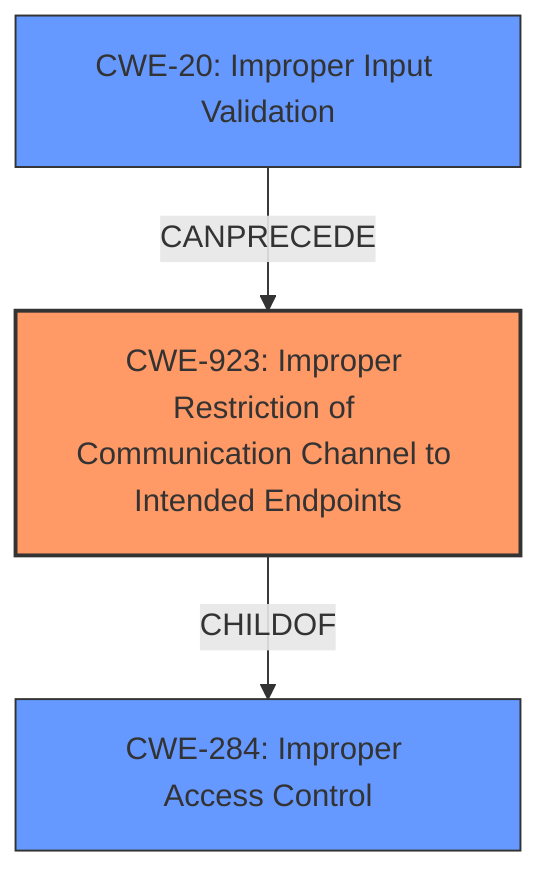

# Enhanced Analysis for CVE-2021-1600

# Summary
| CWE ID | CWE Name | Confidence | CWE Abstraction Level | CWE Vulnerability Mapping Label | CWE-Vulnerability Mapping Notes |
|---|---|---|---|---|---|
| CWE-923 | Improper Restriction of Communication Channel to Intended Endpoints | 0.8 | Class | Primary | Allowed-with-Review |
| CWE-284 | Improper Access Control | 0.5 | Pillar | Secondary | Discouraged |
| CWE-20 | Improper Input Validation | 0.4 | Class | Secondary | Discouraged |

## Evidence and Confidence

*   **Confidence Score:** 0.8
*   **Evidence Strength:** MEDIUM

## Relationship Analysis
The primary CWE selected, CWE-923, is a child of CWE-284 (Improper Access Control), indicating a more specific type of access control issue related to communication channels. While CWE-284 is a broad, high-level classification (Pillar), CWE-923 provides a more targeted description of the vulnerability. The retriever results also include CWE-20 (Improper Input Validation), which can sometimes precede access control issues. This relationship suggests a possible vulnerability chain where inadequate input validation could lead to improper restriction of communication channels.



## Vulnerability Chain
The vulnerability chain starts with **insufficient restrictions for IPv4 or IPv6 packets** (root cause), leading to the ability to access sensitive internal services and make configuration changes (impact).

*   **Root Cause:** Insufficient restrictions on network packets.
*   **Weakness:** Improper Restriction of Communication Channel to Intended Endpoints (CWE-923).
*   **Impact:** Access to sensitive internal services and configuration changes.

## Summary of Analysis
The primary CWE assignment is CWE-923 (Improper Restriction of Communication Channel to Intended Endpoints) because the vulnerability description highlights the **insufficient restrictions for IPv4 or IPv6 packets** received on the external management interface. This aligns with CWE-923's focus on ensuring that communication channels are properly restricted to intended endpoints. The evidence supporting this decision comes directly from the vulnerability description and the CVE Reference Links Content Summary, which states "Insufficient restrictions for IPv4 packets received on the external management interface."

CWE-284 (Improper Access Control) was considered because CWE-923 is a child of CWE-284. However, CWE-284 is too broad and not specific enough to the root cause. The MITRE mapping guidance discourages the usage of CWE-284 due to its high-level nature.

CWE-20 (Improper Input Validation) was also considered, as vulnerabilities often involve input validation issues. However, the description emphasizes the restriction of communication channels rather than input validation directly. While improper input validation might contribute to the problem, the core issue is the **insufficient restrictions for IPv4 or IPv6 packets**, which is more accurately represented by CWE-923.

The final selection of CWE-923 is at the optimal level of specificity because it directly addresses the weakness described in the vulnerability, focusing on the improper restriction of communication channels. This aligns with the base-level abstraction preferred for CWE assignments.


## CWE Relationship Analysis

Current CWEs represent these abstraction levels: .


### Vulnerability Chain Analysis

**Chain starting from CWE-923:**
- 923 (Improper Restriction of Communication Channel to Intended Endpoints) - ROOT


**Chain starting from CWE-20:**
- 20 (Improper Input Validation) - ROOT


### CWE Relationship Diagram

```mermaid
graph TD
    classDef primary fill:#f96,stroke:#333,stroke-width:2px
    classDef secondary fill:#69f,stroke:#333
    classDef tertiary fill:#9e9,stroke:#333
```