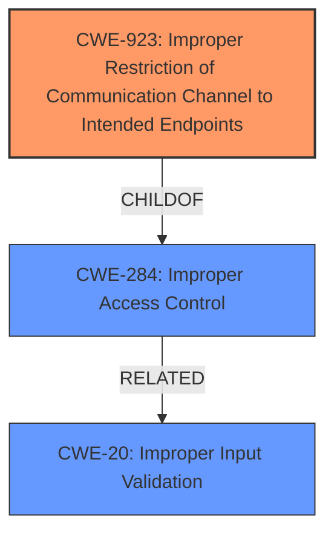

# Analysis Report for CVE-2021-1601

# Vulnerability Analysis Report: CVE-2021-1601

## Description


## Analysis (with Relationship Data)

# Summary
| CWE ID    | CWE Name                                                                             | Confidence | CWE Abstraction Level | CWE Vulnerability Mapping Label | CWE-Vulnerability Mapping Notes |
| :-------- | :----------------------------------------------------------------------------------- | :--------- | :---------------------- | :------------------------------ | :------------------------------ |
| CWE-923   | Improper Restriction of Communication Channel to Intended Endpoints                  | 0.85       | Class                   | Primary CWE                     | Allowed-with-Review             |
| CWE-284   | Improper Access Control                                                              | 0.70       | Pillar                  | Secondary Candidate             | Discouraged                     |
| CWE-20    | Improper Input Validation                                                            | 0.60       | Class                   | Secondary Candidate             | Discouraged                     |

## Evidence and Confidence

*   **Confidence Score:** 0.80
*   **Evidence Strength:** HIGH

## Relationship Analysis
The primary CWE is CWE-923, which is a child of CWE-284 (Improper Access Control). CWE-284 is a high-level Pillar, making CWE-923 a more specific and therefore better choice. CWE-20 (Improper Input Validation) is also considered, as **insufficient restrictions** may relate to improper validation. However, the description focuses more on the communication channel.



## Vulnerability Chain
The vulnerability chain starts with **insufficient restrictions for IPv4 or IPv6 packets** on the external management interface, leading to an attacker gaining access to sensitive internal services and making configuration changes.
  - **Root Cause:** **Insufficient restrictions** (CWE-923 Improper Restriction of Communication Channel)
  - **Impact:** Access to sensitive internal services and configuration changes.

## Summary of Analysis
The initial assessment identified several potential CWEs, including CWE-20, CWE-284, CWE-119 and CWE-923. However, based on the vulnerability description and the retriever results, CWE-923 (Improper Restriction of Communication Channel to Intended Endpoints) is the most appropriate primary CWE.

The vulnerability description states that the issue is due to **insufficient restrictions for IPv4 or IPv6 packets** received on the external management interface. This aligns with CWE-923, which focuses on ensuring communication channels are restricted to intended endpoints. An attacker could exploit this by sending specific traffic, suggesting a failure to properly restrict the communication channel.

CWE-284 (Improper Access Control) is a related, higher-level category, but CWE-923 provides more specific information about the nature of the weakness, and is a child of CWE-284. CWE-20 (Improper Input Validation) is also relevant, as the **insufficient restrictions** could stem from a lack of proper input validation. However, the primary issue is with the communication channel itself, not the input data. CWE-119 is not relevant because the vulnerability description does not refer to memory buffers.

The decision is based on the following evidence:

*   **Vulnerability Description Key Phrases:** "**insufficient restrictions for IPv4 or IPv6 packets**"
*   **CVE Reference Links Content Summary:** "Insufficient restrictions for IPv6 packets received on the external management interface."

The selected CWEs are at the optimal level of specificity because they accurately represent the root cause of the vulnerability, which is the **insufficient restriction** of the communication channel. While broader categories like CWE-284 could apply, CWE-923 provides a more precise description of the weakness.

Relevant CWE Information:

# Enhanced Context (25 CWEs)
The following CWEs were identified as potentially relevant to this vulnerability:

## CWE-41: Improper Resolution of Path Equivalence
**Abstraction Level**: Base
**Similarity Score**: 0.79
**Source**: dense

**Description**:
The product is vulnerable to file system contents disclosure through path equivalence. Path equivalence involves the use of special characters in file and directory names. The associated manipulations are intended to generate multiple names for the same object.

**Mapping Guidance**:
- Usage: Allowed
- Rationale: This CWE entry is at the Base level of abstraction, which is a preferred level of abstraction for mapping to the root causes of vulnerabilities.

## CWE-23: Relative Path Traversal
**Abstraction Level**: Base
**Similarity Score**: 0.79
**Source**: dense

**Description**:
The product uses external input to construct a pathname that should be within a restricted directory, but it does not properly neutralize sequences such as ".." that can resolve to a location that is outside of that directory.

**Mapping Guidance**:
- Usage: Allowed
- Rationale: This CWE entry is at the Base level of abstraction, which is a preferred level of abstraction for mapping to the root causes of vulnerabilities.

## CWE-73: External Control of File Name or Path
**Abstraction Level**: Base
**Similarity Score**: 0.79
**Source**: dense

**Description**:
The product allows user input to control or influence paths or file names that are used in filesystem operations.

**Mapping Guidance**:
- Usage: Allowed
- Rationale: This CWE entry is at the Base level of abstraction, which is a preferred level of abstraction for mapping to the root causes of vulnerabilities.

## CWE-1289: Improper Validation of Unsafe Equivalence in Input
**Abstraction Level**: Base
**Similarity Score**: 0.78
**Source**: dense

**Description**:
The product receives an input value that is used as a resource identifier or other type of reference, but it does not validate or incorrectly validates that the input is equivalent to a potentially-unsafe value.

**Mapping Guidance**:
- Usage: Allowed
- Rationale: This CWE entry is at the Base level of abstraction, which is a preferred level of abstraction for mapping to the root causes of vulnerabilities.

## CWE-184: Incomplete List of Disallowed Inputs
**Abstraction Level**: Base
**Similarity Score**: 0.78
**Source**: dense

**Description**:
The product implements a protection mechanism that relies on a list of inputs (or properties of inputs) that are not allowed by policy or otherwise require other action to neutralize before additional processing takes place, but the list is incomplete.

**Mapping Guidance**:
- Usage: Allowed
- Rationale: This CWE entry is at the Base level of abstraction, which is a preferred level of abstraction for mapping to the root causes of vulnerabilities.

## CWE-59: Improper Link Resolution Before File Access ('Link Following')
**Abstraction Level**: Base
**Similarity Score**: 0.78
**Source**: dense

**Description**:
The product attempts to access a file based on the filename, but it does not properly prevent that filename from identifying a link or shortcut that resolves to an unintended resource.

**Mapping Guidance**:
- Usage: Allowed
- Rationale: This CWE entry is at the Base level of abstraction, which is a preferred level of abstraction for mapping to the root causes of vulnerabilities.

## CWE-74: Improper Neutralization of Special Elements in Output Used by a Downstream Component ('Injection')
**Abstraction Level**: Class
**Similarity Score**: 0.77
**Source**: dense

**Description**:
The product constructs all or part of a command, data structure, or record using externally-influenced input from an upstream component, but it does not neutralize or incorrectly neutralizes special elements that could modify how it is parsed or interpreted when it is sent to a downstream component.

**Mapping Guidance**:
- Usage: Discouraged
- Rationale: CWE-74 is high-level and often misused when lower-level weaknesses are more appropriate.

## CWE-668: Exposure of Resource to Wrong Sphere
**Abstraction Level**: Class
**Similarity Score**: 0.77
**Source**: dense

**Description**:
The product exposes a resource to the wrong control sphere, providing unintended actors with inappropriate access to the resource.

**Mapping Guidance**:
- Usage: Discouraged
- Rationale: CWE-668 is high-level and is often misused as a catch-all when lower-level CWE IDs might be applicable. It is sometimes used for low-information vulnerability reports [REF-1287]. It is a level-1 Class (i.e., a child of a Pillar). It is not useful for trend analysis.

## CWE-138: Improper Neutralization of Special Elements
**Abstraction Level**: Class
**Similarity Score**: 0.77
**Source**: dense

**Description**:
The product receives input from an upstream component, but it does not neutralize or incorrectly neutralizes special elements that could be interpreted as control elements or syntactic markers when they are sent to a downstream


## CWE Relationship Analysis

Current CWEs represent these abstraction levels: .


### Vulnerability Chain Analysis

**Chain starting from CWE-41:**
- 41 (Improper Resolution of Path Equivalence) - ROOT


**Chain starting from CWE-284:**
- 284 (Improper Access Control) - ROOT


### CWE Relationship Diagram

```mermaid
graph TD
    classDef primary fill:#f96,stroke:#333,stroke-width:2px
    classDef secondary fill:#69f,stroke:#333
    classDef tertiary fill:#9e9,stroke:#333
```


*Report generated on 2025-04-02 01:54:27*
