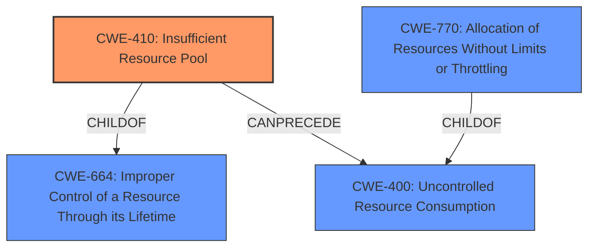

# Enhanced Analysis for CVE-2021-1615

# Summary
| CWE ID | CWE Name | Confidence | CWE Abstraction Level | CWE Vulnerability Mapping Label | CWE-Vulnerability Mapping Notes |
|---|---|---|---|---|---|
| CWE-410 | Insufficient Resource Pool | 0.9 | Base | Allowed | Primary CWE |
| CWE-770 | Allocation of Resources Without Limits or Throttling | 0.7 | Base | Allowed | Secondary Candidate |
| CWE-1284 | Improper Validation of Specified Quantity in Input | 0.6 | Base | Allowed | Secondary Candidate |
| CWE-400 | Uncontrolled Resource Consumption | 0.4 | Class | Discouraged | Secondary Candidate |

## Evidence and Confidence

*   **Confidence Score:** 0.9
*   **Evidence Strength:** HIGH

## Relationship Analysis
The primary CWE selected is CWE-410, which represents the **insufficient resource pool**. This is further related to CWE-664 (Improper Control of a Resource Through its Lifetime) as a child. CWE-400 (Uncontrolled Resource Consumption) can follow CWE-410, representing the impact. CWE-770 (Allocation of Resources Without Limits or Throttling) which is allocation of resources without limits or throttling and also a child of CWE-400. The Base level of abstraction was chosen as it provides the most specific representation of the weakness.



## Vulnerability Chain
The vulnerability chain starts with **insufficient buffer allocation** (CWE-410), leading to resource exhaustion, which causes a denial-of-service (DoS) condition (CWE-400).

## Summary of Analysis
The primary weakness is **insufficient buffer allocation**, which directly leads to resource exhaustion and a denial-of-service condition.

The vulnerability description states: "This vulnerability is due to **insufficient buffer allocation**. An attacker could exploit this vulnerability by sending crafted traffic to an affected device. A successful exploit could allow the attacker to exhaust available resources and cause a DoS condition on an affected AP, as well as a DoS condition for client traffic traversing the AP."

The CVE Reference Links Content Summary confirms this by stating: "RootCause: Insufficient buffer allocation in the packet processing functionality of Cisco Embedded Wireless Controller (EWC) Software."

Given the evidence, CWE-410 (Insufficient Resource Pool) is the most appropriate primary CWE because the root cause is the **insufficient buffer allocation**, leading to resource exhaustion.

CWE-770 (Allocation of Resources Without Limits or Throttling) was considered, as the application allocates resources without proper limits. This is a valid secondary concern, as **insufficient buffer allocation** can be seen as a lack of limits on buffer usage.

CWE-1284 (Improper Validation of Specified Quantity in Input) was also considered. Crafted traffic could include a quantity, such as size, that is not correctly validated, leading to the buffer exhaustion.

CWE-400 (Uncontrolled Resource Consumption) was considered but not chosen as the primary CWE because it is a more general consequence of the underlying **insufficient buffer allocation**.

The selected CWEs are at the optimal level of specificity because they directly address the root cause (**insufficient buffer allocation**) and its immediate consequences (resource exhaustion, DoS).

Relevant CWE Information:

# Enhanced Context (25 CWEs)
The following CWEs were identified as potentially relevant to this vulnerability:

## CWE-799: Improper Control of Interaction Frequency
**Abstraction Level**: Class
**Similarity Score**: 0.78
**Source**: dense

**Description**:
The product does not properly limit the number or frequency of interactions that it has with an actor, such as the number of incoming requests.

**Mapping Guidance**:
- Usage: Allowed-with-Review
- Rationale: This CWE entry is a Class and might have Base-level children that would be more appropriate

## CWE-405: Asymmetric Resource Consumption (Amplification)
**Abstraction Level**: Class
**Similarity Score**: 0.78
**Source**: dense

**Description**:
The product does not properly control situations in which an adversary can cause the product to consume or produce excessive resources without requiring the adversary to invest equivalent work or otherwise prove authorization, i.e., the adversary's influence is "asymmetric."

**Mapping Guidance**:
- Usage: Allowed-with-Review
- Rationale: This CWE entry is a Class and might have Base-level children that would be more appropriate

## CWE-664: Improper Control of a Resource Through its Lifetime
**Abstraction Level**: Pillar
**Similarity Score**: 0.74
**Source**: dense

**Description**:
The product does not maintain or incorrectly maintains control over a resource throughout its lifetime of creation, use, and release.

**Mapping Guidance**:
- Usage: Discouraged
- Rationale: This CWE entry is high-level when lower-level children are available.

## CWE-404: Improper Resource Shutdown or Release
**Abstraction Level**: Class
**Similarity Score**: 0.73
**Source**: dense

**Description**:
The product does not release or incorrectly releases a resource before it is made available for re-use.

**Mapping Guidance**:
- Usage: Allowed-with-Review
- Rationale: This CWE entry is a Class and might have Base-level children that would be more appropriate

## CWE-1325: Improperly Controlled Sequential Memory Allocation
**Abstraction Level**: Base
**Similarity Score**: 0.73
**Source**: dense

**Description**:
The product manages a group of objects or resources and performs a separate memory allocation for each object, but it does not properly limit the total amount of memory that is consumed by all of the combined objects.

**Mapping Guidance**:
- Usage: Allowed
- Rationale: This CWE entry is at the Base level of abstraction, which is a preferred level of abstraction for mapping to the root causes of vulnerabilities.

## CWE-226: Sensitive Information in Resource Not Removed Before Reuse
**Abstraction Level**: Base
**Similarity Score**: 0.73
**Source**: dense

**Description**:
The product releases a resource such as memory or a file so that it can be made available for reuse, but it does not clear or "zeroize" the information contained in the resource before the product performs a critical state transition or makes the resource available for reuse by other entities.

**Mapping Guidance**:
- Usage: Allowed
- Rationale: This CWE entry is at the Base level of abstraction, which is a preferred level of abstraction for mapping to the root causes of vulnerabilities.

## CWE-406: Insufficient Control of Network Message Volume (Network Amplification)
**Abstraction Level**: Class
**Similarity Score**: 0.73
**Source**: dense

**Description**:
The product does not sufficiently monitor or control transmitted network traffic volume, so that an actor can cause the product to transmit more traffic than should be allowed for that actor.

**Mapping Guidance**:
- Usage: Allowed-with-Review
- Rationale: This CWE entry is a Class and might have Base-level children that would be more appropriate

## CWE-410: Insufficient Resource Pool
**Abstraction Level**: Base
**Similarity Score**: 0.72
**Source**: dense

**Description**:
The product's resource pool is not large enough to handle peak demand, which allows an attacker to prevent others from accessing the resource by using a (relatively) large number of requests for resources.

**Mapping Guidance**:
- Usage: Allowed
- Rationale: This CWE entry is at the Base level of abstraction, which is a preferred level of abstraction for mapping to the root causes of vulnerabilities.

## CWE-789: Memory Allocation with Excessive Size Value
**Abstraction Level**: Variant
**Similarity Score**: 0.72
**Source**: dense

**Description**:
The product allocates memory based on an untrusted, large size value, but it does not ensure that the size is within expected limits, allowing arbitrary amounts of memory to be allocated.

**Mapping Guidance**:
- Usage: Allowed
- Rationale: This CWE entry is at the Variant level of abstraction, which is a preferred level of abstraction for mapping to the root causes of vulnerabilities.

## CWE-1220: Insufficient Granularity of Access Control
**Abstraction Level**: Base
**Similarity Score**: 0.71
**Source**: dense

**Description**:
The


## CWE Relationship Analysis

Current CWEs represent these abstraction levels: .


### Vulnerability Chain Analysis

**Chain starting from CWE-664:**
- 664 (Improper Control of a Resource Through its Lifetime) - ROOT


**Chain starting from CWE-404:**
- 404 (Improper Resource Shutdown or Release) - ROOT


### CWE Relationship Diagram

```mermaid
graph TD
    classDef primary fill:#f96,stroke:#333,stroke-width:2px
    classDef secondary fill:#69f,stroke:#333
    classDef tertiary fill:#9e9,stroke:#333
```