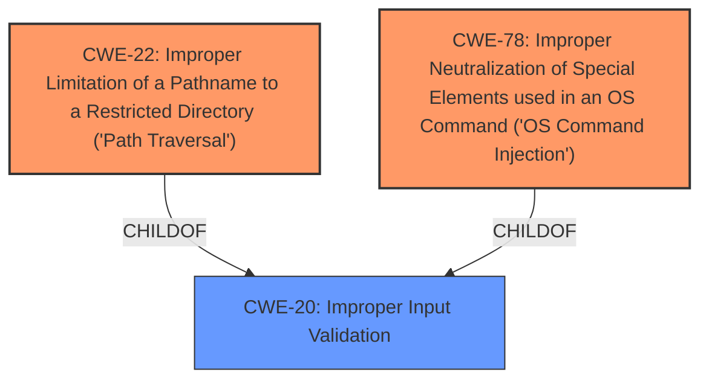

# Enhanced Analysis for CVE-2021-1617

# Summary
| CWE ID | CWE Name | Confidence | CWE Abstraction Level | CWE Vulnerability Mapping Label | CWE-Vulnerability Mapping Notes |
|---|---|---|---|---|---|
| CWE-22 | Improper Limitation of a Pathname to a Restricted Directory ('Path Traversal') | 0.9 | Base | Allowed | Primary CWE. **Insufficient input validation** allows for **path traversal**. |
| CWE-78 | Improper Neutralization of Special Elements used in an OS Command ('OS Command Injection') | 0.9 | Base | Allowed | Secondary CWE. **Insufficient input validation** allows for **command injection**. |

## Evidence and Confidence

*   **Confidence Score:** 0.9
*   **Evidence Strength:** HIGH

## Relationship Analysis
The primary relationships influencing the CWE selection are:

*   CWE-22 and CWE-78 are both potential outcomes of insufficient input validation. They represent distinct attack vectors exploiting the same root cause.
*   CWE-22 has child CWEs such as CWE-23 (Relative Path Traversal) and CWE-36 (Absolute Path Traversal), offering more specific classifications if the description provided greater detail about the path traversal technique.
*   CWE-78 is a child of CWE-77 (Improper Neutralization of Special Elements used in a Command ('Command Injection')), which is a Class-level CWE. CWE-78 provides more specific context as it relates to OS commands.
*   CWE-20 (Improper Input Validation) is a parent of both CWE-22 and CWE-78 but is too general and discouraged for use when more specific CWEs are available.



## Vulnerability Chain
The vulnerability chain starts with **insufficient input validation**, leading to either **path traversal** (CWE-22) or **command injection** (CWE-78), which allows an attacker to read and write arbitrary files or execute arbitrary commands as root.

## Summary of Analysis
The initial analysis identified the key phrases "**insufficient input validation**", "**path traversal or command injection**". The primary CWE match from similar CVE descriptions was CWE-78, with CWE-22 also listed as a top CWE.

The vulnerability description states that the vulnerabilities are due to **insufficient input validation**. An attacker could exploit these vulnerabilities by using the web-based management interface to do one or both of the following: Execute a command using crafted input; Upload a file that has been altered using path traversal techniques. A successful exploit could allow the attacker to read and write arbitrary files or execute arbitrary commands as root on an affected system.

Based on the evidence, both CWE-22 and CWE-78 are applicable. CWE-22 addresses the path traversal aspect, where an attacker can upload a file that has been altered using path traversal techniques, allowing them to read and write arbitrary files. CWE-78 addresses the command injection aspect, where an attacker can execute a command using crafted input, allowing them to execute arbitrary commands as root.

CWE-20 was considered but is too general. The recommendation for CWE-20 is to consider lower-level children, which in this case are CWE-22 and CWE-78.

The final selection of CWEs is based on the specific weaknesses identified in the vulnerability description and the MITRE mapping guidance, which recommends using the most specific CWE available.

Relevant CWE Information:
*   **CWE-22**: Improper Limitation of a Pathname to a Restricted Directory ('Path Traversal')
*   **CWE-78**: Improper Neutralization of Special Elements used in an OS Command ('OS Command Injection')
*   **CWE-20**: Improper Input Validation


## CWE Relationship Analysis

Current CWEs represent these abstraction levels: .


### Vulnerability Chain Analysis

**Chain starting from CWE-36:**
- 36 (Absolute Path Traversal) - ROOT


**Chain starting from CWE-78:**
- 78 (Improper Neutralization of Special Elements used in an OS Command ('OS Command Injection')) - ROOT


### CWE Relationship Diagram

```mermaid
graph TD
    classDef primary fill:#f96,stroke:#333,stroke-width:2px
    classDef secondary fill:#69f,stroke:#333
    classDef tertiary fill:#9e9,stroke:#333
```