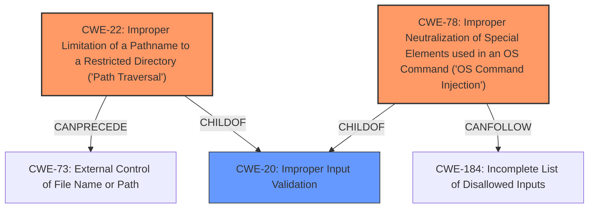

# Analysis for CVE-2021-1618

# Summary
| CWE ID  | CWE Name                                                                          | Confidence | CWE Abstraction Level | CWE Vulnerability Mapping Label | CWE-Vulnerability Mapping Notes |
| :-------- | :--------------------------------------------------------------------------------- | :---------- | :----------------------- | :-------------------------------- | :-------------------------------- |
| CWE-22    | Improper Limitation of a Pathname to a Restricted Directory ('Path Traversal') | 0.95       | Base                     | Primary                           | Allowed                           |
| CWE-78    | Improper Neutralization of Special Elements used in an OS Command ('OS Command Injection')                                                              | 0.95        | Base                     | Primary                           | Allowed                           |
| CWE-20    | Improper Input Validation                                                          | 0.75       | Class                    | Secondary                         | Discouraged                       |

## Evidence and Confidence

*   **Confidence Score:** 0.9
*   **Evidence Strength:** HIGH

## Relationship Analysis
The primary CWEs are CWE-22 and CWE-78, representing **path traversal** and **command injection**, respectively. These are both caused by **insufficient input validation**, which could be represented by CWE-20, although it's a more general, Class-level CWE. CWE-22 and CWE-78 are independent attack vectors in this case, both stemming from the same root cause.

## Vulnerability Chain
The vulnerability chain starts with **insufficient input validation** (CWE-20, though not explicitly mapped due to its generality). This leads to two distinct vulnerabilities:

1.  **Path Traversal** (CWE-22): An attacker uploads a file altered with **path traversal** techniques.
2.  **Command Injection** (CWE-78): An attacker executes a command using crafted input.

Both vulnerabilities allow an attacker to read and write arbitrary files or execute arbitrary commands as root.

## Summary of Analysis
The analysis identifies two primary weaknesses: **path traversal** (CWE-22) and **command injection** (CWE-78). Both stem from the **root cause** of **insufficient input validation**. While CWE-20 is a valid high-level classification for the root cause, CWE-22 and CWE-78 are more specific and accurately represent the nature of the vulnerabilities.

The evidence supporting this classification is directly from the vulnerability description: "Multiple vulnerabilities in the web-based management interface of Cisco Intersight Virtual Appliance could allow an authenticated, remote attacker to conduct a **path traversal** or **command injection** attack... These vulnerabilities are due to **insufficient input validation**... An attacker could exploit these vulnerabilities by using the web-based management interface to do one or both of the following Execute a command using **crafted input** Upload a file that has been altered using **path traversal** techniques."

The graph relationships highlight that both CWE-22 and CWE-78 can stem from **improper input validation** (CWE-20). Choosing CWE-22 and CWE-78 provides a more specific and actionable classification.

The selected CWEs are at the optimal level of specificity because they directly describe the attack vectors: manipulating file paths to access restricted areas (CWE-22) and injecting commands into the system (CWE-78).

Relevant CWE Information:

# Enhanced Context (25 CWEs)

## CWE-807: Reliance on Untrusted Inputs in a Security Decision
**Abstraction Level**: Base
**Similarity Score**: 0.77
**Source**: dense

**Description**:
The product uses a protection mechanism that relies on the existence or values of an input, but the input can be modified by an untrusted actor in a way that bypasses the protection mechanism.

**Mapping Guidance**:
- Usage: Allowed
- Rationale: This CWE entry is at the Base level of abstraction, which is a preferred level of abstraction for mapping to the root causes of vulnerabilities.

*Not Selected*: While related to input handling, this CWE is not the most direct representation of the described vulnerabilities.

## CWE-497: Exposure of Sensitive System Information to an Unauthorized Control Sphere
**Abstraction Level**: Base
**Similarity Score**: 0.76
**Source**: dense

**Description**:
The product does not properly prevent sensitive system-level information from being accessed by unauthorized actors who do not have the same level of access to the underlying system as the product does.

**Mapping Guidance**:
- Usage: Allowed
- Rationale: This CWE entry is at the Base level of abstraction, which is a preferred level of abstraction for mapping to the root causes of vulnerabilities.

*Not Selected*: This describes the impact rather than the root cause or the specific weakness.

## CWE-74: Improper Neutralization of Special Elements in Output Used by a Downstream Component ('Injection')
**Abstraction Level**: Class
**Similarity Score**: 0.75
**Source**: dense

**Description**:
The product constructs all or part of a command, data structure, or record using externally-influenced input from an upstream component, but it does not neutralize or incorrectly neutralizes special elements that could modify how it is parsed or interpreted when it is sent to a downstream component.

**Mapping Guidance**:
- Usage: Discouraged
- Rationale: CWE-74 is high-level and often misused when lower-level weaknesses are more appropriate.

*Not Selected*: CWE-78 is more specific to OS command injection.

## CWE-41: Improper Resolution of Path Equivalence
**Abstraction Level**: Base
**Similarity Score**: 0.75
**Source**: dense

**Description**:
The product is vulnerable to file system contents disclosure through path equivalence. Path equivalence involves the use of special characters in file and directory names. The associated manipulations are intended to generate multiple names for the same object.

**Mapping Guidance**:
- Usage: Allowed
- Rationale: This CWE entry is at the Base level of abstraction, which is a preferred level of abstraction for mapping to the root causes of vulnerabilities.

*Not Selected*: CWE-22 is a more direct representation of **path traversal**.

## CWE-138: Improper Neutralization of Special Elements
**Abstraction Level**: Class
**Similarity Score**: 0.74
**Source**: dense

**Description**:
The product receives input from an upstream component, but it does not neutralize or incorrectly neutralizes special elements that could be interpreted as control elements or syntactic markers when they are sent to a downstream component.

**Mapping Guidance**:
- Usage: Discouraged
- Rationale: This CWE entry is a level-1 Class (i.e., a child of a Pillar). It might have lower-level children that would be more appropriate

*Not Selected*: Too generic; CWE-22 and CWE-78 are more specific.

## CWE-1391: Use of Weak Credentials
**Abstraction Level**: Class
**Similarity Score**: 0.74
**Source**: dense

**Description**:
The product uses weak credentials (such as a default key or hard-coded password) that can be calculated, derived, reused, or guessed by an attacker.

**Mapping Guidance**:
- Usage: Allowed-with-Review
- Rationale: This CWE entry is a Class and might have Base-level children that would be more appropriate

*Not Selected*: Not relevant to the vulnerabilities described.

## CWE-23: Relative Path Traversal
**Abstraction Level**: Base
**Similarity Score**: 0.74
**Source**: dense

**Description**:
The product uses external input to construct a pathname that should be within a restricted directory, but it does not properly neutralize sequences such as ".." that can resolve to a location that is outside of that directory.

**Mapping Guidance**:
- Usage: Allowed
- Rationale: This CWE entry is at the Base level of abstraction, which is a preferred level of abstraction for mapping to the root causes of vulnerabilities.

*Not Selected*: CWE-22 is the more general form of Path Traversal

## CWE-303: Incorrect Implementation of Authentication Algorithm
**Abstraction Level**: Base
**Similarity Score**: 0.74
**Source**: dense

**Description**:
The requirements for the product dictate the use of an established authentication algorithm, but the implementation of the algorithm is incorrect.

**Mapping Guidance**:
- Usage: Allowed
- Rationale: This CWE entry is at the Base level

# Enhanced Query for CVE-2021-1618

# Vulnerability Description

    Multiple vulnerabilities in the web-based management interface of Cisco Intersight Virtual Appliance could allow an authenticated, remote attacker to conduct a **path traversal** or **command injection** attack on an affected system. These vulnerabilities are due to **insufficient input validation**. An attacker could exploit these vulnerabilities by using the web-based management interface to do one or both of the following Execute a command using crafted input Upload a file that has been altered using **path traversal** techniques A successful exploit could allow the attacker to read and write arbitrary files or execute arbitrary commands as root on an affected system. For more information about these vulnerabilities, see the Details section of this advisory.

    # Keyphrase-Specific CWE Analysis
    This vulnerability contains multiple keyphrases that may map to different CWEs. 
    Please analyze each keyphrase separately and determine the most appropriate CWE(s) for each.

    ## ROOTCAUSE: 'insufficient input validation'

Relevant CWEs for this ROOTCAUSE:

### 1. CWE-20: Improper Input Validation (Score: 793.19)

The product receives input or data, but it does
        not validate or incorrectly validates that the input has the
        properties that are required to process the data safely and
        correctly....

### 2. CWE-23: Relative Path Traversal (Score: 764.26)

The product uses external input to construct a pathname that should be within a restricted directory, but it does not properly neutralize sequences such as ".." that can resolve to a location that is outside of that directory....

### 3. CWE-22: Improper Limitation of a Pathname to a Restricted Directory ('Path Traversal') (Score: 750.83)

The product uses external input to construct a pathname that is intended to identify a file or directory that is located underneath a restricted parent directory, but the product does not properly neutralize special elements within the pathname that can cause the pathname to resolve to a location th...

### 4. CWE-78: Improper Neutralization of Special Elements used in an OS Command ('OS Command Injection') (Score: 675.59)

The product constructs all or part of an OS command using externally-influenced input from an upstream component, but it does not neutralize or incorrectly neutralizes special elements that could modify the intended OS command when it is sent to a downstream component....

### 5. CWE-138: Improper Neutralization of Special Elements (Score: 674.74)

The product receives input from an upstream component, but it does not neutralize or incorrectly neutralizes special elements that could be interpreted as control elements or syntactic markers when they are sent to a downstream component....

## WEAKNESS: 'path traversal'

Relevant CWEs for this WEAKNESS:

### 1. CWE-20: Improper Input Validation (Score: 793.19)

The product receives input or data, but it does
        not validate or incorrectly validates that the input has the
        properties that are required to process the data safely and
        correctly....

### 2. CWE-23: Relative Path Traversal (Score: 764.26)

The product uses external input to construct a pathname that should be within a restricted directory, but it does not properly neutralize sequences such as ".." that can resolve to a location that is outside of that directory....

### 3. CWE-22: Improper Limitation of a Pathname to a Restricted Directory ('Path Traversal') (Score: 750.83)

The product uses external input to construct a pathname that is intended to identify a file or directory that is located underneath a restricted parent directory, but the product does not properly neutralize special elements within the pathname that can cause the pathname to resolve to a location th...

### 4. CWE-25: Path Traversal: '/../filedir' (Score: 640.66)

The product uses external input to construct a pathname that should be within a restricted directory, but it does not properly neutralize "/../" sequences that can resolve to a location that is outside of that directory....

### 5. CWE-36: Absolute Path Traversal (Score: 633.54)

The product uses external input to construct a pathname that should be within a restricted directory, but it does not properly neutralize absolute path sequences such as "/abs/path" that can resolve to a location that is outside of that directory....

## WEAKNESS: 'command injection'

Relevant CWEs for this WEAKNESS:

### 1. CWE-20: Improper Input Validation (Score: 793.19)

The product receives input or data, but it does
        not validate or incorrectly validates that the input has the
        properties that are required to process the data safely and
        correctly....

### 2. CWE-23: Relative Path Traversal (Score: 764.26)

The product uses external input to construct a pathname that should be within a restricted directory, but it does not properly neutralize sequences such as ".." that can resolve to a location that is outside of that directory....

### 3. CWE-22: Improper Limitation of a Pathname to a Restricted Directory ('Path Traversal') (Score: 750.83)

The product uses external input to construct a pathname that is intended to identify a file or directory that is located underneath a restricted parent directory, but the product does not properly neutralize special elements within the pathname that can cause the pathname to resolve to a location th...

### 4. CWE-78: Improper Neutralization of Special Elements used in an OS Command ('OS Command Injection') (Score: 675.59)

The product constructs all or part of an OS command using externally-influenced input from an upstream component, but it does not neutralize or incorrectly neutralizes special elements that could modify the intended OS command when it is sent to a downstream component....

### 5. CWE-138: Improper Neutralization of Special Elements (Score: 674.74)

The product receives input from an upstream component, but it does not neutralize or incorrectly neutralizes special elements that could be interpreted as control elements or syntactic markers when they are sent to a downstream component....

## IMPACT: 'read and write arbitrary files'

Relevant CWEs for this IMPACT:

### 1. CWE-20: Improper Input Validation (Score: 793.19)

The product receives input or data, but it does
        not validate or incorrectly validates that the input has the
        properties that are required to process the data safely and
        correctly....

### 2. CWE-23: Relative Path Traversal (Score: 764.26)

The product uses external input to construct a pathname that should be within a restricted directory, but it does not properly neutralize sequences such as ".." that can resolve to a location that is outside of that directory....

### 3. CWE-22: Improper Limitation of a Pathname to a Restricted Directory ('Path Traversal') (Score: 750.83)

The product uses external input to construct a pathname that is intended to identify a file or directory that is located underneath a restricted parent directory, but the product does not properly neutralize special elements within the pathname that can cause the pathname to resolve to a location th...

### 4. CWE-119: Improper Restriction of Operations within the Bounds of a Memory Buffer (Score: 233.26)

The product performs operations on a memory buffer, but it reads from or writes to a memory location outside the buffer's intended boundary. This may result in read or write operations on unexpected memory locations that could be linked to other variables, data structures, or internal program data....

### 5. CWE-61: UNIX Symbolic Link (Symlink) Following (Score: 232.12)

The product, when opening a file or directory, does not sufficiently account for when the file is a symbolic link that resolves to a target outside of the intended control sphere. This could allow an attacker to cause the product to operate on unauthorized files....

## IMPACT: 'execute arbitrary commands as root'

Relevant CWEs for this IMPACT:

### 1. CWE-20: Improper Input Validation (Score: 793.19)

The product receives input or data, but it does
        not validate or incorrectly validates that the input has the
        properties that are required to process the data safely and
        correctly....

### 2. CWE-23: Relative Path Traversal (Score: 764.26)

The product uses external input to construct a pathname that should be within a restricted directory, but it does not properly neutralize sequences such as ".." that can resolve to a location that is outside of that directory....

### 3. CWE-22: Improper Limitation of a Pathname to a Restricted Directory ('Path Traversal') (Score: 750.83)

The product uses external input to construct a pathname that is intended to identify a file or directory that is located underneath a restricted parent directory, but the product does not properly neutralize special elements within the pathname that can cause the pathname to resolve to a location th...

### 4. CWE-78: Improper Neutralization of Special Elements used in an OS Command ('OS Command Injection') (Score: 675.59)

The product constructs all or part of an OS command using externally-influenced input from an upstream component, but it does not neutralize or incorrectly neutralizes special elements that could modify the intended OS command when it is sent to a downstream component....

### 5. CWE-25: Path Traversal: '/../filedir' (Score: 640.66)

The product uses external input to construct a pathname that should be within a restricted directory, but it does not properly neutralize "/../" sequences that can resolve to a location that is outside of that directory....

## VECTOR: 'crafted input'

Relevant CWEs for this VECTOR:

### 1. CWE-20: Improper Input Validation (Score: 793.19)

The product receives input or data, but it does
        not validate or incorrectly validates that the input has the
        properties that are required to process the data safely and
        correctly....

### 2. CWE-23: Relative Path Traversal (Score: 764.26)

The product uses external input to construct a pathname that should be within a restricted directory, but it does not properly neutralize sequences such as ".." that can resolve to a location that is outside of that directory....

### 3. CWE-22: Improper Limitation of a Pathname to a Restricted Directory ('Path Traversal') (Score: 750.83)

The product uses external input to construct a pathname that is intended to identify a file or directory that is located underneath a restricted parent directory, but the product does not properly neutralize special elements within the pathname that can cause the pathname to resolve to a location th...

### 4. CWE-78: Improper Neutralization of Special Elements used in an OS Command ('OS Command Injection') (Score: 675.59)

The product constructs all or part of an OS command using externally-influenced input from an upstream component, but it does not neutralize or incorrectly neutralizes special elements that could modify the intended OS command when it is sent to a downstream component....

### 5. CWE-138: Improper Neutralization of Special Elements (Score: 674.74)

The product receives input from an upstream component, but it does not neutralize or incorrectly neutralizes special elements that could be interpreted as control elements or syntactic markers when they are sent to a downstream component....

## ATTACKER: 'authenticated remote attacker'

Relevant CWEs for this ATTACKER:

### 1. CWE-20: Improper Input Validation (Score: 793.19)

The product receives input or data, but it does
        not validate or incorrectly validates that the input has the
        properties that are required to process the data safely and
        correctly....

### 2. CWE-23: Relative Path Traversal (Score: 764.26)

The product uses external input to construct a pathname that should be within a restricted directory, but it does not properly neutralize sequences such as ".." that can resolve to a location that is outside of that directory....

### 3. CWE-22: Improper Limitation of a Pathname to a Restricted Directory ('Path Traversal') (Score: 750.83)

The product uses external input to construct a pathname that is intended to identify a file or directory that is located underneath a restricted parent directory, but the product does not properly neutralize special elements within the pathname that can cause the pathname to resolve to a location th...

### 4. CWE-78: Improper Neutralization of Special Elements used in an OS Command ('OS Command Injection') (Score: 675.59)

The product constructs all or part of an OS command using externally-influenced input from an upstream component, but it does not neutralize or incorrectly neutralizes special elements that could modify the intended OS command when it is sent to a downstream component....

### 5. CWE-138: Improper Neutralization of Special Elements (Score: 674.74)

The product receives input from an upstream component, but it does not neutralize or incorrectly neutralizes special elements that could be interpreted as control elements or syntactic markers when they are sent to a downstream component....

## PRODUCT: 'Cisco Intersight Virtual Appliance'

Relevant CWEs for this PRODUCT:

### 1. CWE-20: Improper Input Validation (Score: 793.19)

The product receives input or data, but it does
        not validate or incorrectly validates that the input has the
        properties that are required to process the data safely and
        correctly....

### 2. CWE-23: Relative Path Traversal (Score: 764.26)

The product uses external input to construct a pathname that should be within a restricted directory, but it does not properly neutralize sequences such as ".." that can resolve to a location that is outside of that directory....

### 3. CWE-22: Improper Limitation of a Pathname to a Restricted Directory ('Path Traversal') (Score: 750.83)

The product uses external input to construct a pathname that is intended to identify a file or directory that is located underneath a restricted parent directory, but the product does not properly neutralize special elements within the pathname that can cause the pathname to resolve to a location th...

### 4. CWE-138: Improper Neutralization of Special Elements (Score: 674.74)

The product receives input from an upstream component, but it does not neutralize or incorrectly neutralizes special elements that could be interpreted as control elements or syntactic markers when they are sent to a downstream component....

### 5. CWE-119: Improper Restriction of Operations within the Bounds of a Memory Buffer (Score: 233.26)

The product performs operations on a memory buffer, but it reads from or writes to a memory location outside the buffer's intended boundary. This may result in read or write operations on unexpected memory locations that could be linked to other variables, data structures, or internal program data....

## COMPONENT: 'web-based management interface'

Relevant CWEs for this COMPONENT:

### 1. CWE-20: Improper Input Validation (Score: 793.19)

The product receives input or data, but it does
        not validate or incorrectly validates that the input has the
        properties that are required to process the data safely and
        correctly....

### 2. CWE-23: Relative Path Traversal (Score: 764.26)

The product uses external input to construct a pathname that should be within a restricted directory, but it does not properly neutralize sequences such as ".." that can resolve to a location that is outside of that directory....

### 3. CWE-22: Improper Limitation of a Pathname to a Restricted Directory ('Path Traversal') (Score: 750.83)

The product uses external input to construct a pathname that is intended to identify a file or directory that is located underneath a restricted parent directory, but the product does not properly neutralize special elements within the pathname that can cause the pathname to resolve to a location th...

### 4. CWE-78: Improper Neutralization of Special Elements used in an OS Command ('OS Command Injection') (Score: 675.59)

The product constructs all or part of an OS command using externally-influenced input from an upstream component, but it does not neutralize or incorrectly neutralizes special elements that could modify the intended OS command when it is sent to a downstream component....

### 5. CWE-138: Improper Neutralization of Special Elements (Score: 674.74)

The product receives input from an upstream component, but it does not neutralize or incorrectly neutralizes special elements that could be interpreted as control elements or syntactic markers when they are sent to a downstream component....

    # Analysis Instructions
    1. For each keyphrase, identify the most appropriate CWE(s) that represent the weakness.
    2. Consider how the different keyphrases might relate to each other in the vulnerability chain.
    3. Provide a final determination of primary CWE(s) and any secondary CWEs.
    4. Format your response using the standard analysis template.

    Please analyze how these different weaknesses interact and provide a comprehensive CWE classification.
    