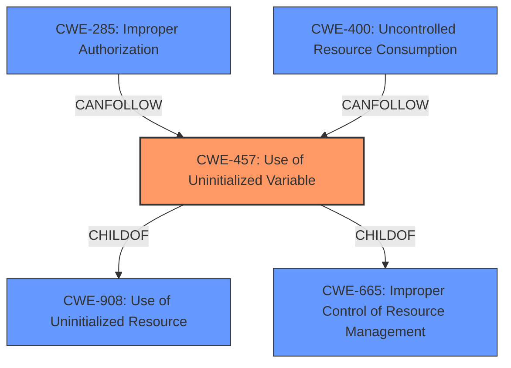

# Analysis for CVE-2021-1619

# Summary
| CWE ID | CWE Name | Confidence | CWE Abstraction Level | CWE Vulnerability Mapping Label | CWE-Vulnerability Mapping Notes |
|---|---|---|---|---|---|
| CWE-457 | Use of Uninitialized Variable | 1.0 | Variant | Primary | Allowed |
| CWE-285 | Improper Authorization | 0.7 | Class | Secondary | Discouraged |
| CWE-400 | Uncontrolled Resource Consumption | 0.6 | Class | Secondary | Discouraged |

## Evidence and Confidence

*   **Confidence Score:** 0.8
*   **Evidence Strength:** HIGH

## Relationship Analysis
The primary weakness is CWE-457 (Use of Uninitialized Variable), which is a variant-level CWE and provides a specific description of the **root cause**. It is related to parent classes CWE-908 (Use of Uninitialized Resource) and CWE-665 (Improper Control of Resource Management). The vulnerability can then lead to CWE-285 (Improper Authorization) and CWE-400 (Uncontrolled Resource Consumption) as secondary weaknesses, which are class-level CWEs and represent the impact of the uninitialized variable.



## Vulnerability Chain
The vulnerability chain starts with the **uninitialized variable** (CWE-457) that leads to bypass of authentication (CWE-285) or memory corruption and DoS (CWE-400).

## Summary of Analysis
The analysis is based on the evidence of "**uninitialized variable**" as the **root cause** of the vulnerability in the provided description. The description clearly states that the vulnerability is due to an **uninitialized variable** in the AAA function of Cisco IOS XE Software. This leads to bypassing authentication and causing memory corruption and DoS.

The graph relationships show that the **root cause** CWE-457 can directly lead to CWE-285 and CWE-400.

The selected CWEs are at the optimal level of specificity because CWE-457 directly addresses the **root cause** (the **uninitialized variable**), and CWE-285 and CWE-400 describe the immediate impacts of this weakness.

Relevant CWE Information:

# Enhanced Context (25 CWEs)
The following CWEs were identified as potentially relevant to this vulnerability:

## CWE-1289: Improper Validation of Unsafe Equivalence in Input
**Abstraction Level**: Base
**Similarity Score**: 0.76
**Source**: dense

**Description**:
The product receives an input value that is used as a resource identifier or other type of reference, but it does not validate or incorrectly validates that the input is equivalent to a potentially-unsafe value.

**Mapping Guidance**:
- Usage: Allowed
- Rationale: This CWE entry is at the Base level of abstraction, which is a preferred level of abstraction for mapping to the root causes of vulnerabilities.

## CWE-807: Reliance on Untrusted Inputs in a Security Decision
**Abstraction Level**: Base
**Similarity Score**: 0.76
**Source**: dense

**Description**:
The product uses a protection mechanism that relies on the existence or values of an input, but the input can be modified by an untrusted actor in a way that bypasses the protection mechanism.

**Mapping Guidance**:
- Usage: Allowed
- Rationale: This CWE entry is at the Base level of abstraction, which is a preferred level of abstraction for mapping to the root causes of vulnerabilities.

## CWE-1288: Improper Validation of Consistency within Input
**Abstraction Level**: Base
**Similarity Score**: 0.75
**Source**: dense

**Description**:
The product receives a complex input with multiple elements or fields that must be consistent with each other, but it does not validate or incorrectly validates that the input is actually consistent.

**Mapping Guidance**:
- Usage: Allowed
- Rationale: This CWE entry is at the Base level of abstraction, which is a preferred level of abstraction for mapping to the root causes of vulnerabilities.

## CWE-799: Improper Control of Interaction Frequency
**Abstraction Level**: Class
**Similarity Score**: 0.74
**Source**: dense

**Description**:
The product does not properly limit the number or frequency of interactions that it has with an actor, such as the number of incoming requests.

**Mapping Guidance**:
- Usage: Allowed-with-Review
- Rationale: This CWE entry is a Class and might have Base-level children that would be more appropriate

## CWE-606: Unchecked Input for Loop Condition
**Abstraction Level**: Base
**Similarity Score**: 0.73
**Source**: dense

**Description**:
The product does not properly check inputs that are used for loop conditions, potentially leading to a denial of service or other consequences because of excessive looping.

**Mapping Guidance**:
- Usage: Allowed
- Rationale: This CWE entry is at the Base level of abstraction, which is a preferred level of abstraction for mapping to the root causes of vulnerabilities.

## CWE-183: Permissive List of Allowed Inputs
**Abstraction Level**: Base
**Similarity Score**: 0.73
**Source**: dense

**Description**:
The product implements a protection mechanism that relies on a list of inputs (or properties of inputs) that are explicitly allowed by policy because the inputs are assumed to be safe, but the list is too permissive - that is, it allows an input that is unsafe, leading to resultant weaknesses.

**Mapping Guidance**:
- Usage: Allowed
- Rationale: This CWE entry is at the Base level of abstraction, which is a preferred level of abstraction for mapping to the root causes of vulnerabilities.

## CWE-1173: Improper Use of Validation Framework
**Abstraction Level**: Base
**Similarity Score**: 0.73
**Source**: dense

**Description**:
The product does not use, or incorrectly uses, an input validation framework that is provided by the source language or an independent library.

**Mapping Guidance**:
- Usage: Allowed
- Rationale: This CWE entry is at the Base level of abstraction, which is a preferred level of abstraction for mapping to the root causes of vulnerabilities.

## CWE-664: Improper Control of a Resource Through its Lifetime
**Abstraction Level**: Pillar
**Similarity Score**: 0.73
**Source**: dense

**Description**:
The product does not maintain or incorrectly maintains control over a resource throughout its lifetime of creation, use, and release.

**Mapping Guidance**:
- Usage: Discouraged
- Rationale: This CWE entry is high-level when lower-level children are available.

## CWE-1220: Insufficient Granularity of Access Control
**Abstraction Level**: Base
**Similarity Score**: 0.73
**Source**: dense

**Description**:
The product implements access controls via a policy or other feature with the intention to disable or restrict accesses (reads and/or writes) to assets in a system from untrusted agents. However, implemented access controls lack required granularity, which renders the control policy too broad because it allows accesses from unauthorized agents to the security-sensitive assets.

**Mapping Guidance**:
- Usage: Allowed
- Rationale: This CWE entry is at the Base level of abstraction, which is a preferred level of abstraction for mapping to the root causes of vulnerabilities.

## CWE-179: Incorrect Behavior Order: Early Validation
**Abstraction Level**: Base
**Similarity Score**: 0.72
**Source**: dense

**Description**:
The product validates input before applying protection mechanisms that modify the input, which could allow an attacker to bypass the validation via dangerous inputs that only arise after the modification.

**Mapping Guidance**:
- Usage: Allowed
- Rationale: This CWE entry is at the Base level of abstraction, which is a preferred level of abstraction for mapping to the root causes of vulnerabilities.

## CWE-20: Improper Input Validation
**Abstraction Level**: Class
**Similarity Score**: 12370.35
**Source**: sparse

**Description**:
The product receives input or data, but it does
        not validate or incorrectly validates that the input has the
        properties that are required to process the data safely and
        correctly.

**Mapping Guidance**:
- Usage: Discouraged
- Rationale:

# Enhanced Query for CVE-2021-1619

## Vulnerability Description
A vulnerability in the authentication, authorization, and accounting (AAA) function of Cisco IOS XE Software could allow an unauthenticated, remote attacker to bypass NETCONF or RESTCONF authentication and do either of the following Install, manipulate, or delete the configuration of an affected device Cause memory corruption that results in a denial of service (DoS) on an affected device This vulnerability is due to an **uninitialized variable**. An attacker could exploit this vulnerability by sending a series of NETCONF or RESTCONF requests to an affected device. A successful exploit could allow the attacker to use NETCONF or RESTCONF to install, manipulate, or delete the configuration of a network device or to corrupt memory on the device, resulting a DoS.

### Vulnerability Description Key Phrases
- **rootcause:** **uninitialized variable**
- **impact:** bypass NETCONF or RESTCONF authentication and install and manipulate and delete configuration and cause memory corruption and denial of service (DoS)
- **vector:** series of NETCONF or RESTCONF requests
- **attacker:** unauthenticated remote attacker
- **product:** Cisco IOS XE Software
- **component:** authentication, authorization, and accounting (AAA) function

## CVE Reference Links Content Summary
```json
{
  "document": {
    "acknowledgments": [
      {
        "summary": "This vulnerability was found during the resolution of a Cisco TAC support case."
      }
    ],
    "category": "csaf_security_advisory",
    "csaf_version": "2.0",
    "notes": [
      {
        "category": "summary",
        "title": "Summary",
        "text": "A vulnerability in the authentication, authorization, and accounting (AAA) function of Cisco IOS XE Software could allow an unauthenticated, remote attacker to bypass NETCONF or RESTCONF authentication and do either of the following:\r\n\r\nInstall, manipulate, or delete the configuration of an affected device\r\nCause memory corruption that results in a denial of service (DoS) on an affected device\r\n\r\nThis vulnerability is due to an uninitialized variable. An attacker could exploit this vulnerability by sending a series of NETCONF or RESTCONF requests to an affected device. A successful exploit could allow the attacker to use NETCONF or RESTCONF to install, manipulate, or delete the configuration of a network device or to corrupt memory on the device, resulting a DoS.\r\n\r\nCisco has released software updates that address this vulnerability. There are workarounds that address this vulnerability.\r\n\r\n\r\n\r\nThis advisory is part of the September 2021 release of the Cisco IOS and IOS XE Software Security Advisory Bundled Publication. For a complete list of the advisories and links to them, see Cisco Event Response: September 2021 Semiannual Cisco IOS and IOS XE Software Security Advisory Bundled Publication. [\"https://sec.cloudapps.cisco.com/security/center/viewErp.x?alertId=ERP-74581\"]"
      },
      {
        "category": "general",
        "title": "Vulnerable Products",
        "text": "This vulnerability affects Cisco IOS XE Software if it is running in autonomous or controller mode and Cisco IOS XE SD-WAN Software. For either to be affected, all of the following must be configured:\r\n\r\nAAA\r\nNETCONF, RESTCONF, or both\r\nenable password without enable secret\r\n\r\nFor information about which Cisco software releases are vulnerable, see the Fixed Software [\"#fs\"] section of this advisory.\r\n\r\nNote: The standalone Cisco IOS XE SD-WAN release images are separate from the universal Cisco IOS XE Software releases. The SD-WAN feature set was first integrated into the universal Cisco IOS XE Software releases starting with IOS XE Software Release 17.2.1r. For additional information, see the Install and Upgrade Cisco IOS XE Release 17.2.1r and Later [\"https://www.cisco.com/c/en/us/td/docs/routers/sdwan/configuration/sdwan-xe-gs-book/install-upgrade-17-2-later.html\"] chapter of the Cisco SD-WAN Getting Started Guide.\r\n Determine the Device Configuration\r\nTo determine whether a device has a vulnerable configuration, do the following:\r\n\r\nCheck AAA Configuration\r\n\r\nTo determine whether AAA authentication is configured on the device, use the show running-config | include aaa authentication login command, as shown in the following example:\r\n\r\n\r\nRouter#show running-config | include aaa authentication login\r\naaa authentication login default local group example\r\nRouter#\r\n\r\nCheck NETCONF and RESTCONF Configuration\r\n\r\nTo determine whether NETCONF or RESTCONF is configured on the device, use the show running-config | include netconf|restconf command, as shown in the following example:\r\n\r\n\r\nRouter#show running-config | include netconf|restconf\r\nnetconf-yang\r\nrestconf\r\nRouter#\r\n\r\nCheck enable password Configuration\r\n\r\nTo determine whether enable password is configured on the device without the presence of an enable secret, use the show running-config | include enable password|secret command, as shown in the following example:\r\n\r\n\r\nRouter#show running-config | include enable password|secret\r\nenable password 7 00010B07094B0703\r\nRouter#\r\n\r\nNote: If enable secret is being used without the presence of enable password, the device is not affected."
      },
      {
        "category": "general",
        "title": "Products Confirmed Not Vulnerable",
        "text": "Only products listed in the Vulnerable Products [\"#vp\"] section of this advisory are known to be affected by this vulnerability.\r\n\r\nCisco has confirmed that this vulnerability does not affect the following Cisco products:\r\n\r\nIOS Software\r\nIOS XR Software\r\nMeraki products\r\nNX-OS Software"
      },
      {
        "category": "general",
        "title": "Workarounds",
        "text": "There is a workaround that addresses this vulnerability: Remove the enable password and configure an enable secret. For more information, see Cisco Guide to Harden Cisco IOS Devices [\"https://www.cisco.com/c/en/us/support/docs/ip/access-lists/13608-21.html#anc14\"].\r\n\r\nThere is also a mitigation that addresses this vulnerability: To limit the attack surface of this vulnerability, ensure that access control lists (ACLs) are in place for NETCONF and RESTCONF to prevent attempted access from untrusted subnets. For more information, see NETCONF and RESTCONF Service-Level ACLs [\"https://www.cisco.com/c/en/us/td/docs/ios-xml/ios/prog/configuration/1611/b_1611_programmability_cg/service_level_ACLs_NETCONF_RESTCONF.html\"].\r\n\r\nWhile this workaround and this mitigation have been deployed and were proven successful in a test environment, customers should determine the applicability and effectiveness in their own environment and under their own use conditions. Customers should be aware that any workaround or mitigation that is implemented may negatively impact the functionality or performance of their network based on intrinsic customer deployment scenarios and limitations. Customers should not deploy any workarounds or mitigations before first evaluating the applicability to their own environment and any impact to such environment."
      },
      {
        "category": "general",
        "title": "Fixed Software",
        "text": "Cisco has released free software updates that address the vulnerability described in this advisory. Customers may only install and expect support for software versions and feature sets for which they have purchased a license. By installing, downloading, accessing, or otherwise using such software upgrades, customers agree to follow the terms of the Cisco software license:\r\nhttps://www.cisco.com/c/en/us/products/end-user-license-agreement.html [\"https://www.cisco.com/c/en/us/products/end-user-license-agreement.html\"]\r\n\r\nAdditionally, customers may only download software for which they have a valid license, procured from Cisco directly, or through a Cisco authorized reseller or partner. In most cases this will be a maintenance upgrade to software that was previously purchased. Free security software updates do not entitle customers to a new software license, additional software feature sets, or major revision upgrades.\r\n\r\nWhen considering software upgrades [\"https://sec.cloudapps.cisco.com/security/center/resources/security\_vulnerability\_policy.html#fixes\"], customers are advised to regularly consult the advisories for Cisco products, which are available from the Cisco Security Advisories page [\"https://www.cisco.com/go/psirt\"], to determine exposure and a complete upgrade solution.\r\n\r\nIn all cases, customers should ensure that the devices to be upgraded contain sufficient memory and confirm that current hardware and software configurations will continue to be supported properly by the new release. If the information is not clear, customers are advised to contact the Cisco Technical Assistance Center (TAC) or their contracted maintenance providers.\r\n Customers Without Service Contracts\r\nCustomers who purchase directly from Cisco but do not hold a Cisco service contract and customers who make purchases through third-party vendors but are unsuccessful in obtaining fixed software through their point of sale should obtain upgrades by contacting the Cisco TAC: https://www.cisco.com/c/en/us/support/web/tsd-cisco-worldwide-contacts.html [\"https://www.cisco.com/c/en/us/support/web/tsd-cisco-worldwide-contacts.html\"]\r\n\r\nCustomers should have the product serial number available and be prepared to provide the URL of this advisory as evidence of entitlement to a free upgrade.\r\n Cisco IOS and IOS XE Software\r\nTo help customers determine their exposure to vulnerabilities in Cisco IOS and IOS XE Software, Cisco provides the Cisco Software Checker [\"https://sec.cloudapps.cisco.com/security/center/softwarechecker.x\"] to identify any Cisco Security Advisories that impact a specific software release and the earliest release that fixes the vulnerabilities described in each advisory (“First Fixed”). If applicable, the tool also returns the earliest release that fixes all the vulnerabilities described in all the advisories identified (“Combined First Fixed”).\r\n\r\nCustomers can use the Cisco Software Checker [\"https://sec.cloudapps.cisco.com/security/center/softwarechecker.x\"] to search advisories in the following ways:\r\n\r\nChoose the software and one or more releases\r\nUpload a .txt file that includes a list of specific releases\r\nEnter the output of the show version command\r\n\r\nAfter initiating a search, customers can customize the search to include all Cisco Security Advisories, a specific advisory, or all advisories in the most recent bundled publication.\r\n\r\nCustomers can also use the following form to determine whether a release is affected by any Cisco Security Advisory by entering a Cisco IOS or IOS XE Software release—for example, 15.1(4)M2 or 3.13.8S:\r\n\r\n\r\n\r\nBy default, the Cisco Software Checker [\"https://sec.cloudapps.cisco.com/security/center/softwarechecker.x\"] includes results only for vulnerabilities that have a Critical or High Security Impact Rating (SIR). To include results for Medium SIR vulnerabilities, customers can use the Cisco Software Checker on Cisco.com and check the Medium check box in the drop-down list under Impact Rating when customizing a search."
      },
      {
        "category": "general",
        "title": "Vulnerability Policy",
        "text": "To learn about Cisco security vulnerability disclosure policies and publications, see the Security Vulnerability Policy [\"https://sec.cloudapps.cisco.com/security/center/resources/security\_vulnerability\_policy.html\"]. This document also contains instructions for obtaining fixed software and receiving security vulnerability information from Cisco."
      },
      {
        "category": "general",
        "title": "Exploitation and Public Announcements",
        "text": "The Cisco Product Security Incident Response Team (PSIRT) is not aware of any public announcements or malicious use of the vulnerability that is described in this advisory."
      },
      {
        "category": "general",
        "title": "Source",
        "text": "This vulnerability was found during the resolution of a Cisco TAC support case."
      },
      {
        "category": "legal_disclaimer",
        "title": "Legal Disclaimer",
        "text": "THIS DOCUMENT IS PROVIDED ON AN \"AS IS\" BASIS AND DOES NOT IMPLY ANY KIND OF GUARANTEE OR WARRANTY, INCLUDING THE WARRANTIES OF MERCHANTABILITY OR FITNESS FOR A PARTICULAR USE. YOUR USE OF THE INFORMATION ON THE DOCUMENT OR MATERIALS LINKED FROM THE DOCUMENT IS AT YOUR OWN RISK. CISCO RESERVES THE RIGHT TO CHANGE OR UPDATE THIS DOCUMENT AT ANY TIME.\r\n\r\nA standalone copy or paraphrase of the text of this document that omits the distribution URL is an uncontrolled copy and may lack important information or contain factual errors. The information in this document is intended for end users of Cisco products."
      }
    ],
    "publisher": {
      "category": "vendor",
      "contact_details": "psirt@cisco.com",
      "issuing_authority": "Cisco PSIRT",
      "name": "Cisco",
      "namespace": "https://wwww.cisco.com"
    },
    "references": [
      {
        "category": "self",
        "summary": "Cisco IOS XE Software NETCONF and RESTCONF Authentication Bypass Vulnerability",
        "url": "https://sec.cloudapps.cisco.com/security/center/content/CiscoSecurityAdvisory/cisco-sa-aaa-Yx47ZT8Q"
      },
      {
        "category": "external",
        "summary": "Cisco Event Response: September 2021 Semiannual Cisco IOS and IOS XE Software Security Advisory Bundled Publication",
        "url": "https://sec.cloudapps.cisco.com/security/center/viewErp.x?alertId=ERP-74581"
      },
      {
        "category": "external",
        "summary": "Cisco Security Vulnerability Policy",
        "url": "https://sec.cloudapps.cisco.com/security/center/resources/security_vulnerability_policy.html"
      },
      {
        "category": "external",
        "summary": "Install and Upgrade Cisco\u00a0IOS XE Release 17.2.1r and Later",
        "url": "https://www.cisco.com/c/en/us/td/docs/routers/sdwan/configuration/sdwan-xe-gs-book/install-upgrade-17-2-later.html"
      },
      {
        "category": "external",
        "summary": "Cisco\u00a0Guide to Harden Cisco\u00a0IOS Devices",
        "url": "https://www.cisco.com/c/en/us/support/docs/ip/access-lists/13608-21.html#anc14"
      },
      {
        "category": "external",
        "summary": "NETCONF and RESTCONF Service-Level ACLs",
        "url": "https://www.cisco.com/c/en/us/td/docs/ios-xml/ios/prog/configuration/1611/b_1611_programmability_cg/service_level_ACLs_NETCONF_RESTCONF.html"
      },
      {
        "category": "external",
        "summary": "https://www.cisco.com/c/en/us/products/end-user-license-agreement.html",
        "url": "https://www.cisco.com/c/en/us/products/end-user-license-agreement.html"
      },
      {
        "category": "external",
        "summary": "considering software upgrades",
        "url": "https://sec.cloudapps.cisco.com/security/center/resources/security_vulnerability_policy.html#fixes"
      },
      {
        "category": "external",
        "summary": "Cisco\u00a0Security Advisories page",
        "url": "https://www.cisco.com/go/psirt"
      },
      {
         "category": "external",
        "summary": "https://www.cisco.com/c/en/us/support/web/tsd-cisco-worldwide-contacts.html",
         "url": "https://www.cisco.com/c/en/us/support/web/tsd-cisco-worldwide-contacts.html"
       },
      {
        "category": "external",
        "summary": "Cisco\u00a0Software Checker",
        "url": "https://sec.cloudapps.cisco.com/security/center/softwarechecker.x"
      }
    ],
    "title": "Cisco IOS XE Software NETCONF and RESTCONF Authentication Bypass Vulnerability",
    "tracking": {
      "current_release_date": "2021-09-22T16:00:00+00:00",
      "generator": {
        "date": "2024-05-10T23:09:14+00:00",
        "engine": {
          "name": "TVCE"
        }
      },
      "id": "cisco-sa-aaa-Yx47ZT8Q",
      "initial_release_date": "2021-09-22T16:00:00+00:00",
      "revision_history": [
        {
          "date": "2021-09-22T15:48:12+00:00",
          "number": "1.0.0",
          "summary": "Initial public release."
        }
      ],
      "status": "final",
      "version": "1.0.0"
    }
  },
  "product_tree": {
    "branches": [
      {
        "name": "Cisco",
        "category": "vendor",
        "branches": [
          {
            "name": "Cisco IOS XE Software",
            "category": "product_family",
             "branches":[
              {
                 "name": "16.3",
                "category": "product_version",
                   "branches":[
                      {
                         "name": "16.3.1",
                       "category": "service_pack",
                          "product":{
                            "name": "16.3.1",
                             "product_id": "CSAFPID-213960"
                           }
                     },
                      {
                         "name": "16.3.2",
                       "category": "service_pack",
                          "product":{
                            "name": "16.3.2",
                             "product_id": "CSAFPID-217255"
                           }
                     },
                      {
                         "name": "16.3.3",
                       "category": "service_pack",
                          "product":{
                            "name": "16.3.3",
                             "product_id": "CSAFPID-217256"
                           }
                     },
                       {
                         "name": "16.3.1a",
                       "category": "service_pack",
                          "product":{
                            "name": "16.3.1a",
                             "product_id": "CSAFPID-220802"
                           }
                     },
                      {
                         "name": "16.3.4",
                       "category": "service_pack",
                          "product":{
                            "name": "16.3.4",
                             "product_id": "CSAFPID-222711"
                           }
                     },
                      {
                         "name": "16.3.5",
                       "category": "service_pack",
                          "product":{
                            "name": "16.3.5",
                             "product_id": "CSAFPID-229124"
                           }
                     },
                      {
                         "name": "16.3.5b",
                       "category": "service_pack",
                          "product":{
                            "name": "16.3.5b",
                             "product_id": "CSAFPID-231187"
                           }
                     },
                      {
                         "name": "16.3.6",
                       "category": "service_pack",
                          "product":{
                            "name": "16.3.6",
                             "product_id": "CSAFPID-231667"
                           }
                     },
                       {
                         "name": "16.3.7",
                       "category": "service_pack",
                          "product":{
                            "name": "16.3.7",
                             "product_id": "CSAFPID-239264"
                           }
                     },
                      {
                         "name": "16.3.8",
                       "category": "service_pack",
                          "product":{
                            "name": "16.3.8",
                             "product_id": "CSAFPID-251165"
                           }
                     },
                       {
                         "name": "16.3.9",
                       "category": "service_pack",
                          "product":{
                            "name": "16.3.9",
                             "product_id": "CSAFPID-262389"
                           }
                     },
                      {
                         "name": "16.3.10",
                       "category": "service_pack",
                          "product":{
                            "name": "16.3.10",
                             "product_id": "CSAFPID-273563"
                           }
                     },
                       {
                         "name": "16.3.11",
                       "category": "service_pack",
                          "product":{
                            "name": "16.3.11",
                             "product_id": "CSAFPID-278402"
                           }
                     }
                  ]
               },
              {
                 "name": "16.4",
                "category": "product_version",
                    "branches":[
                     {
                         "name": "16.4.1",
                       "category": "service_pack",
                          "product":{
                            "name": "16.4.1",
                             "product_id": "CSAFPID-214051"
                           }
                      },
                      {
                         "name": "16.4.2",
                       "category": "service_pack",
                          "product":{
                            "name": "16.4.2",
                             "product_id": "CSAFPID-217257"
                           }
                     },
                      {
                         "name": "16.4.3",
                       "category": "service_pack",
                          "product":{
                            "name": "16.4.3",
                             "product_id": "CSAFPID-231390"
                           }
                      }
                   ]
               },
               {
                 "name": "16.5",
                 "category": "product_version",
                    "branches":[
                      {
                         "name": "16.5.1",
                       "category": "service_pack",
                          "product":{
                            "name": "16.5.1",
                             "product_id": "CSAFPID-217259"
                           }
                       },
                      {
                         "name": "16.5.1a",
                       "category": "service_pack",
                          "product":{
                            "name": "16.5.1a",
                             "product_id": "CSAFPID-225784"
                           }
                      },
                      {
                         "name": "16.5.1b",
                       "category": "service_pack",
                          "product":{
                            "name": "16.5.1b",
                             "product_id": "CSAFPID-226330"
                           }
                      },
                     {
                         "name": "16.5.2",
                       "category": "service_pack",
                          "product":{
                            "name": "16.5.2",
                             "product_id": "CSAFPID-229187"
                           }
                      },
                      {
                         "name": "16.5.3",
                       "category": "service_pack",
                          "product":{
                            "name": "16.5.3",
                             "product_id": "CSAFPID-232461"
                           }
                     }
                  ]
               },
               {
                 "name": "16.6",
                 "category": "product_version",
                    "branches":[
                     {
                         "name": "16.6.1",
                       "category": "service_pack",
                          "product":{
                            "name": "16.6.1",
                             "product_id": "CSAFPID-218901"
                           }
                       },
                      {
                         "name": "16.6.2",
                       "category": "service_pack",
                          "product":{
                            "name": "16.6.2",
                             "product_id": "CSAFPID-228706"
                           }
                     },
                      {
                         "name": "16.6.3",
                       "category": "service_pack",
                          "product":{
                            "name": "16.6.3",
                             "product_id": "CSAFPID-231682"
                           }
                     },
                      {
                         "name": "16.6.4",
                       "category": "service_pack",
                          "product":{
                            "name": "16.6.4",
                             "product_id": "CSAFPID-233155"
                           }
                      },
                    {
                         "name": "16.6.5",
                       "category": "service_pack",
                          "product":{
                            "name": "16.6.5",
                             "product_id": "CSAFPID-241736"
                           }
                      },
                     {
                         "name": "16.6.4s",
                       "category": "service_pack",
                          "product":{
                            "name": "16.6.4s",
                             "product_id": "CSAFPID-244900"
                           }
                      },
                      {
                         "name": "16.6.4a",
                       "category": "service_pack",
                          "product":{
                            "name": "16.6.4a",
                             "product_id": "CSAFPID-247629"
                           }
                     },
                       {
                         "name": "16.6.5a",
                       "category": "service_pack",
                          "product":{
                            "name": "16.6.5a",
                             "product_id": "CSAFPID-252235"
                           }
                      },
                       {
                         "name": "16.6.6",
                       "category": "service_pack",
                          "product":{
                            "name": "16.6.6",
                             "product_id": "CSAFPID-252914"
                           }
                      },
                     {
                         "name": "16.6.5b",
                       "category": "service_pack",
                          "product":{
                            "name": "16.6.5b",
                             "product_id": "CSAFPID-258170"
                           }
                      },
                       {
                         "name": "16.6.7",
                       "category": "service_pack",
                          "product":{
                            "name": "16.6.7",
                             "product_id": "CSAFPID-261241"
                           }
                      },
                      {
                         "name": "16.6.7a",
                       "category": "service_pack",
                          "product":{
                            "name": "16.6.7a",
                             "product_id": "CSAFPID-270097"
                           }
                      },
                       {
                         "name": "16.6.8",
                       "category": "service_pack",
                          "product":{
                            "name": "16.6.8",
                             "product_id": "CSAFPID-277148"
                           }
                      },
                      {
                         "name": "16.6.9",
                       "category": "service_pack",
                          "product":{
                            "name": "16.6.9",
                             "product_id": "CSAFPID-280801"
                           }
                      }
                 ]
               },
               {
                 "name": "16.7",
                 "category": "product_version",
                    "branches":[
                    {
                         "name": "16.7.1",
                       "category": "service_pack",
                          "product":{
                            "name": "16.7.1",
                             "product_id": "CSAFPID-218903"
                           }
                     },
                     {
                         "name": "16.7.1a",
                       "category": "service_pack",
                          "product":{
                            "name": "16.7.1a",
                             "product_id": "CSAFPID-231389"
                           }
                     },
                     {
                        "name": "16.7.1b",
                       "category": "service_pack",
                          "product":{
                            "name": "16.7.1b",
                             "product_id": "CSAFPID-232767"
                           }
                     },
                     {
                        "name": "16.7.2",
                       "category": "service_pack",
                          "product":{
                            "name": "16.7.2",
                             "product_id": "CSAFPID-236837"
                           }
                     },
                      {
                        "name": "16.7.3",
                       "category": "service_pack",
                          "product":{
                            "name": "16.7.3",
                             "product_id": "CSAFPID-244070"
                           }
                    },
                      {
                        "name": "16.7.4",
                       "category": "service_pack",
                          "product":{
                            "name": "16.7.4",
                             "product_id": "CSAFPID-258388"
                           }
                      }
                 ]
               },
                {
                 "name": "16.8",
                 "category": "product_version",
                    "branches":[
                     {
                         "name": "16.8.1",
                       "category": "service_pack",
                          "product":{
                            "name": "16.8.1",
                             "product_id": "CSAFPID-218905"
                           }
                       },
                       {
                         "name": "16.8.1a",
                       "category": "service_pack",
                          "product":{
                            "name": "16.8.1a",
                             "product_id": "CSAFPID-235307"
                           }
                       },
                       {
                        "name": "16.8.1b",
                       "category": "service_pack",
                          "product":{
                            "name": "16.8.1b",
                             "product_id": "CSAFPID-235858"
                           }
                        },
                        {
                        "name": "16.8.1s",
                       "category": "service_pack",
                          "product":{
                            "name": "16.8.1s",
                             "product_id": "CSAFPID-236834"
                           }
                        },
                         {
                        "name": "16.8.1c",
                       "category": "service_pack",
                          "product":{
                            "name": "16.8.1c",
                             "product_id": "CSAFPID-237460"
                           }
                        },
                        {
                           "name":"16.8.1d",
                           "category": "service_pack",
                          "product":{
                            "name": "16.8.1d",
                             "product_id": "CSAFPID-242834"
                           }
                        },
                        {
                           "name":"16.8.2",
                           "category": "service_pack",
                          "product":{
                            "name": "16.8.2",
                             "product_id": "CSAFPID-244071"
                           }
                        },
                        {
                            "name":"16.8.1e",
                            "category": "service_pack",
                          "product":{
                            "name": "16.8.1e",
                             "product_id": "CSAFPID-249171"
                           }
                         },
                      {
                          "name":"16.8.3",
                          "category": "service_pack",
                          "product":{
                            "name": "16.8.3",
                             "product_id": "CSAFPID-257984"
                           }
                      }
                    ]
                 },
                {
                 "name":"16.9",
                 "category":"product_version",
                      "branches":[
                        {
                           "name": "16.9.1",
                            "category": "service_pack",
                             "product":{
                               "name": "16.9.1",
                                "product_id": "CSAFPID-225856"
                            }
                         },
                         {
                             "name": "16.9.2",
                             "category": "service_pack",
                             "product":{
                               "name": "16.9.2",
                                "product_id":"CSAFPID-232008"
                            }
                          },
                          {
                            "name": "16.9.1a",
                             "category":"service_pack",
                             "product":{
                               "name": "16.9.1a",
                               "product_id":"CSAFPID-242308"
                             }
                           },
                           {
                             "name":"16.9.1b",
                             "category":"service_pack",
                             "product":{
                                "name":"16.9.1b",
                                "product_id":"CSAFPID-243362"
                              }
                            },
                           {
                            "name":"16.9.1s",
                             "category":"service_pack",
                             "product":{
                               "name":"16.9.1s",
                               "product_id":"CSAFPID-244530"
                             }
                           },
                           {
                             "name

## Retriever Results

### Top Combined Results

| Rank | CWE ID | Name | Abstraction | Usage  | Retrievers | Individual Scores |
|------|--------|------|-------------|-------|------------|-------------------|
| 1 | 457 | Use of Uninitialized Variable | Variant | Allowed | sparse | 1.153 |
| 2 | 20 | Improper Input Validation | Class | Discouraged | sparse | 0.771 |
| 3 | 119 | Improper Restriction of Operations within the Bounds of a Memory Buffer | Class | Discouraged | sparse | 0.756 |
| 4 | 400 | Uncontrolled Resource Consumption | Class | Discouraged | sparse | 0.747 |
| 5 | 285 | Improper Authorization | Class | Discouraged | sparse | 0.747 |
| 6 | 78 | Improper Neutralization of Special Elements used in an OS Command ('OS Command Injection') | Base | Allowed | dense | 0.546 |
| 7 | 770 | Allocation of Resources Without Limits or Throttling | Base | Allowed | graph | 0.003 |
| 8 | 1284 | Improper Validation of Specified Quantity in Input | Base | Allowed | sparse | 0.742 |
| 9 | 284 | Improper Access Control | Pillar | Discouraged | sparse | 0.734 |
| 10 | 799 | Improper Control of Interaction Frequency | Class | Allowed-with-Review | sparse | 0.728 |


# Complete CWE Specifications


## CWE-457: Use of Uninitialized Variable
**Abstraction:** Variant
**Status:** Draft

### Description
The code uses a variable that has not been initialized, leading to unpredictable or unintended results.

### Extended Description
In some languages such as C and C++, stack variables are not initialized by default. They generally contain junk data with the contents of stack memory before the function was invoked. An attacker can sometimes control or read these contents. In other languages or conditions, a variable that is not explicitly initialized can be given a default value that has security implications, depending on the logic of the program. The presence of an uninitialized variable can sometimes indicate a typographic error in the code.

### Alternative Terms
None

### Relationships
ChildOf -> CWE-908
ChildOf -> CWE-665
ChildOf -> CWE-665

### Mapping Guidance
**Usage:** Allowed
**Rationale:** This CWE entry is at the Variant level of abstraction, which is a preferred level of abstraction for mapping to the root causes of vulnerabilities.
**Comments:** Carefully read both the name and description to ensure that this mapping is an appropriate fit. Do not try to 'force' a mapping to a lower-level Base/Variant simply to comply with this preferred level of abstraction.
**Reasons:**
- Acceptable-Use


### Observed Examples
- **CVE-2019-15900:** Chain: sscanf() call is used to check if a username and group exists, but the return value of sscanf() call is not checked (CWE-252), causing an uninitialized variable to be checked (CWE-457), returning success to allow authorization bypass for executing a privileged (CWE-863).
- **CVE-2008-3688:** Chain: A denial of service may be caused by an uninitialized variable (CWE-457) allowing an infinite loop (CWE-835) resulting from a connection to an unresponsive server.
- **CVE-2008-0081:** Uninitialized variable leads to code execution in popular desktop application.


## CWE-20: Improper Input Validation
**Abstraction:** Class
**Status:** Stable

### Description
The product receives input or data, but it does
        not validate or incorrectly validates that the input has the
        properties that are required to process the data safely and
        correctly.

### Extended Description


Input validation is a frequently-used technique for checking potentially dangerous inputs in order to ensure that the inputs are safe for processing within the code, or when communicating with other components. When software does not validate input properly, an attacker is able to craft the input in a form that is not expected by the rest of the application. This will lead to parts of the system receiving unintended input, which may result in altered control flow, arbitrary control of a resource, or arbitrary code execution.


Input validation is not the only technique for processing input, however. Other techniques attempt to transform potentially-dangerous input into something safe, such as filtering (CWE-790) - which attempts to remove dangerous inputs - or encoding/escaping (CWE-116), which attempts to ensure that the input is not misinterpreted when it is included in output to another component. Other techniques exist as well (see CWE-138 for more examples.)


Input validation can be applied to:


  - raw data - strings, numbers, parameters, file contents, etc.

  - metadata - information about the raw data, such as headers or size

Data can be simple or structured. Structured data can be composed of many nested layers, composed of combinations of metadata and raw data, with other simple or structured data.

Many properties of raw data or metadata may need to be validated upon entry into the code, such as:


  - specified quantities such as size, length, frequency, price, rate, number of operations, time, etc.

  - implied or derived quantities, such as the actual size of a file instead of a specified size

  - indexes, offsets, or positions into more complex data structures

  - symbolic keys or other elements into hash tables, associative arrays, etc.

  - well-formedness, i.e. syntactic correctness - compliance with expected syntax 

  - lexical token correctness - compliance with rules for what is treated as a token

  - specified or derived type - the actual type of the input (or what the input appears to be)

  - consistency - between individual data elements, between raw data and metadata, between references, etc.

  - conformance to domain-specific rules, e.g. business logic 

  - equivalence - ensuring that equivalent inputs are treated the same

  - authenticity, ownership, or other attestations about the input, e.g. a cryptographic signature to prove the source of the data

Implied or derived properties of data must often be calculated or inferred by the code itself. Errors in deriving properties may be considered a contributing factor to improper input validation. 

Note that "input validation" has very different meanings to different people, or within different classification schemes. Caution must be used when referencing this CWE entry or mapping to it. For example, some weaknesses might involve inadvertently giving control to an attacker over an input when they should not be able to provide an input at all, but sometimes this is referred to as input validation.


Finally, it is important to emphasize that the distinctions between input validation and output escaping are often blurred, and developers must be careful to understand the difference, including how input validation is not always sufficient to prevent vulnerabilities, especially when less stringent data types must be supported, such as free-form text. Consider a SQL injection scenario in which a person's last name is inserted into a query. The name "O'Reilly" would likely pass the validation step since it is a common last name in the English language. However, this valid name cannot be directly inserted into the database because it contains the "'" apostrophe character, which would need to be escaped or otherwise transformed. In this case, removing the apostrophe might reduce the risk of SQL injection, but it would produce incorrect behavior because the wrong name would be recorded.


### Alternative Terms
None

### Relationships
ChildOf -> CWE-707
PeerOf -> CWE-345
CanPrecede -> CWE-22
CanPrecede -> CWE-41
CanPrecede -> CWE-74
CanPrecede -> CWE-119
CanPrecede -> CWE-770

### Mapping Guidance
**Usage:** Discouraged
**Rationale:** CWE-20 is commonly misused in low-information vulnerability reports when lower-level CWEs could be used instead, or when more details about the vulnerability are available [REF-1287]. It is not useful for trend analysis. It is also a level-1 Class (i.e., a child of a Pillar).
**Comments:** Consider lower-level children such as Improper Use of Validation Framework (CWE-1173) or improper validation involving specific types or properties of input such as Specified Quantity (CWE-1284); Specified Index, Position, or Offset (CWE-1285); Syntactic Correctness (CWE-1286); Specified Type (CWE-1287); Consistency within Input (CWE-1288); or Unsafe Equivalence (CWE-1289).
**Reasons:**
- Frequent Misuse
**Suggested Alternatives:**
- CWE-1284: Specified Quantity
- CWE-1285: Specified Index, Position, or Offset
- CWE-1286: Syntactic Correctness
- CWE-1287: Specified Type
- CWE-1288: Consistency within Input
- CWE-1289: Unsafe Equivalence
- CWE-116: Improper Encoding or Escaping of Output


### Additional Notes
**[Relationship]** 

CWE-116 and CWE-20 have a close association because, depending on the nature of the structured message, proper input validation can indirectly prevent special characters from changing the meaning of a structured message. For example, by validating that a numeric ID field should only contain the 0-9 characters, the programmer effectively prevents injection attacks.


**[Maintenance]** As of 2020, this entry is used more often than preferred, and it is a source of frequent confusion. It is being actively modified for CWE 4.1 and subsequent versions.

**[Maintenance]** Concepts such as validation, data transformation, and neutralization are being refined, so relationships between CWE-20 and other entries such as CWE-707 may change in future versions, along with an update to the Vulnerability Theory document.

**[Maintenance]** Input validation - whether missing or incorrect - is such an essential and widespread part of secure development that it is implicit in many different weaknesses. Traditionally, problems such as buffer overflows and XSS have been classified as input validation problems by many security professionals. However, input validation is not necessarily the only protection mechanism available for avoiding such problems, and in some cases it is not even sufficient. The CWE team has begun capturing these subtleties in chains within the Research Concepts view (CWE-1000), but more work is needed.

**[Terminology]** 

The "input validation" term is extremely common, but it is used in many different ways. In some cases its usage can obscure the real underlying weakness or otherwise hide chaining and composite relationships.


Some people use "input validation" as a general term that covers many different neutralization techniques for ensuring that input is appropriate, such as filtering, canonicalization, and escaping. Others use the term in a more narrow context to simply mean "checking if an input conforms to expectations without changing it." CWE uses this more narrow interpretation.


### Observed Examples
- **CVE-2024-37032:** Large language model (LLM) management tool does not validate the format of a digest value (CWE-1287) from a private, untrusted model registry, enabling relative path traversal (CWE-23), a.k.a. Probllama
- **CVE-2022-45918:** Chain: a learning management tool debugger uses external input to locate previous session logs (CWE-73) and does not properly validate the given path (CWE-20), allowing for filesystem path traversal using "../" sequences (CWE-24)
- **CVE-2021-30860:** Chain: improper input validation (CWE-20) leads to integer overflow (CWE-190) in mobile OS, as exploited in the wild per CISA KEV.


## CWE-119: Improper Restriction of Operations within the Bounds of a Memory Buffer
**Abstraction:** Class
**Status:** Stable

### Description
The product performs operations on a memory buffer, but it reads from or writes to a memory location outside the buffer's intended boundary. This may result in read or write operations on unexpected memory locations that could be linked to other variables, data structures, or internal program data.

### Extended Description
Not provided

### Alternative Terms
Buffer Overflow: This term has many different meanings to different audiences. From a CWE mapping perspective, this term should be avoided where possible. Some researchers, developers, and tools intend for it to mean "write past the end of a buffer," whereas others use the same term to mean "any read or write outside the boundaries of a buffer, whether before the beginning of the buffer or after the end of the buffer." Others could mean "any action after the end of a buffer, whether it is a read or write." Since the term is commonly used for exploitation and for vulnerabilities, it further confuses things.
buffer overrun: Some prominent vendors and researchers use the term "buffer overrun," but most people use "buffer overflow." See the alternate term for "buffer overflow" for context.
memory safety: Generally used for techniques that avoid weaknesses related to memory access, such as those identified by CWE-119 and its descendants. However, the term is not formal, and there is likely disagreement between practitioners as to which weaknesses are implicitly covered by the "memory safety" term.

### Relationships
ChildOf -> CWE-118
ChildOf -> CWE-20

### Mapping Guidance
**Usage:** Discouraged
**Rationale:** CWE-119 is commonly misused in low-information vulnerability reports when lower-level CWEs could be used instead, or when more details about the vulnerability are available.
**Comments:** Look at CWE-119's children and consider mapping to CWEs such as CWE-787: Out-of-bounds Write, CWE-125: Out-of-bounds Read, or others.
**Reasons:**
- Frequent Misuse


### Additional Notes
**[Applicable Platform]** 

It is possible in any programming languages without memory management support to attempt an operation outside of the bounds of a memory buffer, but the consequences will vary widely depending on the language, platform, and chip architecture.


### Observed Examples
- **CVE-2021-22991:** Incorrect URI normalization in application traffic product leads to buffer overflow, as exploited in the wild per CISA KEV.
- **CVE-2020-29557:** Buffer overflow in Wi-Fi router web interface, as exploited in the wild per CISA KEV.
- **CVE-2009-2550:** Classic stack-based buffer overflow in media player using a long entry in a playlist


## CWE-400: Uncontrolled Resource Consumption
**Abstraction:** Class
**Status:** Draft

### Description
The product does not properly control the allocation and maintenance of a limited resource, thereby enabling an actor to influence the amount of resources consumed, eventually leading to the exhaustion of available resources.

### Extended Description


Limited resources include memory, file system storage, database connection pool entries, and CPU. If an attacker can trigger the allocation of these limited resources, but the number or size of the resources is not controlled, then the attacker could cause a denial of service that consumes all available resources. This would prevent valid users from accessing the product, and it could potentially have an impact on the surrounding environment. For example, a memory exhaustion attack against an application could slow down the application as well as its host operating system.


There are at least three distinct scenarios which can commonly lead to resource exhaustion:


  - Lack of throttling for the number of allocated resources

  - Losing all references to a resource before reaching the shutdown stage

  - Not closing/returning a resource after processing

Resource exhaustion problems are often result due to an incorrect implementation of the following situations:

  - Error conditions and other exceptional circumstances.

  - Confusion over which part of the program is responsible for releasing the resource.


### Alternative Terms
Resource Exhaustion

### Relationships
ChildOf -> CWE-664

### Mapping Guidance
**Usage:** Discouraged
**Rationale:** CWE-400 is intended for incorrect behaviors in which the product is expected to track and restrict how many resources it consumes, but CWE-400 is often misused because it is conflated with the "technical impact" of vulnerabilities in which resource consumption occurs. It is sometimes used for low-information vulnerability reports. It is a level-1 Class (i.e., a child of a Pillar).
**Comments:** Closely analyze the specific mistake that is causing resource consumption, and perform a CWE mapping for that mistake. Consider children/descendants such as CWE-770: Allocation of Resources Without Limits or Throttling, CWE-771: Missing Reference to Active Allocated Resource, CWE-410: Insufficient Resource Pool, CWE-772: Missing Release of Resource after Effective Lifetime, CWE-834: Excessive Iteration, CWE-405: Asymmetric Resource Consumption (Amplification), and others.
**Reasons:**
- Frequent Misuse


### Additional Notes
**[Maintenance]** "Resource consumption" could be interpreted as a consequence instead of an insecure behavior, so this entry is being considered for modification. It appears to be referenced too frequently when more precise mappings are available. Some of its children, such as CWE-771, might be better considered as a chain.

**[Theoretical]** Vulnerability theory is largely about how behaviors and resources interact. "Resource exhaustion" can be regarded as either a consequence or an attack, depending on the perspective. This entry is an attempt to reflect the underlying weaknesses that enable these attacks (or consequences) to take place.

**[Other]** 

Database queries that take a long time to process are good DoS targets. An attacker would have to write a few lines of Perl code to generate enough traffic to exceed the site's ability to keep up. This would effectively prevent authorized users from using the site at all. Resources can be exploited simply by ensuring that the target machine must do much more work and consume more resources in order to service a request than the attacker must do to initiate a request.


A prime example of this can be found in old switches that were vulnerable to "macof" attacks (so named for a tool developed by Dugsong). These attacks flooded a switch with random IP and MAC address combinations, therefore exhausting the switch's cache, which held the information of which port corresponded to which MAC addresses. Once this cache was exhausted, the switch would fail in an insecure way and would begin to act simply as a hub, broadcasting all traffic on all ports and allowing for basic sniffing attacks.


**[Maintenance]** The Taxonomy_Mappings to ISA/IEC 62443 were added in CWE 4.10, but they are still under review and might change in future CWE versions. These draft mappings were performed by members of the "Mapping CWE to 62443" subgroup of the CWE-CAPEC ICS/OT Special Interest Group (SIG), and their work is incomplete as of CWE 4.10. The mappings are included to facilitate discussion and review by the broader ICS/OT community, and they are likely to change in future CWE versions.


### Observed Examples
- **CVE-2022-21668:** Chain: Python library does not limit the resources used to process images that specify a very large number of bands (CWE-1284), leading to excessive memory consumption (CWE-789) or an integer overflow (CWE-190).
- **CVE-2020-7218:** Go-based workload orchestrator does not limit resource usage with unauthenticated connections, allowing a DoS by flooding the service
- **CVE-2020-3566:** Resource exhaustion in distributed OS because of "insufficient" IGMP queue management, as exploited in the wild per CISA KEV.


## CWE-285: Improper Authorization
**Abstraction:** Class
**Status:** Draft

### Description
The product does not perform or incorrectly performs an authorization check when an actor attempts to access a resource or perform an action.

### Extended Description


Assuming a user with a given identity, authorization is the process of determining whether that user can access a given resource, based on the user's privileges and any permissions or other access-control specifications that apply to the resource.


When access control checks are not applied consistently - or not at all - users are able to access data or perform actions that they should not be allowed to perform. This can lead to a wide range of problems, including information exposures, denial of service, and arbitrary code execution.


### Alternative Terms
AuthZ: "AuthZ" is typically used as an abbreviation of "authorization" within the web application security community. It is distinct from "AuthN" (or, sometimes, "AuthC") which is an abbreviation of "authentication." The use of "Auth" as an abbreviation is discouraged, since it could be used for either authentication or authorization.

### Relationships
ChildOf -> CWE-284
ChildOf -> CWE-284

### Mapping Guidance
**Usage:** Discouraged
**Rationale:** CWE-285 is high-level and lower-level CWEs can frequently be used instead. It is a level-1 Class (i.e., a child of a Pillar).
**Comments:** Look at CWE-285's children and consider mapping to CWEs such as CWE-862: Missing Authorization, CWE-863: Incorrect Authorization, CWE-732: Incorrect Permission Assignment for Critical Resource, or others.
**Reasons:**
- Abstraction
**Suggested Alternatives:**
- CWE-862: Missing Authorization
- CWE-863: Incorrect Authorization
- CWE-732: Incorrect Permission Assignment for Critical Resource


### Observed Examples
- **CVE-2022-24730:** Go-based continuous deployment product does not check that a user has certain privileges to update or create an app, allowing adversaries to read sensitive repository information
- **CVE-2009-3168:** Web application does not restrict access to admin scripts, allowing authenticated users to reset administrative passwords.
- **CVE-2009-2960:** Web application does not restrict access to admin scripts, allowing authenticated users to modify passwords of other users.


## CWE-78: Improper Neutralization of Special Elements used in an OS Command ('OS Command Injection')
**Abstraction:** Base
**Status:** Stable

### Description
The product constructs all or part of an OS command using externally-influenced input from an upstream component, but it does not neutralize or incorrectly neutralizes special elements that could modify the intended OS command when it is sent to a downstream component.

### Extended Description


This weakness can lead to a vulnerability in environments in which the attacker does not have direct access to the operating system, such as in web applications. Alternately, if the weakness occurs in a privileged program, it could allow the attacker to specify commands that normally would not be accessible, or to call alternate commands with privileges that the attacker does not have. The problem is exacerbated if the compromised process does not follow the principle of least privilege, because the attacker-controlled commands may run with special system privileges that increases the amount of damage.


There are at least two subtypes of OS command injection:


  - The application intends to execute a single, fixed program that is under its own control. It intends to use externally-supplied inputs as arguments to that program. For example, the program might use system("nslookup [HOSTNAME]") to run nslookup and allow the user to supply a HOSTNAME, which is used as an argument. Attackers cannot prevent nslookup from executing. However, if the program does not remove command separators from the HOSTNAME argument, attackers could place the separators into the arguments, which allows them to execute their own program after nslookup has finished executing.

  - The application accepts an input that it uses to fully select which program to run, as well as which commands to use. The application simply redirects this entire command to the operating system. For example, the program might use "exec([COMMAND])" to execute the [COMMAND] that was supplied by the user. If the COMMAND is under attacker control, then the attacker can execute arbitrary commands or programs. If the command is being executed using functions like exec() and CreateProcess(), the attacker might not be able to combine multiple commands together in the same line.

From a weakness standpoint, these variants represent distinct programmer errors. In the first variant, the programmer clearly intends that input from untrusted parties will be part of the arguments in the command to be executed. In the second variant, the programmer does not intend for the command to be accessible to any untrusted party, but the programmer probably has not accounted for alternate ways in which malicious attackers can provide input.

### Alternative Terms
Shell injection
Shell metacharacters
OS Command Injection

### Relationships
ChildOf -> CWE-77
ChildOf -> CWE-74
ChildOf -> CWE-77
ChildOf -> CWE-77
CanAlsoBe -> CWE-88

### Mapping Guidance
**Usage:** Allowed
**Rationale:** This CWE entry is at the Base level of abstraction, which is a preferred level of abstraction for mapping to the root causes of vulnerabilities.
**Comments:** Carefully read both the name and description to ensure that this mapping is an appropriate fit. Do not try to 'force' a mapping to a lower-level Base/Variant simply to comply with this preferred level of abstraction.
**Reasons:**
- Acceptable-Use


### Additional Notes
**[Terminology]** The "OS command injection" phrase carries different meanings to different people. For some people, it only refers to cases in which the attacker injects command separators into arguments for an application-controlled program that is being invoked. For some people, it refers to any type of attack that can allow the attacker to execute OS commands of their own choosing. This usage could include untrusted search path weaknesses (CWE-426) that cause the application to find and execute an attacker-controlled program. Further complicating the issue is the case when argument injection (CWE-88) allows alternate command-line switches or options to be inserted into the command line, such as an "-exec" switch whose purpose may be to execute the subsequent argument as a command (this -exec switch exists in the UNIX "find" command, for example). In this latter case, however, CWE-88 could be regarded as the primary weakness in a chain with CWE-78.

**[Research Gap]** More investigation is needed into the distinction between the OS command injection variants, including the role with argument injection (CWE-88). Equivalent distinctions may exist in other injection-related problems such as SQL injection.


### Observed Examples
- **CVE-2020-10987:** OS command injection in Wi-Fi router, as exploited in the wild per CISA KEV.
- **CVE-2020-10221:** Template functionality in network configuration management tool allows OS command injection, as exploited in the wild per CISA KEV.
- **CVE-2020-9054:** Chain: improper input validation (CWE-20) in username parameter, leading to OS command injection (CWE-78), as exploited in the wild per CISA KEV.


## CWE-770: Allocation of Resources Without Limits or Throttling
**Abstraction:** Base
**Status:** Incomplete

### Description
The product allocates a reusable resource or group of resources on behalf of an actor without imposing any restrictions on the size or number of resources that can be allocated, in violation of the intended security policy for that actor.

### Extended Description


Code frequently has to work with limited resources, so programmers must be careful to ensure that resources are not consumed too quickly, or too easily. Without use of quotas, resource limits, or other protection mechanisms, it can be easy for an attacker to consume many resources by rapidly making many requests, or causing larger resources to be used than is needed. When too many resources are allocated, or if a single resource is too large, then it can prevent the code from working correctly, possibly leading to a denial of service.


### Alternative Terms
None

### Relationships
ChildOf -> CWE-400
ChildOf -> CWE-665
ChildOf -> CWE-400

### Mapping Guidance
**Usage:** Allowed
**Rationale:** This CWE entry is at the Base level of abstraction, which is a preferred level of abstraction for mapping to the root causes of vulnerabilities.
**Comments:** Carefully read both the name and description to ensure that this mapping is an appropriate fit. Do not try to 'force' a mapping to a lower-level Base/Variant simply to comply with this preferred level of abstraction.
**Reasons:**
- Acceptable-Use


### Additional Notes
**[Relationship]** This entry is different from uncontrolled resource consumption (CWE-400) in that there are other weaknesses that are related to inability to control resource consumption, such as holding on to a resource too long after use, or not correctly keeping track of active resources so that they can be managed and released when they are finished (CWE-771).

**[Theoretical]** Vulnerability theory is largely about how behaviors and resources interact. "Resource exhaustion" can be regarded as either a consequence or an attack, depending on the perspective. This entry is an attempt to reflect one of the underlying weaknesses that enable these attacks (or consequences) to take place.


### Observed Examples
- **CVE-2022-21668:** Chain: Python library does not limit the resources used to process images that specify a very large number of bands (CWE-1284), leading to excessive memory consumption (CWE-789) or an integer overflow (CWE-190).
- **CVE-2009-4017:** Language interpreter does not restrict the number of temporary files being created when handling a MIME request with a large number of parts..
- **CVE-2009-2726:** Driver does not use a maximum width when invoking sscanf style functions, causing stack consumption.


## CWE-1284: Improper Validation of Specified Quantity in Input
**Abstraction:** Base
**Status:** Incomplete

### Description
The product receives input that is expected to specify a quantity (such as size or length), but it does not validate or incorrectly validates that the quantity has the required properties.

### Extended Description


Specified quantities include size, length, frequency, price, rate, number of operations, time, and others. Code may rely on specified quantities to allocate resources, perform calculations, control iteration, etc. When the quantity is not properly validated, then attackers can specify malicious quantities to cause excessive resource allocation, trigger unexpected failures, enable buffer overflows, etc.


### Alternative Terms
None

### Relationships
ChildOf -> CWE-20
ChildOf -> CWE-20
CanPrecede -> CWE-789

### Mapping Guidance
**Usage:** Allowed
**Rationale:** This CWE entry is at the Base level of abstraction, which is a preferred level of abstraction for mapping to the root causes of vulnerabilities.
**Comments:** Carefully read both the name and description to ensure that this mapping is an appropriate fit. Do not try to 'force' a mapping to a lower-level Base/Variant simply to comply with this preferred level of abstraction.
**Reasons:**
- Acceptable-Use


### Additional Notes
**[Maintenance]** This entry is still under development and will continue to see updates and content improvements.


### Observed Examples
- **CVE-2022-21668:** Chain: Python library does not limit the resources used to process images that specify a very large number of bands (CWE-1284), leading to excessive memory consumption (CWE-789) or an integer overflow (CWE-190).
- **CVE-2008-1440:** lack of validation of length field leads to infinite loop
- **CVE-2008-2374:** lack of validation of string length fields allows memory consumption or buffer over-read


## CWE-284: Improper Access Control
**Abstraction:** Pillar
**Status:** Incomplete

### Description
The product does not restrict or incorrectly restricts access to a resource from an unauthorized actor.

### Extended Description


Access control involves the use of several protection mechanisms such as:


  - Authentication (proving the identity of an actor)

  - Authorization (ensuring that a given actor can access a resource), and

  - Accountability (tracking of activities that were performed)

When any mechanism is not applied or otherwise fails, attackers can compromise the security of the product by gaining privileges, reading sensitive information, executing commands, evading detection, etc.

There are two distinct behaviors that can introduce access control weaknesses:


  - Specification: incorrect privileges, permissions, ownership, etc. are explicitly specified for either the user or the resource (for example, setting a password file to be world-writable, or giving administrator capabilities to a guest user). This action could be performed by the program or the administrator.

  - Enforcement: the mechanism contains errors that prevent it from properly enforcing the specified access control requirements (e.g., allowing the user to specify their own privileges, or allowing a syntactically-incorrect ACL to produce insecure settings). This problem occurs within the program itself, in that it does not actually enforce the intended security policy that the administrator specifies.


### Alternative Terms
Authorization: The terms "access control" and "authorization" are often used interchangeably, although many people have distinct definitions. The CWE usage of "access control" is intended as a general term for the various mechanisms that restrict which users can access which resources, and "authorization" is more narrowly defined. It is unlikely that there will be community consensus on the use of these terms.

### Relationships
None

### Mapping Guidance
**Usage:** Discouraged
**Rationale:** CWE-284 is extremely high-level, a Pillar. Its name, "Improper Access Control," is often misused in low-information vulnerability reports [REF-1287] or by active use of the OWASP Top Ten, such as "A01:2021-Broken Access Control". It is not useful for trend analysis.
**Comments:** Consider using descendants of CWE-284 that are more specific to the kind of access control involved, such as those involving authorization (Missing Authorization (CWE-862), Incorrect Authorization (CWE-863), Incorrect Permission Assignment for Critical Resource (CWE-732), etc.); authentication (Missing Authentication (CWE-306) or Weak Authentication (CWE-1390)); Incorrect User Management (CWE-286); Improper Restriction of Communication Channel to Intended Endpoints (CWE-923); etc.
**Reasons:**
- Frequent Misuse
- Abstraction
**Suggested Alternatives:**
- CWE-862: Missing Authorization
- CWE-863: Incorrect Authorization
- CWE-732: Incorrect Permission Assignment for Critical Resource
- CWE-306: Missing Authentication
- CWE-1390: Weak Authentication
- CWE-923: Improper Restriction of Communication Channel to Intended Endpoints


### Additional Notes
**[Maintenance]** 

This entry needs more work. Possible sub-categories include:


  - Trusted group includes undesired entities (partially covered by CWE-286)

  - Group can perform undesired actions

  - ACL parse error does not fail closed


### Observed Examples
- **CVE-2022-24985:** A form hosting website only checks the session authentication status for a single form, making it possible to bypass authentication when there are multiple forms
- **CVE-2022-29238:** Access-control setting in web-based document collaboration tool is not properly implemented by the code, which prevents listing hidden directories but does not prevent direct requests to files in those directories.
- **CVE-2022-23607:** Python-based HTTP library did not scope cookies to a particular domain such that "supercookies" could be sent to any domain on redirect


## CWE-799: Improper Control of Interaction Frequency
**Abstraction:** Class
**Status:** Incomplete

### Description
The product does not properly limit the number or frequency of interactions that it has with an actor, such as the number of incoming requests.

### Extended Description
This can allow the actor to perform actions more frequently than expected. The actor could be a human or an automated process such as a virus or bot. This could be used to cause a denial of service, compromise program logic (such as limiting humans to a single vote), or other consequences. For example, an authentication routine might not limit the number of times an attacker can guess a password. Or, a web site might conduct a poll but only expect humans to vote a maximum of once a day.

### Alternative Terms
Insufficient anti-automation: The term "insufficient anti-automation" focuses primarly on non-human actors such as viruses or bots, but the scope of this CWE entry is broader.
Brute force: Vulnerabilities that can be targeted using brute force attacks are often symptomatic of this weakness.

### Relationships
ChildOf -> CWE-691

### Mapping Guidance
**Usage:** Allowed-with-Review
**Rationale:** This CWE entry is a Class and might have Base-level children that would be more appropriate
**Comments:** Examine children of this entry to see if there is a better fit
**Reasons:**
- Abstraction


### Observed Examples
- **CVE-2002-1876:** Mail server allows attackers to prevent other users from accessing mail by sending large number of rapid requests.

