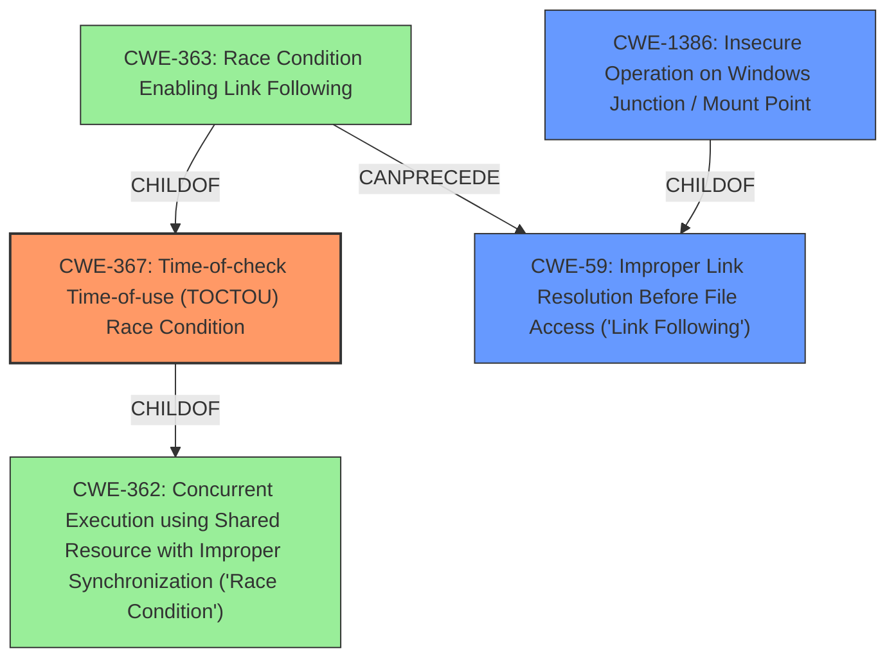

# Raw Analyzer Response for CVE-2021-1640

# Summary
| CWE ID | CWE Name | Confidence | CWE Abstraction Level | CWE Vulnerability Mapping Label | CWE-Vulnerability Mapping Notes |
|---|---|---|---|---|---|
| **CWE-367** | Time-of-check Time-of-use (TOCTOU) Race Condition | 0.9 | Base | Primary CWE | Allowed |
| CWE-1386 | Insecure Operation on Windows Junction / Mount Point | 0.7 | Base | Secondary Candidate | Allowed |
| CWE-59 | Improper Link Resolution Before File Access ('Link Following') | 0.6 | Base | Secondary Candidate | Allowed |

## Evidence and Confidence

*   **Confidence Score:** 0.8
*   **Evidence Strength:** HIGH

## Relationship Analysis
The primary CWE selected is CWE-367 (**Time-of-check Time-of-use (TOCTOU) Race Condition**), which has a hierarchical relationship with CWE-362 (**Concurrent Execution using Shared Resource with Improper Synchronization ('Race Condition')**), being a child of it. CWE-363 (**Race Condition Enabling Link Following**) is also a child of CWE-367 and CANPRECEDE CWE-59 (**Improper Link Resolution Before File Access ('Link Following')**). Additionally, CWE-1386 (**Insecure Operation on Windows Junction / Mount Point**) is a child of CWE-59. This relationship helps in understanding that the TOCTOU condition can lead to link following issues, which can then be exploited via Windows junctions.

## Vulnerability Chain
The vulnerability chain starts with the **TOCTOU** condition (CWE-367) in the Windows Print Spooler service. This allows an attacker to create a directory junction, leading to **improper link resolution** (CWE-59) and ultimately enabling the attacker to manipulate file access and cause file deletion by abusing Windows Junctions (CWE-1386). The root cause is the race condition, and the impact is arbitrary file deletion, which can lead to denial of service or elevation of privilege.

## Summary of Analysis
The initial assessment points to CWE-367 (**Time-of-check Time-of-use (TOCTOU) Race Condition**) as the primary weakness, supported by the "CVE Reference Links Content Summary" which states, "This is a Time-of-Check Time-of-Use (TOCTOU) issue, where a file path is checked to be valid, but is then changed before it is used." The analysis also highlights the ability to create a directory junction that can be abused by the Print Spooler service to delete a file, which relates to CWE-1386 (**Insecure Operation on Windows Junction / Mount Point**). The use of directory junctions implicates CWE-59 (**Improper Link Resolution Before File Access ('Link Following')**).

The relationship analysis confirms that CWE-367 is the root cause, leading to CWE-59 and subsequently CWE-1386. The final decision prioritizes CWE-367 as the primary CWE due to the explicit mention of the **TOCTOU** condition in the vulnerability description. CWE-1386 and CWE-59 are secondary because they represent the exploitation mechanism facilitated by the race condition.

The selected CWEs are at the optimal level of specificity, with CWE-367 being a Base level CWE that accurately captures the root cause, and CWE-1386 and CWE-59 providing further details on the exploitation technique.

Relevant CWE Information:

# Enhanced Context (25 CWEs)
The following CWEs were identified as potentially relevant to this vulnerability:

## CWE-59: Improper Link Resolution Before File Access ('Link Following')
**Abstraction Level**: Base
**Similarity Score**: 0.79
**Source**: dense

**Description**:
The product attempts to access a file based on the filename, but it does not properly prevent that filename from identifying a link or shortcut that resolves to an unintended resource.

**Mapping Guidance**:
- Usage: Allowed
- Rationale: This CWE entry is at the Base level of abstraction, which is a preferred level of abstraction for mapping to the root causes of vulnerabilities.

## CWE-1386: Insecure Operation on Windows Junction / Mount Point
**Abstraction Level**: Base

**Description**:
The product opens a file or directory, but it does not properly prevent the name from being associated with a junction or mount point to a destination that is outside of the intended control sphere.

**Mapping Guidance**:
- Usage: Allowed
- Rationale: This CWE entry is at the Base level of abstraction, which is a preferred level of abstraction for mapping to the root causes of vulnerabilities.

## CWE-367: Time-of-check Time-of-use (TOCTOU) Race Condition
**Abstraction Level**: Base

**Description**:
The product checks the state of a resource before using that resource, but the resource's state can change between the check and the use in a way that invalidates the results of the check. This can cause the product to perform invalid actions when the resource is in an unexpected state.

**Mapping Guidance**:
- Usage: Allowed
- Rationale: This CWE entry is at the Base level of abstraction, which is a preferred level of abstraction for mapping to the root causes of vulnerabilities.

## CWE-40: Path Traversal: '\\UNC\share\name\' (Windows UNC Share)
CWE-40 was considered because the vulnerability involves file paths and potential redirection. However, it was not selected because the core issue is not about traversing paths but about exploiting a race condition and abusing directory junctions.

## CWE-667: Improper Locking & CWE-362: Concurrent Execution using Shared Resource with Improper Synchronization ('Race Condition')
These CWEs were considered due to the race condition aspect of the vulnerability. While the vulnerability involves a race condition, the specific **TOCTOU** nature and the exploitation via directory junctions make CWE-367 a more precise fit.

## CWE-73: External Control of File Name or Path
CWE-73 was considered because the attacker influences the file path. However, the primary issue is not about external control of the path but the race condition that allows the path to be changed between the check and the use, which is better captured by CWE-367.

## CWE-123: Write-what-where Condition
CWE-123 was considered due to the file deletion aspect. However, the vulnerability is primarily about exploiting a race condition to delete arbitrary files, not about directly writing arbitrary data to arbitrary locations.

## CWE-250: Execution with Unnecessary Privileges
CWE-250 was not considered a strong fit as the description does not indicate the Print Spooler service is executing with unnecessary privileges. The vulnerability stems more from the **TOCTOU** issue.

## CWE-363: Race Condition Enabling Link Following
CWE-363 was considered because it directly relates to race conditions and link following. However, CWE-367 provides a more general and accurate representation of the root cause, while CWE-59 and CWE-1386 describe the specific exploitation method.

## CWE-190: Integer Overflow or Wraparound & CWE-1284: Improper Validation of Specified Quantity in Input
These CWEs were not considered relevant as the vulnerability does not involve integer overflows or improper validation of input quantities.

## CWE-454: External Initialization of Trusted Variables or Data Stores
CWE-454 was considered but not selected because the vulnerability is not about external initialization of trusted variables but rather about a race condition during file access.

## CWE-456: Missing Initialization of a Variable
CWE-456 was not considered as the vulnerability doesn't involve missing initialization of a variable.

## CWE-386: Symbolic Name not Mapping to Correct Object
CWE-386 was not selected as the core issue is not about symbolic names but about a race condition leading to arbitrary file deletion.

## CWE-787: Out-of-bounds Write & CWE-789