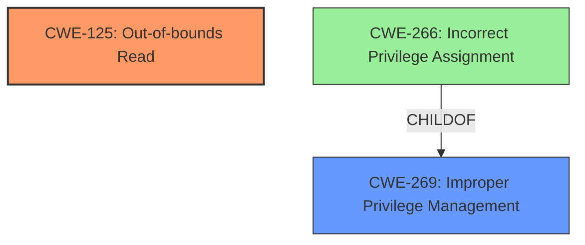

# Analysis for CVE-2021-1648

# Summary
| CWE ID | CWE Name | Confidence | CWE Abstraction Level | CWE Vulnerability Mapping Label | CWE-Vulnerability Mapping Notes |
|---|---|---|---|---|---|
| CWE-125 | Out-of-bounds Read | 0.9 | Base | Allowed | Primary CWE |
| CWE-269 | Improper Privilege Management | 0.6 | Class | Allowed-with-Review | Secondary Candidate |

## Evidence and Confidence

*   **Confidence Score:** 0.75
*   **Evidence Strength:** MEDIUM

## Relationship Analysis
The primary CWE is CWE-125 **Out-of-bounds Read**. It is a Base level CWE. A potential secondary CWE is CWE-269 **Improper Privilege Management**, because the vulnerability leads to privilege escalation. CWE-269 is a class level CWE, which would make CWE-266 **Incorrect Privilege Assignment** a better fit if there was more evidence.

## Vulnerability Chain
The vulnerability chain starts with **improper validation** of user supplied data, leading to an **out-of-bounds read**, and culminating in **privilege escalation**.

## Summary of Analysis
The initial assessment identified the primary weakness as CWE-125 **Out-of-bounds Read** due to the **insufficient validation** of user-provided input. This directly causes a read operation to go beyond the bounds of an allocated buffer. The evidence for this is in the "CVE Reference Links Content Summary" which states: "The insufficient validation of user-provided input leads to a read operation that goes beyond the bounds of an allocated buffer."

A secondary consideration was the privilege escalation aspect. The "CVE Reference Links Content Summary" section also says: "A local attacker can leverage this vulnerability to escalate privileges from low integrity to medium integrity." Given this, a weakness related to privilege management seems relevant.

Several CWEs were considered but ultimately rejected or deemed less appropriate:

*   **CWE-59 Improper Link Resolution Before File Access ('Link Following')**: This was considered due to the file access context, but the vulnerability does not involve symbolic links or similar mechanisms.
*   **CWE-73 External Control of File Name or Path**: This was also considered due to the file access context, but the vulnerability does not involve external control of file names or paths.
*   **CWE-782 Exposed IOCTL with Insufficient Access Control**: This was considered, but is not a direct match because there is no mention of IOCTLs in the description.
*   **CWE-266 Incorrect Privilege Assignment**: This was considered because of the privilege escalation, but there isn't enough information about how the privileges are incorrectly assigned.
*   **CWE-269 Improper Privilege Management**: This was considered because of the privilege escalation, and might apply, but the lack of details makes it a less confident choice than the **out-of-bounds read**.
*   **CWE-787 Out-of-bounds Write**: This was considered, but the summary states that it is a read operation.

Ultimately, CWE-125 **Out-of-bounds Read** was chosen as the primary CWE because it directly reflects the **root cause** described in the vulnerability details.

Relevant CWE Information:

# Enhanced Context (25 CWEs)
The following CWEs were identified as potentially relevant to this vulnerability:

## CWE-59: Improper Link Resolution Before File Access ('Link Following')
**Abstraction Level**: Base
**Similarity Score**: 0.82
**Source**: dense

**Description**:
The product attempts to access a file based on the filename, but it does not properly prevent that filename from identifying a link or shortcut that resolves to an unintended resource.

**Mapping Guidance**:
- Usage: Allowed
- Rationale: This CWE entry is at the Base level of abstraction, which is a preferred level of abstraction for mapping to the root causes of vulnerabilities.

## CWE-41: Improper Resolution of Path Equivalence
**Abstraction Level**: Base
**Similarity Score**: 0.81
**Source**: dense

**Description**:
The product is vulnerable to file system contents disclosure through path equivalence. Path equivalence involves the use of special characters in file and directory names. The associated manipulations are intended to generate multiple names for the same object.

**Mapping Guidance**:
- Usage: Allowed
- Rationale: This CWE entry is at the Base level of abstraction, which is a preferred level of abstraction for mapping to the root causes of vulnerabilities.

## CWE-73: External Control of File Name or Path
**Abstraction Level**: Base
**Similarity Score**: 0.80
**Source**: dense

**Description**:
The product allows user input to control or influence paths or file names that are used in filesystem operations.

**Mapping Guidance**:
- Usage: Allowed
- Rationale: This CWE entry is at the Base level of abstraction, which is a preferred level of abstraction for mapping to the root causes of vulnerabilities.

## CWE-667: Improper Locking
**Abstraction Level**: Class
**Similarity Score**: 0.79
**Source**: dense

**Description**:
The product does not properly acquire or release a lock on a resource, leading to unexpected resource state changes and behaviors.

**Mapping Guidance**:
- Usage: Allowed-with-Review
- Rationale: This CWE entry is a Class and might have Base-level children that would be more appropriate

## CWE-754: Improper Check for Unusual or Exceptional Conditions
**Abstraction Level**: Class
**Similarity Score**: 0.79
**Source**: dense

**Description**:
The product does not check or incorrectly checks for unusual or exceptional conditions that are not expected to occur frequently during day to day operation of the product.

**Mapping Guidance**:
- Usage: Allowed-with-Review
- Rationale: This CWE entry is a Class and might have Base-level children that would be more appropriate

## CWE-23: Relative Path Traversal
**Abstraction Level**: Base
**Similarity Score**: 0.79
**Source**: dense

**Description**:
The product uses external input to construct a pathname that should be within a restricted directory, but it does not properly neutralize sequences such as ".." that can resolve to a location that is outside of that directory.

**Mapping Guidance**:
- Usage: Allowed
- Rationale: This CWE entry is at the Base level of abstraction, which is a preferred level of abstraction for mapping to the root causes of vulnerabilities.

## CWE-703: Improper Check or Handling of Exceptional Conditions
**Abstraction Level**: Pillar
**Similarity Score**: 0.79
**Source**: dense

**Description**:
The product does not properly anticipate or handle exceptional conditions that rarely occur during normal operation of the product.

**Mapping Guidance**:
- Usage: Discouraged
- Rationale: This CWE entry is extremely high-level, a Pillar.

## CWE-755: Improper Handling of Exceptional Conditions
**Abstraction Level**: Class
**Similarity Score**: 0.79
**Source**: dense

**Description**:
The product does not handle or incorrectly handles an exceptional condition.

**Mapping Guidance**:
- Usage: Discouraged
- Rationale: This CWE entry is a level-1 Class (i.e., a child of a Pillar). It might have lower-level children that would be more appropriate

## CWE-668: Exposure of Resource to Wrong Sphere
**Abstraction Level**: Class
**Similarity Score**: 0.79
**Source**: dense

**Description**:
The product exposes a resource to the wrong control sphere, providing unintended actors with inappropriate access to the resource.

**Mapping Guidance**:
- Usage: Discouraged
- Rationale: CWE-668 is high-level and is often misused as a catch-all when lower-level CWE IDs might be applicable. It is sometimes used for low-information vulnerability reports [REF-1287]. It is a level-1 Class (i.e., a child of a Pillar). It is not useful for trend analysis.

## CWE-125: Out-of-bounds Read
**Abstraction Level**: Base
**Similarity Score**: 0.78
**Source**: dense

**Description**:
The product reads data past the end, or before the beginning, of the intended buffer.

**Mapping Guidance**:
- Usage: Allowed
- Rationale: This CWE entry is at the Base level of abstraction, which is a preferred level of abstraction for mapping to the root causes of vulnerabilities.

## CWE-59: Improper Link Resolution Before File Access ('Link Following')
**Abstraction Level**: Base
**Similarity Score**: 5814.32
**Source**: sparse

**Description**:
The product attempts to access a file based on the filename