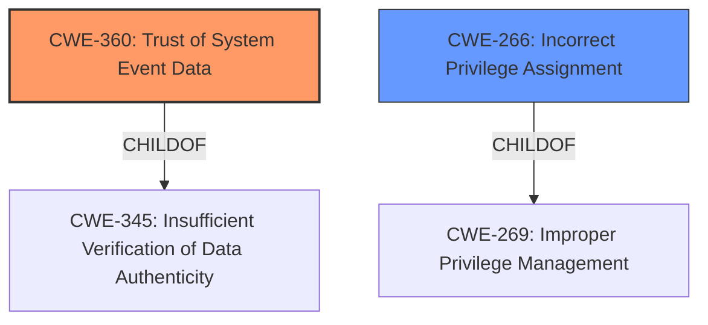

# Analysis Report for CVE-2021-1662

# Vulnerability Analysis Report: CVE-2021-1662

## Description


## Analysis (with Relationship Data)

# Summary
| CWE ID  | CWE Name                                                                                                                                | Confidence | CWE Abstraction Level | CWE Vulnerability Mapping Label | CWE-Vulnerability Mapping Notes |
| :-------- | :--------------------------------------------------------------------------------------------------------------------------------------- | :----------- | :---------------------- | :------------------------------ | :-------------------------------- |
| CWE-360   | Trust of System Event Data                                                                                                               | 0.75        | Base                    | Primary                         | Allowed                             |
| CWE-266   | Incorrect Privilege Assignment                                                                                                           | 0.50        | Base                    | Secondary                        | Allowed                             |

## Evidence and Confidence

*   **Confidence Score:** 0.63
*   **Evidence Strength:** LOW

## Relationship Analysis
The primary CWE, CWE-360 Trust of System Event Data, is a base-level weakness. It is related to the class CWE-345, Insufficient Verification of Data Authenticity. The secondary CWE, CWE-266 Incorrect Privilege Assignment, is also a base-level weakness, with a child relationship to CWE-269, Improper Privilege Management. The relationship between these CWEs suggests that the vulnerability involves trusting potentially spoofed system event data, which could then lead to incorrect privilege assignments.



## Vulnerability Chain
The vulnerability chain starts with the system trusting event data (CWE-360). If this data is spoofed or manipulated, it can lead to an incorrect privilege assignment (CWE-266), ultimately resulting in an elevation of privilege.

## Summary of Analysis
The analysis is primarily based on the limited evidence provided in the vulnerability description, which mentions an "Elevation of Privilege" vulnerability in Windows Event Tracing.

The retriever results and the CWE specifications were used to identify potential CWEs.

CWE-360 (Trust of System Event Data) was selected as the primary CWE because it aligns with the description of a vulnerability in Windows Event Tracing and because it has the highest dense score in the retriever results. The description for CWE-360 states: "Security based on event locations are insecure and can be spoofed." This directly relates to the potential **weakness** in Windows Event Tracing, where system event data might be trusted without proper verification, leading to security vulnerabilities.

CWE-266 (Incorrect Privilege Assignment) was selected as a secondary CWE because **incorrect privilege assignment** can result from trusting unverified system event data. This aligns with the vulnerability's reported **impact** of "Elevation of Privilege".

The selected CWEs are at the base level of specificity, which is the optimal level for representing the **root cause** of the vulnerability.

CWE-NVD-noinfo was rejected because it is not a real CWE and is only used as a placeholder when no other information is available.

Relevant CWE Information:

# Enhanced Context (25 CWEs)

## CWE-59: Improper Link Resolution Before File Access ('Link Following')
**Abstraction:** Base
**Status:** Draft

### Description
The product attempts to access a file based on the filename, but it does not properly prevent that filename from identifying a link or shortcut that resolves to an unintended resource.

### Mapping Guidance
**Usage:** Allowed
**Rationale:** This CWE entry is at the Base level of abstraction, which is a preferred level of abstraction for mapping to the root causes of vulnerabilities.

## CWE-378: Creation of Temporary File With Insecure Permissions
**Abstraction:** Base
**Status:** Draft

### Description
Opening temporary files without appropriate measures or controls can leave the file, its contents and any function that it impacts vulnerable to attack.

### Mapping Guidance
**Usage:** Allowed
**Rationale:** This CWE entry is at the Base level of abstraction, which is a preferred level of abstraction for mapping to the root causes of vulnerabilities.

## CWE-1386: Insecure Operation on Windows Junction / Mount Point
**Abstraction:** Base
**Status:** Incomplete

### Description
The product opens a file or directory, but it does not properly prevent the name from being associated with a junction or mount point to a destination that is outside of the intended control sphere.

### Mapping Guidance
**Usage:** Allowed
**Rationale:** This CWE entry is at the Base level of abstraction, which is a preferred level of abstraction for mapping to the root causes of vulnerabilities.

## CWE-123: Write-what-where Condition
**Abstraction:** Base
**Status:** Draft

### Description
Any condition where the attacker has the ability to write an arbitrary value to an arbitrary location, often as the result of a buffer overflow.

### Mapping Guidance
**Usage:** Allowed
**Rationale:** This CWE entry is at the Base level of abstraction, which is a preferred level of abstraction for mapping to the root causes of vulnerabilities.

## CWE-266: Incorrect Privilege Assignment
**Abstraction:** Base
**Status:** Draft

### Description
A product incorrectly assigns a privilege to a particular actor, creating an unintended sphere of control for that actor.

### Mapping Guidance
**Usage:** Allowed
**Rationale:** This CWE entry is at the Base level of abstraction, which is a preferred level of abstraction for mapping to the root causes of vulnerabilities.

## CWE-360: Trust of System Event Data
**Abstraction:** Base
**Status:** Incomplete

### Description
Security based on event locations are insecure and can be spoofed.

### Mapping Guidance
**Usage:** Allowed
**Rationale:** This CWE entry is at the Base level of abstraction, which is a preferred level of abstraction for mapping to the root causes of vulnerabilities.

## CWE-416: Use After Free
**Abstraction:** Variant
**Status:** Stable

### Description
The product reuses or references memory after it has been freed. At some point afterward, the memory may be allocated again and saved in another pointer, while the original pointer references a location somewhere within the new allocation. Any operations using the original pointer are no longer valid because the memory "belongs" to the code that operates on the new pointer.

### Mapping Guidance
**Usage:** Allowed
**Rationale:** This CWE entry is at the Variant level of abstraction, which is a preferred level of abstraction for mapping to the root causes of vulnerabilities.

## CWE-40: Path Traversal: '\\UNC\share\name\' (Windows UNC Share)
**Abstraction:** Variant
**Status:** Draft

### Description
The product accepts input that identifies a Windows UNC share ('\\UNC\share\name') that potentially redirects access to an unintended location or arbitrary file.

### Mapping Guidance
**Usage:** Allowed
**Rationale:** This CWE entry is at the Variant level of abstraction, which is a preferred level of abstraction for mapping to the root causes of vulnerabilities.

## CWE-1285: Improper Validation of Specified Index, Position, or Offset in Input
**Abstraction:** Base
**Status:** Incomplete

### Description
The product receives input that is expected to specify an index, position, or offset into an indexable resource such as a buffer or file, but it does not validate or incorrectly validates that the specified index/position/offset has the required properties.

### Mapping Guidance
**Usage:** Allowed
**Rationale:** This CWE entry is at the Base level of abstraction, which is a preferred level of abstraction for mapping to the root causes of vulnerabilities.

## CWE-454: External Initialization of Trusted Variables or Data Stores
**Abstraction:** Base
**Status:** Draft

### Description
The product initializes critical internal variables or data stores using inputs that can be modified by untrusted actors.

### Mapping Guidance
**Usage:** Allowed
**Rationale:** This CWE entry is at the Base level of abstraction, which is a preferred level of abstraction for mapping to the root causes of vulnerabilities.


## CWE Relationship Analysis

Current CWEs represent these abstraction levels: .


### Vulnerability Chain Analysis

**Chain starting from CWE-123:**
- 123 (Write-what-where Condition) - ROOT


**Chain starting from CWE-416:**
- 416 (Use After Free) - ROOT


### CWE Relationship Diagram

```mermaid
graph TD
    classDef primary fill:#f96,stroke:#333,stroke-width:2px
    classDef secondary fill:#69f,stroke:#333
    classDef tertiary fill:#9e9,stroke:#333
```


*Report generated on 2025-04-02 01:08:20*
