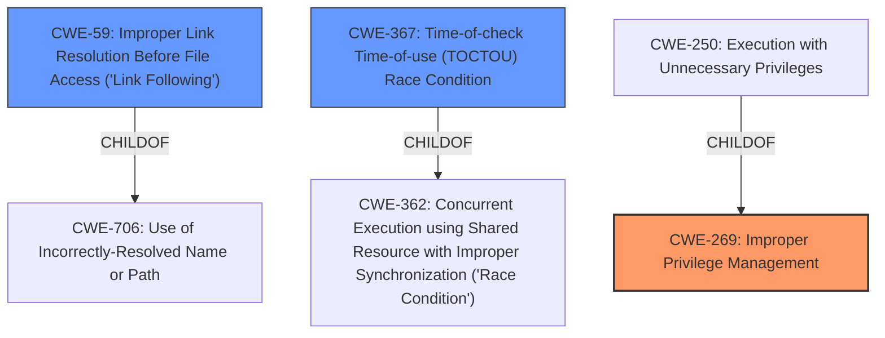

# Analysis Report for CVE-2021-1695

# Vulnerability Analysis Report: CVE-2021-1695

## Description


## Analysis (with Relationship Data)

# Summary
| CWE ID  | CWE Name                                                        | Confidence | CWE Abstraction Level | CWE Vulnerability Mapping Label | CWE-Vulnerability Mapping Notes |
| :-------- | :-------------------------------------------------------------- | :--------- | :-------------------- | :------------------------------ | :------------------------------ |
| CWE-269   | Improper Privilege Management                                 | 0.75       | Class                 | Allowed                         | Primary CWE                     |
| CWE-59    | Improper Link Resolution Before File Access ('Link Following') | 0.6        | Base                  | Allowed                         | Secondary Candidate             |
| CWE-367   | Time-of-check Time-of-use (TOCTOU) Race Condition             | 0.5        | Base                  | Allowed                         | Secondary Candidate             |

## Evidence and Confidence

*   **Confidence Score:** 0.7
*   **Evidence Strength:** LOW

## Relationship Analysis
The primary CWE is CWE-269, a class-level weakness. CWE-59 and CWE-367 are base-level weaknesses. CWE-59 and CWE-367 are related to race conditions and improper handling of file access, which can lead to elevation of privilege. The hierarchical relationships influenced the decision by providing context on how these weaknesses relate to each other.



## Vulnerability Chain
The vulnerability chain starts with **Improper Privilege Management (CWE-269)**, which can lead to **Improper Link Resolution Before File Access (CWE-59)** or **Time-of-check Time-of-use (TOCTOU) Race Condition (CWE-367)**, ultimately resulting in Elevation of Privilege.

## Summary of Analysis
The initial assessment was based on the provided evidence, which included the vulnerability description, key phrases, and CWEs for similar CVE descriptions. The primary CWE match from similar CVE descriptions was CWE-NVD-noinfo, which is not a valid CWE. The top CWEs included CWE-269 and CWE-59.

The retriever results suggested several candidate CWEs, including CWE-40, CWE-59, CWE-1386, CWE-367, and CWE-123. After reviewing the descriptions and relationships of these CWEs, it was determined that CWE-269, CWE-59, and CWE-367 were the most relevant.

The final decision was influenced by the hierarchical relationships between the CWEs and the need to identify the root cause of the vulnerability. CWE-269 was selected as the primary CWE because it represents the underlying **improper privilege management** issue that allows the other weaknesses to occur. CWE-59 and CWE-367 were selected as secondary CWEs because they represent specific mechanisms by which the elevation of privilege can be achieved.

The selected CWEs are at the optimal level of specificity because they accurately represent the root cause and mechanisms of the vulnerability. CWE-269 is a class-level weakness, while CWE-59 and CWE-367 are base-level weaknesses, providing a good balance between generality and specificity.

The evidence for this assessment is limited due to the lack of detailed information in the vulnerability description. However, the key phrases "Elevation of Privilege" and the component "Print Spooler" suggest that the vulnerability involves **improper privilege management** and potentially race conditions or link following issues.

**CWE Selection Justification:**

*   **CWE-269 Improper Privilege Management:** This is the primary weakness because the vulnerability results in an elevation of privilege, indicating a problem with how privileges are managed within the Print Spooler component. The description states, "**impact:** Elevation of Privilege".
*   **CWE-59 Improper Link Resolution Before File Access ('Link Following'):** This CWE is considered because Print Spooler vulnerabilities have historically involved issues with file access and link following. The retriever results also indicate a high similarity score for this CWE.
*   **CWE-367 Time-of-check Time-of-use (TOCTOU) Race Condition:** This CWE is considered because Print Spooler operations can be susceptible to race conditions, especially when handling file access or shared resources.

CWEs Considered But Not Used:

*   CWE-40, CWE-1386, and CWE-123 were considered but not selected because they are more specific and require more evidence to support their relevance. Without more information about the specific mechanism of the vulnerability, it is difficult to determine whether these CWEs are applicable.


## CWE Relationship Analysis

Current CWEs represent these abstraction levels: .


### Vulnerability Chain Analysis

**Chain starting from CWE-123:**
- 123 (Write-what-where Condition) - ROOT


**Chain starting from CWE-362:**
- 362 (Concurrent Execution using Shared Resource with Improper Synchronization ('Race Condition')) - ROOT


### CWE Relationship Diagram

```mermaid
graph TD
    classDef primary fill:#f96,stroke:#333,stroke-width:2px
    classDef secondary fill:#69f,stroke:#333
    classDef tertiary fill:#9e9,stroke:#333
```


*Report generated on 2025-04-02 12:44:15*
