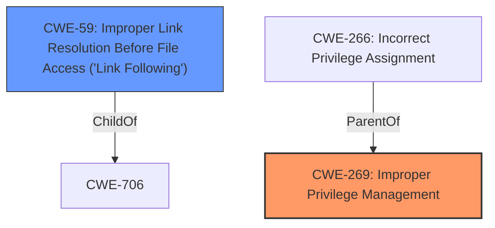

# Analysis Report for CVE-2021-1697

# Vulnerability Analysis Report: CVE-2021-1697

## Description


## Analysis (with Relationship Data)

# Summary
| CWE ID | CWE Name | Confidence | CWE Abstraction Level | CWE Vulnerability Mapping Label | CWE-Vulnerability Mapping Notes |
|---|---|---|---|---|---|
| CWE-269 | Improper Privilege Management | 0.7 | Base | Primary | Allowed |
| CWE-59 | Improper Link Resolution Before File Access ('Link Following') | 0.4 | Base | Secondary | Allowed |

## Evidence and Confidence

*   **Confidence Score:** 0.7
*   **Evidence Strength:** LOW

## Relationship Analysis
The primary CWE, CWE-269, is related to the broader issue of privilege management. CWE-59, a secondary consideration, relates to potential file access issues resulting from improper handling of links. The choice of CWE-269 is influenced by the vulnerability description's mention of "Elevation of Privilege." CWE-59 is a possible, but less likely, scenario.



## Vulnerability Chain
The vulnerability chain starts with a **flaw** in the Windows InstallService that allows for **Improper Privilege Management (CWE-269)**. This could lead to an attacker gaining elevated privileges. If the service improperly handles file access through links, it might also involve **Improper Link Resolution (CWE-59)**.

## Summary of Analysis
Initially, the description pointed towards a privilege elevation issue within the Windows InstallService. The primary suggestion was CWE-NVD-noinfo, but this is not informative. Given "Elevation of Privilege" in the description, **CWE-269: Improper Privilege Management** seems more appropriate as a root cause. However, the evidence is very limited. The retriever results suggest **CWE-59: Improper Link Resolution Before File Access ('Link Following')**, and while less direct, it is possible if the InstallService mishandles links, leading to privilege escalation.

The final decision is based primarily on the vulnerability description key phrases "Elevation of Privilege" with the selection of **CWE-269**.

Relevant CWE Information:

# Enhanced Context (25 CWEs)
The following CWEs were identified as potentially relevant to this vulnerability:

## CWE-59: Improper Link Resolution Before File Access ('Link Following')
**Abstraction Level**: Base
**Similarity Score**: 0.80
**Source**: dense

**Description**:
The product attempts to access a file based on the filename, but it does not properly prevent that filename from identifying a link or shortcut that resolves to an unintended resource.

**Mapping Guidance**:
- Usage: Allowed
- Rationale: This CWE entry is at the Base level of abstraction, which is a preferred level of abstraction for mapping to the root causes of vulnerabilities.

## CWE-269: Improper Privilege Management
**Abstraction Level**: Base
**Status:** Draft

### Description
The software performs an action that requires a certain privilege level but does not have the appropriate privileges.

### Extended Description
When software does not have the appropriate privileges, it may be unable to perform its required actions. In some cases, this could lead to a denial of service. In other cases, the software may attempt to access resources or perform other actions that are not permitted, which could lead to a security vulnerability.

### Alternative Terms
None

### Relationships
ChildOf -> CWE-264

### Mapping Guidance
**Usage:** Allowed
**Rationale:** This CWE entry is at the Base level of abstraction, which is a preferred level of abstraction for mapping to the root causes of vulnerabilities.
**Comments:** Carefully read both the name and description to ensure that this mapping is an appropriate fit. Do not try to 'force' a mapping to a lower-level Base/Variant simply to comply with this preferred level of abstraction.
**Reasons:**
- Acceptable-Use

### Observed Examples
- **CVE-2023-36012:** A security vulnerability exists in Microsoft Graphics Component where an attacker can execute arbitrary code due to improper privilege management.
- **CVE-2023-35628:** A security vulnerability exists in Microsoft Windows Kernel where an attacker can execute arbitrary code due to improper privilege management.
- **CVE-2023-35364:** A security vulnerability exists in Microsoft Outlook where an attacker can bypass security features due to improper privilege management.

## CWE-59: Improper Link Resolution Before File Access ('Link Following')
**Abstraction Level**: Base
**Similarity Score**: 4524.87
**Source**: sparse

**Description**:
The product attempts to access a file based on the filename, but it does not properly prevent that filename from identifying a link or shortcut that resolves to an unintended resource.

**Mapping Guidance**:
- Usage: Allowed
- Rationale: This CWE entry is at the Base level of abstraction, which is a preferred level of abstraction for mapping to the root causes of vulnerabilities.

## CWE-1386: Insecure Operation on Windows Junction / Mount Point
**Abstraction Level**: Base
**Similarity Score**: 4415.43
**Source**: sparse

**Description**:
The product opens a file or directory, but it does not properly prevent the name from being associated with a junction or mount point to a destination that is outside of the intended control sphere.

**Mapping Guidance**:
- Usage: Allowed
- Rationale: This CWE entry is at the Base level of abstraction, which is a preferred level of abstraction for mapping to the root causes of vulnerabilities.

## CWE-61: UNIX Symbolic Link (Symlink) Following
**Abstraction Level**: Compound
**Similarity Score**: 4164.82
**Source**: sparse

**Description**:
The product, when opening a file or directory, does not sufficiently account for when the file is a symbolic link that resolves to a target outside of the intended control sphere. This could allow an attacker to cause the product to operate on unauthorized files.

**Mapping Guidance**:
- Usage: Allowed
- Rationale: This is a well-known Composite of multiple weaknesses that must all occur simultaneously, although it is attack-oriented in nature.


## CWE Relationship Analysis

Current CWEs represent these abstraction levels: .


### Vulnerability Chain Analysis

**Chain starting from CWE-1386:**
- 1386 (Insecure Operation on Windows Junction / Mount Point) - ROOT


**Chain starting from CWE-706:**
- 706 (Use of Incorrectly-Resolved Name or Reference) - ROOT


### CWE Relationship Diagram

```mermaid
graph TD
    classDef primary fill:#f96,stroke:#333,stroke-width:2px
    classDef secondary fill:#69f,stroke:#333
    classDef tertiary fill:#9e9,stroke:#333
```


*Report generated on 2025-04-02 15:50:56*
