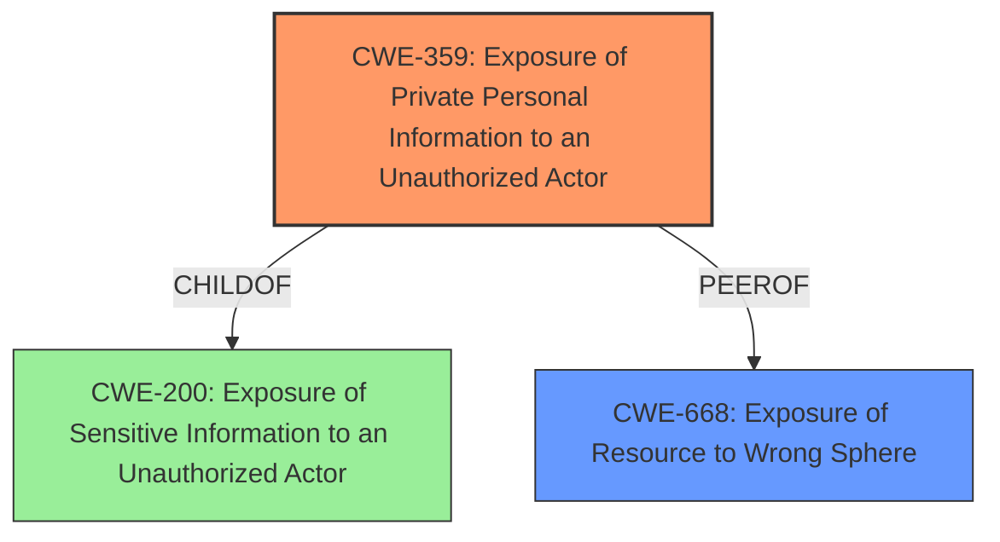

# Analysis for CVE-2021-1725

# Summary
| CWE ID | CWE Name | Confidence | CWE Abstraction Level | CWE Vulnerability Mapping Label | CWE-Vulnerability Mapping Notes |
|---|---|---|---|---|---|
| **CWE-359** | **Exposure of Private Personal Information to an Unauthorized Actor** | 0.8 | Base | Primary | Allowed |
| CWE-668 | Exposure of Resource to Wrong Sphere | 0.6 | Class | Secondary | Discouraged |

## Evidence and Confidence

*   **Confidence Score:** 0.8
*   **Evidence Strength:** MEDIUM

## Relationship Analysis
The primary relationship influencing the choice of CWE-359 is its direct relevance to the **impact** of the vulnerability: "Information Disclosure." CWE-359 is a base-level CWE focused specifically on the exposure of private personal information, making it more specific than the class-level CWE-668, which is a more general resource exposure issue. CWE-359 is a child of CWE-200 (Exposure of Sensitive Information to an Unauthorized Actor), providing a hierarchical context.

## Vulnerability Chain
The vulnerability chain is relatively simple in this case:
  1.  **Root Cause:** (Not explicitly defined, but implied) - **Improper** handling or storage of sensitive information within the Bot Framework SDK.
  2.  **Weakness:** Exposure of this **Private Personal Information**.
  3.  **Impact:** Information Disclosure.

## Summary of Analysis
The initial analysis identified "Information Disclosure" as the **impact**. The analysis was based on the provided vulnerability description and the retriever results.

The retriever results suggested CWE-359 (Exposure of Private Personal Information to an Unauthorized Actor) which directly aligns with the stated **impact** and the nature of the vulnerability. The vulnerability description key phrases also confirm that the **impact** is Information Disclosure.

CWE-668 (Exposure of Resource to Wrong Sphere) was considered but deemed less specific. While technically accurate (information is a resource), it doesn't capture the personal/private nature of the disclosed information. The MITRE guidance discourages the use of CWE-668 when lower-level CWEs are applicable.

The selected CWE, CWE-359, is at the optimal level of specificity because it precisely describes the type of information being disclosed. It is a base-level CWE, which is preferred.

Relevant CWE Information:

# Enhanced Context (25 CWEs)
The following CWEs were identified as potentially relevant to this vulnerability:

## CWE-693: Protection Mechanism Failure
**Abstraction Level**: Pillar
**Similarity Score**: 0.78
**Source**: dense

**Description**:
The product does not use or incorrectly uses a protection mechanism that provides sufficient defense against directed attacks against the product.

**Mapping Guidance**:
- Usage: Discouraged
- Rationale: This CWE entry is extremely high-level, a Pillar.

## CWE-668: Exposure of Resource to Wrong Sphere
**Abstraction Level**: Class
**Similarity Score**: 0.76
**Source**: dense

**Description**:
The product exposes a resource to the wrong control sphere, providing unintended actors with inappropriate access to the resource.

**Mapping Guidance**:
- Usage: Discouraged
- Rationale: CWE-668 is high-level and is often misused as a catch-all when lower-level CWE IDs might be applicable. It is sometimes used for low-information vulnerability reports [REF-1287]. It is a level-1 Class (i.e., a child of a Pillar). It is not useful for trend analysis.

## CWE-703: Improper Check or Handling of Exceptional Conditions
**Abstraction Level**: Pillar
**Similarity Score**: 0.76
**Source**: dense

**Description**:
The product does not properly anticipate or handle exceptional conditions that rarely occur during normal operation of the product.

**Mapping Guidance**:
- Usage: Discouraged
- Rationale: This CWE entry is extremely high-level, a Pillar.

## CWE-404: Improper Resource Shutdown or Release
**Abstraction Level**: Class
**Similarity Score**: 0.76
**Source**: dense

**Description**:
The product does not release or incorrectly releases a resource before it is made available for re-use.

**Mapping Guidance**:
- Usage: Allowed-with-Review
- Rationale: This CWE entry is a Class and might have Base-level children that would be more appropriate

## CWE-212: Improper Removal of Sensitive Information Before Storage or Transfer
**Abstraction Level**: Base
**Similarity Score**: 0.75
**Source**: dense

**Description**:
The product stores, transfers, or shares a resource that contains sensitive information, but it does not properly remove that information before the product makes the resource available to unauthorized actors.

**Mapping Guidance**:
- Usage: Allowed
- Rationale: This CWE entry is at the Base level of abstraction, which is a preferred level of abstraction for mapping to the root causes of vulnerabilities.

## CWE-754: Improper Check for Unusual or Exceptional Conditions
**Abstraction Level**: Class
**Similarity Score**: 0.75
**Source**: dense

**Description**:
The product does not check or incorrectly checks for unusual or exceptional conditions that are not expected to occur frequently during day to day operation of the product.

**Mapping Guidance**:
- Usage: Allowed-with-Review
- Rationale: This CWE entry is a Class and might have Base-level children that would be more appropriate

## CWE-226: Sensitive Information in Resource Not Removed Before Reuse
**Abstraction Level**: Base
**Similarity Score**: 0.75
**Source**: dense

**Description**:
The product releases a resource such as memory or a file so that it can be made available for reuse, but it does not clear or "zeroize" the information contained in the resource before the product performs a critical state transition or makes the resource available for reuse by other entities.

**Mapping Guidance**:
- Usage: Allowed
- Rationale: This CWE entry is at the Base level of abstraction, which is a preferred level of abstraction for mapping to the root causes of vulnerabilities.

## CWE-41: Improper Resolution of Path Equivalence
**Abstraction Level**: Base
**Similarity Score**: 0.75
**Source**: dense

**Description**:
The product is vulnerable to file system contents disclosure through path equivalence. Path equivalence involves the use of special characters in file and directory names. The associated manipulations are intended to generate multiple names for the same object.

**Mapping Guidance**:
- Usage: Allowed
- Rationale: This CWE entry is at the Base level of abstraction, which is a preferred level of abstraction for mapping to the root causes of vulnerabilities.

## CWE-664: Improper Control of a Resource Through its Lifetime
**Abstraction Level**: Pillar
**Similarity Score**: 0.75
**Source**: dense

**Description**:
The product does not maintain or incorrectly maintains control over a resource throughout its lifetime of creation, use, and release.

**Mapping Guidance**:
- Usage: Discouraged
- Rationale: This CWE entry is high-level when lower-level children are available.

## CWE-807: Reliance on Untrusted Inputs in a Security Decision
**Abstraction Level**: Base
**Similarity Score**: 0.74
**Source**: dense

**Description**:
The product uses a protection mechanism that relies on the existence or values of an input, but the input can be modified by an untrusted actor in a way that bypasses the protection mechanism.

**Mapping Guidance**:
- Usage: Allowed
- Rationale: This CWE entry is at the Base level of abstraction, which is a preferred level of abstraction for mapping to the root causes of vulnerabilities.

## CWE-367: Time-of-check Time-of-use (TOCTOU) Race Condition
**Abstraction Level**: Base
**Similarity Score**: 3793.49
**Source**: sparse

**Description**:
The product checks the state of a resource before using that resource, but the resource's state can change between the check and the use in a way that invalidates the results of the check. This can cause the product to perform invalid actions when the resource is in an unexpected state.

**Mapping Guidance**:
- Usage: Allowed
- Rationale: This CWE entry is at the Base level of abstraction, which is a preferred level of abstraction for mapping to the root causes of vulnerabilities.

## CWE-125: Out-of-bounds Read
**Abstraction Level**: Base
**Similarity Score**: 3761.

# Enhanced Query for CVE-2021-1725

## Vulnerability Description
Bot Framework SDK Information Disclosure Vulnerability

### Vulnerability Description Key Phrases
- **impact:** Information Disclosure
- **product:** Bot Framework SDK

## Retriever Results

### Top Combined Results

| Rank | CWE ID | Name | Abstraction | Usage  | Retrievers | Individual Scores |
|------|--------|------|-------------|-------|------------|-------------------|
| 1 | 525 | Use of Web Browser Cache Containing Sensitive Information | Variant | Allowed | sparse | 0.011 |
| 2 | 378 | Creation of Temporary File With Insecure Permissions | Base | Allowed | sparse | 0.009 |
| 3 | 705 | Incorrect Control Flow Scoping | Class | Allowed-with-Review | sparse | 0.008 |
| 4 | 126 | Buffer Over-read | Variant | Allowed | sparse | 0.008 |
| 5 | 826 | Premature Release of Resource During Expected Lifetime | Base | Allowed | sparse | 0.008 |
| 6 | 359 | Exposure of Private Personal Information to an Unauthorized Actor | Base | Allowed | dense | 0.513 |
| 7 | 567 | Unsynchronized Access to Shared Data in a Multithreaded Context | Base | Allowed | graph | 0.002 |
| 8 | 431 | Missing Handler | Base | Allowed | sparse | 0.008 |
| 9 | 379 | Creation of Temporary File in Directory with Insecure Permissions | Base | Allowed | sparse | 0.008 |
| 10 | 693 | Protection Mechanism Failure | Pillar | Discouraged | sparse | 0.008 |

# Complete CWE Specifications

## CWE-525: Use of Web Browser Cache Containing Sensitive Information
**Abstraction:** Variant
**Status:** Incomplete

### Description
The web application does not use an appropriate caching policy that specifies the extent to which each web page and associated form fields should be cached.

### Extended Description
Not provided

### Alternative Terms
None

### Relationships
ChildOf -> CWE-524

### Mapping Guidance
**Usage:** Allowed
**Rationale:** This CWE entry is at the Variant level of abstraction, which is a preferred level of abstraction for mapping to the root causes of vulnerabilities.
**Comments:** Carefully read both the name and description to ensure that this mapping is an appropriate fit. Do not try to 'force' a mapping to a lower-level Base/Variant simply to comply with this preferred level of abstraction.
**Reasons:**
- Acceptable-Use

## CWE-378: Creation of Temporary File With Insecure Permissions
**Abstraction:** Base
**Status:** Draft

### Description
Opening temporary files without appropriate measures or controls can leave the file, its contents and any function that it impacts vulnerable to attack.

### Extended Description
Not provided

### Alternative Terms
None

### Relationships
ChildOf -> CWE-377

### Mapping Guidance
**Usage:** Allowed
**Rationale:** This CWE entry is at the Base level of abstraction, which is a preferred level of abstraction for mapping to the root causes of vulnerabilities.
**Comments:** Carefully read both the name and description to ensure that this mapping is an appropriate fit. Do not try to 'force' a mapping to a lower-level Base/Variant simply to comply with this preferred level of abstraction.
**Reasons:**
- Acceptable-Use

### Observed Examples
- **CVE-2022-24823:** A network application framework uses the Java function createTempFile(), which will create a file that is readable by other local users of the system

## CWE-705: Incorrect Control Flow Scoping
**Abstraction:** Class
**Status:** Incomplete

### Description
The product does not properly return control flow to the proper location after it has completed a task or detected an unusual condition.

### Extended Description
Not provided

### Alternative Terms
None

### Relationships
ChildOf -> CWE-691

### Mapping Guidance
**Usage:** Allowed-with-Review
**Rationale:** This CWE entry is a Class and might have Base-level children that would be more appropriate
**Comments:** Examine children of this entry to see if there is a better fit
**Reasons:**
- Abstraction

### Observed Examples
- **CVE-2023-21087:** Java code in a smartphone OS can encounter a "boot loop" due to an uncaught exception
- **CVE-2014-1266:** chain: incorrect "goto" in Apple SSL product bypasses certificate validation, allowing Adversary-in-the-Middle (AITM) attack (Apple "goto fail" bug). CWE-705 (Incorrect Control Flow Scoping) -> CWE-561 (Dead Code) -> CWE-295 (Improper Certificate Validation) -> CWE-393 (Return of Wrong Status Code) -> CWE-300 (Channel Accessible by Non-Endpoint).

## CWE-126: Buffer Over-read
**Abstraction:** Variant
**Status:** Draft

### Description
The product reads from a buffer using buffer access mechanisms such as indexes or pointers that reference memory locations after the targeted buffer.

### Extended Description
This typically occurs when the pointer or its index is incremented to a position beyond the bounds of the buffer or when pointer arithmetic results in a position outside of the valid memory location to name a few. This may result in exposure of sensitive information or possibly a crash.

### Alternative Terms
None

### Relationships
ChildOf -> CWE-125
ChildOf -> CWE-788

### Mapping Guidance
**Usage:** Allowed
**Rationale:** This CWE entry is at the Variant level of abstraction, which is a preferred level of abstraction for mapping to the root causes of vulnerabilities.
**Comments:** Carefully read both the name and description to ensure that this mapping is an appropriate fit. Do not try to 'force' a mapping to a lower-level Base/Variant simply to comply with this preferred level of abstraction.
**Reasons:**
- Acceptable-Use

### Additional Notes
**[Relationship]** These problems may be resultant from missing sentinel values (CWE-463) or trusting a user-influenced input length variable.

### Observed Examples
- **CVE-2022-1733:** Text editor has out-of-bounds read past end of line while indenting C code
- **CVE-2014-0160:** Chain: "Heartbleed" bug receives an inconsistent length parameter (CWE-130) enabling an out-of-bounds read (CWE-126), returning memory that could include private cryptographic keys and other sensitive data.
- **CVE-2009-2523:** Chain: product does not handle when an input string is not NULL terminated, leading to buffer over-read or heap-based buffer overflow.

## CWE-826: Premature Release of Resource During Expected Lifetime
**Abstraction:** Base
**Status:** Incomplete

### Description
The product releases a resource that is still intended to be used by itself or another actor.

### Extended Description

This weakness focuses on errors in which the product should not release a resource, but performs the release anyway. This is different than a weakness in which the product releases a resource at the appropriate time, but it maintains a reference to the resource, which it later accesses. For this weakness, the resource should still be valid upon the subsequent access.

When a product releases a resource that is still being used, it is possible that operations will still be taken on this resource, which may have been repurposed in the meantime, leading to issues similar to CWE-825. Consequences may include denial of service, information exposure, or code execution.

### Alternative Terms
None

### Relationships
ChildOf -> CWE-666
CanPrecede -> CWE-672

### Mapping Guidance
**Usage:** Allowed
**Rationale:** This CWE entry is at the Base level of abstraction, which is a preferred level of abstraction for mapping to the root causes of vulnerabilities.
**Comments:** Carefully read both the name and description to ensure that this mapping is an appropriate fit. Do not try to 'force' a mapping to a lower-level Base/Variant simply to comply with this preferred level of abstraction.
**Reasons:**
- Acceptable-Use

### Additional Notes
**[Research Gap]** Under-studied and under-reported as of September 2010. This weakness has been reported in high-visibility software, although the focus has been primarily on memory allocation and de-allocation. There are very few examples of this weakness that are not directly related to memory management, although such weaknesses are likely to occur in real-world software for other types of resources.

### Observed Examples
- **CVE-2009-3547:** Chain: race condition (CWE-362) might allow resource to be released before operating on it, leading to NULL dereference (CWE-476)

## CWE-359: Exposure of Private Personal Information to an Unauthorized Actor
**Abstraction:** Base
**Status:** Incomplete

### Description
The product does not properly prevent a person's private, personal information from being accessed by actors who either (1) are not explicitly authorized to access the information or (2) do not have the implicit consent of the person about whom the information is collected.

### Extended Description
Not provided

### Alternative Terms
Privacy violation
Privacy leak
Privacy leakage

### Relationships
ChildOf -> CWE-200

### Mapping Guidance
**Usage:** Allowed
**Rationale:** This CWE entry is at the Base level of abstraction, which is a preferred level of abstraction for mapping to the root causes of vulnerabilities.
**Comments:** Carefully read both the name and description to ensure that this mapping is an appropriate fit. Do not try to 'force' a mapping to a lower-level Base/Variant simply to comply with this preferred level of abstraction.
**Reasons:**
- Acceptable-Use

### Additional Notes
**[Maintenance]** This entry overlaps many other entries that are not organized around the kind of sensitive information that is exposed. However, because privacy is treated with such importance due to regulations and other factors, and it may be useful for weakness-finding tools to highlight capabilities that detect personal private information instead of system information, it is not clear whether - and how - this entry should be deprecated.

**[Other]** 

There are many types of sensitive information that products must protect from attackers, including system data, communications, configuration, business secrets, intellectual property, and an individual's personal (private) information. Private personal information may include a password, phone number, geographic location, personal messages, credit card number, etc. Private information is important to consider whether the person is a user of the product, or part of a data set that is processed by the product. An exposure of private information does not necessarily prevent the product from working properly, and in fact the exposure might be intended by the developer, e.g. as part of data sharing with other organizations. However, the exposure of personal private information can still be undesirable or explicitly prohibited by law or regulation.

Some types of private information include:

  - Government identifiers, such as Social Security Numbers

  - Contact information, such as home addresses and telephone numbers

  - Geographic location - where the user is (or was)

  - Employment history

  - Financial data - such as credit card numbers, salary, bank accounts, and debts

  - Pictures, video, or audio

  - Behavioral patterns - such as web surfing history, when certain activities are performed, etc.

  - Relationships (and types of relationships) with others - family, friends, contacts, etc.

  - Communications - e-mail addresses, private messages, text messages, chat logs, etc.

  - Health - medical conditions, insurance status, prescription records

  - Account passwords and other credentials

Some of this information may be characterized as PII (Personally Identifiable Information), Protected Health Information (PHI), etc. Categories of private information may overlap or vary based on the intended usage or the policies and practices of a particular industry.

Sometimes data that is not labeled as private can have a privacy implication in a different context. For example, student identification numbers are usually not considered private because there is no explicit and publicly-available mapping to an individual student's personal information. However, if a school generates identification numbers based on student social security numbers, then the identification numbers should be considered private.

## CWE-567: Unsynchronized Access to Shared Data in a Multithreaded Context
**Abstraction:** Base
**Status:** Draft

### Description
The product does not properly synchronize shared data, such as static variables across threads, which can lead to undefined behavior and unpredictable data changes.

### Extended Description

Within servlets, shared static variables are not protected from concurrent access, but servlets are multithreaded. This is a typical programming mistake in J2EE applications, since the multithreading is handled by the framework. When a shared variable can be influenced by an attacker, one thread could wind up modifying the variable to contain data that is not valid for a different thread that is also using the data within the variable.

Note that this weakness is not unique to servlets.

### Alternative Terms
None

### Relationships
ChildOf -> CWE-820
ChildOf -> CWE-662
ChildOf -> CWE-662
CanPrecede -> CWE-488

### Mapping Guidance
**Usage:** Allowed
**Rationale:** This CWE entry is at the Base level of abstraction, which is a preferred level of abstraction for mapping to the root causes of vulnerabilities.
**Comments:** Carefully read both the name and description to ensure that this mapping is an appropriate fit. Do not try to 'force' a mapping to a lower-level Base/Variant simply to comply with this preferred level of abstraction.
**Reasons:**
- Acceptable-Use

## CWE-431: Missing Handler
**Abstraction:** Base
**Status:** Draft

### Description
A handler is not available or implemented.

### Extended Description
When an exception is thrown and not caught, the process has given up an opportunity to decide if a given failure or event is worth a change in execution.

### Alternative Terms
None

### Relationships
ChildOf -> CWE-691
CanPrecede -> CWE-433

### Mapping Guidance
**Usage:** Allowed
**Rationale:** This CWE entry is at the Base level of abstraction, which is a preferred level of abstraction for mapping to the root causes of vulnerabilities.
**Comments:** Carefully read both the name and description to ensure that this mapping is an appropriate fit. Do not try to 'force' a mapping to a lower-level Base/Variant simply to comply with this preferred level of abstraction.
**Reasons:**
- Acceptable-Use

### Observed Examples
- **CVE-2022-25302:** SDK for OPC Unified Architecture (OPC UA) is missing a handler for when a cast fails, allowing for a crash

## CWE-379: Creation of Temporary File in Directory with Insecure Permissions
**Abstraction:** Base
**Status:** Incomplete

### Description
The product creates a temporary file in a directory whose permissions allow unintended actors to determine the file's existence or otherwise access that file.

### Extended Description
On some operating systems, the fact that the temporary file exists may be apparent to any user with sufficient privileges to access that directory. Since the file is visible, the application that is using the temporary file could be known. If one has access to list the processes on the system, the attacker has gained information about what the user is doing at that time. By correlating this with the applications the user is running, an attacker could potentially discover what a user's actions are. From this, higher levels of security could be breached.

### Alternative Terms
None

### Relationships
ChildOf -> CWE-377

### Mapping Guidance
**Usage:** Allowed
**Rationale:** This CWE entry is at the Base level of abstraction, which is a preferred level of abstraction for mapping to the root causes of vulnerabilities.
**Comments:** Carefully read both the name and description to ensure that this mapping is an appropriate fit. Do not try to 'force' a mapping to a lower-level Base/Variant simply to comply with this preferred level of abstraction.
**Reasons:**
- Acceptable-Use

### Observed Examples
- **CVE-2022-27818:** A hotkey daemon written in Rust creates a domain socket file underneath /tmp, which is accessible by any user.
- **CVE-2021-21290:** A Java-based application for a rapid-development framework uses File.createTempFile() to create a random temporary file with insecure default permissions.

## CWE-693: Protection Mechanism Failure
**Abstraction:** Pillar
**Status:** Draft

### Description
The product does not use or incorrectly uses a protection mechanism that provides sufficient defense against directed attacks against the product.

### Extended Description
This weakness covers three distinct situations. A "missing" protection mechanism occurs when the application does not define any mechanism against a certain class of attack. An "insufficient" protection mechanism might provide some defenses - for example, against the most common attacks - but it does not protect against everything that is intended. Finally, an "ignored" mechanism occurs when a mechanism is available and in active use within the product, but the developer has not applied it in some code path.

### Alternative Terms
None

### Relationships
None

### Mapping Guidance
**Usage:** Discouraged
**Rationale:** This CWE entry is extremely high-level, a Pillar.
**Comments:** Consider children or descendants of this entry instead.
**Reasons:**
- Abstraction

### Additional Notes
**[Research Gap]** The concept of protection mechanisms is well established, but protection mechanism failures have not been studied comprehensively. It is suspected that protection mechanisms can have significantly different types of weaknesses than the weaknesses that they are intended to prevent.

