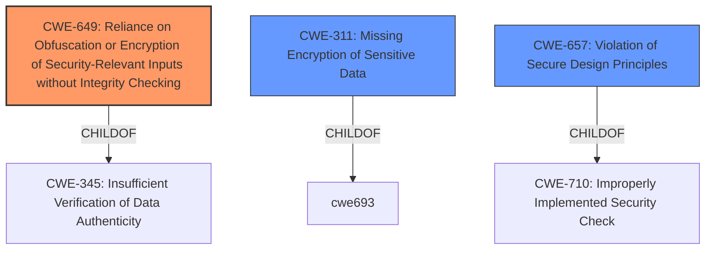

# Raw Analyzer Response for CVE-2021-1731

# Summary
| CWE ID | CWE Name | Confidence | CWE Abstraction Level | CWE Vulnerability Mapping Label | CWE-Vulnerability Mapping Notes |
|---|---|---|---|---|---|
| CWE-649 | Reliance on Obfuscation or Encryption of Security-Relevant Inputs without Integrity Checking | 0.8 | Base | Allowed | Primary CWE. The product uses encryption (PFX Encryption) but doesn't properly check integrity, leading to a security bypass. |
| CWE-311 | Missing Encryption of Sensitive Data | 0.5 | Class | Discouraged | Secondary Candidate. There might be a lack of encryption or improper encryption leading to the bypass. |
| CWE-657 | Violation of Secure Design Principles | 0.4 | Class | Discouraged | Secondary Candidate. A flawed design is contributing to security issues. |

## Evidence and Confidence

*   **Confidence Score:** 0.8
*   **Evidence Strength:** MEDIUM

## Relationship Analysis
The primary CWE selected is CWE-649, which is a Base level CWE. It is related to CWE-345 (Insufficient Verification of Data Authenticity) as a child. CWE-311 (Missing Encryption of Sensitive Data) is a Class level CWE and is considered as a secondary candidate due to the possibility that the encryption is missing or improperly implemented. CWE-657 (Violation of Secure Design Principles) is a high-level Class CWE and is a parent of more specific design flaws. The choice of CWE-649 reflects the specific issue of missing integrity checks on encrypted data, rather than just a general design flaw or missing encryption.

## Vulnerability Chain
The vulnerability chain starts with the **PFX Encryption Security Feature**, followed by a **lack of integrity checking**, which ultimately leads to a **Security Feature Bypass**.

## Summary of Analysis
The initial analysis focused on identifying the core weakness leading to the bypass. The evidence, though limited, points towards a flaw in how the **PFX Encryption Security Feature** is implemented. Specifically, the system **relies on encryption without properly verifying the integrity of the encrypted data**. This allows attackers to potentially manipulate the data and bypass security measures.

The selection of CWE-649 is based on the following:

*   The vulnerability description mentions a "**PFX Encryption Security Feature Bypass**", indicating that encryption is present but ineffective.
*   CWE-649 directly addresses the scenario where encryption is used without proper integrity checking.
*   The description of CWE-649 aligns with the concept of an attacker being able to "traverse the space of possible values" if integrity is not protected.

While CWE-311 (Missing Encryption of Sensitive Data) and CWE-657 (Violation of Secure Design Principles) were considered, they were deemed less specific than CWE-649. CWE-311 implies a complete lack of encryption, which doesn't fit the description of a "PFX Encryption Security Feature". CWE-657 is too broad and doesn't pinpoint the specific flaw of missing integrity checks.

The final selection of CWE-649 is at the optimal level of specificity because it directly addresses the root cause: **reliance on encryption without integrity checking**, leading to a security bypass. This is further supported by the retriever result showing CWE-649 having a high score, indicating a good match with the vulnerability description.