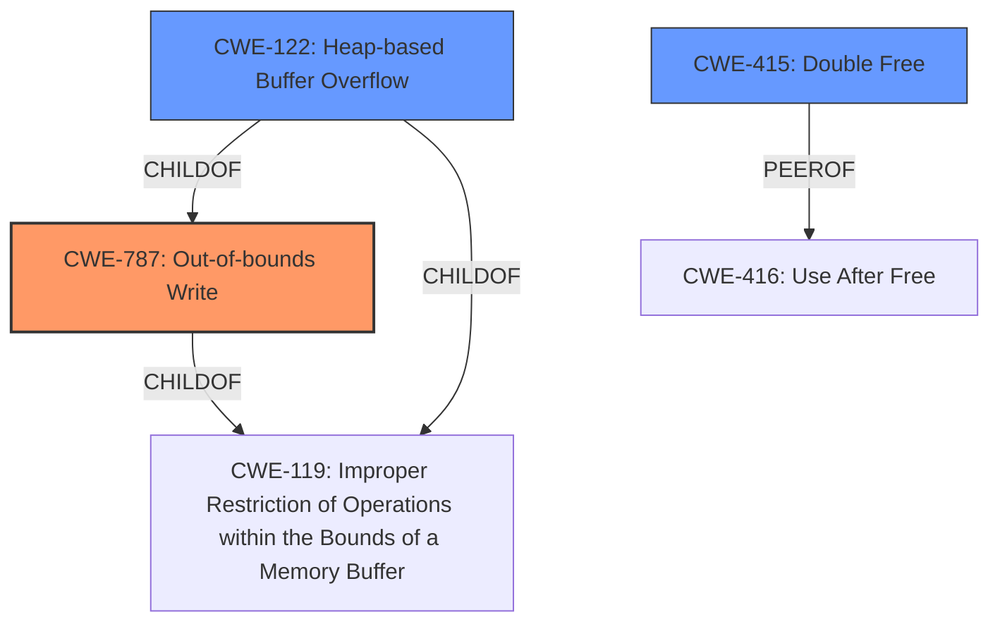

# Analysis for CVE-2021-1767

# Summary
| CWE ID | CWE Name | Confidence | CWE Abstraction Level | CWE Vulnerability Mapping Label | CWE-Vulnerability Mapping Notes |
|---|---|---|---|---|---|
| CWE-787 | Out-of-bounds Write | 1.0 | Base | Allowed | Primary CWE |
| CWE-122 | Heap-based Buffer Overflow | 0.8 | Variant | Allowed | Secondary Candidate |
| CWE-415 | Double Free | 0.6 | Variant | Allowed | Secondary Candidate |

## Evidence and Confidence

*   **Confidence Score:** 0.9
*   **Evidence Strength:** HIGH

## Relationship Analysis
The primary CWE is CWE-787, which is a base level CWE. CWE-122 (Heap-based Buffer Overflow) is a Variant of CWE-787 and a child of CWE-119 (Improper Restriction of Operations within the Bounds of a Memory Buffer). CWE-415 (Double Free) is a variant and peer of CWE-416 (Use After Free).

## Vulnerability Chain
The vulnerability chain starts with a maliciously crafted image, which leads to **heap corruption**. This **heap corruption** can be further classified as an **out-of-bounds write**.

## Summary of Analysis
The vulnerability description indicates that processing a maliciously crafted image may lead to **heap corruption**. The CVE Reference Links Content Summary confirms this, stating that the **root_cause** is "A logic issue in Model I/O" and the **weakness** is "**Heap corruption**" due to "Processing a maliciously crafted image".

The Retriever Results suggest several CWEs, including CWE-843 (Access of Resource Using Incompatible Type ('Type Confusion')), CWE-787 (Out-of-bounds Write), and CWE-415 (Double Free).

Given the description of **heap corruption**, CWE-787 (Out-of-bounds Write) is the most appropriate primary CWE. The vulnerability involves writing data outside the intended buffer, leading to **heap corruption**. This aligns with the definition of CWE-787.

CWE-122 (Heap-based Buffer Overflow) is a variant of CWE-787, and could also be considered since the overflow occurs in the heap. However, CWE-787 is more general and directly addresses the **out-of-bounds write** condition, thus being the more appropriate primary choice.

CWE-415 (Double Free) is less likely, as the description doesn't explicitly mention a double free condition, although **heap corruption** could potentially be caused by it. It is still listed as a secondary candidate because **heap corruption** might involve memory management issues, including double frees, although the provided evidence is not definitive on this point.

The improved checks implemented to address this issue suggest that the original code lacked proper boundary checks, supporting the selection of CWE-787.

The decision to choose CWE-787 is based on the explicit mention of "**heap corruption**" resulting from processing a maliciously crafted image, which strongly suggests an **out-of-bounds write** condition. This is further supported by the fact that the fix involves improved checks.

Other CWEs Considered but Not Used:

*   CWE-843 (Access of Resource Using Incompatible Type ('Type Confusion')): While type confusion could potentially contribute to memory corruption, the description focuses on the **out-of-bounds write** aspect, making CWE-787 more relevant.
*   CWE-665 (Improper Initialization): This is not directly supported by the description.
*   CWE-667 (Improper Locking): This is not directly supported by the description.
*   CWE-20 (Improper Input Validation): While a maliciously crafted image is the attack vector, the root cause is the **out-of-bounds write**, not the lack of input validation.
*   CWE-125 (Out-of-bounds Read): The description indicates a write (**heap corruption**), not a read.
* CWE-1263 (Improper Physical Access Control): is related to physical security, and not memory corruption.
* The remaining CWEs related to resource management, path traversal and integer overflows are less related to the vulnerability description, which explicitly refers to **heap corruption**