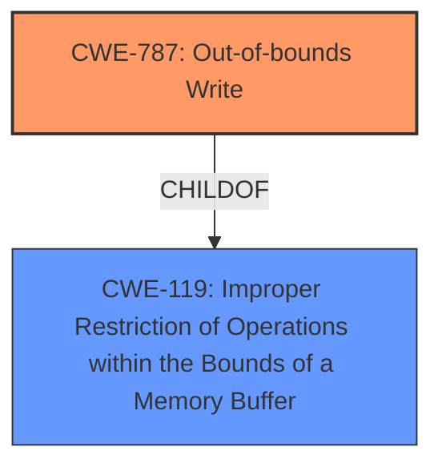

# Enhanced Analysis for CVE-2021-1770

# Summary
| CWE ID | CWE Name | Confidence | CWE Abstraction Level | CWE Vulnerability Mapping Label | CWE-Vulnerability Mapping Notes |
|---|---|---|---|---|---|
| CWE-787 | Out-of-bounds Write | 0.8 | Base | Allowed | Primary CWE |
| CWE-119 | Improper Restriction of Operations within the Bounds of a Memory Buffer | 0.5 | Class | Discouraged | Secondary Candidate |

## Evidence and Confidence

*   **Confidence Score:** 0.8
*   **Evidence Strength:** MEDIUM

## Relationship Analysis
The primary CWE selected is CWE-787 (Out-of-bounds Write), which is a child of CWE-119 (Improper Restriction of Operations within the Bounds of a Memory Buffer). While CWE-119 is a broader category, the description explicitly mentions a buffer overflow, making CWE-787 a more specific and appropriate choice. This aligns with the guidance to prefer more specific CWEs when evidence supports it.



## Vulnerability Chain
The vulnerability chain appears to start with a **logic issue** leading to a buffer overflow, which then results in arbitrary code execution. The mapping focuses on the buffer overflow (**Out-of-bounds Write**) as the direct cause of the exploitable condition.

## Summary of Analysis
The initial assessment identified CWE-787 as the primary candidate due to the presence of "buffer overflow" in the vulnerability description and CVE Reference Links Content Summary section. While the description mentions a **logic issue**, the more direct technical weakness is the resultant buffer overflow. The choice of CWE-787 over its parent, CWE-119, is based on the guidance to select the most specific applicable CWE.

The evidence supporting CWE-787 is the "buffer overflow" mentioned in the Vulnerability Description Key Phrases and the CVE Reference Links Content Summary.
> **Vulnerability Description Key Phrases**
> - **vector:** buffer overflow
> **CVE Reference Links Content Summary**
> **Root Cause:** A logic issue leading to a buffer overflow vulnerability.
The selection of CWE-787 is at the base level of abstraction.

Relevant CWE Information:

# Enhanced Context (25 CWEs)
The following CWEs were identified as potentially relevant to this vulnerability:

## CWE-787: Out-of-bounds Write
**Abstraction Level**: Base
**Similarity Score**: 4.33
**Source**: graph

**Description**:
CWE-787: Out-of-bounds Write

**Mapping Guidance**:
- Usage: Allowed
- Rationale: This CWE entry is at the Base level of abstraction, which is a preferred level of abstraction for mapping to the root causes of vulnerabilities.

**Relationships**:
- CANFOLLOW -> CWE-825
- CANFOLLOW -> CWE-824
- CANFOLLOW -> CWE-823
- CANFOLLOW -> CWE-822
- PARENTOF -> CWE-124

## CWE-119: Improper Restriction of Operations within the Bounds of a Memory Buffer
**Abstraction Level**: Class
**Similarity Score**: 6345.49
**Source**: sparse

**Description**:
The product performs operations on a memory buffer, but it reads from or writes to a memory location outside the buffer's intended boundary. This may result in read or write operations on unexpected memory locations that could be linked to other variables, data structures, or internal program data.

**Mapping Guidance**:
- Usage: Discouraged
- Rationale: CWE-119 is commonly misused in low-information vulnerability reports when lower-level CWEs could be used instead, or when more details about the vulnerability are available.

**CWEs Considered But Not Used:**

*   **CWE-843 (Access of Resource Using Incompatible Type ('Type Confusion'))**: While potentially related to the **logic issue**, the evidence does not specifically point to type confusion.
*   **CWE-415 (Double Free)**: No evidence suggests a double free condition.
*   **CWE-665 (Improper Initialization)**: The vulnerability description doesn't mention issues with resource initialization.
*   **CWE-20 (Improper Input Validation)**: While the **logic issue** could be related to input validation, it's not explicitly stated. Moreover, CWE-20 is discouraged when more specific CWEs exist.
*   **CWE-122 (Heap-based Buffer Overflow)**: Could be a more specific variant if heap allocation is confirmed, but the provided information doesn't specify where the buffer is allocated.
*   **CWE-123 (Write-what-where Condition)**: While a potential consequence of a buffer overflow, CWE-787 is more directly related to the root cause.
*   **CWE-667 (Improper Locking)**: There's no indication of locking issues in the description.
*   **CWE-1263 (Improper Physical Access Control)**: This is irrelevant to the described vulnerability.


## CWE Relationship Analysis

Current CWEs represent these abstraction levels: .


### Vulnerability Chain Analysis

**Chain starting from CWE-823:**
- 823 (Use of Out-of-range Pointer Offset) - ROOT


**Chain starting from CWE-787:**
- 787 (Out-of-bounds Write) - ROOT


### CWE Relationship Diagram

```mermaid
graph TD
    classDef primary fill:#f96,stroke:#333,stroke-width:2px
    classDef secondary fill:#69f,stroke:#333
    classDef tertiary fill:#9e9,stroke:#333
```