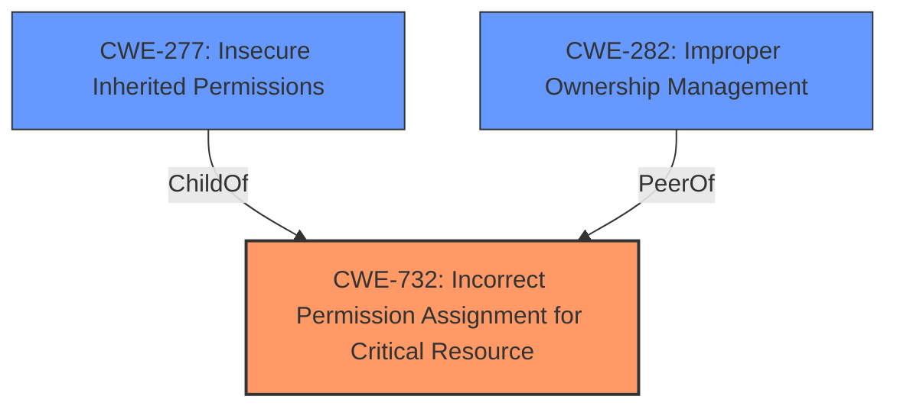

# Raw Analyzer Response for CVE-2021-1784

# Summary
| CWE ID | CWE Name | Confidence | CWE Abstraction Level | CWE Vulnerability Mapping Label | CWE-Vulnerability Mapping Notes |
|---|---|---|---|---|---|
| CWE-732 | Incorrect Permission Assignment for Critical Resource | 0.9 | Class | Allowed-with-Review | Primary CWE |
| CWE-277 | Insecure Inherited Permissions | 0.7 | Variant | Allowed | Secondary Candidate |
| CWE-282 | Improper Ownership Management | 0.6 | Class | Allowed-with-Review | Secondary Candidate |

## Evidence and Confidence

*   **Confidence Score:** 0.8
*   **Evidence Strength:** HIGH

## Relationship Analysis
The primary CWE selected is CWE-732, "Incorrect Permission Assignment for Critical Resource," which is a Class-level CWE. While it could be argued that more specific Base or Variant CWEs might be more appropriate, the vulnerability description explicitly mentions a "**permissions issue**," making CWE-732 a strong candidate.

CWE-277 "Insecure Inherited Permissions" is a child of CWE-732 and represents a more specific scenario, this is included as a secondary candidate.

CWE-282 "Improper Ownership Management" is related to permission issues and is a peer of CWE-732, providing an alternative perspective.

## Vulnerability Chain
The chain of events in this vulnerability is as follows:
1.  **Root Cause:** A **permissions issue** in DiskArbitration (CWE-732).
2.  **Impact:** A malicious application can modify protected parts of the file system.

## Summary of Analysis
The initial analysis focused on identifying the root cause of the vulnerability based on the provided description. The description clearly states a "**permissions issue**" in DiskArbitration. The CVE Reference Links Content Summary confirms this, stating: "A **permissions issue** existed in DiskArbitration."

The Retriever Results highlight CWE-732 as a strong candidate due to its description aligning with the "**permissions issue**." The phrase, "The product specifies permissions for a security-critical resource in a way that allows that resource to be read or modified by unintended actors," directly reflects the vulnerability.

While CWE-732 is a Class-level CWE, the evidence does not strongly support a more specific Base or Variant CWE. The mapping guidance for CWE-732 suggests it is often misused for authorization weaknesses; however, the description here genuinely indicates a **permission issue**.

CWE-277, "Insecure Inherited Permissions," is considered as a secondary candidate because it is a child of CWE-732 and offers a more specific interpretation. However, the provided information does not confirm that the permissions were inherited.

CWE-282, "Improper Ownership Management" is considered as a secondary candidate because it is related to permissions and could be a contributing factor.

Therefore, based on the evidence, CWE-732 is the most appropriate primary CWE, capturing the essence of the "**permissions issue**" that allows a malicious application to modify protected parts of the file system.

Relevant CWE Information:
-   **CWE-732: Incorrect Permission Assignment for Critical Resource**
    -   **Technical Explanation:** The vulnerability involves incorrect assignment of permissions, allowing unauthorized modification of the file system.
    -   **Security Implications:** This leads to potential privilege escalation and compromise of system integrity.
    -   **Relationship:** The vulnerability directly relates to incorrect permission settings.
    -   **Mapping Guidance:** The name and description closely align with the provided vulnerability details, making it a suitable mapping.
-   **CWE-277: Insecure Inherited Permissions**
    -   **Technical Explanation:** The vulnerability could be because of insecure inherited permissions, allowing unauthorized modification of the file system.
    -   **Security Implications:** This leads to potential privilege escalation and compromise of system integrity.
    -   **Relationship:** Child of CWE-732, represents a specific type of permission issue.
    -   **Mapping Guidance:** Considered due to the potential for inherited permissions to be the root cause, although not explicitly stated.
-   **CWE-282: Improper Ownership Management**
    -   **Technical Explanation:** The vulnerability could stem from incorrect management of object or resource ownership, enabling unauthorized access.
    -   **Security Implications:** Could lead to unauthorized data modification or privilege escalation.
    -   **Relationship:** Related to permission issues, an alternative perspective.
    -   **Mapping Guidance:** Considered because ownership issues often contribute to permission-related vulnerabilities.

CWEs Considered but Not Used:
-   CWE-415 (Double Free), CWE-667 (Improper Locking): These CWEs were considered because they appeared in the Retriever Results, but they do not align with the "**permissions issue**" described in the vulnerability.
-   CWE-123 (Write-what-where Condition): This CWE was considered, but it represents a lower-level consequence rather than the root cause of the "**permissions issue**."
-   CWE-284 (Improper Access Control): While related to permissions, it focuses on access control mechanisms rather than the specific assignment of permissions, making CWE-732 a better fit.