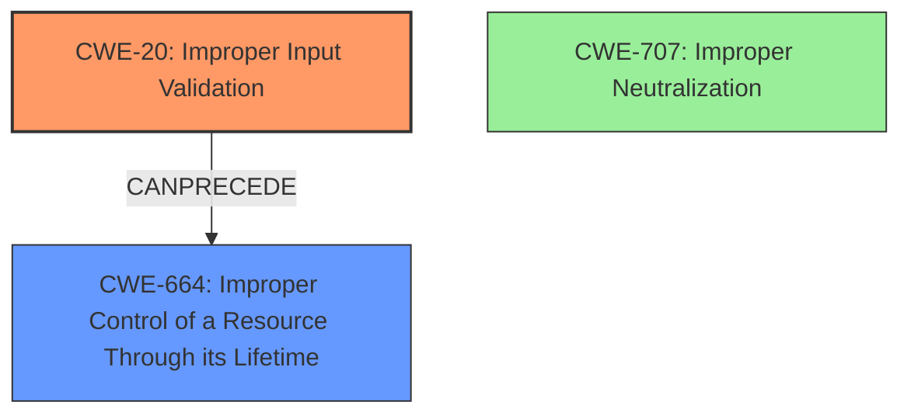

# Raw Analyzer Response for CVE-2021-1813

# Summary
| CWE ID | CWE Name | Confidence | CWE Abstraction Level | CWE Vulnerability Mapping Label | CWE-Vulnerability Mapping Notes |
|---|---|---|---|---|---|
| CWE-20 ([CWE-20: Improper Input Validation](https://cwe.mitre.org/data/definitions/20.html)) | Improper Input Validation | 0.7 | Class | Allowed | The vulnerability description explicitly mentions a **validation issue**, and the CVE summary confirms this. Although CWE-20 is discouraged, more specific validation CWEs are not evident. |
| CWE-664 ([CWE-664: Improper Control of a Resource Through its Lifetime](https://cwe.mitre.org/data/definitions/664.html)) | Improper Control of a Resource Through its Lifetime | 0.4 | Pillar | Discouraged | A malicious application may be able to gain root privileges. The validation issue may lead to improper resource control. |

## Evidence and Confidence

*   **Confidence Score:** 0.7
*   **Evidence Strength:** MEDIUM

## Relationship Analysis
The primary relationship influencing the CWE selection is the ChildOf relationship between CWE-707 (Improper Neutralization) and CWE-20 (Improper Input Validation). However, CWE-20 is selected because the description focuses on the initial validation failure rather than a specific neutralization technique. The graph also shows that CWE-20 can precede other weaknesses, indicating it could be a root cause leading to further exploitation, so CWE-664 is added as a secondary CWE.

## Vulnerability Chain
The vulnerability chain begins with a **validation issue** (CWE-20), which allows a malicious application to gain root privileges. The chain is:

1.  **Improper Input Validation (CWE-20)**: The application **fails to properly validate input**.
2.  **Improper Control of a Resource Through its Lifetime (CWE-664)**: The failed validation leads to **improper control of resources**.
3.  **Gain root privileges**: As an impact, the root privileges are gained.

## Summary of Analysis
The initial analysis focused on the **validation issue** and its resulting impact. The primary evidence supporting CWE-20 is the phrase "**validation issue** was addressed with improved logic" from the vulnerability description. The CVE summary also explicitly states "Validation issue" as the root cause and "Improper input validation" as a weakness. The relationship graph and retriever results were considered, but the direct evidence from the vulnerability description was the most influential factor. The choice of CWE-20, despite being discouraged, is based on the available evidence. The description doesn't provide enough detail to pinpoint a more specific input validation flaw. Therefore, CWE-20 is the most appropriate choice. The lack of detail also means that CWE-664 has a lower confidence.

Relevant CWE Information: