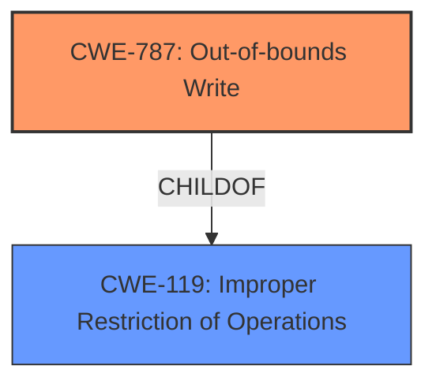

# Analysis for CVE-2021-1840

# Summary
| CWE ID  | CWE Name                      | Confidence | CWE Abstraction Level | CWE Vulnerability Mapping Label | CWE-Vulnerability Mapping Notes |
|---------|-------------------------------|------------|-----------------------|---------------------------------|---------------------------------|
| CWE-787 | Out-of-bounds Write         | 0.9        | Base                  | Allowed                        | Primary CWE                     |

## Evidence and Confidence

*   **Confidence Score:** 0.9
*   **Evidence Strength:** HIGH

## Relationship Analysis
The primary identified CWE is CWE-787 (**CWE-787: Out-of-bounds Write**). This is a base-level CWE. CWE-787 is a child of CWE-119 (**CWE-119: Improper Restriction of Operations within the Bounds of a Memory Buffer**), indicating that out-of-bounds writes are a specific type of memory buffer issue. The retriever results and the vulnerability description both point to memory corruption, making CWE-787 a strong candidate.

## Vulnerability Chain
The vulnerability chain starts with a **memory corruption** issue. The improved validation addresses the root cause, preventing a local attacker from elevating privileges. The vulnerability chain is: **Memory Corruption** (CWE-787) -> Privilege Elevation (Impact).

## Summary of Analysis
The initial assessment, based on the provided evidence, points strongly towards a **memory corruption** issue that leads to privilege elevation. The key phrase from the vulnerability description is "**memory corruption** issue was addressed with improved validation." The CVE Reference Links Content Summary confirms that the root cause is "**A memory corruption** issue" and the impact is "A local attacker may be able to elevate their privileges."

The retriever results list CWE-787 (**CWE-787: Out-of-bounds Write**) as the top candidate, which aligns well with the description of **memory corruption**. The description for CWE-787 states, "The product writes data past the end, or before the beginning, of the intended buffer." The alternative term for CWE-787 is "Memory Corruption", which aligns perfectly with the vulnerability description.

CWE-843 (**CWE-843: Access of Resource Using Incompatible Type ('Type Confusion')**), CWE-415 (**CWE-415: Double Free**) and CWE-123 (**CWE-123: Write-what-where Condition**) were considered but ultimately deemed less suitable. While they relate to memory corruption, the provided information does not specifically indicate type confusion, double freeing, or arbitrary write capabilities. The description only mentions a general **memory corruption** issue. Therefore, CWE-787 is the most accurate and specific representation of the vulnerability based on the available evidence.

The selection of CWE-787 is at the optimal level of specificity because it directly addresses the **memory corruption** issue identified in the vulnerability description.