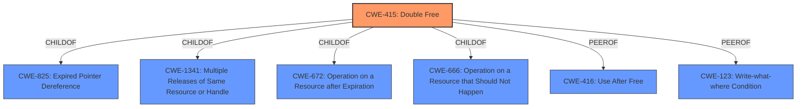

# Enhanced Analysis for CVE-2021-1875

# Summary

| CWE ID  | CWE Name                                                        | Confidence | CWE Abstraction Level | CWE Vulnerability Mapping Label | CWE-Vulnerability Mapping Notes |
| :-------- | :-------------------------------------------------------------- | :--------- | :---------------------- | :------------------------------ | :-------------------------------- |
| CWE-415 | Double Free                                                     | 1.0        | Variant               | Allowed                       | Primary CWE                       |

## Evidence and Confidence

*   **Confidence Score:** 1.0
*   **Evidence Strength:** HIGH

## Relationship Analysis

The primary relationship influencing the decision is that CWE-415 is a Variant of CWE-825 (Expired Pointer Dereference) and CWE-1341 (Multiple Releases of Same Resource or Handle). While other CWEs like CWE-416 (Use After Free) are related, the vulnerability description explicitly mentions "**double free**", making CWE-415 the most accurate and specific choice. It is important to distinguish double-free from use-after-free as they are distinct operations within vulnerability theory.



## Vulnerability Chain

The vulnerability chain starts with a maliciously crafted file leading to a **double free** condition and culminating in heap corruption.

Maliciously Crafted File --> **Double Free** (CWE-415) --> Heap Corruption

## Summary of Analysis

The initial analysis strongly pointed towards CWE-415 due to the explicit mention of "**double free**" in the vulnerability description and CVE Reference Links Content Summary. The retriever results also listed CWE-415 as the top combined result. The final decision was based on the precise match between the vulnerability and the CWE description, along with the allowed usage based on MITRE's mapping guidance.

The evidence from the vulnerability description is: "A **double free** issue was addressed with improved memory management." And from the CVE Reference Links Content Summary: "root_cause": "A double free issue".

CWE-415 is at the optimal level of specificity (Variant) as it accurately describes the vulnerability.

Relevant CWE Information:
- **CWE-415: Double Free:** The product calls free() twice on the same memory address, potentially leading to modification of unexpected memory locations.

Other CWEs Considered and Not Used:

- **CWE-416 (Use After Free):** While related, this is distinct from a double free. A double free involves freeing the same memory twice, whereas use-after-free involves using memory after it has been freed.
- **CWE-123 (Write-what-where Condition):** This is a potential consequence of memory corruption but not the root cause in this specific case.
- **CWE-787 (Out-of-bounds Write):** While heap corruption *could* involve an out-of-bounds write, the **double free** is the root cause.
- **CWE-843 (Access of Resource Using Incompatible Type ('Type Confusion'))**: While type confusion can lead to memory corruption, the vulnerability description explicitly mentions a double free issue, making CWE-415 a more precise fit.
- **CWE-665 (Improper Initialization):** This is not directly related to the **double free** issue described.
- **CWE-667 (Improper Locking):** This is not directly related to the **double free** issue described.
- **CWE-282 (Improper Ownership Management):** This is not directly related to the **double free** issue described.
- **CWE-20 (Improper Input Validation):** While a maliciously crafted file is mentioned, the core issue is the **double free**, not the input validation itself.
- **CWE-1263 (Improper Physical Access Control):** This is clearly not relevant to the software vulnerability described.


## CWE Relationship Analysis

Current CWEs represent these abstraction levels: .


### Vulnerability Chain Analysis

**Chain starting from CWE-667:**
- 667 (Improper Locking) - ROOT


**Chain starting from CWE-415:**
- 415 (Double Free) - ROOT


### CWE Relationship Diagram

```mermaid
graph TD
    classDef primary fill:#f96,stroke:#333,stroke-width:2px
    classDef secondary fill:#69f,stroke:#333
    classDef tertiary fill:#9e9,stroke:#333
```