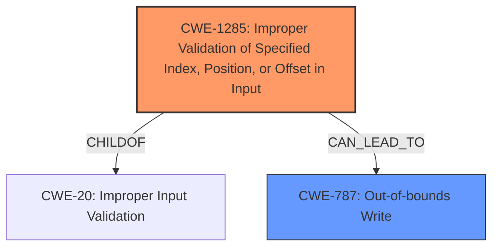

# Raw Analyzer Response for CVE-2021-1890

# Summary
| CWE ID  | CWE Name                                                                | Confidence | CWE Abstraction Level | CWE Vulnerability Mapping Label | CWE-Vulnerability Mapping Notes |
| ------- | ----------------------------------------------------------------------- | ---------- | --------------------- | ------------------------------- | ------------------------------- |
| CWE-1285 | Improper Validation of Specified Index, Position, or Offset in Input | 0.8        | Base                  | Allowed                         | Primary CWE                   |
| CWE-787 | Out-of-bounds Write                                                     | 0.7        | Base                  | Allowed                         | Secondary Candidate             |

## Evidence and Confidence

*   **Confidence Score:** 0.75
*   **Evidence Strength:** MEDIUM

## Relationship Analysis
The primary CWE, CWE-1285, represents the **improper validation** aspect, which is the root cause. CWE-787 represents the potential impact of the **improper validation** leading to an out-of-bounds write and memory corruption. The relationship between CWE-1285 and CWE-787 is not directly defined in the provided relationships, but the failure to validate an input can lead to out-of-bounds writes. CWE-1285 is a child of CWE-20 (Improper Input Validation), which is a broad category.

## Vulnerability Chain
The chain of events starts with the **improper length check of the public exponent** (CWE-1285), which leads to memory corruption (CWE-787).

## Summary of Analysis
The analysis is based on the provided vulnerability description, which indicates an **improper length check** as the root cause, resulting in memory corruption.

The vulnerability description states: "**Improper length check of public exponent** in RSA import key function could cause memory corruption."

CWE-1285 (Improper Validation of Specified Index, Position, or Offset in Input) is the primary candidate because it directly addresses the **improper validation** aspect. The description for CWE-1285 states: "The product receives input that is expected to specify an index, position, or offset into an indexable resource such as a buffer or file, but it does not validate or incorrectly validates that the specified index/position/offset has the required properties." This aligns with the **improper length check of public exponent**.

CWE-787 (Out-of-bounds Write) is a secondary candidate as it describes the impact (memory corruption).

The selection is based on identifying the root cause (improper validation) and then considering the impact (memory corruption). The evidence supports CWE-1285 as the primary weakness due to the direct reference to **improper length check**. The abstraction level of Base is appropriate as it represents the specific weakness.

Other CWEs Considered:

*   CWE-126 (Buffer Over-read): While memory corruption is a potential impact, the root cause is the **improper length check**, not necessarily a read beyond the buffer.
*   CWE-822 (Untrusted Pointer Dereference) and CWE-823 (Use of Out-of-range Pointer Offset): These are related to pointer issues, which are not explicitly mentioned in the vulnerability description.
*   CWE-415 (Double Free): This is a memory management issue not directly related to the **improper length check**.
*   CWE-367 (Time-of-check Time-of-use (TOCTOU) Race Condition): This is related to race conditions, which are not indicated in the description.
*   CWE-781 (Improper Address Validation in IOCTL with METHOD_NEITHER I/O Control Code): This is specific to IOCTL, which is not mentioned in the description.
*   CWE-124 (Buffer Underwrite ('Buffer Underflow')): This is not the primary impact.

---
# Summary
| CWE ID  | CWE Name                                                                | Confidence | CWE Abstraction Level | CWE Vulnerability Mapping Label | CWE-Vulnerability Mapping Notes |
| ------- | ----------------------------------------------------------------------- | ---------- | --------------------- | ------------------------------- | ------------------------------- |
| CWE-1285 | Improper Validation of Specified Index, Position, or Offset in Input | 0.8        | Base                  | Allowed                         | Primary CWE                   |
| CWE-787 | Out-of-bounds Write                                                     | 0.7        | Base                  | Allowed                         | Secondary Candidate             |

## Evidence and Confidence

*   **Confidence Score:** 0.75
*   **Evidence Strength:** MEDIUM

## Relationship Analysis
The primary CWE, CWE-1285, represents the **improper validation** aspect, which is the root cause. CWE-787 represents the potential impact of the **improper validation** leading to an out-of-bounds write and memory corruption. The relationship between CWE-1285 and CWE-787 is not directly defined in the provided relationships, but the failure to validate an input can lead to out-of-bounds writes. CWE-1285 is a child of CWE-20 (Improper Input Validation), which is a broad category.

## Vulnerability Chain
The chain of events starts with the **improper length check of the public exponent** (CWE-1285), which leads to memory corruption (CWE-787).

## Summary of Analysis
The analysis is based on the provided vulnerability description, which indicates an **improper length check** as the root cause, resulting in memory corruption.

The vulnerability description states: "**Improper length check of public exponent** in RSA import key function could cause memory corruption."

CWE-1285 (Improper Validation of Specified Index, Position, or Offset in Input) is the primary candidate because it directly addresses the **improper validation** aspect. The description for CWE-1285 states: "The product receives input that is expected to specify an index, position, or offset into an indexable resource such as a buffer or file, but it does not validate or incorrectly validates that the specified index/position/offset has the required properties." This aligns with the **improper length check of public exponent**.

CWE-787 (Out-of-bounds Write) is a secondary candidate as it describes the impact (memory corruption).

The selection is based on identifying the root cause (improper validation) and then considering the impact (memory corruption). The evidence supports CWE-1285 as the primary weakness due to the direct reference to **improper length check**. The abstraction level of Base is appropriate as it represents the specific weakness.

Other CWEs Considered:

*   CWE-126 (Buffer Over-read): While memory corruption is a potential impact, the root cause is the **improper length check**, not necessarily a read beyond the buffer.
*   CWE-822 (Untrusted Pointer Dereference) and CWE-823 (Use of Out-of-range Pointer Offset): These are related to pointer issues, which are not explicitly mentioned in the vulnerability description.
*   CWE-415 (Double Free): This is a memory management issue not directly related to the **improper length check**.
*   CWE-367 (Time-of-check Time-of-use (TOCTOU) Race Condition): This is related to race conditions, which are not indicated in the description.
*   CWE-781 (Improper Address Validation in IOCTL with METHOD_NEITHER I/O Control Code): This is specific to IOCTL, which is not mentioned in the description.
*   CWE-124 (Buffer Underwrite ('Buffer Underflow')): This is not the primary impact.