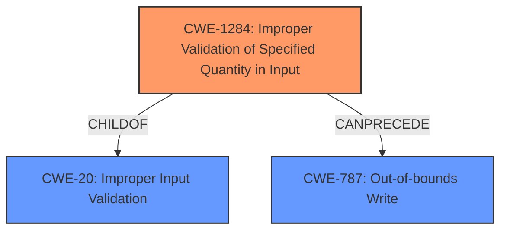

# Analysis for CVE-2021-1892

# Summary
| CWE ID    | CWE Name                                                     | Confidence | CWE Abstraction Level | CWE Vulnerability Mapping Label | CWE-Vulnerability Mapping Notes |
| :-------- | :----------------------------------------------------------- | :--------- | :-------------------- | :------------------------------ | :------------------------------ |
| CWE-1284  | Improper Validation of Specified Quantity in Input          | 0.85       | Base                  | Primary                         | Allowed                       |
| CWE-20    | Improper Input Validation                                    | 0.6        | Class                 | Secondary                       | Discouraged                    |
| CWE-787 | Out-of-bounds Write | 0.5 | Base | Secondary | Allowed |

## Evidence and Confidence

*   **Confidence Score:** 0.8
*   **Evidence Strength:** MEDIUM

## Relationship Analysis

The primary CWE is CWE-1284 (Improper Validation of Specified Quantity in Input), which is a child of CWE-20 (Improper Input Validation). CWE-1284 can precede CWE-789 (Excessive Memory Allocation), indicating a potential chain. The relationships indicate that improper validation can lead to further weaknesses such as memory corruption.

## Vulnerability Chain

The vulnerability chain starts with **improper input validation** (CWE-1284), which leads to memory corruption (potentially CWE-787). The **improper input validation** is the root cause, and the memory corruption is the impact.

## Summary of Analysis

The initial analysis focused on identifying the root cause and impact of the vulnerability. The vulnerability description indicates **improper input validation** leading to memory corruption.

Based on the provided evidence, the primary CWE is CWE-1284 (Improper Validation of Specified Quantity in Input). This aligns with the description of **improper input validation** during IO control processing. The retriever results also listed CWE-1284 as a candidate.

CWE-20 (Improper Input Validation) was considered but is a class-level CWE and is discouraged when more specific CWEs are available. Since CWE-1284 provides more specific information about the type of input that is not being properly validated (a quantity), it is the more appropriate choice.

CWE-787 (Out-of-bounds Write) was considered as a potential impact of the **improper input validation**. While the vulnerability description mentions "memory corruption," it does not explicitly state that the corruption is due to an out-of-bounds write. However, given that **improper input validation** can lead to writing to arbitrary memory locations, CWE-787 is included as a secondary candidate.

The final selection is based on the evidence available, the relationships between CWEs, and the mapping guidance. CWE-1284 is at the optimal level of specificity, representing the root cause of the vulnerability.

Relevant CWE Information:

# Enhanced Context (25 CWEs)

## CWE-415: Double Free
**Abstraction Level**: Variant
**Similarity Score**: 0.78
**Source**: dense

**Description**:
The product calls free() twice on the same memory address, potentially leading to modification of unexpected memory locations.

**Mapping Guidance**:
- Usage: Allowed
- Rationale: This CWE entry is at the Variant level of abstraction, which is a preferred level of abstraction for mapping to the root causes of vulnerabilities.

*This CWE was not selected because there is no evidence of double free in the vulnerability description.*

## CWE-226: Sensitive Information in Resource Not Removed Before Reuse
**Abstraction Level**: Base
**Similarity Score**: 0.76
**Source**: dense

**Description**:
The product releases a resource such as memory or a file so that it can be made available for reuse, but it does not clear or "zeroize" the information contained in the resource before the product performs a critical state transition or makes the resource available for reuse by other entities.

**Mapping Guidance**:
- Usage: Allowed
- Rationale: This CWE entry is at the Base level of abstraction, which is a preferred level of abstraction for mapping to the root causes of vulnerabilities.

*This CWE was not selected because there is no evidence in the description*

## CWE-404: Improper Resource Shutdown or Release
**Abstraction Level**: Class
**Similarity Score**: 0.75
**Source**: dense

**Description**:
The product does not release or incorrectly releases a resource before it is made available for re-use.

**Mapping Guidance**:
- Usage: Allowed-with-Review
- Rationale: This CWE entry is a Class and might have Base-level children that would be more appropriate

*This CWE was not selected because there is no evidence in the description*

## CWE-667: Improper Locking
**Abstraction Level**: Class
**Similarity Score**: 0.75
**Source**: dense

**Description**:
The product does not properly acquire or release a lock on a resource, leading to unexpected resource state changes and behaviors.

**Mapping Guidance**:
- Usage: Allowed-with-Review
- Rationale: This CWE entry is a Class and might have Base-level children that would be more appropriate

*This CWE was not selected because there is no evidence in the description*

## CWE-1289: Improper Validation of Unsafe Equivalence in Input
**Abstraction Level**: Base
**Similarity Score**: 0.75
**Source**: dense

**Description**:
The product receives an input value that is used as a resource identifier or other type of reference, but it does not validate or incorrectly validates that the input is equivalent to a potentially-unsafe value.

**Mapping Guidance**:
- Usage: Allowed
- Rationale: This CWE entry is at the Base level of abstraction, which is a preferred level of abstraction for mapping to the root causes of vulnerabilities.

*This CWE was not selected because there is no evidence in the description*

## CWE-252: Unchecked Return Value
**Abstraction Level**: Base
**Similarity Score**: 0.74
**Source**: dense

**Description**:
The product does not check the return value from a method or function, which can prevent it from detecting unexpected states and conditions.

**Mapping Guidance**:
- Usage: Allowed
- Rationale: This CWE entry is at the Base level of abstraction, which is a preferred level of abstraction for mapping to the root causes of vulnerabilities.

*This CWE was not selected because there is no evidence in the description*

## CWE-822: Untrusted Pointer Dereference
**Abstraction Level**: Base
**Similarity Score**: 0.74
**Source**: dense

**Description**:
The product obtains a value from an untrusted source, converts this value to a pointer, and dereferences the resulting pointer.

**Mapping Guidance**:
- Usage: Allowed
- Rationale: This CWE entry is at the Base level of abstraction, which is a preferred level of abstraction for mapping to the root causes of vulnerabilities.

*This CWE was not selected because there is no evidence in the description*

## CWE-131: Incorrect Calculation of Buffer Size
**Abstraction Level**: Base
**Similarity Score**: 0.74
**Source**: dense

**Description**:
The product does not correctly calculate the size to be used when allocating a buffer, which could lead to a buffer overflow.

**Mapping Guidance**:
- Usage: Allowed
- Rationale: This CWE entry is at the Base level of abstraction, which is a preferred level of abstraction for mapping to the root causes of vulnerabilities.

*This CWE was not selected because there is no evidence in the description*

## CWE-476: NULL Pointer Dereference
**Abstraction Level**: Base
**Similarity Score**: 0.74
**Source**: dense

**Description**:
The product dereferences a pointer that it expects to be valid but is NULL.

**Mapping Guidance**:
- Usage: Allowed
- Rationale: This CWE entry is at the Base level of abstraction, which is a preferred level of abstraction for mapping to the root causes of vulnerabilities.

*This CWE was not selected because there is no evidence in the description*

## CWE-763: Release of Invalid Pointer or Reference
**Abstraction Level**: Base
**Similarity Score**: 0.73
**Source**: dense

**Description**:
The product attempts to return a memory resource to the system, but it calls the wrong release function or calls the appropriate release function incorrectly.

**Mapping Guidance**:
- Usage: Allowed
- Rationale: This CWE entry is at the Base level of abstraction, which is a preferred level of abstraction for mapping to the root causes of vulnerabilities.

*This CWE was not selected because there is no evidence