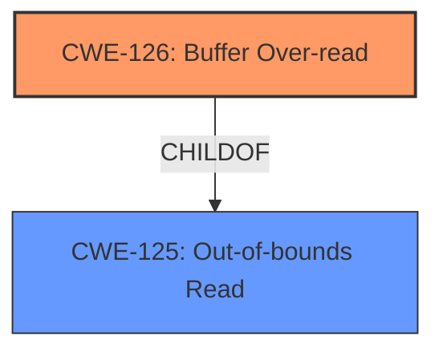

# Raw Analyzer Response for CVE-2021-1898

# Summary
| CWE ID | CWE Name | Confidence | CWE Abstraction Level | CWE Vulnerability Mapping Label | CWE-Vulnerability Mapping Notes |
|---|---|---|---|---|---|
| CWE-126 | Buffer Over-read | 0.9 | Variant | Allowed | Primary CWE |

## Evidence and Confidence

*   **Confidence Score:** 0.9
*   **Evidence Strength:** HIGH

## Relationship Analysis
The primary relationship that influenced the decision was the ChildOf relationship between CWE-126 and CWE-125, which indicates that CWE-126 is a specific type of out-of-bounds read. The retriever results also suggested several other CWEs related to buffer access and pointer manipulation, but these were deemed less relevant as they did not directly align with the "over-read" impact described in the vulnerability.

## Vulnerability Chain
The vulnerability chain starts with an **incorrect overflow check**, leading to a **buffer over-read**. The provided information does not elaborate on what follows after the buffer over-read occurs.

## Summary of Analysis
The initial analysis focused on identifying the most accurate CWE based on the vulnerability description, which explicitly mentions "buffer over-read." The selection of CWE-126 is primarily based on this direct evidence from the "**impact:** buffer over-read" key phrase. The "Retriever Results" also listed CWE-126 as the top combined result.

The relationship analysis reinforces this choice, as CWE-126 is a variant of CWE-125 (Out-of-bounds Read), indicating a more specific type of out-of-bounds access.

The selected CWE is at the Variant level, which is a preferred level of specificity according to MITRE's mapping guidance.

Relevant CWE Information:

# Enhanced Context (25 CWEs)

## CWE-131: Incorrect Calculation of Buffer Size
**Abstraction Level**: Base
**Similarity Score**: 0.81
**Source**: dense

**Description**:
The product does not correctly calculate the size to be used when allocating a buffer, which could lead to a buffer overflow.

**Mapping Guidance**:
- Usage: Allowed
- Rationale: This CWE entry is at the Base level of abstraction, which is a preferred level of abstraction for mapping to the root causes of vulnerabilities.

**Why Not Used**: While an incorrect calculation of buffer size can lead to buffer overflows, the vulnerability description mentions a "buffer over-read" due to an "incorrect overflow check," not a buffer overflow directly related to size calculation.

## CWE-1285: Improper Validation of Specified Index, Position, or Offset in Input
**Abstraction Level**: Base
**Similarity Score**: 0.79
**Source**: dense

**Description**:
The product receives input that is expected to specify an index, position, or offset into an indexable resource such as a buffer or file, but it does not validate or incorrectly validates that the specified index/position/offset has the required properties.

**Mapping Guidance**:
- Usage: Allowed
- Rationale: This CWE entry is at the Base level of abstraction, which is a preferred level of abstraction for mapping to the root causes of vulnerabilities.

**Why Not Used**: This CWE focuses on improper validation of input related to indices, positions, or offsets. The vulnerability description doesn't explicitly mention input validation failures related to indexes or positions. It does mention **incorrect overflow check**, which is related, but not a direct validation issue.

## CWE-822: Untrusted Pointer Dereference
**Abstraction Level**: Base
**Similarity Score**: 0.78
**Source**: dense

**Description**:
The product obtains a value from an untrusted source, converts this value to a pointer, and dereferences the resulting pointer.

**Mapping Guidance**:
- Usage: Allowed
- Rationale: This CWE entry is at the Base level of abstraction, which is a preferred level of abstraction for mapping to the root causes of vulnerabilities.

**Why Not Used**: This CWE deals with untrusted pointer dereferences, which is not mentioned in the vulnerability description. The vulnerability is about a buffer over-read, not about the use of untrusted pointers.

## CWE-129: Improper Validation of Array Index
**Abstraction Level**: Variant
**Similarity Score**: 0.78
**Source**: dense

**Description**:
The product uses untrusted input when calculating or using an array index, but the product does not validate or incorrectly validates the index to ensure the index references a valid position within the array.

**Mapping Guidance**:
- Usage: Allowed
- Rationale: This CWE entry is at the Variant level of abstraction, which is a preferred level of abstraction for mapping to the root causes of vulnerabilities.

**Why Not Used**: Similar to CWE-1285, this focuses on array index validation, which is not directly indicated in the provided description.

## CWE-824: Access of Uninitialized Pointer
**Abstraction Level**: Base
**Similarity Score**: 0.78
**Source**: dense

**Description**:
The product accesses or uses a pointer that has not been initialized.

**Mapping Guidance**:
- Usage: Allowed
- Rationale: This CWE entry is at the Base level of abstraction, which is a preferred level of abstraction for mapping to the root causes of vulnerabilities.

**Why Not Used**: This CWE deals with uninitialized pointers, which is not mentioned in the vulnerability description.

## CWE-667: Improper Locking
**Abstraction Level**: Class
**Similarity Score**: 0.78
**Source**: dense

**Description**:
The product does not properly acquire or release a lock on a resource, leading to unexpected resource state changes and behaviors.

**Mapping Guidance**:
- Usage: Allowed-with-Review
- Rationale: This CWE entry is a Class and might have Base-level children that would be more appropriate

**Why Not Used**: This CWE is related to improper locking, which is not relevant to the vulnerability description.

## CWE-119: Improper Restriction of Operations within the Bounds of a Memory Buffer
**Abstraction Level**: Class
**Similarity Score**: 0.78
**Source**: dense

**Description**:
The product performs operations on a memory buffer, but it reads from or writes to a memory location outside the buffer's intended boundary. This may result in read or write operations on unexpected memory locations that could be linked to other variables, data structures, or internal program data.

**Mapping Guidance**:
- Usage: Discouraged
- Rationale: CWE-119 is commonly misused in low-information vulnerability reports when lower-level CWEs could be used instead, or when more details about the vulnerability are available.

**Why Not Used**: While this CWE is broadly related to out-of-bounds access, the description is specific about a buffer *over-read*, making CWE-126 a more precise fit. The mapping guidance also discourages its usage when lower-level CWEs are available.

## CWE-191: Integer Underflow (Wrap or Wraparound)
**Abstraction Level**: Base
**Similarity Score**: 0.77
**Source**: dense

**Description**:
The product subtracts one value from another, such that the result is less than the minimum allowable integer value, which produces a value that is not equal to the correct result.

**Mapping Guidance**:
- Usage: Allowed
- Rationale: This CWE entry is at the Base level of abstraction, which is a preferred level of abstraction for mapping to the root causes of vulnerabilities.

**Why Not Used**: This CWE focuses on integer underflow, which is not mentioned or implied in the vulnerability description.

## CWE-754: Improper Check for Unusual or Exceptional Conditions
**Abstraction Level**: Class
**Similarity Score**: 0.77
**Source**: dense

**Description**:
The product does not check or incorrectly checks for unusual or exceptional conditions that are not expected to occur frequently during day to day operation of the product.

**Mapping Guidance**:
- Usage: Allowed-with-Review
- Rationale: This CWE entry is a Class and might have Base-level children that would be more appropriate

**Why Not Used**: The description mentions **incorrect overflow check**, which means a check was done, but it was not done correctly. This is not the same as an improper check for unusual or exceptional conditions.

## CWE-755: Improper Handling of Exceptional Conditions
**Abstraction Level**: Class
**Similarity Score**: 0.77
**Source**: dense

**Description**:
The product does not handle or incorrectly handles an exceptional condition.

**Mapping Guidance**:
- Usage: Discouraged
- Rationale: This CWE entry is a level-1 Class (i.e., a child of a Pillar). It might have lower-level children that would be more appropriate

**Why Not Used**: While related to error handling, this is too general. The vulnerability description is specific about a buffer over-read.

## CWE-823: Use of Out-