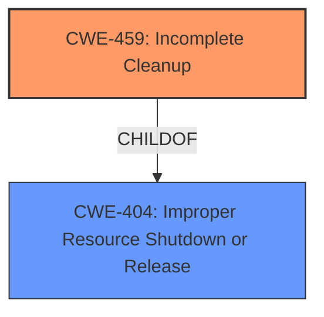

# Analysis for CVE-2021-1950

# Summary
| CWE ID | CWE Name | Confidence | CWE Abstraction Level | CWE Vulnerability Mapping Label | CWE-Vulnerability Mapping Notes |
|---|---|---|---|---|---|
| CWE-459 | Incomplete Cleanup | 0.9 | Base | Primary | Allowed |

## Evidence and Confidence

*   **Confidence Score:** 0.9
*   **Evidence Strength:** HIGH

## Relationship Analysis
The primary relationship considered was the ChildOf relationship between CWE-459 and CWE-404, where CWE-459 is a specific type of improper resource shutdown. The Base abstraction level of CWE-459 was preferred due to its specificity.

## Vulnerability Chain
The chain starts with **improper secure memory cleaning** (CWE-459), leading to a face authentication bypass.

## Summary of Analysis
The initial analysis focused on the **rootcause**, which is **improper secure memory cleaning**. The Retriever Results listed CWE-459, Incomplete Cleanup, as a candidate.

The vulnerability description states "Improper cleaning of secure memory between authenticated users can lead to face authentication bypass". This directly aligns with the definition of CWE-459, which states "The product does not properly 'clean up' and remove temporary or supporting resources after they have been used."

The evidence is strong as the description explicitly mentions **improper secure memory cleaning**, which matches the core concept of CWE-459. Therefore, CWE-459 is the most appropriate mapping.

Relevant CWE Information:

# Enhanced Context (25 CWEs)

## CWE-459: Incomplete Cleanup
**Abstraction Level**: Base
**Similarity Score**: 0.80
**Source**: dense

**Description**:
The product does not properly "clean up" and remove temporary or supporting resources after they have been used.

**Mapping Guidance**:
- Usage: Allowed
- Rationale: This CWE entry is at the Base level of abstraction, which is a preferred level of abstraction for mapping to the root causes of vulnerabilities.

### Justification for selecting CWE-459:
CWE-459 directly addresses the **rootcause** of the vulnerability, which is **improper secure memory cleaning**. The vulnerability description aligns perfectly with CWE-459's description: "The product does not properly 'clean up' and remove temporary or supporting resources after they have been used." The Base level of abstraction is appropriate for this weakness.

### Other CWEs Considered but Not Used:
*   CWE-126: Buffer Over-read - While a buffer over-read could potentially lead to information exposure, it's not the primary **rootcause** described in the vulnerability. The issue is specifically about cleaning up memory, not about reading beyond buffer boundaries.
*   CWE-367: Time-of-check Time-of-use (TOCTOU) Race Condition - This CWE relates to race conditions, which are not mentioned or implied in the vulnerability description.
*   CWE-1314: Missing Write Protection for Parametric Data Values - This CWE is related to hardware sensors, which are not relevant to this vulnerability description.
*   CWE-413: Improper Resource Locking - This CWE is about resource locking, not memory cleaning.
*   CWE-822: Untrusted Pointer Dereference - This CWE involves using untrusted input as a pointer, which is not described in the vulnerability.
*   CWE-1285: Improper Validation of Specified Index, Position, or Offset in Input - This CWE involves improper input validation of indices, which is not relevant to this vulnerability.
*   CWE-781: Improper Address Validation in IOCTL with METHOD_NEITHER I/O Control Code - This CWE is specific to IOCTLs, which are not mentioned in the vulnerability description.
*   CWE-287: Improper Authentication - While the impact is a face authentication bypass, the **rootcause** is memory cleaning, not authentication.
*   CWE-252: Unchecked Return Value - This CWE involves not checking return values, which is not relevant to the vulnerability description.