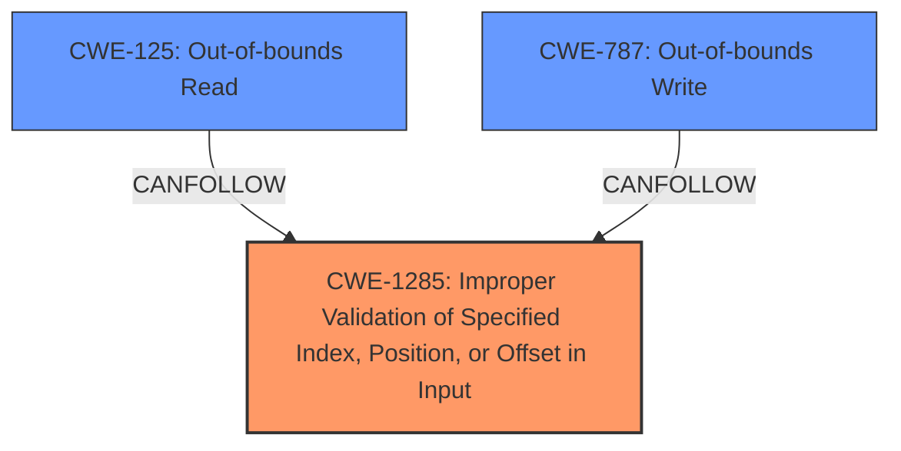

# Enhanced Analysis for CVE-2021-1968

# Summary
| CWE ID | CWE Name | Confidence | CWE Abstraction Level | CWE Vulnerability Mapping Label | CWE-Vulnerability Mapping Notes |
|---|---|---|---|---|---|
| CWE-1285 | Improper Validation of Specified Index, Position, or Offset in Input | 0.9 | Base | Primary | Allowed |
| CWE-125 | Out-of-bounds Read | 0.6 | Base | Secondary | Allowed |
| CWE-787 | Out-of-bounds Write | 0.6 | Base | Secondary | Allowed |

## Evidence and Confidence

*   **Confidence Score:** 0.8
*   **Evidence Strength:** HIGH

## Relationship Analysis
The primary CWE is CWE-1285, which focuses on the **improper validation of input** used as an index, position, or offset. This aligns with the **root cause** of the vulnerability where the kernel buffer address isn't properly validated. CWE-125 and CWE-787 are potential consequences if the **improper validation** leads to out-of-bounds access. These are child-parent relationships where CWE-1285 is a cause and CWE-125 and CWE-787 are possible effects.



## Vulnerability Chain
The vulnerability chain starts with **improper validation** (CWE-1285). This can lead to out-of-bounds read (CWE-125) if the invalid address is read from, which results in kernel memory information exposure to user space. Or, it could lead to out-of-bounds write (CWE-787) if the invalid address is written to.

## Summary of Analysis
The analysis indicates that the **root cause** of the vulnerability is the **improper validation of the kernel buffer address** when copying information to the user buffer. This is based on the "Vulnerability Description Key Phrases" section, which explicitly mentions **"Improper validation of kernel buffer address while copying information back to user buffer."** This directly supports the selection of CWE-1285 (Improper Validation of Specified Index, Position, or Offset in Input) as the primary CWE. The "CWE for similar CVE Descriptions" section also indicates CWE-20 (Improper Input Validation) as the primary match, which aligns with the chosen CWE.

The selection of CWE-1285 as the primary CWE is further supported by the "Retriever Results" section, which lists CWE-1285 as a candidate with a relatively high score. The MITRE mapping guidance for CWE-1285 allows its usage at the Base level of abstraction.

CWE-125 (Out-of-bounds Read) and CWE-787 (Out-of-bounds Write) are considered as secondary CWEs, as they represent potential consequences of the **improper validation**. If the **improperly validated** address is used for reading, it could lead to CWE-125; if it's used for writing, it could lead to CWE-787. These CWEs are at the Base level of abstraction, which is a preferred level.

Other CWEs considered, such as CWE-822 (Untrusted Pointer Dereference) and CWE-823 (Use of Out-of-range Pointer Offset), are related to pointer issues. However, the description focuses on the validation aspect rather than direct pointer manipulation, making CWE-1285 a more accurate primary classification.

The selected CWEs are at the optimal level of specificity because they accurately represent the **root cause** (**improper validation**) and potential consequences (out-of-bounds access) described in the vulnerability description.

Relevant CWE Information:
## CWE-1285: Improper Validation of Specified Index, Position, or Offset in Input
**Abstraction Level**: Base
**Similarity Score**: 0.80
**Source**: dense

**Description**:
The product receives input that is expected to specify an index, position, or offset into an indexable resource such as a buffer or file, but it does not validate or incorrectly validates that the specified index/position/offset has the required properties.

**Mapping Guidance**:
- Usage: Allowed
- Rationale: This CWE entry is at the Base level of abstraction, which is a preferred level of abstraction for mapping to the root causes of vulnerabilities.


## CWE Relationship Analysis

Current CWEs represent these abstraction levels: .


### Vulnerability Chain Analysis

**Chain starting from CWE-823:**
- 823 (Use of Out-of-range Pointer Offset) - ROOT


**Chain starting from CWE-787:**
- 787 (Out-of-bounds Write) - ROOT


### CWE Relationship Diagram

```mermaid
graph TD
    classDef primary fill:#f96,stroke:#333,stroke-width:2px
    classDef secondary fill:#69f,stroke:#333
    classDef tertiary fill:#9e9,stroke:#333
```