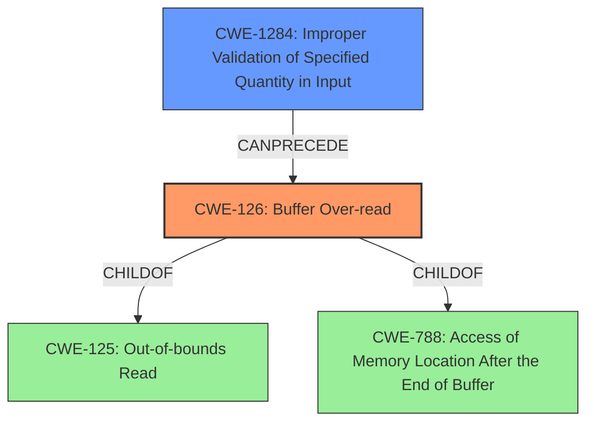

# Enhanced Analysis for CVE-2021-1977

# Summary
| CWE ID | CWE Name | Confidence | CWE Abstraction Level | CWE Vulnerability Mapping Label | CWE-Vulnerability Mapping Notes |
|---|---|---|---|---|---|
| CWE-126 | Buffer Over-read | 0.9 | Variant | Allowed | Primary CWE |
| CWE-1284 | Improper Validation of Specified Quantity in Input | 0.7 | Base | Allowed | Secondary Candidate |

## Evidence and Confidence

*   **Confidence Score:** 0.8
*   **Evidence Strength:** HIGH

## Relationship Analysis
The primary CWE, CWE-126 (Buffer Over-read), is a variant of CWE-125 (Out-of-bounds Read) and CWE-788 (Access of Memory Location After the End of Buffer). The vulnerability description indicates an **improper validation of frame length**, which can lead to a read beyond the buffer's boundaries. CWE-1284 (Improper Validation of Specified Quantity in Input) can precede a buffer over-read by failing to validate the size or length of the data. Therefore, there is a chain of **improper validation** leading to a **buffer over-read**.



## Vulnerability Chain
The vulnerability chain starts with **improper validation of the frame length** (CWE-1284), which results in a **buffer over-read** (CWE-126) during AEAD decryption while processing ASSOC response.
  - CWE-1284: **Improper Validation of Specified Quantity in Input** (Root Cause)
  - CWE-126: **Buffer Over-read** (Weakness/Result)

## Summary of Analysis
The initial assessment focused on the explicit mention of "**buffer over read** due to **improper validation of frame length**". This strongly suggests that the primary weakness is CWE-126 (Buffer Over-read). The root cause is the **improper validation of frame length**, which directly relates to CWE-1284 (Improper Validation of Specified Quantity in Input).

The graph relationships confirm that CWE-1284 can precede CWE-126, establishing a potential chain. This makes CWE-1284 a relevant secondary CWE to consider.

The selection of CWE-126 as the primary CWE is based on the direct evidence of "**buffer over read**". CWE-126 is a Variant, which is the preferred level of abstraction. The selection of CWE-1284 is because it represents the **improper validation** root cause.

Relevant CWE Information:
- Vulnerability Description Key Phrases:
  - **rootcause:** **improper validation of frame length**
  - **weakness:** **buffer over read**


## CWE Relationship Analysis

Current CWEs represent these abstraction levels: .


### Vulnerability Chain Analysis

**Chain starting from CWE-788:**
- 788 (Access of Memory Location After End of Buffer) - ROOT


**Chain starting from CWE-125:**
- 125 (Out-of-bounds Read) - ROOT


### CWE Relationship Diagram

```mermaid
graph TD
    classDef primary fill:#f96,stroke:#333,stroke-width:2px
    classDef secondary fill:#69f,stroke:#333
    classDef tertiary fill:#9e9,stroke:#333
```